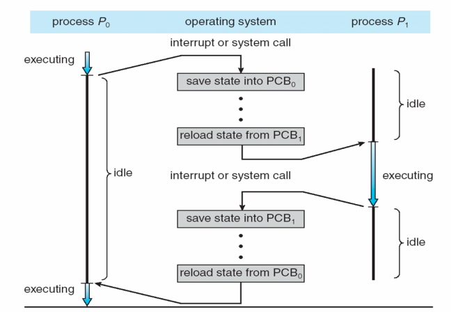
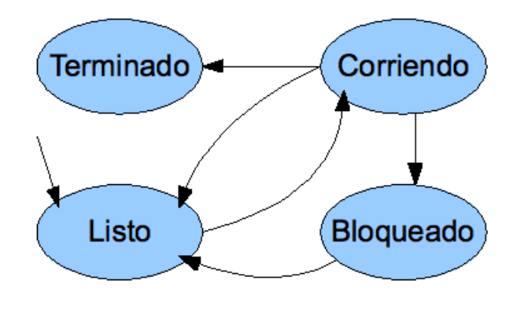
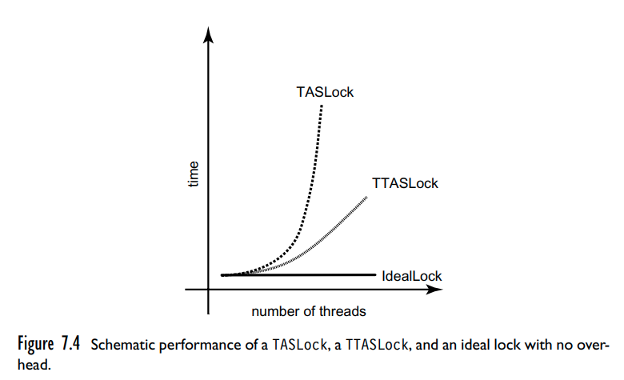
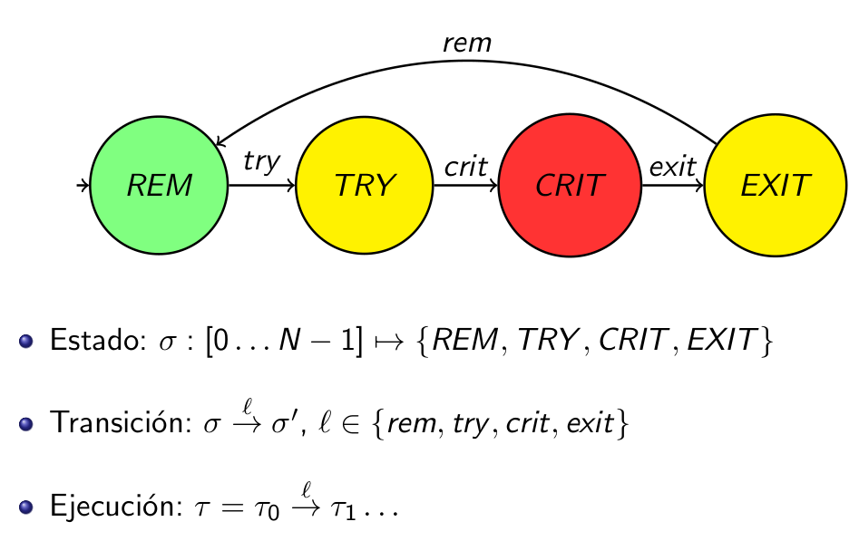
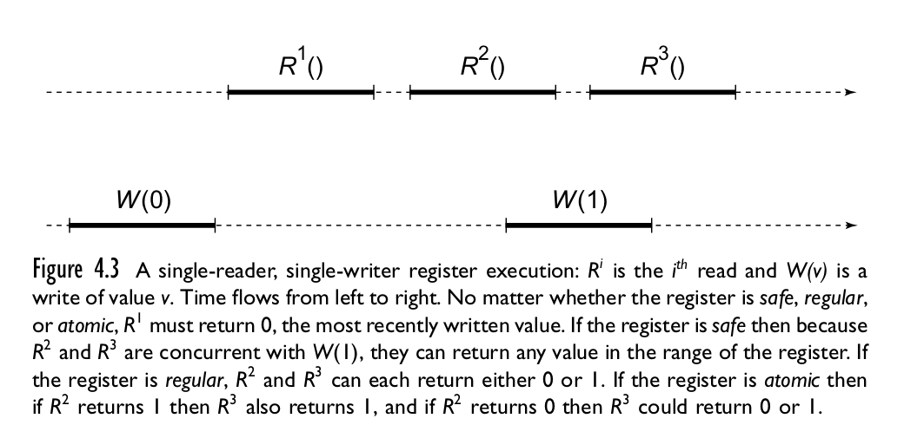
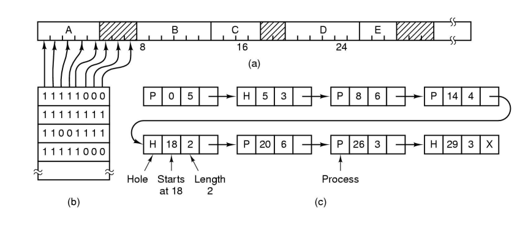
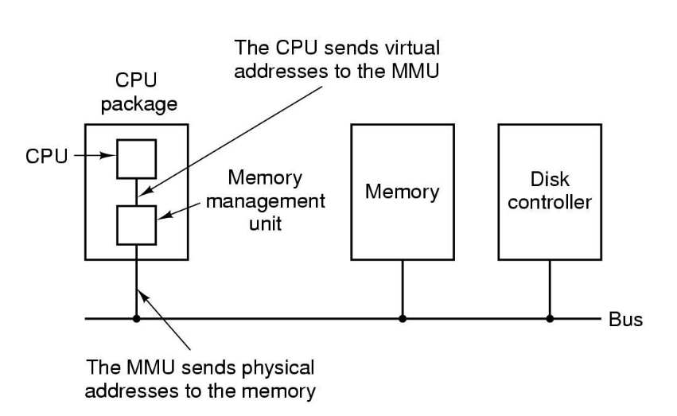
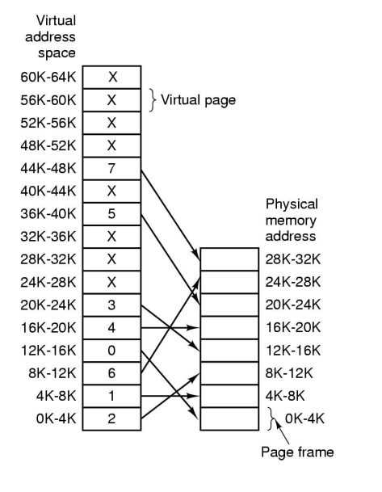
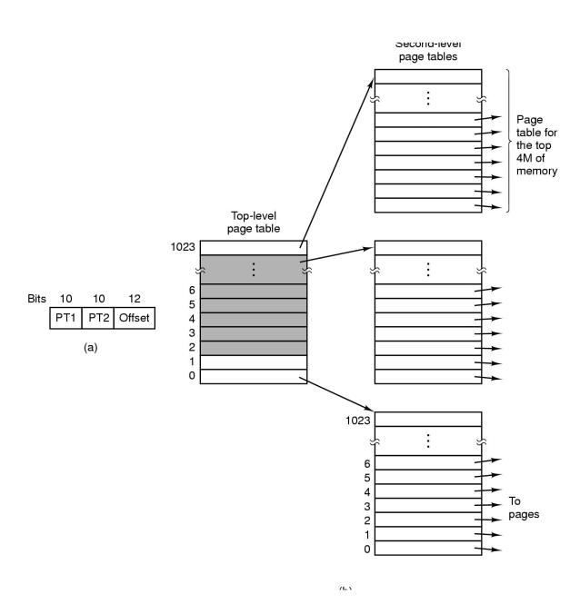

<!-- markdownlint-disable MD045 MD046 -->
<!-- MD046/code-block-style - Code block style (fenced / indented) -->
<!-- MD045/no-alt-text: Images should have alternate text (alt text) -->

# Resumen final SO

- [Resumen final SO](#resumen-final-so)
  - [Bibliografia](#bibliografia)
    - [Silber](#silber)
  - [Temas](#temas)
  - [1 - Intro](#1---intro)
    - [Elementos básicos](#elementos-básicos)
  - [2 - Procesos y API del SO](#2---procesos-y-api-del-so)
    - [Procesos](#procesos)
    - [Scheduler](#scheduler)
    - [Multiprogramación](#multiprogramación)
      - [Estado de un proceso](#estado-de-un-proceso)
    - [IPC - InterProcess Communication](#ipc---interprocess-communication)
  - [3 - Scheduling](#3---scheduling)
    - [Tipos de scheduling](#tipos-de-scheduling)
    - [Politicas](#politicas)
  - [4 - Sync entre procesos](#4---sync-entre-procesos)
    - [Secciones criticas (CRIT)](#secciones-criticas-crit)
    - [TAS (Test & Set)](#tas-test--set)
    - [Primitivas de sync](#primitivas-de-sync)
      - [Semáforos](#semáforos)
        - [Motivación - Bounded buffer (productor-consumidor)](#motivación---bounded-buffer-productor-consumidor)
        - [Definición](#definición)
        - [Deadlock](#deadlock)
      - [Objeto atómico](#objeto-atómico)
      - [TAS Lock / Spin Lock](#tas-lock--spin-lock)
      - [TTASLock / Local spinning](#ttaslock--local-spinning)
      - [CAS](#cas)
      - [Monitores](#monitores)
      - [Variables de condicion](#variables-de-condicion)
    - [Modelos](#modelos)
      - [Condiciones de Coffman](#condiciones-de-coffman)
      - [Digrafos bipartitos](#digrafos-bipartitos)
    - [Inconvenientes de sync](#inconvenientes-de-sync)
    - [Correctitud (propiedades)](#correctitud-propiedades)
      - [Modelo de proceso](#modelo-de-proceso)
      - [LTL](#ltl)
      - [Propiedades](#propiedades)
    - [Livelock](#livelock)
    - [Problemas clasicos](#problemas-clasicos)
    - [Jerarquia de objetos atomicos](#jerarquia-de-objetos-atomicos)
      - [Registros RW](#registros-rw)
      - [Problema del consenso](#problema-del-consenso)
  - [5 - Memoria](#5---memoria)
    - [Fragmentacion](#fragmentacion)
    - [Organización de la memoria](#organización-de-la-memoria)
    - [Políticas de asignación](#políticas-de-asignación)
    - [Memoria virtual](#memoria-virtual)
      - [Paginas](#paginas)
      - [MMU](#mmu)
      - [Reemplazo de paginas](#reemplazo-de-paginas)
      - [Page Fault](#page-fault)
    - [Thrashing](#thrashing)
    - [Protección y reubicación](#protección-y-reubicación)
    - [Segmentacion](#segmentacion)
    - [Copy-on-write](#copy-on-write)

## Bibliografia

- [MIT 6.824: Distributed Systems](https://www.youtube.com/watch?v=cQP8WApzIQQ&list=PLrw6a1wE39_tb2fErI4-WkMbsvGQk9_UB&ab_channel=MIT6.824%3ADistributedSystems)
- Operating Systems Concepts, Abraham Silberschatz & Peter B. Galvin.
- Modern Operating Systems, Andrew S. Tanenbaum.
- Sistemas distribuidos: Distributed Algorithms. Nancy A. Lynch. Morgan Kaufmann Publishers Inc., San Francisco, CA, USA. 1996.
- Synchro: The Art of Multiprocessor Programming

### Silber

- 1 - 2: Overview
- 3 - 5: Procesos
- 6 - 8: Sync
- 9 - 10: Memoria
- 11 - 12: Storage, IO
- 13 - 15: FS
- 16 - 17: Seguridad y proteccion
- 18 - 19: Advanced topics

## Temas

- Procesos y API del SO (2)
- Scheduling (3)
- Sync entre procesos (4, 5, 6)
- Programación concurrente
- Administración de memoria (7)
- Administración de E/S (8)
- File systems (9)
- Protección y seguridad (10)
- Sistemas distribuidos (11, 12)
- "Conceptos avanzados" (13, 14)
  - Virtualización, contenedores, cloud computing.

## 1 - Intro

- Mutliprogramación: aumenta el **throughput** (rendimiento)
- Contención: Varis programas pueden querer acceder a un mismo recurso a la vez.
- SO: Intermediario entre software de usuario y hardware. Tiene que manejar la contención y concurrencia de manera tal de lograr
  - Buen rendimiento
  - Correctitud
  - Para eso, corre en maximo privilegio

### Elementos básicos

- Drivers: Programas parte del SO que manejan la comunicación con los distintos dispositivos.
- Kernel: La parte central del SO.
- Shell: Un programa mas, muchas veces se ejecuta automaticamente.
- Proceso: Programa en ejecucion + espacio de memoria, otros attrs.
- Archivo: Bytes con nombre y metadata
  - Binario del sistema: Archivos que viven en directorios del sistema. No forman parte del kernel pero llevan a cabo tareas importantes o proveen utilidades basicas del sistema. `/usr/sbin/syslogd`, `/bin/sh`, `/usr/bin/who`.
  - Archivos de config: El SO saca de ahi info que necesita para funcionar. `/etc/passwd`.
- Directorio: Coleccion de archivos y otros directorios, con nombre y organizado jerarquicamente.
  - Directorios del sistema: Donde el SO guarda archivos necesarios para su funcionamiento. `/boot`, `/devices`, `C:\Windows\system32`.
- Dispositivo virtual: Abstraccion de uno fisico bajo la forma de un archivo, para que se pueda hacer `open`, `read`, `write`, etc.
- Filesystem: Forma de organizar los datos en el disco para gestionar acceso, permisos, etc.
- Usuario: Repr dentro del SO de las personas o entidades que pueden usarlo. Sirven para aislar info entre si y establecer permisos.
- Grupo: coleccion de usuarios.

## 2 - Procesos y API del SO

### Procesos

Un **programa** es una secuencia de pasos escrita en algun lenguaje. Cuando se
pone a ejecutar, pasa a ser un **proceso**. A cada uno se le asigna un **pid**
(*process id*). Estan compuestos por:

- Area de *texto*: codigo
- Area de datos: heap
- Stack

Y puede hacer

- **Terminar**
  
  El proceso le indica al SO (`exit()`) que puede liberar sus recursos con un
  status de terminación, el cuál es reportado al padre.

  Los procesos estan organizados jerárquicamente como un árbol. Cuando comienza
  el SO, se lanza un proceso *root* o *init*.

- **Lanzar un proceso hijo** (`system()`, `fork()`, `exec()`)
  
  `fork()` es una syscall que crea un proceso igual al actual, y retorna el PID
  del proceso hijo. El padre puede suspenderse hasta que termine haciendo
  `wait()`. Y cuando termine, el padre obtiene el status code del hijo.

  `system = fork + wait`.

  El proceso hijo puede reemplazar su binario por otro, con por ej. `exec`.

  

- **Ejecutar en el CPU**

  Mientras ejecuta en la CPU, puede

  - Hacer operaciones entre registros/direcciones de memoria
  - IO
  - syscalls

  Pero por cuanto tiempo se los deja ejecutar?

  - Hasta que termina: Es lo mejor para el proceso, pero podrian no terminar y
    causa starvation.
  - Un ratito: **quantum**.

  Los SOs modernos hacen *preemption*: cuando se acaba el quantum, le toca al
  siguiente proceso.

  De esto se encarga el **scheduler** (planificador)

- **Hacer una syscall**
  
  Por ej. un `print` termina haciendo un `write`. Para todas las syscalls hay
  que llamar al kernel, y a diferencia de una llamada normal, requieren un
  cambio de privilegio, de contexto y a veces una interrupcion, lo cual hace que
  sean lentas.

- **Realizar IO**

  Es muy lenta. Quedarse bloqueado esperando es un desperdicio de tiempo.
  Alternativas:

  - Busy waiting: El proceso no libera el CPU, ejecuta uno a la vez
  - Polling: El proceso libera el CPU pero recibe un quantum que desperdicia
    hasta que la E/S este terminada.
  - Interrupciones: Permite multiprogramación. El SO no le entrega el quantum al
    proceso hasta que la E/S este lista, y el HW le avisa que el IO terminó
    mediante una int, que es atendida por el SO que despierta al proceso.

### Scheduler

Decide a que proceso le toca ejecutar en cada momento. La **politica de
scheduling** tiene un gran impacto en el rendimiento de un SO.

Para cambiar el programa que se ejecuta en la CPU, es necesario hacer un
**context switch**

- Guardar los registros, IP
- Cargar el programa (si es nuevo) en memoria
- Cargar los registros y el IP del nuevo

Las cosas se guardan en una estructura de datos llamada PCB (*Process Control
Block*)



### Multiprogramación

Es la capacidad de un SO de tener varios procesos en ejecución.

#### Estado de un proceso



- Corriendo: usando la CPU
- Bloqueado: No puede correr hasta que suceda algo externo (tipicamente IO)
- Listo: No esta bloqueado, pero la CPU no esta disponible para que corra.

El *system load* es la cantidad de procesos listos que hay. Es la
responsabilidad del **scheduler** elegir entre ellos el prox a correr. Y cual
elige esta determinado por la *politica de scheduling*.

El SO tiene una *tabla de procesos* (lista de PCBs)

### IPC - InterProcess Communication

Es la forma que tienen los procesos de comunicarse entre sí. Hacer IPC para un
proceso es igual a hacer IO, se quedan bloqueados. Formas:

- Recurso compartido (memoria, archivo, BD, etc.)
- Pasaje de mensajes
  - Sockets

Puede ser:

- Sync: El emisor no termina de enviar hasta que el receptor no recibe, y si un
  mensaje se envía correctamente suele significar que también se recibió
  correctamente. Involucra bloqueo del emisor
- Async: El emisor envia algo que el receptor recibe en algun momento, requiere
  algun mecanismo adicional para recibir la respuesta y saber si llego.
  Libera al emisor para que haga otras tareas.

## 3 - Scheduling

La **política de scheduling** es tan importante que es una de las
características principales de un SO, y algunos proveen más de una. Tiene un
gran impacto en el rendimiento.

Goals:

- **Fairness (equanimidad)**: Cada proceso reciba una parte justa del CPU
- **Eficiencia**: Que la CPU este ocupada todo el tiempo
- **Carga del sistema**: Minimizar cantidad de procesos en ready
- **Tiempo de respuesta**: Minimizar el tiempo de respuesta *percibido* por los
  usuarios interactivos
- **Latencia**: Minimizar el tiempo requerido hasta que un proceso empieza a dar
  resultados.
- **Tiempo de ejecucion**: Minimizar el tiempo total de ejecucion de un proceso.
- **Throughput (rendimiento)**: Maximizar el nro de procesos terminados por
  unidad de tiempo.
- **Liberacion de recursos**: Hacer que terminen cuanto antes los procesos que
  tienen reservados mas recursos.

Muchos son contradictorios. Cada política busca maximizar una función objetivo,
que es una combinación de los goals tratando de impactar lo minimo el resto.

### Tipos de scheduling

- **cooperativo**: El sched analiza la situacion cuando toma control el kernel
  (con syscalls), en especial con IO. A veces se proveen syscalls especificas
  para pasar el turno.
- **con desalojo** (preemtive, apropiativo): El scheduler se cuelga a la
  interrupcion del clock para decidir si le toca ejecutar al proceso actual u
  otro.

  Suele ser deseable pero requiere mas hardware (clock con interrupciones) y no
  da garantia de continuidad a los procesos, que podria ser un problema en un SO
  real time.

### Politicas

- FIFO (o FCFS, First Come First Served)

  Supone que todos los procesos son iguales, pero si llega un proceso polenta
  que requiere mucha CPU genera **inanición** (**starvation**) para todos los
  demas. Los de mayor prioridad demoran infinitamente a los de menor, que nunca
  llegan a ejecutarse.

  Cualquier esquema de prioridades fijas corre riesgo de inanicion.

- Round robin

  Darle un quantum a cada proceso y alternar entre ellos.

  Como elegir el quantum?

  - Muy largo: En SO interactivos pareceria que el sistema no responde
  - Muy corto: Se nota el overhead de scheduling+context switch

  Se lo suele combinar con prioridades.

- Multiples colas

  Colas con 1, 2, 4, 8 quantum. A la hora de elegir un proceso para correr, la
  prioridad la tiene siempre la cola menor. Cuando un proceso no le alcanza el
  CPU se pasa a la siguiente, lo cual disminuye su prioridad, pero le toca mas
  tiempo en el CPU la proxima.

  Los procesos interactivos van a la cola de maxima prioridad, y se puede hacer
  que cuando alguno termina de hacer IO vaya a la 1ra porque tenderia a volver a
  ser interactivo.

  La idea general es minimizar el tiempo de respuesta de los procesos
  interactivos.

- SJF (*Shortest Job First*)

  Para sistemas donde prediminan los trabajos batch, orientada a maximizar el
  throughput.

  Si uno conoce las duraciones de antemano, es optimo en cuanto a latencia
  promedio. Y sino, muchas veces se pueden predecir, pero puede salir mal si los
  procesos tienen comportamiento irregular.

- Scheduling en RT (Real time)

  Las tareas tienen *deadlines* estrictos, se usan en entornos criticos. Una
  politica posible seria EDF: Earliest Deadline First.

- Scheduling en SMP

  El problema es la **afinidad** de un proceso a un CPU, por la cache.

  A veces se intenta distribuir la carga entre los procesadores, con *push
  migration* y *pull migration*

## 4 - Sync entre procesos

Como hacer para que los procesos puedan cooperar sin estorbarse

Ejemplo: Fondo de donaciones, sorteo entre los donantes, dar numeros. Dos
procesos tienen que incrementar el numero de ticket y manejar el fondo
acumulado.

<table>
  <thead><tr><th>C</th><th>ASM</th></tr></thead>
  <tbody>
  <tr><td>

    ```c
    int ticket = 0;
    int fondo = 0;

    int donar(int donacion) {
      fondo += donacion;
      ticket++;
      return ticket;
    }
    ```

    </td><td>

    ```asm
    load fondo
    add donacion
    store fondo

    load ticket
    add 1
    store ticket

    return reg
    ```
  </td></tr>
  </tbody>
</table>

Como dos procesos ejecutan el **mismo** programa, y comparten las variables
`fondo` y `ticket`, podria suceder que el `store` de uno pise los cambios del
otro.

Toda ejecucion deberia dar un resultado equivalente a **alguna secuencial** de
los mismos procesos. Como esto no sucede, pueden ocurrir **condiciones de
carrera** (o *race conditions*)

### Secciones criticas (CRIT)

Una forma posible de solucionar race conditions, lograr *exclusion mutua*
mediante **secciones criticas**. Estas son un cacho de codigo que

- Solo hay un proceso a la vez en CRIT
- Todo proceso que esta esperando para entrar, va a entrar a CRIT
- Ningun proceso fuera de CRIT puede bloquear a otro.

Pero como se implementa? Por lo general con ayuda del hardware.

Depende de la granularidad con la que se definan, puede haber más o menos
concurrencia.

- CRIT es toda la función, menor concurrencia

  ```c
  crit int donar(...) { ... }
  ```

- CRIT es un bloque, mayor concurrencia

  ```c
  int donar(int n) {
    int tmp;
    crit { fondo += donacion; }
    crit { tmp = ++ticket; }
    return tmp;
  }
  ```

### TAS (Test & Set)

Instruccion que permite establecer **atomicamente** el valor de un `int` en 1,
llamada `TestAndSet`. Pone 1 y devuelve el valor anterior de manera *atomica*,
indivisible, incluso con varios CPUs.

```c
// pseudocodigo de TAS, pero en realidad esta en asm.
bool TestAndSet(bool *dest) {
  bool res = *dest;
  *dest = true;
  return res;
}
```

Y ejemplo de uso para usar un lock

```c
bool lock;
void main() {
  while(true) {

    // Si da true estaba lockeado, entonces sigo esperando.
    // Busy waiting
    while (TestAndSet(&lock));

    // Estoy en CRIT

    lock = false;

    // Salgo de CRIT
  }
}
```

El codigo hace **busy waiting** (o *espera activa*) porque consume tiempo de la
CPU para ver si esta tomado el lock.

### Primitivas de sync

#### Semáforos

##### Motivación - Bounded buffer (productor-consumidor)

Ambos comparten un buffer de tamaño limitado (bounded), el productor pone
elementos y el consumidor los saca. Ademas, si quieren poner algo cuando el
buffer esta lleno o sacar algo cuando esta vacio deben esperar.

No podemos usar `sleep()` y `wakeup()` porque el wakeup se podria perder en
algun interleaving.

```c
// productor
if (cant == 0) sleep();

// consumidor
agregar(item, buf); cant++; wakeup();
```

| Consumidor | Productor        | Vars                 |
| ---------- | ---------------- | -------------------- |
|            |                  | cant = 0, buf = []   |
|            | agregar(i1, buf) | cant = 0, buf = [i1] |
| cant = 0?  |                  |
|            | cant++; wakeup() | cant = 1             |
| sleep()    |                  |

Se pierde el `wakeup()` del productor, *lost wakeup problem*

##### Definición

Es un TAD que permite controlar el acceso a un recurso compartido por
múltiples procesos.

Tiene un valor al cual no podemos acceder. La única de interactuar con el
semáforo es mediante las primitivas `wait()` y `signal()`, las cuales son
**atómicas** a efectos de los procesos. (es decir, no se entrelazan con
otros procesos, no debería haber condiciones de carrera por ese lado)

Primitivas

- `sem(uint val)`: Devuelve un nuevo semáforo inicializado en ese valor
- `wait()`: Mientras el valor sea <= 0 se bloquea el proceso esperando
  un signal. Luego decrementa el valor del semáforo.
- `signal()`: Incrementa en uno el valor del semáforo y despierta a
  *alguno* de los procesos que estén haciendo `wait` sobre él. El resto
  quedan bloqueados

Permite implementar un **mutex** (*mutual exclusion*)

```c
mutex = sem(1)

wait(sem)   // "mutex.lock"
signal(sem) // "mutex.unlock"
```

##### Deadlock

Traen un problema, que es que si un proceso A espera a B, y B espera a A, el
sistema se bloquea, un **deadlock**.


#### Objeto atómico

Es un objeto que provee `getAndSet()` y `testAndSet()`, implementa operaciones
**indivisibles** a nivel de hardware.

```c
private bool reg;
atomic bool get() { return reg; }
atomic void set(bool b) { reg = b; }

atomic bool getAndSet(bool b) {
    bool m = reg;
    reg = b;
    return m;
}

atomic bool testAndSet() {
    return getAndSet(true);
}
```

#### TAS Lock / Spin Lock

Es un mutex construido con `testAndSet()`

```c
class TASLock {
    atomic<bool> reg;
    void create() { reg.set(false); }
    void lock() { while (reg.testAndSet()) {} } // no es atomico
    void unlock() { reg.set(false); }
}
```

Produce **busy waiting** pero puede tener un overhead menor
al de usar semáforos.

Ejemplo de uso

```c
TASLock mu;

int donar(int donacion) {
  int res;

  // CRIT
  mu.lock();
  fondo += donacion;
  mu.unlock();
  // EXIT

  // CRIT
  mu.lock()
  res = ticket; ticket++;
  mu.unlock()
  // EXIT

  return res;
}
```

Problemas:

- No hay que olvidarse de hacer `unlock()` (sino, deadlock)
- Produce **busy waiting**
- Aun asi, puede tener menos overhead que semaforos

#### TTASLock / Local spinning

Testea anets de hacer test and set, de esta forma minimizando el impacto del
busy waiting. Tambien se llama *local spinning*

```c
void lock() {
    while true {
        while(mtx.get());
        if (!mtx.testAndSet()) return;
    }
}
```

*Local Spinning* es mas eficiente

- Lee la memoria cache mientras sea verdadero
- Cuando un proceso hace `unlock()` hay cache miss



#### CAS

Otra primitiva es *Compare And Swap* o **CAS**

```cpp
atomic T compareAndSwap(T u, T v) {
    T res = reg;
    if (u == res) reg = v;
    return res;
}
```

#### Monitores

Ver de bib

#### Variables de condicion

Ver de bib

### Modelos

Modelos para detectar / garantizar que no haya deadlocks

#### Condiciones de Coffman

Postulo una serie de condiciones necesarias para la existencia de un deadlock,
pero tiene algunas falencias

- **Exclusion mutua**: Un recurso no puede estar asignado a mas de un proceso
- **Hold and wait**: Los procesos que ya tienen algun recurso pueden solicitar
  otro.
- **No preemption**: No hay mecanismo para quitarle recursos a un proceso
- **Circular wait**: Tiene que haber un ciclo de N >= 2 procesos tq P_i espera
  un recurso que tiene P_i+1

#### Digrafos bipartitos

- Nodos: Procesos y recursos
- Aristas:
  - p -> r si p **solicita** r
  - r -> p si p **adquiere** r
- Un deadlock es un **ciclo**.

### Inconvenientes de sync

Algunos problemas posibles son

- Race conditions
- Deadlocks
- Starvation

Y se pueden prevenir mediante

- Patrones de diseño
- Reglas de programacion
- Prioridades
- Protocolo (eg priority inheritance)

O detectar mediante

- Analisis de programas estatico o dinamico
- En runtime, preventivo o recuperacion.

### Correctitud (propiedades)

La correctitud de un programa paralelo es un conjunto de propiedades que se
plantean sobre toda ejecución. Como tienen muchas ejecuciones posibles, no nos
basta con pre/post condiciones, o teorema del invariante.

Para argumentar que una propiedad no es cierta, es necesario mostrar un
*contraejemplo*, una sucesión de pasos que muestra una ejecución del sistema
que no la cumpla.

Tipos de propiedades:

- **safety**
  - Intuición: Nada malo sucede
  - Nunca pasan cosas que no queremos que pasen
  - Ejemplos: Mutex, ausencia de deadlock, no perdida de mensajes, etc.
  - Definición: Tienen un *contraejemplo finito*
- **progreso** o **liveness**
  - Intuición: En algun momento algo bueno si va a suceder
  - El sistema progresa, suceden cosas, el sistema no se queda bloqueado.
  - Ejemplos: "Si se presiona el botón de stop, el tren frena", no inanición.
  - Definición: Los contraejemplos no son finitos (una secuencia infinita de
    pasos).
- **fairness**
  - Intuición: Los procesos reciben su turno con infinita frecuencia.
  - "No se van a dar escenarios poco realistas en donde alguien es postergado
    para siempre"
  - En general se asume como valida para probar otras propiedades.

La manera usual de mostrar la correctitud de este tipo de sistemas es plantear
propiedades e safety y liveness, y demostrar que su combinacion implica el
comportamiento deseado.

En la practica se suelen usar versiones acotadas de estas propieades, y para
trabajar con ellas se usan *logicas temporales* como LTL, CTL, TCTL, ITL, etc.

#### Modelo de proceso



#### LTL

```text
T |= F?             los estados t satisfacen F

F = p
F = F1 AND F2
F = F1 OR F2
F = [] F1           en todos los estados vale

Por ejemplo,

[] NOT(deadlock)    en ningun estado de mi sistema hay un deadlock

F = <> F1           en algun momento del futuro vale F1

<> estado == final  en algun momento llego al estado final.

[] (pedido => <> respuesta)     tipica propiedad de liveness
```

#### Propiedades

- **WAIT-FREEDOM**

  Todo proceso que intenta acceder a la sección crítica, en algún momento lo
  logra, cada vez que lo intenta.

  Para todo proceso, si está en un estado TRY, habrá un momento posterior en el
  que estará en CRIT.

  Intuicion: Libre de procesos que esperan para siempre.

  *WAIT-FREEDOM* $\equiv \forall \tau \forall k \forall i \ \tau_k(i) = TRY
  \implies \exists k' > k.\ \tau_{k'}(i) = CRIT$

  Es una garantia demasiado fuerte.

- **FAIRNESS - Equanimidad**

  Para toda ejecucion $\tau$ y todo proceso $i$, **si** $i$ *puede* hacer una
  transicion $l_i$ en una cantidad infinita de estados $\tau$ **entonces**
  existe un $k$ tal que $\tau_k \xrightarrow{l_i} \tau_{k+1}$

- **EXCL - Exclusión Mutua**

  Para toda ejecución $\tau$ y estado $\tau_k$, no puede haber más de **un**
  proceso $i$ tal que $\tau_k(i) = CRIT$

  *EXCL* $\equiv \square \# CRIT \leq 1$

- **LOCK-FREEDOM - Progreso del sistema**

  Para toda ejecución y estado, si hay un proceso en TRY, y ninguno en CRIT,
  entonces hay un estado posterior tal que algún proceso está en CRIT.

  *LOCK-FREEDOM* $\equiv \square ( \#TRY \geq 1 \wedge \#CRIT = 0 \Rightarrow \lozenge
  \#CRIT > 0)$

- **DEADLOCK/LOCKOUT/STARVATION-FREEDOM - Progreso global dependiente**

  Predicados auxiliares:

  - *Lograr entrar*

    $IN(i) \equiv i \in TRY \Rightarrow \lozenge i \in CRIT$

  - *Salir*

    $OUT(i) \equiv i \in CRIT \Rightarrow \lozenge i \in REM$

  Para toda ejecución, si para todo estado y proceso i que está en crit, existe
  un estado tal que sale, entonces para todo estado posterior y todo proceso
  diferente, si intenta de entrar existe un estado para el cual entra.

  Que todos salgan implican que todos van a entrar en algún momento.

  *STARVATION-FREEDOM* $\equiv \forall i \square OUT(i) \Rightarrow \forall i \square
  IN(i)$

- **WAIT-FREEDOM - Progreso global absoluto**

  Todo proceso entra a la sección crítica

  *WAIT-FREEDOM* $\equiv \forall i \square IN(i)$

### Livelock

Un conjunto de procesos esta en **livelock** si estos continuamente cambian su
estado en respuesta a cambios de estado de otros.

Ej: queda poco espacio en disco. Proceso A detecta y notifica a proceso B
(journal del sistema) que lo registra en disco, disminuyendo el espacio, lo que
hace que lo detecte A... y asi.

### Problemas clasicos

Leer de teo

- Readers / writers
- Filosofos que cenan
- Barbero

### Jerarquia de objetos atomicos

Se puede lograr exclusion mutua sin TestAndSet?

#### Registros RW

Un registro basico **read-write register** puede ser single/multi (i.e
single-reader, single-writer, etc.)

- Si `read()` y `write()` no se solapan, `read()` devuelve el **ultimo** valor
  escrito.

- Si se solapan,
  - *safe*: `read` devuelve **cualquier** valor
  - *regular*: `read` devuelve **algun** valor escrito
  - *atomic*: `read` devuelve un valor **consistente** con una serializacion.



Ejemplos de EXCL con registros RW

- Dijkstra
- Panaderia de Lamport
- Algoritmo de Fischer

**Teorema (Burns & Lynch)**: No se puede garantizar EXCL y LOCK-FREEDOM con
menos de n registros RW.

#### Problema del consenso

Es una forma de medir que tan buenos son los objetos atomicos. Una formalización
de la pregunta "pueden n procesos (concurrentes) acordar sobre un estado
booleano?"

- Dados
  - Valores: V = {0, 1}
  - Inicio: Todo proceso i empieza con init(i) en V
  - Decision: Todo proceso i decide un valor decide(i) en V
- El problema de consenso requiere
  - Acuerdo: Para todo i != j, decide(i) = decide(j)
  - Validez: Existe i tal que init(i) = decide(i)
  - Terminacion: Todo i decide en un numero finito de transiciones (WAIT-FREEDOM)

**Teorema (Herelihy, Lynch)**: No se puede garantizar consenso para un n
arbitrario con registros RW atómicos.

**Consensus number**: Cantidad de procesos para los cuales se resuelve consenso.
Sirve para definir una jerarquía de los mecanísmos de sync (Herlihy)

- Registros RW atomicos: 1
- Colas, pilas = 1
- (TAS) getAndSet = 2
- CompareAndSwap/CompareAndSet = consensus number infinito

  ```cpp
  atomic T compareAndSwap(T registro, T esperado, T nuevo) {
    T actual = registro;
    if (actual == esperado) registro = nuevo;
    return actual;
  }

  atomic bool compareAndSet(T registro, T esperado, T nuevo) {
    if (registro == esperado) {
      registro = nuevo;
      return true
    }

    return false;
  }
  ```

  ```cpp
  // El que lee -1 con el CAS (i.e el primero que lo llega a ejecutar,
  // ya que es atomico) pasa a ser el decisor.
  atomic<int> decisor = -1;
  T[] proposed

  T decide(int i) {
    proposed[i] = init(i);

    if (decisor.compareAndSet(-1, i))
      // Soy el decisor
      return proposed[i];

    // No soy el decisor, decido lo que decidio el.
    return proposed[decisor.get()];
  }
  ```

## 5 - Memoria

La memoria tambien se comparte. El sustistema **manejador de memoria** se
encarga de

- Manejar el espacio libre / ocupado
- Asignar y liberar memoria
- Controlar el swapping (cuando los procesos van y vienen de disco)

Si tenemos un proceso en memoria, no hace falta compartir nada. Pero con
*multiprogramacion*, si cuando ese se bloquea queremos ejecutar otro, que
hacemos con esa memoria? Eventualmente no alcanza toda y tenemos que hacer
*swapping* a disco. Pero el problema es que es lento, entonces uno intenta de
hacerlo lo minimo posible y aprovechar la memoria.

Problemas:

- **Reubicacion** (cambio de contexto, swapping)
- **Proteccion** (memoria privada de los procesos)
- **Manejo del espacio libre** (evitando *fragmentacion*)

### Fragmentacion

> Había una cantidad de espacio libre para meter un auto más, pero partido
> en pedazos tan chiquitos que no entraba a fines prácticos.
> La calle estaría **fragmentada**

La fragmentación es cuando tenemos suficiente memoria para atender una
solicitud, pero no es continua. Si no se soluciona, el problema se hace
arbitrariamente grande.

Cada tanto se podria parar todo y compactar la memoria, pero seria muy costoso e
imposible en sistemas real time. La idea entonces es *evitarla*.

### Organización de la memoria

- **Segmentos**
  - Stack: crece hacia abajo
  - Heap: crece hacia arriba
- **Bitmap**
  - Dividir la memoria en bloques de igual tamaño, y cada pocision del beatmap
    representa un bloque. 0 si esta libre y 1 ocupado.
  - Asignar y liberar O(1) pero buscar un bloque libre es O(n)
  - No es muy usado
- !! **Lista enlazada**
  - Cada nodo representa un bloque libre o proceso que tiene asignado.
  - Liberar es O(1) y asignar similar una vez que decidis donde.



### Políticas de asignación

Donde asignar:

- **First fit**: Asigno en el primer bloque donde entra.
  - Rapido
  - Tiende a fragmentar
- **Best fit**: Me fijo donde entra mas justo
  - Lento
  - No es mejor, en la practica tiende a llenar la memoria de pequeños
    bloquecitos.
- **Quick fit**: Mantengo una lista de los bloques libres de los tamaños mas
  frecuentemente solicitados.
- **Buddy system**: Splitting de bloques.

En la practica se usan esquemas mas complicados que conocen mas sobre la
distribucion de pedidos, y realizan manejos mas sofisticados.

Todos son muy ingenuos, y pueden producir fragmentación de distintos tipos

- **Fragmentacion externa**: bloques libres pero chicos y dispersos) y otros
- **Fragmentacion interna**: espacio desperdiciado dentro de los propios bloques, asignar bloques demasiado grandes.)

### Memoria virtual

Soluciona el problema de la reubicacion.

Es la *virtualizacion del espacio de direcciones*, y requiere ayuda del HW con
la MMU (Memory management unit)



- Sin memoria virtual
  - El espacio de direcciones es el mismo que el tamaño de la memoria fisica
  - Para obtener una celda,
    - Pongo la dir en el bus de memoria
    - Obtengo el contenido
- Con memoria virtual,
  - Espacio de direcciones: tamaño mem fisica + swap
  - Los programas usan direcciones virtuales
  - Para obtener una celda,
    - Dir en el bus de memoria
    - La MMU tradice virtual -> fisica
    - La tabla de traduccion contiene el bit present, que indica si esta
      cargado.
    - Si no lo esta, lo cargo
    - La dir fisica se pone en el bus
    - Obtengo el contenido

Permite direccionar un espacio mayor, y no hay problemas si al cargar devuelta
un proceso queda con direcciones fisicas diferentes, porque las virtuales se
mantienen.

#### Paginas

La memoria virtual esta dividida en *paginas*, bloques de memoria de tamaño
fijo. Y el de memoria fisica esta dividida en bloques del mismo tamaño llamados
*page frames*. La MMU entonces traduce paginas a frames, interpretando las
direcciones virtuales como pagina + offset

Cuando una pagina no esta en memoria, la MMU emite un Page Fault (#PF) que se
atrapa por el SO, que **saca** alguna pagina de memoria y sube la
correspondiente al disco. Cual sacar afecta al rendimiento (politica de
remocion)



Puede haber páginas especiales de solo lectura o no swappeables (ya que no hay
control de lo que pasa en el disco)

#### MMU

La MMU tiene una tabla de paginas usada para el mapeo. Esta es *multinivel*, los
primeros bits llevan a cual tabla consultar. Esto es para evitar que sea
demasiado grande.



Cada entry de la page table tiene

- Page frame.
- Bit present.
- Bits de proteccion.
- Bit de dirty (modificada desde que fue cargada a disco, si no lo fue, no hace
  falta escribirla devuelta en el disco).
- Bit de referenced: Si fue accedida desde que fue cargada a disco. Se usa para
  ver cual bajar.
- Y puede tener mas dependiendo de la arch.

Como las tablas de paginas estan en memoria, el acceso a ellas es muy lento.
Para remediarlo, se agrega un cache (la TLB, Translation Lookaside Buffer o
*memoria asociativa*) que mapea de páginas a frames.

#### Reemplazo de paginas

Elegir las correctas afecta drasticamente el rendimiento

Algoritmos:

- FIFO
- Second chance: Como FIFO, pero si la que voy a bajar tiene el bit de
  referenced prendido, la considero como recien subida y bajo la siguiente.
  Facil de implementar y mejor que FIFO
- NRU (Not recently used): Se establece una prioridad para desalojar.
  - No fueron referenciadas ni modificadas
  - Fueron referenciadas pero no modificadas
  - Modificadas
- LRU (Least recently used): es el que suele funcionar mejor, pero es caro de
  implementar. La que se uso menos recientemente tiene menos proba de volver a
  ser usada en lo inmediato.

Tambien hay variaciones que van al balance entre costo de implementacion y
calidad de resultados, y a veces se combinan con carga de paginas por adelantado
(en vez de esperar al PF)

Los programas suelen exhibir *localidad de referencia*: acceden a direcciones
que estan juntas entre si.

#### Page Fault

Que pasa con un PF?

- Se emite la interrupcion (fault) PF, es atrapada por el kernel
- Se hace un context switch
- El kernel determina el tipo de la int y lo delega a la ISR correspondiente.
- Averiguar que direccion virtual se queria
- Se chequea que sea valida y que el proceso tenga los permisos. Sino, mata al
  proceso (unix: Segmentation violation)
- Se selecciona un page frame libre si lo hay, sino se libera mediante un
  algoritmo de reemplazo.
- Si la pagina tenia el bit *dirty*, hay que bajarla a memoria. Se marca como
  *busy* para evitar que se use, mientras se pone a dormir.
- Cuando el SO es notificado que termino de bajar la pagina disco, sube la otra
  y duerme devuelta.
- Cuando llega la interrupcion que indica que eso termino, actualiza la tabla de
  paginas indicando que esta cargada
- La instruccion que causo el page fault retoma, y cuando se reintente la pagina
  va a estar en memoria

### Thrashing

**Thrashing** sucede cuando no hay mucha memoria, y hay mucha competencia entre
los procesos para usarla. El SO esta constantemente cambiando paginas de memoria
a disco ida y vuelta.

### Protección y reubicación

Para la proteccion, cada proceso tiene su propia tabla de paginas, pero no
hay forma de acceder a la de otro. Esto se puede solucionar con
**segmentacion**, haciendo que cada proceso tenga su propio espacio de memoria.

### Segmentacion

Los segmentos no son de tamaño fijo, pero tenemos los mismos problemas de
swapping y fragmentacion. Lo mas comun es combinar segmentacion con paginado.

> En diapo 35 ejemplo de intel

Comparacion con paginacion

- Las paginas son invisibles para el programador (en asm) pero los segmentos no
- Los segmentos proveen mas de un espacio de direccionamiento que pueden estar
  solapados.
- Los segmentos facilitan la proteccion, a pesar de que tambien se pueda
  implementar mediante paginados
- La segmentacion brinda espacios de memoria separados al mismo proceso.

### Copy-on-write

Nuevos procesos se crean con `fork()`, pero no copiamos inmediatamente las
paginas a memoria, sino que se hace **copy-on-write**: al principio referencia a
las paginas del proceso padre, pero ni bien hace una escritura, antes de dejar
que suceda las duplico.