<!-- markdownlint-disable MD045 MD046 -->
<!-- MD046/code-block-style - Code block style (fenced / indented) -->
<!-- MD045/no-alt-text: Images should have alternate text (alt text) -->

# Resumen final SO

- [Resumen final SO](#resumen-final-so)
  - [Bibliografia](#bibliografia)
    - [Silber](#silber)
  - [Temas](#temas)
  - [1 - Intro](#1---intro)
    - [Elementos básicos](#elementos-básicos)
  - [2 - Procesos y API del SO](#2---procesos-y-api-del-so)
    - [Procesos](#procesos)
    - [Scheduler](#scheduler)
    - [Multiprogramación](#multiprogramación)
      - [Estado de un proceso](#estado-de-un-proceso)
    - [IPC - InterProcess Communication](#ipc---interprocess-communication)
  - [3 - Scheduling](#3---scheduling)
    - [Tipos de scheduling](#tipos-de-scheduling)
    - [Politicas](#politicas)
  - [4 - Sync entre procesos](#4---sync-entre-procesos)
    - [Secciones criticas (CRIT)](#secciones-criticas-crit)
    - [TAS (Test & Set)](#tas-test--set)
    - [Primitivas de sync](#primitivas-de-sync)
      - [Semáforos](#semáforos)
        - [Motivación - Bounded buffer (productor-consumidor)](#motivación---bounded-buffer-productor-consumidor)
        - [Definición](#definición)
        - [Deadlock](#deadlock)
      - [Objeto atómico](#objeto-atómico)
      - [TAS Lock / Spin Lock](#tas-lock--spin-lock)
      - [TTASLock / Local spinning](#ttaslock--local-spinning)
      - [CAS](#cas)
      - [Monitores](#monitores)
      - [Variables de condicion](#variables-de-condicion)
    - [Modelos](#modelos)
      - [Condiciones de Coffman](#condiciones-de-coffman)
      - [Digrafos bipartitos](#digrafos-bipartitos)
    - [Inconvenientes de sync](#inconvenientes-de-sync)
    - [Correctitud (propiedades)](#correctitud-propiedades)
      - [Modelo de proceso](#modelo-de-proceso)
      - [LTL](#ltl)
      - [Propiedades](#propiedades)
    - [Livelock](#livelock)
    - [Problemas clasicos](#problemas-clasicos)
    - [Jerarquia de objetos atomicos](#jerarquia-de-objetos-atomicos)
      - [Registros RW](#registros-rw)
      - [Problema del consenso](#problema-del-consenso)
  - [5 - Memoria](#5---memoria)
    - [Fragmentacion](#fragmentacion)
    - [Organización de la memoria](#organización-de-la-memoria)
    - [Políticas de asignación](#políticas-de-asignación)
    - [Memoria virtual](#memoria-virtual)
      - [Paginas](#paginas)
      - [MMU](#mmu)
      - [Reemplazo de paginas](#reemplazo-de-paginas)
      - [Page Fault](#page-fault)
    - [Thrashing](#thrashing)
    - [Protección y reubicación](#protección-y-reubicación)
    - [Segmentacion](#segmentacion)
    - [Copy-on-write](#copy-on-write)
  - [6 - Manejo de IO](#6---manejo-de-io)
    - [Esquema de IO](#esquema-de-io)
    - [Drivers](#drivers)
    - [Interacción con dispositivos](#interacción-con-dispositivos)
    - [Subsistema de IO](#subsistema-de-io)
    - [Planificación de IO](#planificación-de-io)
    - [Gestión de discos](#gestión-de-discos)
    - [Spooling](#spooling)
    - [IO Locking](#io-locking)
    - [Protección de la información](#protección-de-la-información)
      - [Backups](#backups)
      - [Redundancia](#redundancia)
        - [RAID 0 (Data Striping, Striped Volume)](#raid-0-data-striping-striped-volume)
        - [RAID 1 (Mirror)](#raid-1-mirror)
        - [RAID 4](#raid-4)
        - [RAID 5](#raid-5)
        - [RAID 5E](#raid-5e)
        - [RAID anidados](#raid-anidados)
  - [7 - File Systems](#7---file-systems)
    - [File System](#file-system)
    - [Punto de montaje](#punto-de-montaje)
    - [Representacion de archivos](#representacion-de-archivos)
    - [Representacion de directorios](#representacion-de-directorios)
    - [Link simbolico](#link-simbolico)
    - [Manejo de espacio libre y cache](#manejo-de-espacio-libre-y-cache)
    - [Consistencia](#consistencia)
    - [Caracteristicas avanzadas](#caracteristicas-avanzadas)
    - [NFS](#nfs)
    - [Definiciones](#definiciones)
    - [Asignación](#asignación)
      - [Contigua](#contigua)
      - [FAT](#fat)
      - [Inodos](#inodos)
      - [Punteros con indireccion](#punteros-con-indireccion)
      - [Estructura interna](#estructura-interna)
    - [Directorios](#directorios)
    - [Links (enlaces)](#links-enlaces)
    - [Recuperando un archivo en FAT](#recuperando-un-archivo-en-fat)
  - [8 - Proteccion y Seguridad](#8---proteccion-y-seguridad)
    - [Crypto](#crypto)
      - [Firma digital](#firma-digital)
    - [Representacion de permisos](#representacion-de-permisos)
    - [Buffer overflows](#buffer-overflows)
    - [Mecanismos de proteccion](#mecanismos-de-proteccion)
    - [Controles de parametros](#controles-de-parametros)
  - [9 - Sistemas Distribuidos](#9---sistemas-distribuidos)
    - [Memoria compartida](#memoria-compartida)
    - [Distribuido](#distribuido)
    - [Arquitecturas](#arquitecturas)
      - [Cliente-servidor](#cliente-servidor)
      - [Async](#async)
    - [Locks](#locks)
      - [Enfoque centralizado (coordinador)](#enfoque-centralizado-coordinador)
      - [Ordenar eventos en la red](#ordenar-eventos-en-la-red)
    - [Acuerdo bizantino](#acuerdo-bizantino)
    - [Clusters](#clusters)
    - [Scheduling en distribuidos](#scheduling-en-distribuidos)
    - [Problemas y algoritmos](#problemas-y-algoritmos)
      - [Modelo de fallas](#modelo-de-fallas)
      - [Metricas de complejidad](#metricas-de-complejidad)
      - [Exclusion mutua distribuida](#exclusion-mutua-distribuida)
      - [Locks - protocolo de mayoria](#locks---protocolo-de-mayoria)
      - [Eleccion de lider](#eleccion-de-lider)
      - [Instantanea (snapshot) global consistente](#instantanea-snapshot-global-consistente)
      - [2PC (Two Phase Commit)](#2pc-two-phase-commit)
      - [Consenso](#consenso)
  - [10 - Avanzados](#10---avanzados)
    - [Microkernels](#microkernels)
    - [Virtualizacion](#virtualizacion)
      - [Contenedores](#contenedores)
    - [DFS (Distributed File System)](#dfs-distributed-file-system)

## Bibliografia

- [MIT 6.824: Distributed Systems](https://www.youtube.com/watch?v=cQP8WApzIQQ&list=PLrw6a1wE39_tb2fErI4-WkMbsvGQk9_UB&ab_channel=MIT6.824%3ADistributedSystems)
- Operating Systems Concepts, Abraham Silberschatz & Peter B. Galvin.
- Modern Operating Systems, Andrew S. Tanenbaum.
- Sistemas distribuidos: Distributed Algorithms. Nancy A. Lynch. Morgan Kaufmann Publishers Inc., San Francisco, CA, USA. 1996.
- Synchro: The Art of Multiprocessor Programming

### Silber

- 1 - 2: Overview
- 3 - 5: Procesos
- 6 - 8: Sync
- 9 - 10: Memoria
- 11 - 12: Storage, IO
- 13 - 15: FS
- 16 - 17: Seguridad y proteccion
- 18 - 19: Advanced topics

## Temas

- Procesos y API del SO (2)
- Scheduling (3)
- Sync entre procesos (4, 5, 6)
- Programación concurrente
- Administración de memoria (7)
- Administración de E/S (8)
- File systems (9)
- Protección y seguridad (10)
- Sistemas distribuidos (11, 12)
- "Conceptos avanzados" (13, 14)
  - Virtualización, contenedores, cloud computing.

## 1 - Intro

- Mutliprogramación: aumenta el **throughput** (rendimiento)
- Contención: Varis programas pueden querer acceder a un mismo recurso a la vez.
- SO: Intermediario entre software de usuario y hardware. Tiene que manejar la contención y concurrencia de manera tal de lograr
  - Buen rendimiento
  - Correctitud
  - Para eso, corre en maximo privilegio

### Elementos básicos

- Drivers: Programas parte del SO que manejan la comunicación con los distintos dispositivos.
- Kernel: La parte central del SO.
- Shell: Un programa mas, muchas veces se ejecuta automaticamente.
- Proceso: Programa en ejecucion + espacio de memoria, otros attrs.
- Archivo: Bytes con nombre y metadata
  - Binario del sistema: Archivos que viven en directorios del sistema. No forman parte del kernel pero llevan a cabo tareas importantes o proveen utilidades basicas del sistema. `/usr/sbin/syslogd`, `/bin/sh`, `/usr/bin/who`.
  - Archivos de config: El SO saca de ahi info que necesita para funcionar. `/etc/passwd`.
- Directorio: Coleccion de archivos y otros directorios, con nombre y organizado jerarquicamente.
  - Directorios del sistema: Donde el SO guarda archivos necesarios para su funcionamiento. `/boot`, `/devices`, `C:\Windows\system32`.
- Dispositivo virtual: Abstraccion de uno fisico bajo la forma de un archivo, para que se pueda hacer `open`, `read`, `write`, etc.
- Filesystem: Forma de organizar los datos en el disco para gestionar acceso, permisos, etc.
- Usuario: Repr dentro del SO de las personas o entidades que pueden usarlo. Sirven para aislar info entre si y establecer permisos.
- Grupo: coleccion de usuarios.

## 2 - Procesos y API del SO

### Procesos

Un **programa** es una secuencia de pasos escrita en algun lenguaje. Cuando se
pone a ejecutar, pasa a ser un **proceso**. A cada uno se le asigna un **pid**
(*process id*). Estan compuestos por:

- Area de *texto*: codigo
- Area de datos: heap
- Stack

Y puede hacer

- **Terminar**
  
  El proceso le indica al SO (`exit()`) que puede liberar sus recursos con un
  status de terminación, el cuál es reportado al padre.

  Los procesos estan organizados jerárquicamente como un árbol. Cuando comienza
  el SO, se lanza un proceso *root* o *init*.

- **Lanzar un proceso hijo** (`system()`, `fork()`, `exec()`)
  
  `fork()` es una syscall que crea un proceso igual al actual, y retorna el PID
  del proceso hijo. El padre puede suspenderse hasta que termine haciendo
  `wait()`. Y cuando termine, el padre obtiene el status code del hijo.

  `system = fork + wait`.

  El proceso hijo puede reemplazar su binario por otro, con por ej. `exec`.

  

- **Ejecutar en el CPU**

  Mientras ejecuta en la CPU, puede

  - Hacer operaciones entre registros/direcciones de memoria
  - IO
  - syscalls

  Pero por cuanto tiempo se los deja ejecutar?

  - Hasta que termina: Es lo mejor para el proceso, pero podrian no terminar y
    causa starvation.
  - Un ratito: **quantum**.

  Los SOs modernos hacen *preemption*: cuando se acaba el quantum, le toca al
  siguiente proceso.

  De esto se encarga el **scheduler** (planificador)

- **Hacer una syscall**
  
  Por ej. un `print` termina haciendo un `write`. Para todas las syscalls hay
  que llamar al kernel, y a diferencia de una llamada normal, requieren un
  cambio de privilegio, de contexto y a veces una interrupcion, lo cual hace que
  sean lentas.

- **Realizar IO**

  Es muy lenta. Quedarse bloqueado esperando es un desperdicio de tiempo.
  Alternativas:

  - Busy waiting: El proceso no libera el CPU, ejecuta uno a la vez
  - Polling: El proceso libera el CPU pero recibe un quantum que desperdicia
    hasta que la E/S este terminada.
  - Interrupciones: Permite multiprogramación. El SO no le entrega el quantum al
    proceso hasta que la E/S este lista, y el HW le avisa que el IO terminó
    mediante una int, que es atendida por el SO que despierta al proceso.

### Scheduler

Decide a que proceso le toca ejecutar en cada momento. La **politica de
scheduling** tiene un gran impacto en el rendimiento de un SO.

Para cambiar el programa que se ejecuta en la CPU, es necesario hacer un
**context switch**

- Guardar los registros, IP
- Cargar el programa (si es nuevo) en memoria
- Cargar los registros y el IP del nuevo

Las cosas se guardan en una estructura de datos llamada PCB (*Process Control
Block*)


### Multiprogramación

Es la capacidad de un SO de tener varios procesos en ejecución.

#### Estado de un proceso


- Corriendo: usando la CPU
- Bloqueado: No puede correr hasta que suceda algo externo (tipicamente IO)
- Listo: No esta bloqueado, pero la CPU no esta disponible para que corra.

El *system load* es la cantidad de procesos listos que hay. Es la
responsabilidad del **scheduler** elegir entre ellos el prox a correr. Y cual
elige esta determinado por la *politica de scheduling*.

El SO tiene una *tabla de procesos* (lista de PCBs)

### IPC - InterProcess Communication

Es la forma que tienen los procesos de comunicarse entre sí. Hacer IPC para un
proceso es igual a hacer IO, se quedan bloqueados. Formas:

- Recurso compartido (memoria, archivo, BD, etc.)
- Pasaje de mensajes
  - Sockets

Puede ser:

- Sync: El emisor no termina de enviar hasta que el receptor no recibe, y si un
  mensaje se envía correctamente suele significar que también se recibió
  correctamente. Involucra bloqueo del emisor
- Async: El emisor envia algo que el receptor recibe en algun momento, requiere
  algun mecanismo adicional para recibir la respuesta y saber si llego.
  Libera al emisor para que haga otras tareas.

## 3 - Scheduling

La **política de scheduling** es tan importante que es una de las
características principales de un SO, y algunos proveen más de una. Tiene un
gran impacto en el rendimiento.

Goals:

- **Fairness (equanimidad)**: Cada proceso reciba una parte justa del CPU
- **Eficiencia**: Que la CPU este ocupada todo el tiempo
- **Carga del sistema**: Minimizar cantidad de procesos en ready
- **Tiempo de respuesta**: Minimizar el tiempo de respuesta *percibido* por los
  usuarios interactivos
- **Latencia**: Minimizar el tiempo requerido hasta que un proceso empieza a dar
  resultados.
- **Tiempo de ejecucion**: Minimizar el tiempo total de ejecucion de un proceso.
- **Throughput (rendimiento)**: Maximizar el nro de procesos terminados por
  unidad de tiempo.
- **Liberacion de recursos**: Hacer que terminen cuanto antes los procesos que
  tienen reservados mas recursos.

Muchos son contradictorios. Cada política busca maximizar una función objetivo,
que es una combinación de los goals tratando de impactar lo minimo el resto.

### Tipos de scheduling

- **cooperativo**: El sched analiza la situacion cuando toma control el kernel
  (con syscalls), en especial con IO. A veces se proveen syscalls especificas
  para pasar el turno.
- **con desalojo** (preemtive, apropiativo): El scheduler se cuelga a la
  interrupcion del clock para decidir si le toca ejecutar al proceso actual u
  otro.

  Suele ser deseable pero requiere mas hardware (clock con interrupciones) y no
  da garantia de continuidad a los procesos, que podria ser un problema en un SO
  real time.

### Politicas

- FIFO (o FCFS, First Come First Served)

  Supone que todos los procesos son iguales, pero si llega un proceso polenta
  que requiere mucha CPU genera **inanición** (**starvation**) para todos los
  demas. Los de mayor prioridad demoran infinitamente a los de menor, que nunca
  llegan a ejecutarse.

  Cualquier esquema de prioridades fijas corre riesgo de inanicion.

- Round robin

  Darle un quantum a cada proceso y alternar entre ellos.

  Como elegir el quantum?

  - Muy largo: En SO interactivos pareceria que el sistema no responde
  - Muy corto: Se nota el overhead de scheduling+context switch

  Se lo suele combinar con prioridades.

- Multiples colas

  Colas con 1, 2, 4, 8 quantum. A la hora de elegir un proceso para correr, la
  prioridad la tiene siempre la cola menor. Cuando un proceso no le alcanza el
  CPU se pasa a la siguiente, lo cual disminuye su prioridad, pero le toca mas
  tiempo en el CPU la proxima.

  Los procesos interactivos van a la cola de maxima prioridad, y se puede hacer
  que cuando alguno termina de hacer IO vaya a la 1ra porque tenderia a volver a
  ser interactivo.

  La idea general es minimizar el tiempo de respuesta de los procesos
  interactivos.

- SJF (*Shortest Job First*)

  Para sistemas donde prediminan los trabajos batch, orientada a maximizar el
  throughput.

  Si uno conoce las duraciones de antemano, es optimo en cuanto a latencia
  promedio. Y sino, muchas veces se pueden predecir, pero puede salir mal si los
  procesos tienen comportamiento irregular.

- Scheduling en RT (Real time)

  Las tareas tienen *deadlines* estrictos, se usan en entornos criticos. Una
  politica posible seria EDF: Earliest Deadline First.

- Scheduling en SMP

  El problema es la **afinidad** de un proceso a un CPU, por la cache.

  A veces se intenta distribuir la carga entre los procesadores, con *push
  migration* y *pull migration*

## 4 - Sync entre procesos

Como hacer para que los procesos puedan cooperar sin estorbarse

Ejemplo: Fondo de donaciones, sorteo entre los donantes, dar numeros. Dos
procesos tienen que incrementar el numero de ticket y manejar el fondo
acumulado.

<table>
  <thead><tr><th>C</th><th>ASM</th></tr></thead>
  <tbody>
  <tr><td>

    ```c
    int ticket = 0;
    int fondo = 0;

    int donar(int donacion) {
      fondo += donacion;
      ticket++;
      return ticket;
    }
    ```

    </td><td>

    ```asm
    load fondo
    add donacion
    store fondo

    load ticket
    add 1
    store ticket

    return reg
    ```
  </td></tr>
  </tbody>
</table>

Como dos procesos ejecutan el **mismo** programa, y comparten las variables
`fondo` y `ticket`, podria suceder que el `store` de uno pise los cambios del
otro.

Toda ejecucion deberia dar un resultado equivalente a **alguna secuencial** de
los mismos procesos. Como esto no sucede, pueden ocurrir **condiciones de
carrera** (o *race conditions*)

### Secciones criticas (CRIT)

Una forma posible de solucionar race conditions, lograr *exclusion mutua*
mediante **secciones criticas**. Estas son un cacho de codigo que

- Solo hay un proceso a la vez en CRIT
- Todo proceso que esta esperando para entrar, va a entrar a CRIT
- Ningun proceso fuera de CRIT puede bloquear a otro.

Pero como se implementa? Por lo general con ayuda del hardware.

Depende de la granularidad con la que se definan, puede haber más o menos
concurrencia.

- CRIT es toda la función, menor concurrencia

  ```c
  crit int donar(...) { ... }
  ```

- CRIT es un bloque, mayor concurrencia

  ```c
  int donar(int n) {
    int tmp;
    crit { fondo += donacion; }
    crit { tmp = ++ticket; }
    return tmp;
  }
  ```

### TAS (Test & Set)

Instruccion que permite establecer **atomicamente** el valor de un `int` en 1,
llamada `TestAndSet`. Pone 1 y devuelve el valor anterior de manera *atomica*,
indivisible, incluso con varios CPUs.

```c
// pseudocodigo de TAS, pero en realidad esta en asm.
bool TestAndSet(bool *dest) {
  bool res = *dest;
  *dest = true;
  return res;
}
```

Y ejemplo de uso para usar un lock

```c
bool lock;
void main() {
  while(true) {

    // Si da true estaba lockeado, entonces sigo esperando.
    // Busy waiting
    while (TestAndSet(&lock));

    // Estoy en CRIT

    lock = false;

    // Salgo de CRIT
  }
}
```

El codigo hace **busy waiting** (o *espera activa*) porque consume tiempo de la
CPU para ver si esta tomado el lock.

### Primitivas de sync

#### Semáforos

##### Motivación - Bounded buffer (productor-consumidor)

Ambos comparten un buffer de tamaño limitado (bounded), el productor pone
elementos y el consumidor los saca. Ademas, si quieren poner algo cuando el
buffer esta lleno o sacar algo cuando esta vacio deben esperar.

No podemos usar `sleep()` y `wakeup()` porque el wakeup se podria perder en
algun interleaving.

```c
// productor
if (cant == 0) sleep();

// consumidor
agregar(item, buf); cant++; wakeup();
```

| Consumidor | Productor        | Vars                 |
| ---------- | ---------------- | -------------------- |
|            |                  | cant = 0, buf = []   |
|            | agregar(i1, buf) | cant = 0, buf = [i1] |
| cant = 0?  |                  |
|            | cant++; wakeup() | cant = 1             |
| sleep()    |                  |

Se pierde el `wakeup()` del productor, *lost wakeup problem*

##### Definición

Es un TAD que permite controlar el acceso a un recurso compartido por
múltiples procesos.

Tiene un valor al cual no podemos acceder. La única de interactuar con el
semáforo es mediante las primitivas `wait()` y `signal()`, las cuales son
**atómicas** a efectos de los procesos. (es decir, no se entrelazan con
otros procesos, no debería haber condiciones de carrera por ese lado)

Primitivas

- `sem(uint val)`: Devuelve un nuevo semáforo inicializado en ese valor
- `wait()`: Mientras el valor sea <= 0 se bloquea el proceso esperando
  un signal. Luego decrementa el valor del semáforo.
- `signal()`: Incrementa en uno el valor del semáforo y despierta a
  *alguno* de los procesos que estén haciendo `wait` sobre él. El resto
  quedan bloqueados

Permite implementar un **mutex** (*mutual exclusion*)

```c
mutex = sem(1)

wait(sem)   // "mutex.lock"
signal(sem) // "mutex.unlock"
```

##### Deadlock

Traen un problema, que es que si un proceso A espera a B, y B espera a A, el
sistema se bloquea, un **deadlock**.


#### Objeto atómico

Es un objeto que provee `getAndSet()` y `testAndSet()`, implementa operaciones
**indivisibles** a nivel de hardware.

```c
private bool reg;
atomic bool get() { return reg; }
atomic void set(bool b) { reg = b; }

atomic bool getAndSet(bool b) {
    bool m = reg;
    reg = b;
    return m;
}

atomic bool testAndSet() {
    return getAndSet(true);
}
```

#### TAS Lock / Spin Lock

Es un mutex construido con `testAndSet()`

```c
class TASLock {
    atomic<bool> reg;
    void create() { reg.set(false); }
    void lock() { while (reg.testAndSet()) {} } // no es atomico
    void unlock() { reg.set(false); }
}
```

Produce **busy waiting** pero puede tener un overhead menor
al de usar semáforos.

Ejemplo de uso

```c
TASLock mu;

int donar(int donacion) {
  int res;

  // CRIT
  mu.lock();
  fondo += donacion;
  mu.unlock();
  // EXIT

  // CRIT
  mu.lock()
  res = ticket; ticket++;
  mu.unlock()
  // EXIT

  return res;
}
```

Problemas:

- No hay que olvidarse de hacer `unlock()` (sino, deadlock)
- Produce **busy waiting**
- Aun asi, puede tener menos overhead que semaforos

#### TTASLock / Local spinning

Testea anets de hacer test and set, de esta forma minimizando el impacto del
busy waiting. Tambien se llama *local spinning*

```c
void lock() {
    while true {
        while(mtx.get());
        if (!mtx.testAndSet()) return;
    }
}
```

*Local Spinning* es mas eficiente

- Lee la memoria cache mientras sea verdadero
- Cuando un proceso hace `unlock()` hay cache miss


#### CAS

Otra primitiva es *Compare And Swap* o **CAS**

```cpp
atomic T compareAndSwap(T u, T v) {
    T res = reg;
    if (u == res) reg = v;
    return res;
}
```

#### Monitores

Ver de bib

#### Variables de condicion

Ver de bib

### Modelos

Modelos para detectar / garantizar que no haya deadlocks

#### Condiciones de Coffman

Postulo una serie de condiciones necesarias para la existencia de un deadlock,
pero tiene algunas falencias

- **Exclusion mutua**: Un recurso no puede estar asignado a mas de un proceso
- **Hold and wait**: Los procesos que ya tienen algun recurso pueden solicitar
  otro.
- **No preemption**: No hay mecanismo para quitarle recursos a un proceso
- **Circular wait**: Tiene que haber un ciclo de N >= 2 procesos tq P_i espera
  un recurso que tiene P_i+1

#### Digrafos bipartitos

- Nodos: Procesos y recursos
- Aristas:
  - p -> r si p **solicita** r
  - r -> p si p **adquiere** r
- Un deadlock es un **ciclo**.

### Inconvenientes de sync

Algunos problemas posibles son

- Race conditions
- Deadlocks
- Starvation

Y se pueden prevenir mediante

- Patrones de diseño
- Reglas de programacion
- Prioridades
- Protocolo (eg priority inheritance)

O detectar mediante

- Analisis de programas estatico o dinamico
- En runtime, preventivo o recuperacion.

### Correctitud (propiedades)

La correctitud de un programa paralelo es un conjunto de propiedades que se
plantean sobre toda ejecución. Como tienen muchas ejecuciones posibles, no nos
basta con pre/post condiciones, o teorema del invariante.

Para argumentar que una propiedad no es cierta, es necesario mostrar un
*contraejemplo*, una sucesión de pasos que muestra una ejecución del sistema
que no la cumpla.

Tipos de propiedades:

- **safety**
  - Intuición: Nada malo sucede
  - Nunca pasan cosas que no queremos que pasen
  - Ejemplos: Mutex, ausencia de deadlock, no perdida de mensajes, etc.
  - Definición: Tienen un *contraejemplo finito*
- **progreso** o **liveness**
  - Intuición: En algun momento algo bueno si va a suceder
  - El sistema progresa, suceden cosas, el sistema no se queda bloqueado.
  - Ejemplos: "Si se presiona el botón de stop, el tren frena", no inanición.
  - Definición: Los contraejemplos no son finitos (una secuencia infinita de
    pasos).
- **fairness**
  - Intuición: Los procesos reciben su turno con infinita frecuencia.
  - "No se van a dar escenarios poco realistas en donde alguien es postergado
    para siempre"
  - En general se asume como valida para probar otras propiedades.

La manera usual de mostrar la correctitud de este tipo de sistemas es plantear
propiedades e safety y liveness, y demostrar que su combinacion implica el
comportamiento deseado.

En la practica se suelen usar versiones acotadas de estas propieades, y para
trabajar con ellas se usan *logicas temporales* como LTL, CTL, TCTL, ITL, etc.

#### Modelo de proceso


#### LTL

```text
T |= F?             los estados t satisfacen F

F = p
F = F1 AND F2
F = F1 OR F2
F = [] F1           en todos los estados vale

Por ejemplo,

[] NOT(deadlock)    en ningun estado de mi sistema hay un deadlock

F = <> F1           en algun momento del futuro vale F1

<> estado == final  en algun momento llego al estado final.

[] (pedido => <> respuesta)     tipica propiedad de liveness
```

#### Propiedades

- **WAIT-FREEDOM**

  Todo proceso que intenta acceder a la sección crítica, en algún momento lo
  logra, cada vez que lo intenta.

  Para todo proceso, si está en un estado TRY, habrá un momento posterior en el
  que estará en CRIT.

  Intuicion: Libre de procesos que esperan para siempre.

  *WAIT-FREEDOM* $\equiv \forall \tau \forall k \forall i \ \tau_k(i) = TRY
  \implies \exists k' > k.\ \tau_{k'}(i) = CRIT$

  Es una garantia demasiado fuerte.

- **FAIRNESS - Equanimidad**

  Para toda ejecucion $\tau$ y todo proceso $i$, **si** $i$ *puede* hacer una
  transicion $l_i$ en una cantidad infinita de estados $\tau$ **entonces**
  existe un $k$ tal que $\tau_k \xrightarrow{l_i} \tau_{k+1}$

- **EXCL - Exclusión Mutua**

  Para toda ejecución $\tau$ y estado $\tau_k$, no puede haber más de **un**
  proceso $i$ tal que $\tau_k(i) = CRIT$

  *EXCL* $\equiv \square \# CRIT \leq 1$

- **LOCK-FREEDOM - Progreso del sistema**

  Para toda ejecución y estado, si hay un proceso en TRY, y ninguno en CRIT,
  entonces hay un estado posterior tal que algún proceso está en CRIT.

  *LOCK-FREEDOM* $\equiv \square ( \#TRY \geq 1 \wedge \#CRIT = 0 \Rightarrow \lozenge
  \#CRIT > 0)$

- **DEADLOCK/LOCKOUT/STARVATION-FREEDOM - Progreso global dependiente**

  Predicados auxiliares:

  - *Lograr entrar*

    $IN(i) \equiv i \in TRY \Rightarrow \lozenge i \in CRIT$

  - *Salir*

    $OUT(i) \equiv i \in CRIT \Rightarrow \lozenge i \in REM$

  Para toda ejecución, si para todo estado y proceso i que está en crit, existe
  un estado tal que sale, entonces para todo estado posterior y todo proceso
  diferente, si intenta de entrar existe un estado para el cual entra.

  Que todos salgan implican que todos van a entrar en algún momento.

  *STARVATION-FREEDOM* $\equiv \forall i \square OUT(i) \Rightarrow \forall i \square
  IN(i)$

- **WAIT-FREEDOM - Progreso global absoluto**

  Todo proceso entra a la sección crítica

  *WAIT-FREEDOM* $\equiv \forall i \square IN(i)$

### Livelock

Un conjunto de procesos esta en **livelock** si estos continuamente cambian su
estado en respuesta a cambios de estado de otros.

Ej: queda poco espacio en disco. Proceso A detecta y notifica a proceso B
(journal del sistema) que lo registra en disco, disminuyendo el espacio, lo que
hace que lo detecte A... y asi.

### Problemas clasicos

Leer de teo

- Readers / writers
- Filosofos que cenan
- Barbero

### Jerarquia de objetos atomicos

Se puede lograr exclusion mutua sin TestAndSet?

#### Registros RW

Un registro basico **read-write register** puede ser single/multi (i.e
single-reader, single-writer, etc.)

- Si `read()` y `write()` no se solapan, `read()` devuelve el **ultimo** valor
  escrito.

- Si se solapan,
  - *safe*: `read` devuelve **cualquier** valor
  - *regular*: `read` devuelve **algun** valor escrito
  - *atomic*: `read` devuelve un valor **consistente** con una serializacion.


Ejemplos de EXCL con registros RW

- Dijkstra
- Panaderia de Lamport
- Algoritmo de Fischer

**Teorema (Burns & Lynch)**: No se puede garantizar EXCL y LOCK-FREEDOM con
menos de n registros RW.

#### Problema del consenso

Es una forma de medir que tan buenos son los objetos atomicos. Una formalización
de la pregunta "pueden n procesos (concurrentes) acordar sobre un estado
booleano?"

- Dados
  - Valores: V = {0, 1}
  - Inicio: Todo proceso i empieza con init(i) en V
  - Decision: Todo proceso i decide un valor decide(i) en V
- El problema de consenso requiere
  - Acuerdo: Para todo i != j, decide(i) = decide(j)
  - Validez: Existe i tal que init(i) = decide(i)
  - Terminacion: Todo i decide en un numero finito de transiciones (WAIT-FREEDOM)

**Teorema (Herelihy, Lynch)**: No se puede garantizar consenso para un n
arbitrario con registros RW atómicos.

**Consensus number**: Cantidad de procesos para los cuales se resuelve consenso.
Sirve para definir una jerarquía de los mecanísmos de sync (Herlihy)

- Registros RW atomicos: 1
- Colas, pilas = 1
- (TAS) getAndSet = 2
- CompareAndSwap/CompareAndSet = consensus number infinito

  ```cpp
  atomic T compareAndSwap(T registro, T esperado, T nuevo) {
    T actual = registro;
    if (actual == esperado) registro = nuevo;
    return actual;
  }

  atomic bool compareAndSet(T registro, T esperado, T nuevo) {
    if (registro == esperado) {
      registro = nuevo;
      return true
    }

    return false;
  }
  ```

  ```cpp
  // El que lee -1 con el CAS (i.e el primero que lo llega a ejecutar,
  // ya que es atomico) pasa a ser el decisor.
  atomic<int> decisor = -1;
  T[] proposed

  T decide(int i) {
    proposed[i] = init(i);

    if (decisor.compareAndSet(-1, i))
      // Soy el decisor
      return proposed[i];

    // No soy el decisor, decido lo que decidio el.
    return proposed[decisor.get()];
  }
  ```

## 5 - Memoria

La memoria tambien se comparte. El sustistema **manejador de memoria** se
encarga de

- Manejar el espacio libre / ocupado
- Asignar y liberar memoria
- Controlar el swapping (cuando los procesos van y vienen de disco)

Si tenemos un proceso en memoria, no hace falta compartir nada. Pero con
*multiprogramacion*, si cuando ese se bloquea queremos ejecutar otro, que
hacemos con esa memoria? Eventualmente no alcanza toda y tenemos que hacer
*swapping* a disco. Pero el problema es que es lento, entonces uno intenta de
hacerlo lo minimo posible y aprovechar la memoria.

Problemas:

- **Reubicacion** (cambio de contexto, swapping)
- **Proteccion** (memoria privada de los procesos)
- **Manejo del espacio libre** (evitando *fragmentacion*)

### Fragmentacion

> Había una cantidad de espacio libre para meter un auto más, pero partido
> en pedazos tan chiquitos que no entraba a fines prácticos.
> La calle estaría **fragmentada**

La fragmentación es cuando tenemos suficiente memoria para atender una
solicitud, pero no es continua. Si no se soluciona, el problema se hace
arbitrariamente grande.

Cada tanto se podria parar todo y compactar la memoria, pero seria muy costoso e
imposible en sistemas real time. La idea entonces es *evitarla*.

### Organización de la memoria

- **Segmentos**
  - Stack: crece hacia abajo
  - Heap: crece hacia arriba
- **Bitmap**
  - Dividir la memoria en bloques de igual tamaño, y cada pocision del beatmap
    representa un bloque. 0 si esta libre y 1 ocupado.
  - Asignar y liberar O(1) pero buscar un bloque libre es O(n)
  - No es muy usado
- !! **Lista enlazada**
  - Cada nodo representa un bloque libre o proceso que tiene asignado.
  - Liberar es O(1) y asignar similar una vez que decidis donde.


### Políticas de asignación

Donde asignar:

- **First fit**: Asigno en el primer bloque donde entra.
  - Rapido
  - Tiende a fragmentar
- **Best fit**: Me fijo donde entra mas justo
  - Lento
  - No es mejor, en la practica tiende a llenar la memoria de pequeños
    bloquecitos.
- **Quick fit**: Mantengo una lista de los bloques libres de los tamaños mas
  frecuentemente solicitados.
- **Buddy system**: Splitting de bloques.

En la practica se usan esquemas mas complicados que conocen mas sobre la
distribucion de pedidos, y realizan manejos mas sofisticados.

Todos son muy ingenuos, y pueden producir fragmentación de distintos tipos

- **Fragmentacion externa**: bloques libres pero chicos y dispersos) y otros
- **Fragmentacion interna**: espacio desperdiciado dentro de los propios bloques, asignar bloques demasiado grandes.)

### Memoria virtual

Soluciona el problema de la reubicacion.

Es la *virtualizacion del espacio de direcciones*, y requiere ayuda del HW con
la MMU (Memory management unit)


- Sin memoria virtual
  - El espacio de direcciones es el mismo que el tamaño de la memoria fisica
  - Para obtener una celda,
    - Pongo la dir en el bus de memoria
    - Obtengo el contenido
- Con memoria virtual,
  - Espacio de direcciones: tamaño mem fisica + swap
  - Los programas usan direcciones virtuales
  - Para obtener una celda,
    - Dir en el bus de memoria
    - La MMU tradice virtual -> fisica
    - La tabla de traduccion contiene el bit present, que indica si esta
      cargado.
    - Si no lo esta, lo cargo
    - La dir fisica se pone en el bus
    - Obtengo el contenido

Permite direccionar un espacio mayor, y no hay problemas si al cargar devuelta
un proceso queda con direcciones fisicas diferentes, porque las virtuales se
mantienen.

#### Paginas

La memoria virtual esta dividida en *paginas*, bloques de memoria de tamaño
fijo. Y el de memoria fisica esta dividida en bloques del mismo tamaño llamados
*page frames*. La MMU entonces traduce paginas a frames, interpretando las
direcciones virtuales como pagina + offset

Cuando una pagina no esta en memoria, la MMU emite un Page Fault (#PF) que se
atrapa por el SO, que **saca** alguna pagina de memoria y sube la
correspondiente al disco. Cual sacar afecta al rendimiento (politica de
remocion)


Puede haber páginas especiales de solo lectura o no swappeables (ya que no hay
control de lo que pasa en el disco)

#### MMU

La MMU tiene una tabla de paginas usada para el mapeo. Esta es *multinivel*, los
primeros bits llevan a cual tabla consultar. Esto es para evitar que sea
demasiado grande.


Cada entry de la page table tiene

- Page frame.
- Bit present.
- Bits de proteccion.
- Bit de dirty (modificada desde que fue cargada a disco, si no lo fue, no hace
  falta escribirla devuelta en el disco).
- Bit de referenced: Si fue accedida desde que fue cargada a disco. Se usa para
  ver cual bajar.
- Y puede tener mas dependiendo de la arch.

Como las tablas de paginas estan en memoria, el acceso a ellas es muy lento.
Para remediarlo, se agrega un cache (la TLB, Translation Lookaside Buffer o
*memoria asociativa*) que mapea de páginas a frames.

#### Reemplazo de paginas

Elegir las correctas afecta drasticamente el rendimiento

Algoritmos:

- FIFO
- Second chance: Como FIFO, pero si la que voy a bajar tiene el bit de
  referenced prendido, la considero como recien subida y bajo la siguiente.
  Facil de implementar y mejor que FIFO
- NRU (Not recently used): Se establece una prioridad para desalojar.
  - No fueron referenciadas ni modificadas
  - Fueron referenciadas pero no modificadas
  - Modificadas
- LRU (Least recently used): es el que suele funcionar mejor, pero es caro de
  implementar. La que se uso menos recientemente tiene menos proba de volver a
  ser usada en lo inmediato.

Tambien hay variaciones que van al balance entre costo de implementacion y
calidad de resultados, y a veces se combinan con carga de paginas por adelantado
(en vez de esperar al PF)

Los programas suelen exhibir *localidad de referencia*: acceden a direcciones
que estan juntas entre si.

#### Page Fault

Que pasa con un PF?

- Se emite la interrupcion (fault) PF, es atrapada por el kernel
- Se hace un context switch
- El kernel determina el tipo de la int y lo delega a la ISR correspondiente.
- Averiguar que direccion virtual se queria
- Se chequea que sea valida y que el proceso tenga los permisos. Sino, mata al
  proceso (unix: Segmentation violation)
- Se selecciona un page frame libre si lo hay, sino se libera mediante un
  algoritmo de reemplazo.
- Si la pagina tenia el bit *dirty*, hay que bajarla a memoria. Se marca como
  *busy* para evitar que se use, mientras se pone a dormir.
- Cuando el SO es notificado que termino de bajar la pagina disco, sube la otra
  y duerme devuelta.
- Cuando llega la interrupcion que indica que eso termino, actualiza la tabla de
  paginas indicando que esta cargada
- La instruccion que causo el page fault retoma, y cuando se reintente la pagina
  va a estar en memoria

### Thrashing

**Thrashing** sucede cuando no hay mucha memoria, y hay mucha competencia entre
los procesos para usarla. El SO esta constantemente cambiando paginas de memoria
a disco ida y vuelta.

### Protección y reubicación

Para la proteccion, cada proceso tiene su propia tabla de paginas, pero no
hay forma de acceder a la de otro. Esto se puede solucionar con
**segmentacion**, haciendo que cada proceso tenga su propio espacio de memoria.

### Segmentacion

Los segmentos no son de tamaño fijo, pero tenemos los mismos problemas de
swapping y fragmentacion. Lo mas comun es combinar segmentacion con paginado.

> En diapo 35 ejemplo de intel

Comparacion con paginacion

- Las paginas son invisibles para el programador (en asm) pero los segmentos no
- Los segmentos proveen mas de un espacio de direccionamiento que pueden estar
  solapados.
- Los segmentos facilitan la proteccion, a pesar de que tambien se pueda
  implementar mediante paginados
- La segmentacion brinda espacios de memoria separados al mismo proceso.

### Copy-on-write

Nuevos procesos se crean con `fork()`, pero no copiamos inmediatamente las
paginas a memoria, sino que se hace **copy-on-write**: al principio referencia a
las paginas del proceso padre, pero ni bien hace una escritura, antes de dejar
que suceda las duplico.

## 6 - Manejo de IO

Los dispositivos de IO se pueden categorizar como almacenamiento (nuestro foco
principal), comunicaciones, interfaz de usuario, etc.

Los SOs se tienen que preocupar de

- Almacenamiento fisico: Discos rigidos, unidades de cinta (mas que nada hoy en
  dia para backup), discos removibles.
- Discos virtuales: NAS - Network Attached Storage, discos que se acceden
  mediante la red (NFS, AFS, Coda, etc.)

### Esquema de IO

Un dispositivo de IO tiene conceptualmente dos partes

- El dispositivo *fisico* en si
- Un *controlador del dispositivo* (driver): interactua con el SO mediante algun
  bus o registro.

La estructura tipica es


### Drivers


Los **drivers** están entre el subsistema de IO del SO y los dispositivos. Son
componentes de software muy específicos que encapsulan conocimiento

- Conocen los detalles a bajo nivel del dispositivo. Si el fabricante cambia la
  logica de la electrónica, el driver también tiene que cambiar
- Conocen las particularidades del SO para el cual se programaron.

Ademas,Corren en maximo privilegio (pueden hacer colgar al sistema) y de ellos
depende el rendimiento de IO (fundamental para el rendimiento del sistema).

### Interacción con dispositivos

- **Polling**: El driver periodicamente verifica si el dispositivo se comunico
  - +: Sencillo y context-switching controlado
  - -: Consume CPU (busy waiting)
- **Interrupciones** (push): El dispositivo avisa mediante una interrupcion
  - +: Eventos async poco frecuentes
  - -: Genera context-switching impredecible
- **DMA** (direct memory access): Para transferir grandes volumenes de data sin
  intervencion del CPU. Requiere el controlador de DMA en HW. Cuando finaliza,
  interrumpe al CPU.
  > En vez de hacer que el CPU lea de a un reg por vez, al controlador de DMA le
  > decis "pasame todo esto de tal lugar del disco a tal otro en memoria, y
  > cuando termines todo me avisas (int)"

Hoy en dia siguen vigentes los 3 porque tienen casos de uso distintos. Por
ejemplo, los drivers de las placas de red hacen un modo *combinado*:
interrupciones hasta que llega una, y despues hacen polling por un rato (ya que
probablemente lleguen mas)

### Subsistema de IO

Se encarga de proveerle la API de manejo de archivos al programador. Una de las
funciones del SO es brindar un acceso consistente a todos los dispositivos
posibles, ocultando las particularidades tanto como sea posible. Por lo
general es la POSIX, que permite trabajar todos los dispositivos como si fueran
archivos

- `open` / `close`
- `read` / `write`
- `seek`

Y los dispositivos se separan en dos grupos

- **Char device**: Se transmite info secuencialmente byte a byte. No soportan
  acceso aleatorio y no usan cache. Ej: teclado, mouse, terminales, puerto
  serie.
- **Block device**: Se transmite info en bloque. Permite acceso aleatorio y por
  lo general usan un buffer (cache). Ej: Disco rigido, memoria flash, CD-ROM.

> Mejor que aleatorio es *arbitrario*

> En linux, en `/dev` se encuentran todos los dispositivos.

### Planificación de IO

Hay que planificar como manejamos la cola de pedidos de IO para lograr el mejor
rendimiento posible, ya que el disco tiene un cabezal que se mueve fisicamente,
lo cual toma tiempo. Queremos minimizar los movimientos, el *seek time*.


Políticas de scheduling:

- FIFO / FCFS: El primero que viene vamos. Pero si viene un pedido como 20, 200,
  10, va y viene como loco.
- SSTF (Shortest Seek Time First): Atender al mas cercano donde esta la cabeza
  en ese momento. Pero puede producir inanicion. Es un algoritmo goloso (pero no
  optimo)
- Algoritmo del ascensor: Espero un rato y la cabeza siempre va del fondo hacia
  la punta, va acumulando pedidos y los va haciendo en el camino. Esto suelen
  hacer y de forma empírica es lo que funciona mejor.

No se usa ninguno de forma pura, sino que combinaciones de todos.

### Gestión de discos

Filesystem: Como se organiza la información.

Dependiendo del SO, formatear y meter un file system puede llegar a ser lo
mismo o no. Estos bytes en este sector, tengo que leer y escribir

- **Formatear**: Cada byte dentro del disco en realidad tiene más bits de los
  que podemos leer. Lee esos bits y se los pasa al controlador. Como los medios
  físicos son corrompibles, se usan esos bytes para detectar errores.
  Funcionan como prefijo y postfijo a la parte donde efectivamente van los
  datos en cada sector. Me asegura que lo que yo lea sea lo que yo tengo que
  leer.

- **Booteo**: Arrancar el SO. La parte donde el SO se carga a memoria.
  Una computadora arranca con la RAM vacía. En la primer sección del disco,
  lee los bytes y pone en memoria y hace un jump a esa dirección. Es fija,
  corta y estándar. El *bootloader*.

  Muchas veces bootean en partes, el primer programa carga un segundo programa
  más largo, que va haciendo otras tareas.

- **Bloque dañado**: Al leer un sector el prefijo y postfijo no coinciden.
  Esa información de redundancia que yo agregué al leer veo que no está bien.
  Los SO a veces tienen un manejo de bloques dañados.
  Los SO "anotan" que un bloque está dañado.

### Spooling

Es una cuarta técnica de manejo de dispositivos, muy particular.

El caso típico es el de la impresora.

> Mandás a imprimir un documento de 30 paginas. El procesador de texto tiene
> una barrita de avance que dice cuanto imprimió, y capaz el procesador de texto
> piensa que terminó de imprimir pero la impresora sigue.

Vas al *spooler* de la impresora, y ahí si dice el estado real.

La idea sencilla es que es una cola de tareas armada por este pseudodispositivo.
A medida que la impresora real se va liberando, el spooler le va mandando.

El procesador de texto le manda por "socket", algo así como "/dev/printer" y
empieza a mandar los bytes ahí. En /dev/printer hay un programa esperando, y
cuando llegan los bytes agarra y los empieza a acumular. Y ese sí hace un open
de la impresora y va escribiendo en el hardware. El spooler habla con el driver
pero no es el driver, y el kernel no se entera que está haciendo spooling, pero
el usuario sí.

EL termino viene de Spool: *Simultaneus Peripheral Operation On-Line*

> IPP internet printing protocol para las impresoras de red.
> CUPS: Encapsula toda la complejidad y lo hace multi-impresora

### IO Locking

"Lock de los pobres"

POSIX garantiza que `open(..., O_CREAT | O_EXCL)` es atómico y crea el archivo
si no existe o falla si ya existe. Un lock de baja contención, en disco.
Para desbloquear tengo que borrar el archivo, lo cual es atómico siempre.

### Protección de la información

Tiene sentido proteger la información? Que valor tiene?

- Cuanto vale para mi
- Que pasa si se pierde
- Que cosas no puedo hacer sin ella

Hay información que puedo recomputar. De acá sale la política de resguardo, que
tiene costo en tiempo y $$.

Estrategias

- MSSVR: _Mirá si se va a romper!_. No funciona muy bien
- Backup
- Redundancia

#### Backups

Hacer una copia de seguridad (backup) consiste en resguardar la información
importante en otro lado. Es fundamental.

Se suele hacer en cinta, o incluso en bibliotecas de cintas robotizadas. La
principal ventaja es que se pueden llevar a otro lugar. Si pongo las cintas al
lado de donde estoy, si se prende fuego en centro de computo perdí la
información igual. Cada tanto, las llevo a una sala cofre en otro lado. Toma
tiempo, y se suele programar a los sistemas para que lo hagan por la noche.

Una vez cada cierto tiempo copiás todo al disco rígido

- Una vez al {mes|semana|etc.} copia total
- Todas las noches una copia *incremental*: solo los archivos modificados desde
  la última copia incremental.
  - Ventaja: backup + rápido
  - Desventaja: Tenés que aplicarlas de a 1. Si justo se rompió la del miercoles
    cagas

- Alternativamente, un backup *diferencial*, guardas las diferencias con
  respecto al backup total. Como un balance entre el total y el incremental.

Luego, para restaurar

- Si solo hago copias totales, tomo la del dia correspondiente y listo
- Si hago diferenciales, necesito la ultima total mas la ultima diferencial

  Hoy = Ultimo total + ultimo dif

- Si hago incrementales, necesito la ultima total y todas las incrementales
  entre esa copia total y la fecha requerida.

  Hoy = Ultimo total + $\sum_i Incremental_i$

#### Redundancia

A veces no alcanza con una copia de seguridad. El costo de que el sistema salga
de línea es muy alto. Conviene implementar ***redundancia***.

Esto se puede hacer mediante **RAID**: *Redundant Array of Independent Disks* es
un sistema de almacenamiento de datos que utiliza multiples unidades (discos
duros o SSDs) entre las cuales se distribuyen o replican los datos.

La idea intuitiva es generar un disco virtual muy resistente en base a muchos
discos comunes.

Tener RAID no excluye de tener que hacer backup.

Fuentes:

- [Wikipedia](https://es.wikipedia.org/wiki/RAID)

Pueden estar configurados en varios niveles, los cuales se diferencian en su
integridad, tolerancia frente a fallos, tasa de transferencia y capacidad.

Todas las implementaciones pueden soportar el uso de uno o mas *hot spares*
(discos de reserva). Que son unidades preinstaladas que pueden usarse
inmediatamente tras el fallo de un disco raid.

Niveles:

- RAID 0
- RAID 1
- RAID 0+1
- RAID 2, 3, 4: no interesan
- RAID 5

##### RAID 0 (Data Striping, Striped Volume)

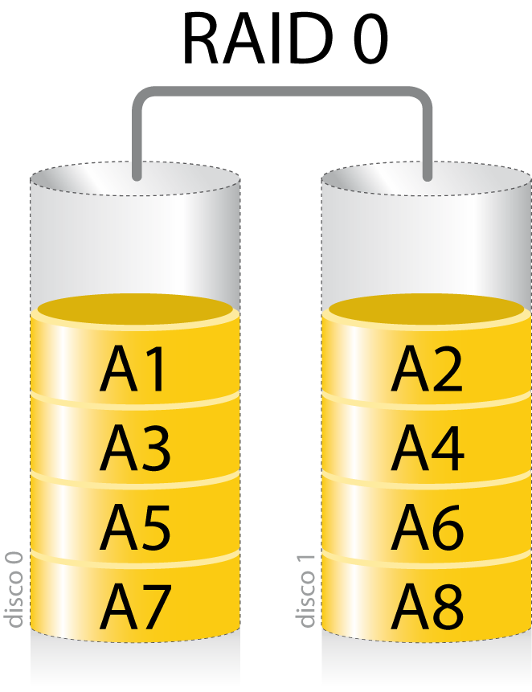

Un RAID 0 distribuye los datos equitativamente entre dos o mas discos, sin
informacion de paridad que proporcione redundancia.

Se usa para dar alto rendimiento de escritura, ya que se escriben en dos o mas
discos de forma paralela.

Se puede usar con discos de diferentes tamaños, pero el espacio añadido al
conjunto esta limitado por el tamaño del disco mas chico (ej. 450GB y otro de
100GB, el tamaño resultante es de 200GB, cada disco aporta 100GB).

La probabilidad de fallo es inversamente proporcional al numero de discos del
conjunto, pues para que falle es suficiente que lo haga *cualquiera* de los
discos.

##### RAID 1 (Mirror)


Crea una copia exacta (o espejo) de un conjunto de datos en dos o mas discos.

Es util cuando queremos mas seguridad pero desaprovechando capacidad, ya que si
perdemos un disco, tenemos al otro con la misma informacion.

Un conjunto RAID 1 solo puede ser tan grande como el mas pequeño de sus discos.

La fiabilidad incrementa exponencialmente con respecto a un solo disco, ya que
la probabilidad de fallo es el producto de la de cada disco, pues para que falle
tienen que fallar todos.

El rendimiento de lectura incrementa de forma lineal con respecto al numero de
copias. Un RAID 1 puede estar leyendo al mismo tiempo dos datos diferentes en
dos discos diferentes.

##### RAID 4


Acceso independiente con discos dedicados a la paridad

Usa division a nivel de bloques con un disco de paridad dedicado. Necesita al
menos 3 discos fisicos.

Es parecido a RAID 3 excepto porque divide a nivel de bloques en vez de bytes,
lo cual permite que cada miembro del conjunto funcione independientemente cuando
se solicita un unico bloque.

Si la controladora de disco lo permite, un conjunto RAID 4 puede servir varias
peticiones de lectura simultaneamente.

##### RAID 5


Distribuido con paridad.

Es una divison de datos a nivel de bloques, que distribuye la info de paridad
entre todos los discos miembros del conjunto. Genenralmente se implementass con
soporte de hardware para el calculo de paridad.

Necesita un minimo de 3 discos para ser implementado.

En el ejemplo, una peticion de lectura de A1 seria servida por el disco 0, y una
simultanea en el bloque B1 tendria que esperar, pero del bloque B2 podria ser
atendida concurrentemente ya que seria realizada por el disco 2.

Cada vez que se escribe un bloque de datos, se genera un bloque de paridad
dentro de la misma division (stripe). Una serie de bloques (un bloque de cada
uno de los discos en conjunto) se le llama *stripe* o division. Si otro bloque,
o alguna porcion de un bloque, es escrita en ea misma division, el bloque de
paridad es recalculado y vuelto a escribir.

Los bloques de paridad se leen durante lecturas cuando alguna produce un error
de CRC (error de verificacion de redundancia). El sector en la misma posicion
relativa dentro de cada bloque de datos restantes en la divison y dentro del
bloque de paridad se usan para reconstruir el sector erroneo, ocultando asi el
error del resto del sistema.

Si falla un disco entero del conjunto, los bloques de paridad de los discos
restantes son combinados con los bloques de datos para reconstruir los datos del
disco que fallo. **Pero si falla un segundo disco, provoca la perdida completa
de los datos**

##### RAID 5E


Variante de RAID que incluye discos de reserva, los cuales pueden estar
conectados y preparados (*hot spare*) o en espera (*standby spare*). No supunen
mejora en rendimiento, pero minimizan el tiempo de reconstruccion y la
administracion necesaria ante fallos.

##### RAID anidados

Si lo toman, ver en wikipedia

- **RAID 0+1**: Espejo de divisiones
- **RAID 1+0**: Divison de espejos
- **RAID 30**: Divison de niveles RAID con paridad dedicada
- **RAID 100**: Division de divison de espejos
- **RAID 10+1**: Espejo de espejos

## 7 - File Systems

Un **archivo** es una secuencia de bytes, sin estructura, identificados por un
nombre. Es responsabilidad de cada programa interpretarlo.

### File System

El modulo de kernel que se encarga de organizar la informacion en el disco es el
**file system** (sistema de archivos). Algunos SOs soportan uno solo (DOS solo
FAT), mas de uno (windows FAT, FAT32, NTFS, etc.), y otros permiten que se
carguen dinamicamente (como Unix).

Responsabilidades:

- Ver como se organizan de manera logica los archivos
  - Interna: Como se estructura la info dentro del archivo (ex windows y unix
    usan una secuencia de bytes)
  - Externa: Como se organizan los archivos. Todos los FS soportan el concepto
    de *directorios*, lo que hace que se organizen de forma jerarquica en forma
    de arbol.

- Casi todos soportan *links*: alias, otro nombre para el mismo archivo. Deja de
  ser un arbol la estructura y se convierte en un grafo (que puede tener ciclos)

  

- Como se nombrara los archivos: Caracter de separacion, extension o no,
  restricciones de longitud y encoding, case sensitivity, prefijado o no por el
  dispositivo, punto de montaje.

  Ej:
  - `/usr/local/etc/apache.conf`
  - `C:\Program Files\Antivirus\Antivirus.exe`
  - `\\SERVIDOR3\Parciales\parcial1.doc`
  - `servidor4:/ejercicios/practica3.pdf`

### Punto de montaje

Si tengo mas de una unidad de almacenamiento externo, tengo que indicarle al SO
de alguna manera en que punto del FS comienza su raiz.

### Representacion de archivos

Como representar archivos, gestionar el espacio libre, y que hacer con la
metadata determina las caracteristicas del FS. Para el FS, un archivo es una
lista de bloques en los que estan los datos + metadata.

- **Naive**: Todos los bloques de un mismo archivo los guardo contiguos en el
  disco. Para leerlo es rapido, pero a medida que se modifica el FS, se genera
  mucha fragmentacion. Sirve para FS *inmutables* (read-only).

- **Lista enlazada**: Lecturas consecutivas razonablemente rapidas, pero las
  arbitrarias son muy lentas. Y desperdicia espacio de cada bloque indicando
  donde esta el siguiente

  

- **Tablas**: Una tabla que por cada bloque dice en que bloque esta el
  siguiente, y a parte tengo cada archivo en donde comienza.

  > Ej: El archivo A esta en los bloques 1, 2, 5, 7, 9 y el B en 4, 3, 8.
  >
  > | Bloque | Siguiente |
  > | ------ | --------- |
  > | 0      | vacio     |
  > | 1      | 2         |
  > | 2      | 5         |
  > | 3      | 8         |
  > | 4      | 3         |
  > | 5      | 7         |
  > | 6      | vacio     |
  > | 7      | 9         |
  > | 8      | -1        |
  > | 9      | -1        |

  **FAT** (*File Allocation Table*) usa este metodo

  La desventaja que tiene es la concurrencia (unica tabla, mucha contencion) y
  las inconsistencias. La tabla la tengo en memoria, pero es necesario bajarla a
  disco cada tanto. Se trata como una cache. Pero si se corta la luz, tengo una
  inconsistencia. Es poco robusto.

- **inodos** (index nodes)

  Cada archivo tiene un inodo, que esta compuesto por

  - Al principio metadata
  - *Single indirect block*: Punteros a nodos con datos. Hasta 16MB.
  - *Double indirect block*: Apunta a una tabla de single indirect. Hasta 32GB.
  - *Triple indirect block*: Apunta a un bloque de double indirect. Hasta 70TB.

  Como hay una tabla por archivo, hay mucho menos contencion, y solo estan en
  memoria las listas correspondientes a los archivos abiertos.

  Si se corta la luz, solo se corrompen los archivos abiertos en ese momento.

  `ls -i` te deja ver el numero de inodo.

  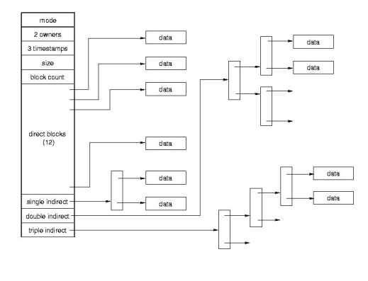

### Representacion de directorios

Para implementar el arbol de directorios, hay un inodo reservado que es el *root
directory*. Dentro de los bloques de los directorios hay una lista de inodos con
los nombres de archivo/directorio.

### Link simbolico

```bash
ln -s
```

Ahi ves explicitamente una flechita. No comparten el inodo

En el inodo cuyo contenido dice "che, anda a leer el archivo al cual estoy
linkeado"

Es una manera de apuntar a algo exista o no, porque solo se ve el nombre.

El principal uso es hacer un link a un archivo que esta en otro file system.
Si no te deja hacer un link normal porque pertenece a un inodo de otro file
system, pero si se puede hacer el link normal


### Manejo de espacio libre y cache

Leer del silber

### Consistencia

Los datos se pueden perder con un corte abrupto, y los SOs brindan formas de
forzar que se escriba la cache (`fsync`, pero no es un flush porque no se
limpia)

Pero el sistema se puede interrumpir antes de que eso suceda, dejandolo el FS en
un estado inconsistente. Paar eso brindan un programa que restaura la
consistencia (`fsck` - file system check en Unix), que realiza una serie de
chequeos que nacen del *invariante* de los inodos para restaurarlo.

Cuando la computadora se apaga de forma normal, se escribe un bit que lo indica.
Si cuando prende no esta set, se corre de forma automatica.

Pero es bastante lento porque puede llegar a recorrer todo el disco, entonces
hay alternativas para evitar hacerlo de forma parcial o total

- **Soft updates**: Yo cacheo bloques de datos, pero la metadata trato de
  grabarla casi siempre. Deja de ser binario si esta en sync o no. La ventaja es
  que permite que el recorrido para verificar el invariante se pueda hacer con
  el sistema funcionando.

  El sistema arranca, esta un poco mas lento porque corre un proceso, pero no te
  quedas esperando un rato largo a que el sistema levante.

  No es la linea evolutiva ganadora

- **Journaling**: Algunos FS llevan un *log* o *journal*, un registro de los
  cambios que hay que hacer. Cuando el sistema levanta, se aplican los cambios
  aun no aplicados.

### Caracteristicas avanzadas

- Cuotas de disco: Limitar cuanto usa cada usuario.
- Encripcion: https://xkcd.com/538/s
- Snapshots: Fotos del disco en determinado momento, para hacer copias de
  seguridad.
- RAID por software, mas lento pero mayor control independiente del proveedor
- Compresion

### NFS

Leer del libro

### Definiciones

- Un **archivo** es un conjunto de datos relacionados entre si. Incluye *datos*
  y *metadatos* (datos que describen al archivo en si, como por ejemplo
  propietario, permisos, etc). Es la unidad mínima de almacenamiento secundario
  para el usuario.

- Un **sistema de archivos** permite administrar y ordenar los archivos. La diferencia entre uno y otro esta en la
  estructura de datos que se utilizan

- Las lecturas y escrituras a un medio de almacenamiento se hacen en unidades llamadas **bloques**, que pasa a ser la
  unidad minima de almacenamiento. No los bytes. Los bloques son *lógicos*, pero tienen que ver con las caracteristicas
  del hardware subyacente, como por ejemplo los sectores de un disco. Cada archivo ocupa una cantidad entera de bloques,
  lo cual lleva a fragmentación interna.

### Asignación

Como **asignar** los bloques a los diferentes archivos

#### Contigua

Es la forma mas naive, pero puede llevar a fragmentación externa: teniendo el espacio disponible no se le puede asignar
a un bloque por estar fragmentado.

Ejemplo

Se asignan bloques contiguos a los archivos 1, 2 y 3.

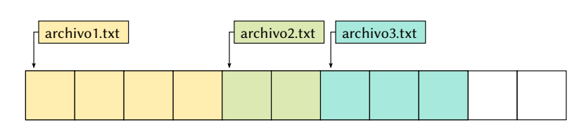

Se desaloja el archivo 2, y ahora hay espacio para un archivo de 4 bloques, pero no contiguo.

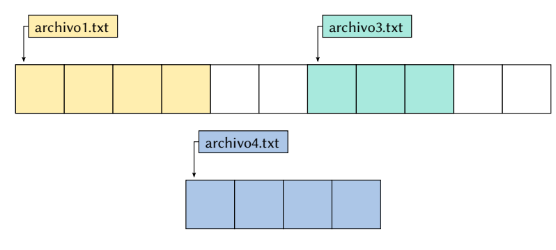

#### FAT

**Referencia**: Cada bloque dice cual es el siguiente del archivo, una lista enlazada. Y en el final, el ultimo nodo
marca el final del archivo. Una versión tuneada de esto es **FAT** (*File Allocation Table*), tiene una tabla de
asignación de archivos. Cada bloque guarda al siguiente, y finaliza en un EOF.

Una tabla de **asignación de archivos**, **FAT**, es una tabla que tiene una entrada para cada bloque de disco. Si tengo
un disco con 1000 bloques, necesito 1000 entradas.

Si tengo un archivo que inicia en la posicion 5, voy a la entrada 5, que indica cual es el siguiente, y así hasta llegar
a `EOF` que tambien esta indicado en la tabla.

En la tabla se indica:

- Cual es el bloque siguiente del archivo al cual pertenece el bloque
- Si el bloque es el ultimo de un archivo
- Si el bloque está vacío

El sistema necesita la data adicional para saber donde inician los archivos.

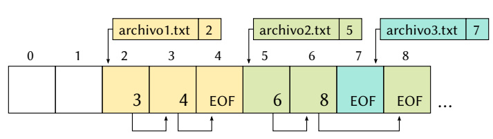

Por ejemplo el archivo 2, no necesariamente tienen que estar contiguos en memoria, incluso podria haber un archivo con
un solo bloque.

Problemas:

- Cuando el acceso a los bloques no es secuencial, se vuelve menos eficiente

  > (yo) porque va y viene en memoria al lugar en donde esta la FAT (generalmente el principio del disco) y los lugares
  > en donde estan las paginas.

- Requiere tener *toda* la tabla cargada en memoria siempre

Ejemplos: FAT, FAT16, FAT32

#### Inodos

Se mantienen **indexados** todos los bloques de cada archivo. Tener para cada archivo una lista de punteros a todos sus
bloques. Me traigo solo los bloques asociados a cada archivo.

En los sistemas UNIX, estas estructuras se llaman **inodos**.

Ejemplos: UFS, ext2, ext3, ext4

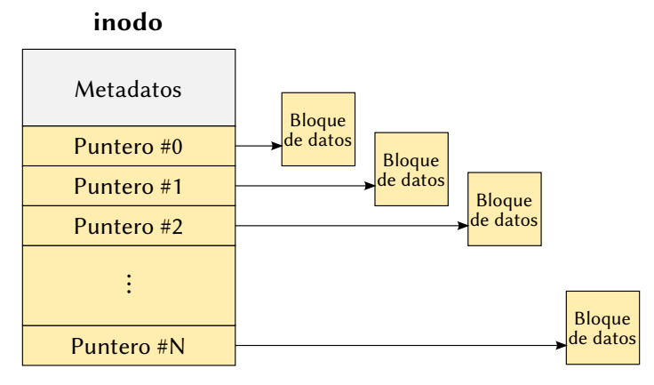

En un sistema con **inodos**, a cada archivo le corresponde una de estas estructuras.

- Metadatos: Datos descriptivos del propio archivo
- Punteros: A los bloques de datos. Los datos no estan en el inodo

#### Punteros con indireccion

Es deseable que tengan un tamaño fijo, y los primeros bloques de un archivo suelen ser accedidos con más frecuencia.
Para archivos mas grande se usan **punteros con indirección**. Por ejemplo en ext2 todos los inodos tienen 15 punteros
as bloques, de 4 tipos distintos

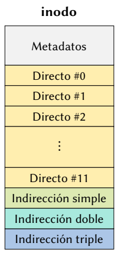

- Indireccion simple: Apunta a un inodo
- Indireccion doble: Tiene dos niveles de punteros
- Indireccion triple: Tiene punteros a bloques de indirecciones dobles

Entonces, hay

- **12 directos**: que apuntan directamente a un bloque de datos
- 1 con **indireccion simple**: que apunta a un bloque con una lista de punteros
  a bloques de datos.
- 1 con **indireccion doble**: apunta a un bloque con una lista de punteros de
  indireccion simple.
- 1 con **indireccion triple**: apunta a un bloque con una lista de punteros de
  indireccion doble.

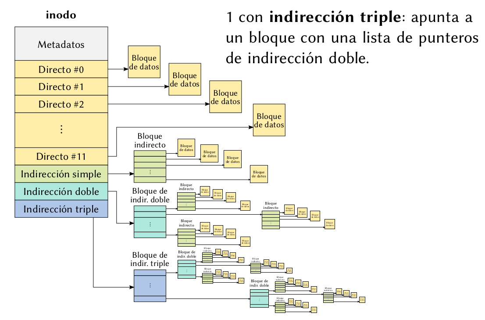

Este arbol según la necesidad permite abarcar una mayor cantidad de bloques.

#### Estructura interna

Pero donde están los inodos? En un fs ext2, los bloques del disco están
divididos en **grupos** contiguos. Los inodos estan repartidos a lo largo de
todo el disco.

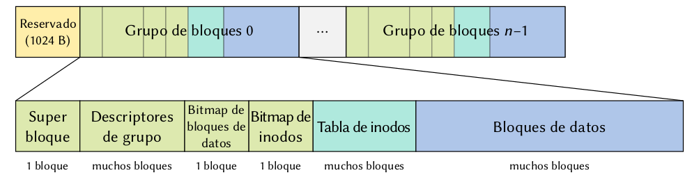

Cada grupo contiene bloques de **datos** y bloques de **inodos**.
A cada inodo **no** le corresponde un bloque. En un bloque **puede haber varios
inodos** y suelen ser mucho mas grandes los bloques que los inodos.

- Reservado: para que arranque el sistema. Si tengo mas de un fs no necesariamente en todos va a estar ocupado.
- Se agrupan los bloques para tener redundancia de ciertos datos, y conseguir los archivos con mayor facilidad.
- **Super bloque**: Tiene la descripción de todo el sistema de archivos en general. Se copia varias veces de forma
  redundante en cada grupo. A partir de ahi empieza la info personal de cada grupo
- Descriptor de grupo: Dan información del grupo
  - archivos asignados
  - inodos disponibles
  - espacio disponible
  - etc.
- Bitmaps: De bloques de datos y de inodos. Indica rápido que bloques de inodos y datos están disponbiles.
- Tabla de inodos: Es donde están almacenados los inodos que apuntan a los bloques de datos almacenados más adelante.

### Directorios

Contienen dentro los archivos. Y como sabemos a partir de el nombre de un archivo (el nombre completo, con `/`s) que
bloques ocupa? **directorios**. Los directorios **también son archivos**, son una tabla con una entrada por cada archivo
que contienen, indicando su nombre y posición donde comienzan en el disco. Puede tener subdirectorios, y de esa forma
podemos organizar a los archivos de forma *jerárquica*, mediante un arbol (en realidad un grafo) de directorios.

En FAT32, los directorios

- Indican el indice del **primer bloque** de cada archivo
- Contienen todos los **metadatos**: nombre, tamaño, fecha de ultimo acceso, etc.
- El bloque del directorio **root** es distinguido, tiene una posición especial, y de esa forma podemos encontrar
  cualquier ruta partiendo desde la raiz.

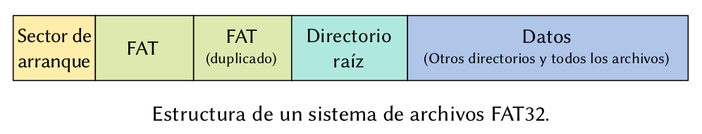

En ext2, los directorios

- Solo contienen el **nombre** de cada archivo y el índice de su inodo, ya que los metadatos están en cada inodo.
- Como los directorios son archivos, también les corresponde un inodo a cada uno
- Al igual que en FAT, el directorio root está en una posición distinguida: es siempre el inodo número 2.

### Links (enlaces)

En los sistemas con inodos, el nombre de los archivos no aparece en los inodos. De esa forma, se puede referenciar el
mismo inodo con diferentes nombres desde más de un directorio, conocido como **hard link** (*enlace duro* o *físico*).
Se pueden crear con `ln`.

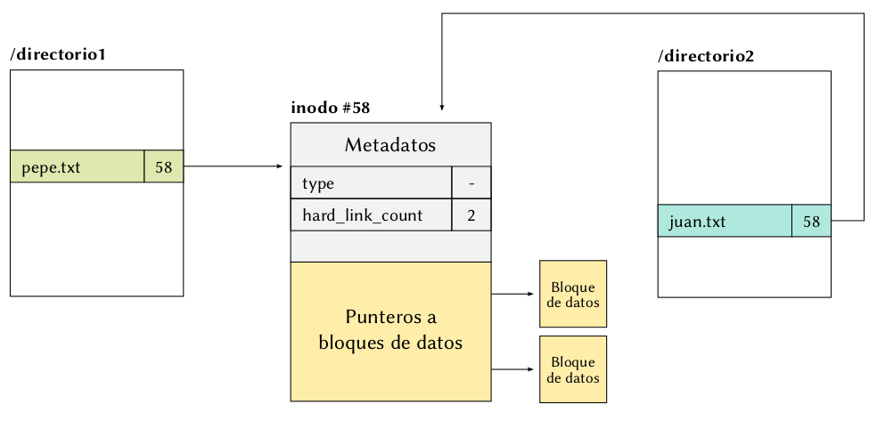

Uno de los metadatos que tiene es la cantidad de enlaces duros del inodo.

Los links duros no se pueden hacer entre sistemas de archivos, porque un hard link solamente es un numero de inodo, y se
podria confundir.

Los symlinks o *links simbólicos* permiten tener enlaces que vayan más allá del fs actual. Se crean con `ln -s`. De fondo
se crea otro inodo, y dentro de el se guarda la entrada de directorio que apunta a la entrada de ese archivo. Pero esa
dirección podría ser tranquilamente la de otro sistema de archivos.

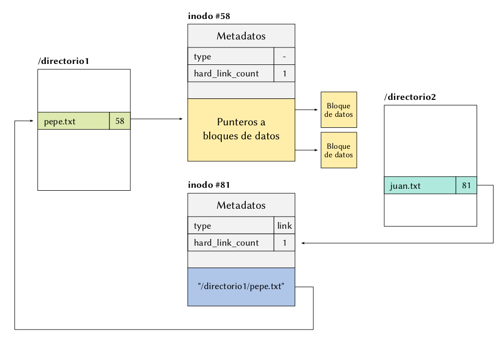

### Recuperando un archivo en FAT

Y ext2 se hace en el taller

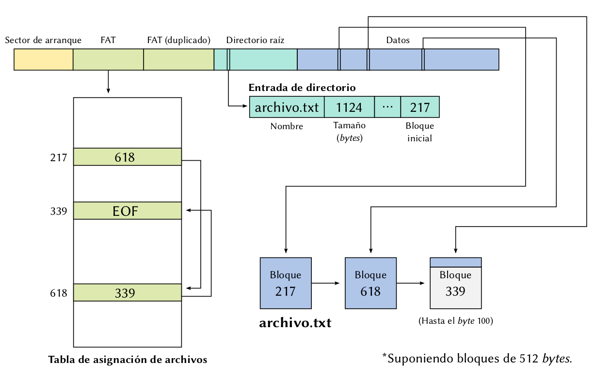

## 8 - Proteccion y Seguridad

- Proteccion: Mecanismos para que nadie pueda usar los datos de otro. Que
  usuario puede hacer cada cosa.
- Seguridad: Asegurarse de quien dice ser cierto usuario, lo sea. Impedir
  tambien la destruccion o adulteracion de los datos.

La distincion puede ser un poco tirada de los pelos asi que nosotros no la
hacemos, pero algunos ambientes academicos si.

Como una definicion mas moderna, la *seguridad de la información* se entiende como preservar:

- Confidencialidad
- Integridad
- Disponibilidad

Los protagonistas en los sistemas de seguridad suelen ser *sujetos*, *objetos* y
*acciones*. La idea es decir que sujetos pueden realizar que acciones sobre que
objetos. El sujeto por lo general es un usuario. Los usuarios se suelen agrupar
en *grupos* que tambien son sujetos. Ademas se les suelen asignar roles.

Triple A:

- Authentication: Quien decis ser
- Authorization: Que podes hacer
- Accounting (auditoria): dejar registrado lo que se hace

### Crypto

La **criptografia** es una rama de la matematica e informata que se ocupa de
cifrar/descifrar info usando metodos y tecnicas que permiten el intercambio de
mensajes tal que solo puedan ser leidos por las personas a las que van
dirigidos.

El **criptoanalisis** no es lo mismo, sino que se encarga de romper lo que logra
cripto.

Tipos:

- **Simetrico**: La misma clave que uso para encriptar me sirve para desencriptar.
  Ej: Caesar, DES (Data Encryption Standard), Blowfish, AES.

- **Asimetrico**: usan claves distintas para encriptar y desencriptar. El mas
  famoso es **RSA**.

  La clave publica la puede conocer cualquier persona. Requiere factorizar un
  numero en sus componentes primos, lo cual es NP-completo.

  La clave privada es de cada receptor, por cada persona que te comunicas
  generas un par de claves publica y privada.

  Para encriptar un mensaje, interpreto cada letra como si fuera un numero y
  hago una cuenta con la clave publica del receptor. Para descifrarlo es
  necesaria la privada.

  Cualquier mecanismo de encripcion usa RSA como parte, y se suele combinar con
  simetricas.

- Funciones de **hash** one way: MD5, SHA1, SHA-256

  Lo hasheado no es facil de volver a entender que valor era (salvo por fuerza
  bruta). Deben cumplir con:

  - Resistencia a la preimagen. Dado h deberia ser dificil encontrar m tal que h
    = hash(m)
  - Resistencia a la segunda preimagen: Deberia ser dificil encontrar
    colisiones.
  
  Son muy utiles para almacenar contraseñas de los usuarios, pero se debe usar
  *salts* (como numeros al azar para después hasharlos juntos) e iterarlo varias
  veces.

#### Firma digital

Para saber que alguien firmo un documento.

- Calculo el hash del documento
- Encripto con mi clave privada
- Entrego el documento y el hash encriptado (la firma)

La persona que recibe,

- Hashea el documento, deberia obtener el mismo hash que el que firmo.
- Desencripta con la publica. Si da lo mismo, el unico que puede haber
  encriptado es el dueño de la privada, y se valida la firma.

En la practica los *key servers* tienen las claves publicas de la gente.

### Representacion de permisos

La forma mas facil de realizar autorizacion es una matriz de sujetos x objetos
de control de accesos. En las celdas figuran las acciones permitidas. Pero que
pasa cuando se crea un objeto nuevo?

- **DAC**: Discretionary Access Control, el dueño decide los permisos de
  seguridad de cada objeto explicitamente.

  En Unix los permisos de los archivos son DAC. `SETUID` y `SETGID` son permisos
  de acceso que se asignan a archivos o directorios en un SO. Se suelen usar
  para permitir que usuarios ejecuten binarios con privilegios elevados
  temporalmente para una tarea especifica. Si un archivo tiene activado el bit
  `SETUID` se idntifica con una `s` en `ls`

  ```text
  -rwsr-xr-x 1 root shadow 27920 ago 15 22:45 /usr/bin/passwd
  ```

- **MAC**: Mandatory Access Control, se usa para manejar informacion muy
  sensible. Cada sujeto tiene un grado o nivel, y los objetos heredan el grado
  del ultimo sujeto que los modifico. Un sujeto solo puede acceder a objetos de
  grado menor o igual que el de el.

  Un ejemplo es *Windows Integrity Control*, que define cuatro niveles de
  integridad: System, High, Medium (nivel por defecto) y Low. Todos los
  archivos, carpetas, usuarios y procesos tienen niveles de integridad.

### Buffer overflows

Cuando se invoca una función en c, primero se hace push de los parametros y el
IP a la pila, y las variables locales reservan espacio en la pila.

```c
void f(char* origen) {
  char buffer[16];
  strcpy(buffer, origen);
}

void main(void) {
  char grande[18];
  f(grande);
}
```

| Antes de `strcpy`                       | Despues                                |
| --------------------------------------- | -------------------------------------- |
| 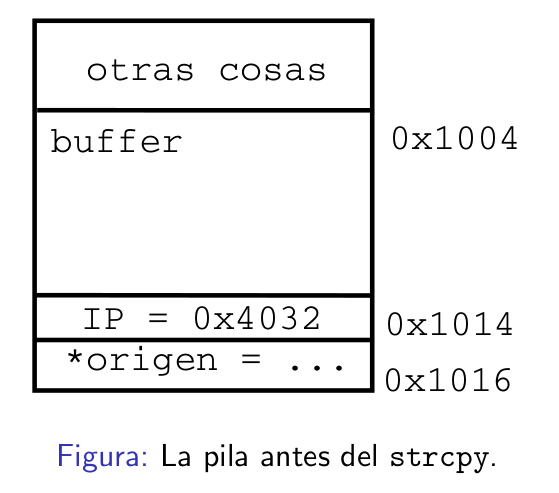 | 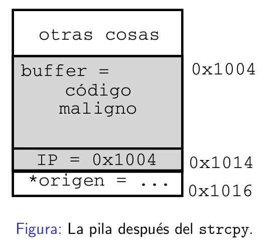 |

Se piso el IP. Esta es stack based pero tambien hay heap based. Hay distintas
formas de detectarlo e intentar prevenirlo

### Mecanismos de proteccion

Algunos SOs implementan uno o mas mecanismos para protegerse de posibles
ataques, como

- `DEP`: Data Execution Prevention
  
  Ninguna region de memoria deberia ser al mismo tiempo escribible y ejecutable.
  Se implementan con ayuda del hardware, por ej mediante el bit NX en intel.
  Impide ataques basicos como los que aparecen aqui.

  Es bypasseable (ROP)

- `ASLR`: Address Space Layout Randomization

  Modifica de manera aleatoria la direccion base de regiones importantes de
  memorientre diferentes ejecuciones de un proceso. Por ej del heap, stack,
  libc, etc.

  Impide ataques que utilizan direcciones hardcodeadas. Y no todo se randomiza,
  por lo general, la seccion de text no cambia, y para que lo haga, se tiene que
  compilar especialmente para ser *Position Independent Executable* (PIE).

  Es bypasseable.

- `Stack Canaries`: Tambien Stack Guards o Stack Cookies

  Se implementa a nivel compilador. Se coloca un valor en la pila luego de crear
  el stack frame (canary) el cual se verifica antes de retornar de la funcion.

  La idea es proteger el valor de retorno de la funcion de buffer overflows.

### Controles de parametros

Cuando no se valida el input y se termina haciendo algo que no debia, como un
sql inyection o un rm -rf en un `system`.

## 9 - Sistemas Distribuidos

Un **sistema distribuido** es un conjunto de varios recursos conectados entre si
que interactuan. Pueden ser varias maquinas en una red, un procesador con varias
memorias, varios procesadores que comparten memorias.

Fortalezas:

- Paralelismo
- Replicacion
- Descentralizacion

Debilidades:

- Dificultad en la sync
- Dificultad para mantener coherencia
- No suelen compartir clock
- Informacion parcial

### Memoria compartida

Puede ser por hardware:

- UMA: Uniform memory access
- NUMA: Non uniform memory access
- Hibrida

O por software

- Estructurada
  - Memoria asociativa
  - Distributed arrays
- No estructurada
  - Memoria virtual global
  - Memoria virtual particionada por localidad

### Distribuido

Sin memoria compartida, es un sistema distribuido. Computadoras (nodos)
conectadas a traves de la red.

### Arquitecturas

#### Cliente-servidor

La cooperacion tiene forma de solicitarle servicios a otros, que no tienen un
rol activo. El **servidor** es el que da servicios cuando el cliente se lo pide.
El programa principal hace de cliente de los distintos servicios que necesita
para cumplir con su tarea.

- **Telnet**

  Los recursos necesarios para el procesamiento estan en otro equipo, accedemos
  a el y hacemos el procesamiento de manera remota. El otro solo tiene que
  recibir las conexiones. Utilizacion asimetrica de los recursos.

- **RPC**

  Se hacen *procedure calls* de forma remota. Se stubbea la funcion llamada por
  una que hace un llamado a traves de la red y el programador no se entera. Del
  otro lado tiene que haber un *daemon* para recibir la peticion y ejecutar la
  funcion.

  Un stub es una funcion que tiene la misma aridad que la real, pero por abajo
  tiene otra implementacion.

  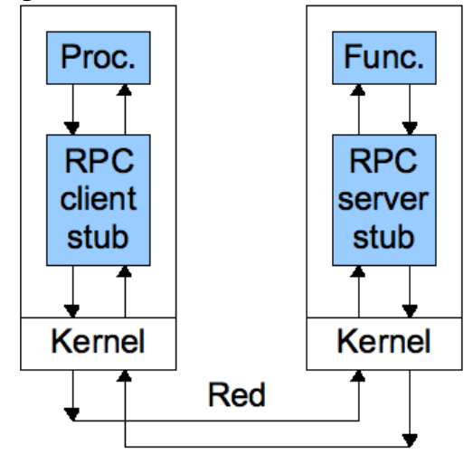

  Es un mecanismo **sincronico**, el proceso queda bloqueado hasta que no se
  hace el camino de ida y vuelta.

  - Java Remote Method Invocation
  - JSON-RPC
  - SOAP

#### Async

Comunicacion async

- **RPC async**
  - Promises
  - Futures
  - Windows async RPC

- **Pasaje de mensajes**

  Ejemplos:
  - Mailbox
  - Pipe
  - MPI
  - Scala actors

  Es el metodo mas general, ya que solo supone que hay compartido un canal de
  comunicacion (puede llegar a ser un bus).

  Problemas a considerar:

  - Codificacion de los datos
  - Si es comunicacion async, hay que ver cada tanto si recibo un mensaje
  - La red es lenta
  - El canal puede perder pensajes. gracias a TCP/IP podemos hacer de cuenta que
    hay una capa que soluciona eso, y que los canales son más confiables.
  - Podria costar plata $$ mandar mensajes.

  Y a ignorar

  - Los nodos pueden morir
  - La red se puede partir

  **Conjetura de brewer**: En un entorno distribuido, se pueden tener solo dos
  de tres
  
  - Consistencia: Todos los nodos tienen la misma informacion
  - Disponibilidad: El sistema esta disponible 24/7
  - Tolerancia a fallas: Se banca que haya nodos que se caigan

  Lograr cada una afecta a las demas. Por ejemplo, si se cae un nodo y el
  sistema continua funcionando, es tolerante a fallas, pero cuando levante
  nuevamente va a tener informacion inconsistente.

### Locks

En entornos distribuidos no tenemos un TestAndSet atomico. Como hacemos?

#### Enfoque centralizado (coordinador)

Un nodo es distinguido, el *coordinador*, y es el que se encarga de arbitrar los
recursos. Tiene varios problemas

- Puede llegar a ser un bottleneck de procesamiento y capacidad de red.
- Comunicarse con el es lento (red)
- Es el unico punto de falla, si se cae, se cae toda la red. Una cadena se corta
  por el eslabon las debil.

#### Ordenar eventos en la red

El que quiere usarlo, canta pri y se lo dice a todos. Si dos lo hacen a la vez,
todos los escuchan en algun orden.

Si dos nodos emiten el mensaje al mismo tiempo, como están a distancias
diferentes, llegan en momentos diferentes. En una red, el orden el que se
reciben los mensajes no necesariamente tiene que ver con el orden en el que
fueron emitidos.

Uno podría decir, si todos tenemos la hora, está todo bien, pero trae otras
dificultades también.

**Como sabemos entonces cuando sucede un evento antes que otro en una red?**

> Hay protocolos de sync de relojes en la red, como NTP (Network Time Protocol)
> que tratan de lograr que sea *suave*. Si notan un desfazaje, lo van ajustando
> lentamente para que no haya cambios abruptos. Y los relojes tienden a
> desincronizarse, entonces cuando es necesaria una sync por tiempo muy fina
> como para un mecanismo de locks, no sirve.

No es necesario sincronizar los relojes. Lamport: solo es necesario ordenar los
eventos, saber si algo ocurrio antes o despues, pero no importa exactamente
cuando.

Leslie define un **orden parcial no reflexivo** entre los eventos

- Si en un proceso A sucede antes que B, A -> B
- Si E es el envio de un mensaje y R su recepcion, E -> R sin importar en que
  procesos ocurran.
- Transitividad: A -> B y B -> C entonces A -> C
- Si no vale A -> B ni B -> A, entonces A y B son *concurrentes* (no es un orden
  total, no estan todos los elementos relacionados entre si)

Implementacion

- Cada procesador tiene un reloj, alcanza con que sea un valor monotonicamente
  creciente.
- Cada mensaje tiene timestamp
- Cuando recibo un mensaje enviado en un tiempo `t`, me fijo que hora tengo
  - Si es anterior, entonces ahora es despues que el instante, ya que la
    recepcion es mayor al envio. Paso mi tiempo a al menos `t+1`.

Con esto construyo un orden parcial. Para un orden *total*, puedo romper empates
arbitrariamente (como por el PID) para eventos concurrentes.

### Acuerdo bizantino

- [Video de Tom Scott](https://www.youtube.com/watch?v=IP-rGJKSZ3s)

Formalizacion

- Dadas
  - **Fallas** en la comunicacion
  - **Valores** $V = \{0, 1\}$
  - **Inicio** todo proceso $i$ empieza con un valor valido, $init(i) \in V$
- Se trata de
  - **Acordar** Para todo $i \neq j, decide(i) = decide(j)$
  - **Validez** $\exists i, decide(i) = init(i)$
  - **Terminacion** todo $i$ decide en un numero finito de transiciones (WAIT
    FREEDOM)

Teo: No existe ningun algoritmo para resolver consenso en este escenario.

- Dadas
  - **Fallas** los procesos dejan de funcionar
  - **Valores** $V = \{0, 1\}$
  - **Inicio** todo proceso $i$ empieza con un valor valido, $init(i) \in V$
- Se trata de
  - **Acordar** Para todo $i \neq j, decide(i) = decide(j)$
  - **Validez** $\forall i init(i)=v$ entonces $\nexists j, decide(j) \neq v$
  - **Terminacion** todo $i$ que *no falla* decide en un numero finito de transiciones

Teo: Si fallan a lo sumo k < n procesos, entonces se puede resolver consenso con
O((k+1) * n^2) mensajes

Y hay otro para procesos no confiables

### Clusters

En un sentido cientifico, es un conjunto de computadoras conectadas a una red
con un scheduler de trabajos. No es uno como el del SO, sino que le doy una
serie de tareas y sus caracteristicas y este lo manda a correr de forma
distribuida en una red. En la facu tenemos el **CECAR**, un cluster de computo
cientifico.

En el resto del mundo, es un conjunto de computadoras que estan trabajando en
conjunto de alguna forma.

- **Grid** Conjunto de clusters
- **Cloud**: Tengo una serie de computadoras y las alquilo
  - Puede ser un servicio *elastico*, escala la cantidad de computadoras. En vez
    de hacerlo a mano podria ser automatico segun el trafico. (autoscaling)

### Scheduling en distribuidos

Dos niveles:

- Local: Dar el procesador a un proceso listo
- Global: Asignar un proceso a un procesador (**mapping**)

  Para **compartir** la carga entre los procesadores

  - Estatica: **affinity**: las tareas son asignadas a un procesador. Tal vez
    para resolverlas necesito hacer uso de ciertos recursos que no es tan fácil
    mover a través de la red.
  - Dinámica: **migration** La asignación varía durante la ejecución. Es un
    problema complejo, porque es dificil saber cuando mover, y de donde a donde
    mover. Y quien lo define? Los nodos lo definen de forma distribuida? Un nodo
    solo está destinado a ello? Es un quilombo.
    - **Sender initiated**: Iniciaza por el procesador sobrecargado)
    - **Receiver initiated** / **work stealing**: Iniciada por el proc. libre

### Problemas y algoritmos

Problemas y algoritmos sobre sistemas totalmente distribuidos. Pertenecen a tres
grandes familias

- Orden de ocurrencia de los eventos
- Exclusion mutua
- Consenso

#### Modelo de fallas

Cuando se trabaja con algoritmos distribuidos es importante determinar el modelo
de fallas. Alternativas (combinables) que indicen algoritmos distintos.

- Nadie falla (los resultados son correctos si no hay fallas)
- Los procesos caen pero no levantan
- Caen y pueden levantar
- Caen y pueden levantar, pero solo en determinados momentos
- La red se particiona
- Los procesos pueden comportarse de manera impredecible.

En la materia nos concentramos en algoritmos sin fallas.

#### Metricas de complejidad

Se mide segun la cantidad de mensajes enviadas a traves de la red, pero no
siempre es asi, por ej. algoritmos sobre redes dedicadas de alta velocidad
pueden llegar a tener otros bottlenecks.

#### Exclusion mutua distribuida

Formas:

- **Token passing**

  Aramr un anillo logico (onda token ring) entre los procesos y poner a circular
  un token. Cuando quiero entrar a CRIT, espero a que me llegue el token.

  Sin fallas no hay inanicion, pero hay mensajes circulando cuando no son
  necesarios.

- **Otra**

  - Cuando quiero entrar, envio a todos un mensaje `solicitud(Pi, ts)` (ts
  timestamp). Cada proceso puede responder inmediatamente o encolar la
  respuesta.
  - Entro cuando recibi todas las respuestas.
  - Y si entro, al salir respondo todos los pedidos demorados.
  - Respondo inmediatamente si:
    - No quiero entrar a CRIT
    - Quiero entrar, aun no lo hice, y el `ts` del pedido que recibi es menor
      que el mio, entonces el otro tiene prioridad.

  Requiere que todos conozcan la existencia de todos (no es un token ring), pero
  no circulan mensajes si no se quiere entrar a la seccion critica.

  Tiene de supuestos que no se pierden mensajes y que ningun proceso falla.

#### Locks - protocolo de mayoria

Queremos obtener un lock sobre un objeto del cual hay copias en n lugares.
Para hacerlo, debemos pedirlo a por lo menos n/2 + 1 (la mitad mas uno) sitios

Cada sitio responde si puede o no darnoslo.

1. Se puede pensar como computadoras que tienen archivos, y hay distintos
   procesos que tienen acceso exclusivo a distintos recursos en distintos
   lugares de la red. Y quieren obtener un lock para esos recursos
2. O tambien, que esos distintos archivos son copias de la misma informacion,
   entonces me tengo que garantizar de lockear todos a la vez

Si obtengo el lock, cada objeto tiene un numero de version, entonces lo
escribimos **en todas las copias** y ponemos el numero de version como el max+1.

- **No se pueden otorgar dos locks a la vez** ya que seria necesario que dos
  procesos tengan al menos la mitad mas 1.

- **No se puede leer una copia desactualizada** ya que cada proceso escribe en
  n/2 + 1 copias, entonces siempre voy a leer al menos 1 de las que escribio el
  otro proceso, la cual esta actualizada.

  > Supongamos que leo una copia desactualizada.
  > Debo tener $k \geq n/2 + 1$ locks cuya ts sea $t$, y que exista otra copia
  > $j$ con marca $t_j > t$.
  >
  > Por lo tanto, el ultimo que escribio la version $t_j$, lo tuvo que hacer en
  > menos de $n/2 + 1$ copias, porque sino al menos una de las mias tendria
  > marca $t_j$.
  >
  > Pero cada proceso escribe siempre en todas las que tiene lockeadas, y lockea
  > al menos $n/2 + 1$. Abs!

#### Eleccion de lider

Una serie de procesos elije a uno como *lider* para alguna tarea.

- Mantengo un status que dice si soy el lider o no. Comienza con que no
- Organizo los procesos en un anillo y hago circular mi ID.
- Cuando recibo un mensaje, comparo el ID que circula con el mio, y circulo el
  mayor.
- Cuando dio toda la vuelta, sabemos quien es el lider. (el maximo)
- Circulamos otro mensaje de notificacion para que todos lo sepan.

Complicaciones posibles: varias elecciones simultaneas, procesos que suben y bajan del anillo.

Complejidades

- Tiempo
  - Sin fase de stop O(n)
  - Con fase de stop O(2n)
- Comunicacion
  - O(n^2)
  - Cota inferior de nlogn

#### Instantanea (snapshot) global consistente

Es *global* porque quiero saber el estado de todos los nodos del sistema.
Pero como no comparten clocks, necesito que si los miro a todos juntos, eso
tenga sentido que haya sucedido en algun momento del tiempo. Que sean
*consistentes* entre ellos. Por ejemplo,

> si un nodo en su estado dice que
>
> `A -> B`
>
> B recibio un mensaje de A
> no puede suceder que A crea que no se lo envio, porque la recepcion siempre
> es posterior al envio. Pero al reves si, ya que el mensaje puede estar en el
> aire

Algoritmo

- Cuando se quiere hacer una instantanea, envia un mensaje de `marca` a si
  mismo.
- Cuando recibo por primera vez un mensaje de marca, guardo una copia de mi
  estado y le mando a todos los otros procesos un mensaje de marca
- Empiezo a registrar los mensajes que recibo hasta que recibo `marca` de todos

  > deberia recibir marca de todos una vez, pues todos lo mandan una vez a todos

- Cuando recibo el ultimo de marca, se que termino la instantanea. Y todos los
  procesos guardaron la copia de su estado. Los mensajes de la primera a la
  ultima estaban en vuelo durante la instantanea.

- Finalmente, el estado global es que cada proceso esta en cierto estado, y los
  mensajes que cada proceso se guardo despues del comienzo de la instantanea son
  los que estan circulando por la red.

Usos:

- Deteccion de propiedades estables (una vez que son verdaderas, lo siguen
  siendo)
- Deteccion de terminacion
- Debugging distribuido
- Deteccion de deadlocks

#### 2PC (Two Phase Commit)

Acuerdo en dos etapas. La idea es realizar una transaccion de manera *atomica*,
todos los nodos tienen que estar de acuerdo en si se hizo o no se hizo.

Espiritu

- En la primera fase, preguntamos a todos si estamos de acuerdo con que se haga
  la transaccion, con un timeout para las respuestas
  - Si recibimos *no* de al menos uno (o cortamos por timeout), abortamos
  - Si recibimos todos *si*, pasamos a la segunda
- En la segunda fase, avisamos a todos que quedo confirmada.

#### Consenso

Acuerdos:

- k-agreement (o k-set agreement)

  decide(i) $\in W$ tq $|W| = k$, se deciden k cosas

- Aproximado

  $\forall i \neq j |decide(i) - decide(j)| \leq \epsilon$

- Probabilistico

  $P(\exists i \neq j. decide(i) \neq decide(j)) < \epsilon$

Aplicaciones

- Sincronizacion de relojes (NTP, RFC 5905 y anteriores)
- Tolerancia a fallas en sistemas criticos.

## 10 - Avanzados

### Microkernels

Busca contrarrestar las desventajas de un kernel monolitico logrando

- Menos codigo privilegiado
- Facilidad de actualizaciones
- Mayor flexibilidad y extensibilidad
- Crash de servicios no tira abajo todo el sistema
- Diferentes flavors de servicios

Para esto se hace el minimo kernel posible, que tenga manejo basico de memoria,
IPC liviano y manejo basico de ES. Todo lo demas se provee por procesos que
corren por fuera del kernel, **servicios** (hay uno que implementa TCP/IP, otro
filesystems, etc.)

Resulta mas lento en la practica que los kernels monoliticos, y nunca termino de
tomar vuelo. Excepciones notables

- QNX: Unix RT microkernel para embebidos
- MacOS tiene match que es unm microkernel.

### Virtualizacion

**Virtualizacion** es la posibilidad de que un conjunto de recursos fisicos se
vean como varias copias de recursos logicos. Pensar en una computadora
realizando el trabajo de varias. Esto sirve para tener *maquinas virtuales*, con
objetivos:

- Portabilidad (por ej. JVM)
- Simulacion y testing
- Aislamiento
- Agrupamiento de funciones
- Particionamiento del HW
- Proteccion ante fallas del HW mediante migracion entre HW sin perdida de
  servicio.

Se puede lograr mediante

- **Simulacion**: El sistema *host* (o anfitrion) se construye una variable de
  estado artificial que representa al sistema *guest* (o huesped). Lee cada
  instruccion y modifica el estado como si estuviera ejecutando realmente.

  Pero tiene mucho overhead, y detalles: como maneja interrupciones, DMA,
  concurrencia, etc.?

- **Emulacion** del hardware: El sistema emulado se ejecuta realmente en la CPU
  del host, y se *emulan* los componentes del hardware.

  El grueso del codigo se corre mediante *trauduccion binaria*: las cosas que
  funcionan en el HW tal cual las ejecuto, y las que no las reemplazo por
  equivalentes.
  
  Tiene un problema con la separacion de privilegios, toda la VM corre en modo
  usuario.

Por esto surge la intencion de lograr virtualizacion asistida por hardware, para
evitar los siguientes problemas

- Ring aliasing: Programas escritos para modo kernel que se ejecutan en modo
  usuario.
- Address-space compression: Que la maquina virtual no pise la memoria del
  emulador, desde el punto de vista del host son un proceso
- Non-faulting access to privileged state
- Interrupt virtualization: Simularle las int al SO host.
- Access to hidden state: Parte del estado del procesador que no es consultable
  por software
- Ring compression: No hay proteccion entre kernel y programas de usuario en la
  VM
- Frequent access to privileged resourceAs: El controlador de maquinas virtuales
  puede bloquear el acceso a ciertos recursos, haciendo que genere un trap, lo
  que puede ser un bottleneck para recursos accedidos frecuentemente.

Para solucionarlo, los fabricantes agregan soporte para virtualizacion dentro
del hardware.

> En Intel se agregan las extensiones VT-x, que proveen modos VMX root y VMX
> non-root

Tiene problemas:

- Optimizaciones pensadas para el kernel, picos de carga en mas de una CPU
- Unico punto de falla

Usos

- Correr sistemas viejos
- Aprovechar equipamiento
- Desarrollo / testing / debugging
- Abaratar costos

#### Contenedores

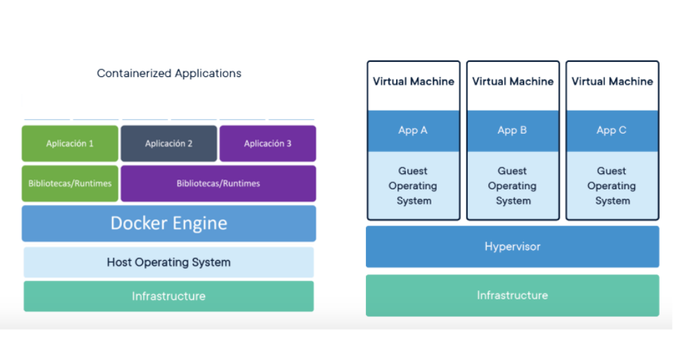

Es una especie de maquina virtual, no simula, su motivación tiene que ver. La
idea es correr apps en la misma computadora sin que interfieran entre si,
generando un entorno lo más replicable posible.

Tiene varias ventajas: codigo compartido, portabilidad, aislamiento, capas,
snapshots.

### DFS (Distributed File System)

Es un sistema de archivos cuyos servidores y dispositivos de almacenamiento
estan distribuidos entre las maquinas de un sistema distribuido.

Hay dos modelos: Cliente servidor y basados en clusters. Desafios: Nomenclatura
y transparencia, acceso a archivos remotos, caches y consistencia.

- **Cliente servidor**

  Ejemplo: NFS

  El servidor almacena los archivos y su metadata en almacenamiento conectado al
  servidor. Los clientes se contactan a el para pedirle archivos, y el servidor
  es el responsable de la autenticacion, chequeo de permisos y envio del
  archivo.
  
  Los cambios que hace un cliente al archivo deben ser propagados al servidor.

  El problema es que hay un unico punto de falla en el servidor, que ademas es
  un cuello de botella para todos los pedidos. Problemas de escalabilidad y
  bandwidth.
  
  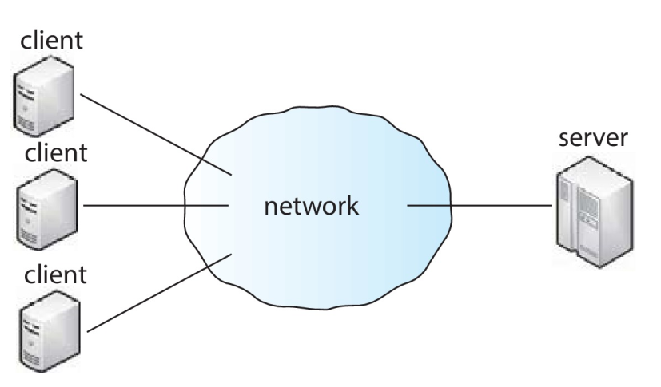

- **Cluster**

  Ejemplo: Google File System (GFS) y Haddop Distributed File System (HDFS)

  Mas resistente a fallas y escalable que client-server.

  Los clientes se conectan a un servidor de metadata que contiene un mapeo de
  que servidores de datos contienen que chunks de cada archivo y hay varios
  servidores de datos que contienen chunks (porciones) de archivos.

  Los chunks se replican n veces.

  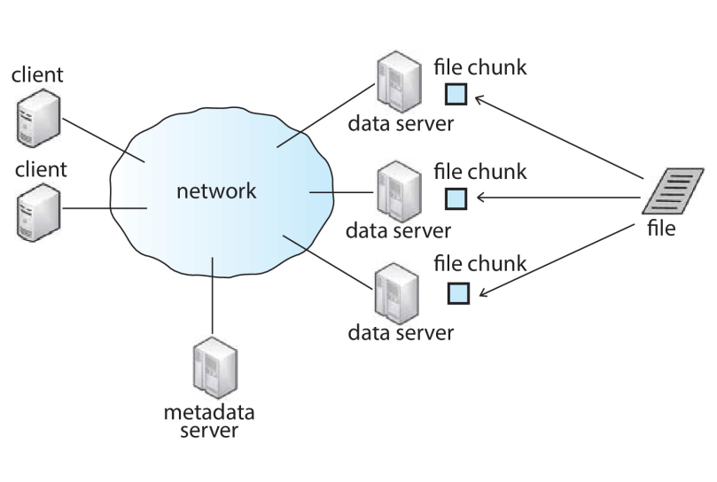

  - GFS (Global File System)

La **nomenclatura** es el mapeo entre objetos logicos y fisicos.

Un **mapeo multinivel** es una abstraccion de un archivo que oculta los detalles
de como y donde en disco esta almacenado el archivo.

Un DFS *transparente* oculta la ubicacion en la que se almacena el archivo en la
red. Entonces para uno replicado en varios sitios, el mapeo devuelve un set de
las ubicaciones de las replicas. La existencia y ubicacion de multiples copias
se ocultan.

Nombres:

- Transparencia de ubicacion: El nombre del archivo no revela su ubicacion
  fisica
- Independencia de ubicacion: El nombre del archivo no cambia cuando la
  ubicacion fisica cambia.

La mayoria de los DFS usan un mapeo estatico, independiente de la ubicacion para
nombre a nivel de usuario.

Esquema de nombres, tres enfoques

- Los archivos se nombran combinando host con nombre local. Esto garantiza un
  nombre unico en todo el sistema. No es ni transparente ni independiente de
  ubicacion

- Montar directorios remotos en locales, dando la apariencia de un arbol de
  directorios coherentes. Solo los remotos previamente montados pueden ser
  accedidos de manera transparente.

- Unica estructura global de nombre abarca a todos los archivos del sistema. Si
  un servidor no esta disponible, un conjunto arbitrario de directorios en
  distintas maquinas tambien.

El resto no parece importante y me parece que ni entra, asi que mas en las
diapos.
