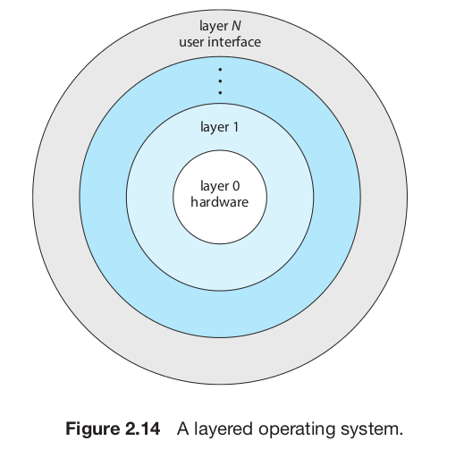
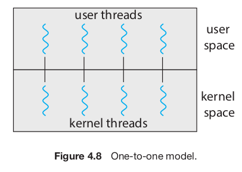

<!-- markdownlint-disable MD025 MD045 -->
<!-- MD025 single-title/single-h1 - Multiple top level headings in the same document -->
<!-- MD045/no-alt-text: Images should have alternate text (alt text) -->
# TOC

- [TOC](#toc)
- [Part one - Overview](#part-one---overview)
  - [Chapter 1 - Introduction](#chapter-1---introduction)
    - [Organization](#organization)
      - [Storage](#storage)
    - [Architecture](#architecture)
    - [OS Operations](#os-operations)
      - [Modes of execution](#modes-of-execution)
    - [Resource management](#resource-management)
    - [Seguridad y protección](#seguridad-y-protección)
    - [Virtualización](#virtualización)
    - [Sistemas distribuidos](#sistemas-distribuidos)
    - [Kernel Data Structures](#kernel-data-structures)
    - [Computing environments](#computing-environments)
    - [Free and Open-source OSs](#free-and-open-source-oss)
  - [Chapter 2 - Operating System Structures](#chapter-2---operating-system-structures)
    - [Services](#services)
    - [Interface](#interface)
    - [Syscalls](#syscalls)
      - [API](#api)
      - [Tipos](#tipos)
    - [System Services](#system-services)
    - [Linkers & Loaders](#linkers--loaders)
      - [Formatos](#formatos)
    - [OS Design & Implementation](#os-design--implementation)
    - [OS Structure](#os-structure)
    - [Building and booting](#building-and-booting)
    - [Debugging](#debugging)
    - [Chapter 2 Summary](#chapter-2-summary)
- [Part two - Process Management](#part-two---process-management)
  - [Chapter 3 - Processes](#chapter-3---processes)
    - [Concepto de proceso](#concepto-de-proceso)
      - [State](#state)
      - [PCB](#pcb)
    - [Process/CPU Scheduling](#processcpu-scheduling)
      - [Context switch](#context-switch)
    - [Operaciones en procesos](#operaciones-en-procesos)
      - [Creation](#creation)
      - [Termination](#termination)
    - [IPC](#ipc)
    - [Client-server](#client-server)
    - [Chapter 3 Summary](#chapter-3-summary)
  - [Chapter 4 - Threads & Concurrency](#chapter-4---threads--concurrency)
    - [Overview](#overview)
    - [Multicore programming](#multicore-programming)
      - [Types of parallelism](#types-of-parallelism)
    - [Multithreading models](#multithreading-models)
    - [Thread Libraries](#thread-libraries)
    - [Implicit Threading](#implicit-threading)
    - [Threading issues](#threading-issues)
    - [Implementación](#implementación)
  - [Chapter 5 - CPU Scheduling](#chapter-5---cpu-scheduling)
    - [Scheduling concepts](#scheduling-concepts)
      - [IO Burst cycle](#io-burst-cycle)
      - [Preemptive / non-preemptive](#preemptive--non-preemptive)
      - [Dispatcher](#dispatcher)
    - [Scheduling criteria](#scheduling-criteria)
    - [Scheduling algorithms](#scheduling-algorithms)
    - [Thread scheduling](#thread-scheduling)
    - [Multiprocessor scheduling](#multiprocessor-scheduling)
      - [Approaches](#approaches)
      - [Multicore](#multicore)
      - [Load Balancing](#load-balancing)
      - [Processor affinity](#processor-affinity)
    - [Real time scheduling](#real-time-scheduling)
    - [OS Scheduling examples](#os-scheduling-examples)
    - [Algorithm evaluation](#algorithm-evaluation)
- [Part three - Process Synchronization](#part-three---process-synchronization)
  - [Chapter 6 - Sync tools](#chapter-6---sync-tools)
    - [Background](#background)
    - [The Critical-Section Problem](#the-critical-section-problem)
      - [Peterson's solution](#petersons-solution)
    - [Hardware support for sync](#hardware-support-for-sync)
      - [Memory barriers](#memory-barriers)
      - [Hardware instructions](#hardware-instructions)
      - [Atomic variables](#atomic-variables)
    - [Mutex locks](#mutex-locks)
      - [Spinlock](#spinlock)
    - [Semaphores](#semaphores)
    - [Monitors](#monitors)
    - [Liveness](#liveness)
      - [Priority inversion](#priority-inversion)
    - [Evaluation](#evaluation)
  - [Chapter 7 - Sync Examples](#chapter-7---sync-examples)

Notacion:

- (!): Se nombra en el summary (por lo tanto es un punto importante del chapter)

# Part one - Overview

Notas del silber

## Chapter 1 - Introduction

Objetivos

- Organizacion general de una computadora y el rol de interrupciones
- Componentes
- Transicion de modo usuario a modo kernel
- Uso de SOs
- Ejemplos de SOs

### Organization

#### Storage

### Architecture

Se categorizan aproximadamente según la cantidad de CPUs de propósito general
que se usan.

- Single-processor systems

    El **core** es el componente que ejecuta instrucciones y tiene registros
    para almacenar info de forma local. El CPU principal con su core ejecuta un
    conjunto de instrucciones de proposito general, incluyendo instrucciones de
    procesos.

    Pueden tener otros procesadores de proposito especifico.

- Multiprocessor systems

    Tienen mas de un procesador single-core. Tienen mas throughput.

  - SMP: symmetric multiprocessing, cada procesador hace todos los tasks. El
    beneficio es que muchos procersos pueden correr simultaneamente, sin
    causar un deterioro en la performace.

    

    No se pueden agregar CPUs para siempre porque a partir de cierto punto la
    contención del bus pasa a ser un bottleneck y se empieza a degradar la
    performance.

    - Multicore: evolucion a traves del tiempo de multiprocessor, hay mas de un
    core en un chip. Pueden ser mas eficientes que multiples chips con
    single-cores.

        

    Definiciones:

    - CPU: El hardware que ejecuta las instrucciones
    - Procesaro: Un chip fisico que tiene uno o mas CPUs
    - Core: La unidad basica de computo de la CPU
    - Multicore: mas de un core en el mismo CPU
    - Multiprocessor: Mas de un procesador.

    NUMA: Non Uniform Memory Access, alternativa en el que cada CPU tiene una
    memoria local y estan interconectados entre sí. Esto hace que sea más escalable
    seguir agregando CPUs, pero hay un penalty en performance cuando un CPU tiene
    que acceder a la memoria de otro.

    

- Clustered system

    Tiene multiples CPUs, y se diferencian con los sistemas multiprocesador en
    que tienen un conjunto de *nodos* (siustemas individuales) unidos, cada uno
    un sistema multicore.

### OS Operations

- **System daemons**: programas que corren siempre que corra el kernel. Por ej.
  en linux el primer programa que corre es `systemd`, que inicia otros daemons.

El sistema espera idle a que pase algo

- Interrupciones
- Excepciones: Interrupciones generadas por el codigo causados por un error o un
  request de un programa para que se ejecute un servicio del SO (syscall)

- Multiprogramming

  Organizar a los programas para que el CPU siempre tenga uno para ejecutar. Un
  programa en ejecución se llama **proceso**. El SO mantiene los procesos en
  memoria, y elije y ejecuta alguno.

  En un sistema no multiprogramado, cuando el proceso tenga que esperar por algo
  (por ej IO) el CPU se quedaria idle. En cambio, en uno multiprogramado, mientras
  tanto se corre otro. Siempre y cuando al menos un proceso necesite ejecutar, el
  CPU nunca esta idle.

- Multitasking

  Es una extensión lógica de multiprogramación. En un sistema con multitasking, el
  CPU ejecuta multiples procesos cambiando entre ellos, pero los switches ocurren
  frecuentemente, proveyendo al usuario con un **tiempo de respuesta** rapido.

La decisión de que proceso correr es **CPU scheduling**

#### Modes of execution

Es necesario poder diferenciar entre código de usuario y de kernel para que el
de usuario no haga que el SO se comporte de formas que no debería. Al menos son
necesarios dos **modos** de operación (**dual mode**)

- **user mode**
- **kernel mode** (supervisor mode, system mode, privileged mode)

Esto se implementa con un bit en el hardware - "mode bit"

Cuando se ejecuta un programa de usuario, el SO corre en modo usuario. Pero
cuando se hace una syscall, hay que hacer un cambio de modo.


De esta forma, las instrucciones que puedan causar daño se designan como
**instrucciones privilegiadas**, que solo se puedan ejecutar en modo kernel.

Se puede extender el concepto a más de un modo. Por ej. intel tiene **protection
rings** donde 0 es kernel y 3 es user mode. (**multimode**)

### Resource management

Un SO es un **resource manager**. Hace manejo de

- **Procesos**
  
  Un programa por si solo no es un proceso. Un programa es una entidad *pasiva*
  en el sistema, mientras que un proceso es una *activa*. Un proceso
  single-threaded tiene un solo **program counter** que especifica la siguiente
  instrucción a ejecutar, y uno multithreaded tiene múltiples, uno para cada
  thread.
  
  Un proceso es la unidad de trabajo de un sistema, que consiste en una
  colección de procesos. Algunos OS-processes (que ejecutan código del sistema)
  y otros user-processes (que ejecutan código de usuario). Todos pueden ejecutar
  concurrentemente, o en parelelo en diferentes cores.

  El SO debe

  - Crear y borrar user y system processes
  - Schedulear procesos y threads en los CPUs
  - Suspender y resumir procesos
  - Proveedr mecanismos para IPC y sync.

  Chapters 3 a 7.

- **Memoria**
  - Que partes de memoria se usan y por qué proceso
  - Allocating y deallocating memory space as needed
  - Decidir que procesos (o partes de ellos) y data mover desde y hacia la
    memoria.

  Chapters 9 y 10

- **FS**

  El SO provee una vista uniforme y lógica del almacenamiento. Abstrae de las
  propiedades físicas con una sola unidad lógica de almacenamiento, el
  **archivo** (file). Mapea files a memoria física y las accede mediante los
  dispositivos de almacenamiento. Usualmente se organizan en **directorios**.

  El SO se encarga de

  - Crear y borrar archivos
  - Crear y borrar directorios para organizar archivos
  - Soportar primitivas para manipular ambos
  - Mapear archivos al storage
  - Backup de archivos en nonvolatile storage.

  Chapters 13 a 15

- **Mass-Storage**

  El SO debe proveer soporte para **almacenamiento secundario** para almacenar
  su memoria principal (que es volátil). En general se usan HDDs o NVM (SSDs)

  - Mounting y unmounting
  - Manejo del espacio libre
  - Asignación de almacenamiento
  - Disk scheduling
  - Particionar
  - Protección

  Como se usa tan seguido, la velocidad del SO puede depender de la eficiencia
  con la que se maneja el storage secundario.

  Opcionalmente, se puede proveer soporte para **tertiary storage** (para
  backups). Algunos SOs lo hacen mientras otros lo dejan en manos de software de
  usuario.

  Chapter 11

- **Cache**

  Como tienen tamaño limitado, **cache management** es un problema importante de
  diseño. Elegir el tamaño y la política de desalojo puede mejorar mucho la
  performance.

- **IO**

  Un propósito de los SOs es esconder las peculiaridades de los dispositivos de
  hardware del usuario. Esto es parte del **subsistema de E/S**, que consiste en
  varios componentes:

  - Manejo de memoria que incluya buffering, caching y spooling
  - Una interfaz general para drivers de dispositivos
  - Drivers para dispositivos de hardware específicos.
  
### Seguridad y protección

- Protección: Es cualqueir mecanismo para controlar el acceso de procesos o
  usuarios a recursos definidos por el sistema. Debe proveer formas de
  especificar los controles y hacerlos cumplir

- Seguridad: Defender a un sistema de ataques internos y externos. Viruses,
  DDOS, robo de identidad, etc.

Ambos requieren que el sistema distinga a los usuarios que lo utilizan. La
mayoria tiene una lista de usuarios y **user IDs** asociados. (**SID**, security
ID en windows).

También se pueden armar **grupos** de usuarios.

### Virtualización

Es una tecnología que permite abstraer el hardware de una sola computadora (CPU,
memoria, disco, tarjetas de red, etc) en diferentes entoros de ejecución,
creando la ilusión de que cada uno está corriendo en una computadora diferente.

Deja que los SOs corran como apps en otros SOs.

El software de virtualización es parte de una clase más grande que incluye la
**emulación**, que involucra simular hardware en software.

En virtualización, hay un **host** operating system y una aplicación que actúa
de **virtual machine manager (VMM)**, la cual corre los *guest* SOs, maneja su
uso de recursos, y protege a cada uno de los demás.


### Sistemas distribuidos

Es un conjunto de sistemas fisicamente separados conectados a través de una red
(**network**).

Una **red** es un camino de comunicación entre dos o más sistemas. Varian según
el protocolo usado, distancia entre nodos y funcionalidad. El protocolo más
usado es TCP/IP. Se caracterizan basada en la distancia entre sus nodos

- LAN: Local area network, conecta computadoras de un mismo cuarto, edificio,
  campus.
- WAN: Wide area network. Edificios, ciudades o paises.
- PAN: Personal area network.

### Kernel Data Structures

Estructuras de datos usadas por el kernel

- Lists, stacks y queues
- Trees
- Hash functions and maps
- Bitmaps

### Computing environments

Entornos en los cuales se usan SOs. Más info en el libro

- Traditional computing
- Mobile computing
- Client server computing
- Peer to peer computing
- Cloud computing
- Real time embedded systems.

### Free and Open-source OSs

Más info en el libro.

- GNU/Linux
- BSD Unix
- Solaris

## Chapter 2 - Operating System Structures

Objetivos:

- Identificar servicios provistos por un SO
- Ilustrar como las syscalls se usan para proveer servicios del SO
- Comparar y contrastar tecnicas de diseño de SOs monolithic, layered,
  microkernel, modular y hybrid.
- Proceso de boot
- Monitoreo de performance del sistema
- Diseñar e implementar modulos de para interactuar con un kernel de Linux.

### Services


### Interface

- CLI

  **shell**: Interpretes de comandos de los usuarios.

- GUI
- Touch

Eleccion: suele ser personal preference

El diseño de interfaces de usuario buenas e intuitivas no es tarea del SO.

### Syscalls

Las **syscalls** proveen una interfaz a los servicios del SO. Suelen ser
funciones en C o C++, pero para algunas tareas muy low-level incluso en asm.

#### API

Application programming interface. Especifica las funciones que pueden usar y su
signatura. Las mas comunes son

- Windows API
- POSIX API
- Java API

Las funciones de un API por abajo hacen syscalls on behalf del usuario.

#### Tipos

Describe las syscalls que se usan en cada categoria, mas en el libro.

- **Process control**
- **File management**
- **Device management**
- **Info maintenance**
- **Communications**: Hay dos modelos principales
  - Message passing: Los procesos intercambian mensajes entre si para transferir
    info.
  - Shared-memory

- **Protection**

### System Services

Servicios que provee el sistema para su uso y desarrollo más simple.

- Daemons: (o **services**, **subsystems**): System-program processes que estan
  corriendo en todo momento.

### Linkers & Loaders

Para que un programa corra en la CPU, se tiene que cargar en memoria.

1. Los archivos fuente se compilan a archivos objeto, que se cargan en memoria. Son
  del formato **relocatable object file**
2. El **linker** combina los archivos objetos en un solo binario **executable**
   Durante esta fase, otros objetos o bibliotecas se pueden incluir, como la
   libc math (-lm)

3. Un **loader** se usa para cargar el binario a memoria, donde puede correr en
   algun core.
4. Tambien potencialmente se puede hacer **relocation**, que asigna la direccion
   final de las partes del programa.

5. No necesariamente todas las libs se tienen que cargar estaticamente, se
   pueden cargar dinamicamente mientras se carga.
   Evita linkear libs que no se usarian en el ejecutable.
    - Windows: DLLs

#### Formatos

ELF: Executable and Linkable Format. Formato de UNIX.


### OS Design & Implementation

Tipos

- Traditional desktop/laptop
- Mobile
- Distributed
- Real time

Goals:

- **User goals**
- **System goals**

Es importante la separacion de

- Policy: *what* will be done
- Mechanism: *how* it will be done

### OS Structure

Como los componentes de un SO se interconectan y forman un kernel.

- **Monolithic**

  Todo en un solo binario que corre en un solo address space. Ejemplo: UNIX.

  

  

  Contra:

  - Difiles de implementar y extender
  - Coupled: Cambios en una parte del sistema pueden llegar a afectar a otras
    partes.

  Pro

  - Mas rapidos. No hay overhead en el system-call interface, comunicacion con el
    kernel es rapida.

- **Layered**

  Loosely coupled: Cambios en una parte afectan solo ellas.

  

  Cada capa se implementa usando funciones de las inferiores.

  Se pueden debuggear nivel a nivel, de forma tal que cuando encontramos un
  fallo, estamos seguros de que esta en el nivel que estamos debuggeando en ese
  momento.

- **Microkernels**

  Ejemplo: Match

  

  Se hace al kernel mas chiquito y el resto de las cosas programas de usuario.
  Necesariamente los procesos se comunican con message passing a traves del
  kernel, lo cual puede ser lento.

  \+ es mas facil de extender
  
  \+ mas facil de portear

  \- la performance puede ser peor por overhead en las syscalls, al ser codigo
  de usuario.  

- **Modules**

  **LKM**: Loadable kernel modules. El kernel tiene un set de componentes core
  que pueden ser linkeados con modulos adicionales en boot o runtime.

- **Hybrid**

### Building and booting

Proceso de boot, bootloader, GRUB, UEFI / BIOS, etc.

### Debugging

Como hacer debugging en el kernel, [BCC](https://github.com/iovisor/bcc)

### Chapter 2 Summary

- Un SO provee un entorno para la ejecucion de programas mediante servicios a
  sus usuarios y programas.

- Approaches principales para interactuar: CLI, GUI y touch
- syscalls sirven para acceder a los servicios del SO. Los programadores usan la
  API de ellas para acceder a sus servicios.

- Categorias de syscalls: process control, file management, device management,
  info maintenance, communications y protection.

- La libc provee la API de syscalls para Unix y linux.
- Los SOs vienen con una coleccion de system-programs que proveen utilidades a
  usuarios.

- Un **linker** combina varios *relocatable object files* a un solo binario
  ejecutable. Un **loader** lo carga en memoria, donde puede correr en el CPU

- Un SO se diseña con diferentes *goals* en mente. Esto determina sus
  *policies*, que se implementan mediante *mechanisms*

  - Monolithic: No tiene estructura, toda la funcionalidad se provee en un solo
    bonario que corre en un solo espacio de direcciones. Eficientes
  - Layered: Se divide en una cantidad finita de capas, donde la mas baja es el
    HW y la mas alta el UI. Tiene problemas de performance
  - Microkernel: Kernel minimo y el resto userland programs. Se comunican con
    message-passing.
  - Modular: Servicios de kernel como modulos que se pueden cargar y sacar en
    runtime. (por ej. drivers)
  - La mayoria de los SOs modernos son un hybrido entre modular y monolithic.

- Un **boot loader** carga un SO a memoria, lo inicializa y ejecuta.

# Part two - Process Management

- Un *proceso* es un programa en ejecución. Necesita recursos para cumplir su
  tarea, que se le reservan mientras ejecuta.

- Es la *unidad de trabajo* del sistema. Los sistemas consisten en una colección
  de procesos, los del SO ejecutan código de sistema y los de usuario código de
  usuario. Todos concurrentemente.

- Los SOs modernos permiten que tengan diferentes *threads* de control. Cuando
  hay más de un core, pueden correr en paralelo.

- Un aspeco importante del SO es como hace el *scheduling* de threads a cores.

## Chapter 3 - Processes

Objetivos

- Componentes de un proceso y como se representan y schedulean en un SO
- Creacion y terminacion de procesos.
- IPC con shared memory y message passing
  - Programas con pipes y POSIX shared memory
- Client-server communication con sockets y RPC
- Kernel modules que interactuan con el sistema.

### Concepto de proceso

El estado es el PC y el contenido de los registros. La memoria se separa en

- Text section: Codigo ejecutable
- Data: Variables globales
- Heap: Memoria dinamica
- Stack: Almacenamiento temporal (parametros, RET addr, variables locales)


Aunque dos procesos tengan asociado el mismo programa, son secuencias de
ejecucion distintas. Tienen el mismo text y data, pero heap y stack varian.

#### State

Mientras un proceso ejecuta, tiene **estado** (state).

- **new**: Esta siendo creado
- **running**: Se estan ejecutando instrucciones
- **waiting**: Esta esperando a que ocurra algun evento (IO / o una signal)
- **ready**: Esperando para tener asignado un procesador.
- **terminated**: Termino ejecucion


#### PCB

Cada proceso se representa en el SO por una **process control block** (PCB), o
task control block. Incluye

- Estado del proceso
- PC (addr de la siguiente instruccion a ejecutar)
- CPU Registers (es necesario guardarla para poder resumir la ejecucion del
  proceso)
- CPU-scheduling info. Prioridad, punteros a colas, etc.
- Memory-management info
- Accounting info: tiempo usado, etc.
- IO status: IO devices allocated, open files, etc.

Es toda la data necesaria para comenzar o reiniciar un proceso, ademas de alguna
accounting data.

Cuando hay **threads** la PCB contiene info de cada uno.

### Process/CPU Scheduling

Un **process scheduler** elige un proceso listo para que ejecute en un core.
Cada core puede ejecutar uno solo a la vez.

La cantidad de procesos en memoria es conocida como **degree of
multiprogramming**.

La mayoria de los procesos se pueden dividir en dos

- **IO-bound**: la mayoria del tiempo la pasa haciendo IO mas que computations
- **CPU-bound**: hace poco IO y mas que nada computations.

El sistema mantiene diferentes colas para los procesos

- Ready queue
- Wait queue


Y un diagrama de estados y colas


Ni bien entra se pone en ready, y despues puede hacer IO y caer en una IO queue,
o puede crear un proceso y esperar a que termine, o puede ser sacado del core
por una interrupcion o que se le termino el tiempo.

El rol del **CPU scheduler** es elegir de los procesos que estan en ready (en la
ready queue) y asignarles un CPU core.

#### Context switch

Cuando llega una interrupcion y hay que cambiar de proceso, el SO debe guardar
el **contexto** del actual para poder reestablecerlo luego, y cambiarlo con el
del que le toca ejecutar. Este esta representado en la PCB del proceso. El
proceso es llamado **context switch**.


### Operaciones en procesos

#### Creation

Un proceso puede crear otros procesos hijos, y ellos lo mismo, asi formando un
**arbol** de ellos. Estos se identifican con un **process identifier** (pid)

Para crear un proceso en UNIX, se usa la syscall `fork()`, que forkea el hilo de
ejecución y retorna 0 si es el hijo y el PID si es padre. El hijo puede tirar
`exec()` para cargar otro programa.


#### Termination

Un proceso le dice al SO que lo borre con la syscall `exit()`, retornando un
status value (int).

Por lo general es el padre el que lo tiene que matar. Y algunos sistemas no
dejan que los hijos existan si los padres terminaron, si uno termina, todos los
hijos deben terminar. Esto seconoce como **cascading termination**.

- Los procesos hijos que terminan no se sacan de la tabla de procesos para que
  los padres puedan tener su status code, al hacer `wait()`. Entonces hasta que
  los padres lo hagan, quedan como **zombies**.

  Cuando el padre hace wait(), se sacan de la tabla y no son mas zombies.

- Si el padre termina sin hacer `wait()`, quedan **orphans**. Aqui se hace que
  su padre sea `init/systemd`, que periodicamente hace wait() haciendo que no
  queden zombi.

### IPC

Los procesos pueden ser *independientes* si no comparten data con otros
procesos, o *cooperating* si pueden afectar o ser afectados por otros procesos.
Queremos que los procesos cooperen porque

- Info sharing: concurrent access a la misma info
- Computation speedup: Para dividir una tarea en subtareas que ejecuten en
  parlelo (si hay mas de un core)
- Modularidad

Los procesos que cooperan requieren una manera de intercambiar datos entre si,
**inter-process communication** (IPC). Hay dos modelos fundamentales: **shared
memory** y **message passing**


- Shared memory

  Un cacho de memoria se comparte entre un conjunto de procesos, y de esta forma
  pueden intercambiar info escribiendo y leyendo por ahi.

- Message passing

  Intercambian mensajes entre si, basicamente es posible un

  - `send()`
  - `receive()`

  Que cada uno puede especificar de que proceso obtiene/envia el mensaje, o sino
  con *mailboxes* que pueden ser de procesos o el SO.

  Los sends/receives pueden ser blocking o non-blocking, y pueden estar
  buffereados. (por ej. channels de go son blocking-blocking y pueden estar
  buffereados)

Ejemplos

- POSIX shared memory
- Match message passing
  - Ports = mailboxes
- Windows
- Pipes

### Client-server

Formas mas comunes

- Sockets
- RPC

### Chapter 3 Summary

- Un proceso es un programa en ejecucion, cuyo status esta representado por el
  PC y los registros.
- Tiene 4 secciones: text, data, heap y stack.
- Mientras ejecuta puede cambiar de estado. Hay 4 generales: ready, running,
  waiting y terminated
- La PCB (process control block) es la estructura de datos del kernel usada para
  representar un proceso.

- El rol del process-scheduler es elegir un proceso ready para que corra en un
  CPU, y el de un cpu-scheduler es elegir en que cpu corre. Cuando se cambia de
  proceso, se hace un **context-switch**
- IPC: shared memory / message passing
- Pipes: conducto para que procesos se comuniquen
  - Ordinary: Comunicacion entre procesos con parent-child relationship.
    Unidireccionales.
  - Named: mas generales y dejan que mas de un proceso se comunique
- Client-server
  - Sockets: Dejan que dos procesos se comuniquen a traves de la red, pueden
    estar en maquinas diferentes.
  - RPC: Abstrae el concepto de llamados a procedimiento de forma tal que una
    funcion se puede llamar en otro proceso que puede estar corriendo en otra
    computadora.

## Chapter 4 - Threads & Concurrency

El modelo del chapter 3 asumia que habia un solo thread, pero puede haber mas.

Objetivos:

- Que es un thread y las diferencias con un proceso
- Beneficios y desafios de diseñar procesos multithreaded
- Approaches a implicit threading: thread pools, fork-join, Grand Central
  Dispatch.
- Windows/linux threads

### Overview

Un thread es la unidad basica de utilización del CPU. Tiene como componentes

- Thread ID
- PC (Program Counter)
- Registros
- Stack

Y comparte con los otros threads del mismo proceso las secciones de codigo,
data, files abiertos, signals.


Un ejemplo de uso es un webserver que para atender a cada cliente usa un thread
diferente.

Beneficios:

- **Responsiveness**: Por ej. si un usuario toca un boton y eso causa un computo
  intensivo, si fuera single-threaded la app se traba, pero sino se puede hacer
  en un thread a parte y no se pierde la interactividad.
- **Resource sharing**: Los procesos solo pueden usar IPC (shared memory,
  message passing) para compartir recursos, mientras los threads comparten
  memoria y los recursos por default.
- **Economy**: Suele ser mas eficiente crear threads que procesos. En particular
  es mucho mas rapido el context-switch.
- **Scalability**

### Multicore programming

Concurrencia no es lo mismo que paralelismo. Un sistema **concurrente** soporta
mas de una tarea permitiendo que todas *progresen*, mientras que uno paralelo
ejecuta mas de una al mismo tiempo. El paralelismo existe cuando mas de una
tarea esta haciendo progreso en simultaneo.

Se puede tener concurrencia sin paralelismo, y el paralelismo requiere un
sistema multicore.

Desafíos a la hora de programar multithreaded:

- Identificar tareas a dividir en separadas concurrentes.
- Balancear el trabajo de cada una
- Separar los datos para que sean accedidos en cores diferentes
- Dependencias de datos entre tareas (sync)
- Testing y debugging es más difícil

#### Types of parallelism


Hay dos tipos de paralelismo en general

- **Data parallelism**: Separar data en cores y hacer la misma operacion en
  todos.

  > Por ej. sumar los contenidos de un array. Cada thread puede sumar un cacho.

- **Task parallelism**: Distribuir no la data, pero las tareas en distintos
  cores. Cada thread hace una operacion diferente, que podria estar usando la
  misma data. Requiere sync.

  > Por ej. dos threads haciendo operaciones estadisticas diferentes sobre el
  > mismo array, como la media y el promedio.

### Multithreading models


El soporte de threads puede ser a nivel de usuario (**user threads**) o por el
kernel (**kernel threads**). Tiene que existir una relación entre ambos.

Las aplicaciones de usuario crean user-level threads, que luego son mapeados a
kernel threads. Hay tres modelos principales

- **many-to-one**

  

  El threading se hace en user-space. El proceso entero se bloquea si un thread
  hace una syscall bloqueante. No pueden correr en paralelo porque uno solo
  puede acceder al kernel a la vez.

  No se usa mucho.

- **one-to-one**

  

  Mapea cada user thread a un kernel thread. Tiene mas concurrencia que el
  anterior y permite paralelismo.

  Lo malo es que crear un thread de usuario requiere crear un thread de kernel,
  lo cual lo hace mas costoso.

- **many-to-many**

  

  Multiplexa muchos user threads a menos (o la misma cantidad) de kernel
  threads.
  
  Una variacion tambien permite un user-level thread one to one. Se le llama
  **two-level model**.

  

### Thread Libraries

Una **thread library** le da a un programador una API para crear y manejar
threads. Puede ser user-space o kernel-space (soportada por el SO)

- POSIX pthreads
- Windows: kernel
- Java: Por abajo usa windows o posix.

### Implicit Threading

La estrategia de **implicit threading** consiste en mover la creacion de threads
a compiladores y bibliotecas de runtime. Por lo general involucran que los
programadores identifiquen *tareas* que pueden correr en paralelo, en vez de
threads.

Approaches

- **Thread pools**: Tener un pool de threads que se crean al inicio y se
  reutilizan, en vez de crear y destruir cada uno.

- **fork-join**: El padre *forkea* creando multiples hilos de ejecucion, y luego
  espera que terminen (*join*), punto en el cual combina sus resultados.

  

- **OpenMP**: Son directivas del compilador y APIs que permiten identificar
  regiones paralelas como bloques de codigo que pueden correr en paralelo.

- **Grand Central Dispatch** (GCD)

### Threading issues

- `fork()` y `exec()`, copian threads o mantienen? Parametrizado
- Las signals quien las maneja?
- Cancelar threads: Se puede hacer de dos maneras
  - Async cancellation: Para a un thread inmediatamente, aunque este en el medio
    de algo.
  - Deferred cancellation: Le informa al thread que deberia terminar pero lo
    deja hacer de una manera ordenada.

  Se suele preferir *deferred*.

- Thread local storage (TLS)
- Scheduler activations

### Implementación

En Linux, no hay distinción entre threads y procesos, son ambos *tasks*. Los
threads se crean con la syscall `clone()`.

## Chapter 5 - CPU Scheduling

En general se schedulea *kernel-threads* en vez de procesos en los sistemas
modernos. Estos corren en los *cores* del CPU.

Objetivos:

- Describir CPU scheduling algorithms
- Evaluarlos
- Explicar problemas de scheduling
- Describir algoritmos para real time scheduling
- Describir los usados en Windows, Linux y Solaris
- Aplicar modelados y simulaciones para evaluarlos
- Diseñar un programa que los implemente

### Scheduling concepts

En un sistema con un solo core, cada tarea debe esperar a que se libere para
poder ejecutar. El objetivo de la **multiprogramacion** (multiprogramming) es
que haya siempre uno corriendo, para maximizar la utilizacion de CPU.

Un proceso se ejecuta hasta que debe esperar algo (tipicamente IO). En un
sistema simple, el CPU se quedaria idle esperando a que termine, pero en uno con
multiprogramacion se swapea el CPU a otro proceso.

El **CPU scheduler** es el que se encarga de elegir que proceso en ready va a
correr en que CPU.

#### IO Burst cycle


La ejecucion de todo proceso consiste en un **ciclo** de ejecucion en la CPU y
IO wait. Alternan entre ambos: **IO burst** y **CPU burst**.

La distribucion se midio a ser la siguiente:


#### Preemptive / non-preemptive

Hay 4 situaciones en las cuales se podria tomar una decision de scheduling

1. running -> waiting (io wait, `wait()`)
2. running -> ready (interrupt)
3. waiting -> ready (io finish)
4. process termination

En 1 y 4 si o si se debe elegir uno, pero con 2 y 3 hay una elección.

- Cuando no se hace nada en 2 y 3, decimos que es **noonpreemptive** o
  **cooperativo**: Una vez que se le dio el CPU a un proceso, lo usa hasta que
  se ponga en waiting o termine.

- Sino, **preemptive**: Todos los modernos usan este. *Preemption* Puede
  resultar en race conditions.

Tambien:

- Preemtpive: Se puede sacar el CPU de un proceso
- Nonpreemptive: Un proceso debe necesariamente dar el control del CPU.

#### Dispatcher

El **dispatcher** es el modulo de kernel que le da el control del CPU al proceso
seleccionado por el scheduler. Involucra

- Context switch de un proceso a otro
- Cambiar a modo usuario
- JMP al PC del nuevo programa para resumir.

Debe ser lo mas rapida posible ya que se invoca cada context switch. El tiempo
que tarda es conocido como **dispatch latency**.


### Scheduling criteria

Criterios para juzgar que tan buenos son los algoritmos

- **Uso de CPU** (max): Queremos que este ocupado
- **Throughput** (max): Cantidad de procesos que terminan por unidad de tiempo.
- **Turnaround time** (min): Cuanto tarda desde que se pone en ready hasta que
  termina cada proceso.
- **Waiting time** (min): Suma de tiempos esperando en la cola de ready (no
  waiting por IO, porque eso no es controlado por el scheduler)
- **Response time** (min): Tiempo hasta el primer resultado, mejor que
  turnaround para sistemas interactivos.

### Scheduling algorithms

- **FCFS** (First come, first served)

  El que lo pide primero es asignado primero. Se implementa facil con un FIFO
  queue.

  Es nonpreemptive

- **SJF** (Shortest job first)

  Asocia con cada proceso la longitud de su siguiente burst de CPU, y cuando
  esta disponible se lo asigna al que tenga el mas corto (se usa FCFS para
  romper empates).

  Es óptimo en cuanto a avg waiting time (porque siempre es mejor poner uno mas
  corto antes de uno mas largo) pero no se puede saber cual va a ser la longitud
  del siguiente burst. Para esto se puede predecir con un **exponential
  average**.

  Puede ser preemptive (suele llamarse shortest remaining time first) o
  nonpreemptive.

- **RR** (Round robin)

  Es similar a FCFS, pero con preemption. Se define un **time quantum** o **time
  slice**, tiempo que tiene cada proceso para ejecutar en la CPU (Generalmente
  10-100ms) luego del cual se lo saca y se pone al siguiente. Se trata a la
  ready queue como una cola circular.

  Queremos que el quantum sea

  - Grande con respecto al context-switch
  - No demasiado grande, sino se convierte en FCFS

  Rule of thumb: 80% de los CPU-bursts deberian ser mas cortos que el quantum.

- **Priority**

  SJF es un caso particular. Se le asocia una prioridad a cada proceso y se
  despacha el de maxima, con FCFS para romper empates. Estas pueden ser internas
  (del SO) o externas (asignadas por usuarios)

  Puede ser preemptive o nonpreemptive.

  Puede llegar a producir **indefinite blocking** o **starvation** de procesos
  con baja prioridad. Una solucion posible es **aging**: de a poco incrementar
  la prioridad de los procesos que esperan por periodos prolongados de tiempo.

  Otra es combinarlo con round-robin, si hay mas de uno de una prioridad
  correrlos con round robin.

- **Multilevel queue**

  Los procesos se pueden poner en una sola cola para ejecutar, pero depende de
  como esten manejadas podria tomar O(n) determinar el de maxima prioridad.
  Suele ser mas practico entonces tener una queue por prioridad, donde cada una
  puede tener una politica diferente.

  

  Tambien se puede tener una queue por tipo de proceso (RT, interactivo,
  background) cada una con su politica, y luego otra para decidir entre ellas.

- Multilevel feedback queue

  Permite que los procesos cambien de cola. Por ej. si uno usa mucho CPU, baja
  prioridad. Esto hace que los que son IO-bound e interactivos tengan mas
  prioridad (suelen tener CPU-bursts cortos).

  Y un proceso que espera mucho en una cola de baja prioridad puede subir
  (aging), evitando starvation.

  Es el mas general. Se puede configurar para matchear cualquiera de los
  anteriores.

### Thread scheduling

En la mayoria de los SOs modernos se schedulean kernel-level threads en vez de
procesos.

### Multiprocessor scheduling

Si hay mas de un core es posible el **load sharing**: cuando threads pueden
correr en paralelo.

Multiprocessor puede ser

- Multicore CPUs
- Multithread cores
- NUMA
- Multiprocesamiento heterogeneo (HMP): no todos los CPUs son iguales, permite
  que se asignen tareas que consumirian mucho pero que son background a
  procesadores mas chicos

#### Approaches

- **asymmetric multiprocessing**: Hay un CPU maestro que ejecuta solo el codigo
  de kernel, y el resto hace solo codigo de usuario. Se vuelve un bottleneck
- **SMP**: Cada uno puede tener su propia cola o puede haber una en comun (ojo
  con las race conditions, si se usa lock podria ser bottleneck)

  

#### Multicore

Mas en el libro

- Chip multithreading (hyperthreading en intel)
  Cada CPU puede tener mas de un **hardware thread**, y desde el SO cada uno es
  un CPU logico diferente.

#### Load Balancing

Es importante en SMP mantener el workload balanceado (suponiendo una queue por
proceso). Para esto se hace **load balancing**. Approaches:

- **push migration**: Una tarea chequea el load en cada proceso y los distribuye
  equitativamente pusheando threads de uno al otro.
- **pull migration**: Un CPU idle *pullea* un task en waiting de otro.

#### Processor affinity

Si se migra un thread de un CPU a otro se pierde la (warm) cache y tiene que
llenarse devuelta. Esto se llama **processor affinity**, un proceso tiene
afinidad por el procesador en el que esta corriendo. Las ready-queues por CPU
hacen que lo tengamos gratis, mientras que tener una comun no.

- soft affinity: cuando es best-effort que se mantenga la afinidad
- hard affinity: cuando se cumple si o si, con syscalls se configura.

### Real time scheduling

(No lo dio muy en detalle chapa, lo nombró por arriba)

- **soft RT**: no hay garantias de cuando un proceso RT critico se schedulea
  
  Los sistemas soft real time le dan prioridad a las tareas real-time sobre las
  que no, pero no dan garantias.

- **hard RT**: un task tiene que ejecutarse antes de su deadline si o si.

  Los sitemas hard RT proveen garantias de tiempo para las RT tasks.

Hay que minimizar el **event latency**: el tiempo desde que ocurre un evento
hasta que se atiende. Dos tipos de latencia

- Interrupt latency
- Dispatch latency

Algoritmos:

- Priority based scheduling
- Rate-Monotonic scheduling: Asigna tareas periodicas usando una static priority
  policy con preemtpion.
- EDF (Earliest deadline first) scheduling: Asigna prioridades segun el
  deadline. Mientras mas cercano, mas alta la prioridad.
- Proportional share scheduling: Asigna *T* particiones a todas las apps. Si a
  una se le asignan N particiones (*shares*) tiene garantizado ejecutar N/T en
  el procesador.

### OS Scheduling examples

- Linux
  - Implementa un CFS (*Completely fair scheduler*), que asigna una proporcion
    del CPU a cada tarea. Se basa en el virtual runtime (`vruntime`) del task.
- Windows: Preemtpive, 32-level priority scheme.
- Solaris

### Algorithm evaluation

Primero se define un criterio para seleccionar un algoritmo.

- **Deterministic modeling** es un tipo particular de **analytic evaluation**.
  Toma un workload (conjunto de procesos, orden, prioridad, etc.) de input y
  corre los diferentes algoritmos para ver cuál da mejor en cuanto a performance
  de cierta métrica (por ej. waiting time).

  > (esto es lo que haciamos en la practica)

  Como depende del caso particular que le dan, sirve solo para ejemplos y
  explicar algoritmos.

- **Modelos de colas**: matematicamente se predicen parametros
- **Simulaciones**: Se programa un modelo del sistema y se obtiene telemetria.
  Los eventos se pueden generar de forma random (puede seguir una dist) o con un
  **trace file**: copiar un comportamiento que haya sucedido en el sistema.

  

- **Implementacion**: La unica manera accurate de saber que tan bueno es, es
  programarlo y probarlo en un sistema real.

# Part three - Process Synchronization

Usar herramientas que controlan el acceso a datos compartidos para evitar *race
conditions*.

## Chapter 6 - Sync tools

Un **cooperating process** puede afectar o ser afectado por otros procesos
ejecutando en el sistema. Pueden compartir directamente un espacio de
direcciones logico (codigo y data) o requerir el uso de shared memory / message
passing.

Objetivos

- Describir el problema de critical section e ilustrar race condition
- Soluciones de hardware para crit. Mem barries, CAS, atomic vars.
- Mutex, semaphores, monitores, condition variables para CRIT
- Evaluar herramientas que lo solucionan en diferentes niveles de contencion.

### Background

Los procesos pueden correr en paralelo y sus instrucciones pueden tener
cualquier interleaving, dependiendo del scheduler.

(!) Una **race condition** sucede cuando hay muchos procesos ejecutando
concurrentemente y tienen acceso a data compartida, y el resultado final depende
del orden particular en el cual suceden los accesos concurrentes a la data.
Estas pueden resultar en valores corrompidos en la data compartida. Para
evitarlo, tienen que estar *sincronizados* de alguna forma.

> Por ejemplo, dos programas ejecutando `n++` el resultado deberia ser siempre
> n+2. La operacion se podría implementar en algun lenguaje de maquina como
>
> ```asm
> r1 = n
> r1 = r1 + 1
> n = r1
> ```
>
> Un interleaving posible seria
>
> - [p1] r1 = n
> - [p1] r1++
> - [p2] r2 = n
> - [p2] r2++
> - [p1] n = r1
> - [p2] n = r2
>
> Donde el valor final es `n + 1`.

### The Critical-Section Problem

(!) En un sistema con n procesos, cada uno tiene un cacho de codigo llamado
**sección crítica**, en el cual accede y actualiza informacion compartida con al
menos otro proceso. No deberia haber dos procesos ejecutando en sus secciones
criticas a la vez. El *critical-section problem* es diseñar un protocolo que
usen los procesos para sincronizar su actividad para que esto suceda.

La **entry section** es la que hace el *request* de entrar y la **exit section**
la de salir. El resto es **remainder section**. La estructura general de un
proceso típico es

```c
while(true) {
  entry section

    critical section

  exit section

    remainder section
}
```

(!) Una solución al problema debe cumplir con:

1. **Mutual exclusion**: A lo sumo un proceso esta en la seccion critica.
2. **Progress**: Si no hay ninguno en ella y algunos quieren entrar, solo los
   que no esten en REM peuden participar en la decision de cual entra, y no
   puede ser pospuesto indefinidamente.

   Los programas cooperan para determinar que proceso va a entrar a la seccion
   critica.

3. **Bounded waiting**: Hay un limite para la cantidad de veces que otros
   procesos pueden entrar a la seccion critica desde que uno pidio entrar, antes
   de que se lo deje entrar.

   Limita la cantidad de tiempo un programa puede esperar hasta entrar a la
   seccion critica.

Hay dos acercamientos generales para manejar critical sections en SOs:

- **Preemptive kernels**: Deja que los procesos sean preempted mientras corre en
  modo kernel. No esta libre de race conditions.
- **Nonpreemptive kernels**: No deja. Un proceso en kernel mode va a correr
  hasta que sale, se bloquea, o le da control al CPU. Esta libre de race
  conditions en las estructuras de datos del kernel, ya que hay uno a la vez.

  Es dificil de implementar en arquitecturas SMP, ya que puede haber mas de un
  proceso corriendo en cada core.

#### Peterson's solution

Es una software-based (porque no requiere soporte especial del hardware o SO)
solution que permite que dos procesos (Pi y Pj) se turnen para entrar a su
seccion critica.

```c
int turn;     // shared
bool flag[2]; // shared

// codigo de Pi
while(true) {
  flag[i] = true;
  turn = j;
  while (flag[j] && turn == j); // entry

    // crit
  
  flag[i] = false; // exit

  // remainder
}
```

Cumple con las 3 propiedades (demo en el libro), pero (!) **no necesariamente
anda en arquitecturas modernas** porque el compilador o el procesador pueden
reordenar instrucciones que no tienen dependencias para mejorar la eficiencia,
lo cual no tendria efecto en programas singlethreaded pero si en estas
situaciones.

### Hardware support for sync

Como las software-based solutions no esta garantizado que andan en arquitecturas
modernas, hay que brindar algo de soporte desde el HW.

(!) Incluyen

- Memory barriers
- Instrucciones de hardware (CAS, TAS)
- Atomic variables

#### Memory barriers

La manera en la cual una arquitectura determina que garantias de memoria le
provee a una aplicacion es su **memory model**, que puede ser de dos categorias:

- **Strongly ordered**: modificaciones a memoria en un procesador es
  inmediatamente visible a todos los demas.

- **Weakly ordered**: modificaciones a memoria en un procesador pueden no ser
  inmediatamente visibles a los demas.

Varian segun el procesador, entonces desde el kernel no se puede asumir nada.
Pero si brindan instrucciones que fuerzan que los cambios sean propagados al
resto de los procesadores. Se llaman **memory barriers** o **memory fences**.
Cuando se ejecutan, el sistema asegura que se terminen de ejecutar todos los
loads / stores antes de que ejecuten mas.

Son muy low-level y solo se usan a veces en el kernel.

#### Hardware instructions

Instrucciones de hardware especiales que permiten ver el valor y modificar el
contenido de una word o swappear los de dos words de manera **atomica** (como
una unidad indivisible / ininterrumpible). Esto se puede usar para solucionar
critical-section.

Los conceptos principales atras de las instrucciones son los de las funciones
`test_and_set()` y `compare_and_swap()`. Ambas se ejecutan *atomicamente*, si se
ejecutasen dos a la vez, (una en cada core) se ejecutarian secuencialmente en
algun orden arbitrario.

```c
// Ejecutadas atomicamente
bool test_and_set(bool *target) {
  bool rv = *target;
  *target = true;

  return rv;
}

int compare_and_swap(int* value, int expected, int new) {
  int prev = *value;
  if (*value == expected) *value = new;

  return prev;
}
```

Se puede usar para solucionar critical section de la siguiente manera

```c
boolean lock; // shared

// Con test_and_set
do {
  while (test_and_set(&lock)); // entry

  // critical section

  lock = false; // exit

  // remainder
} while(true);

// Con compare_and_swap
while (true) {
  while (compare_and_swap(&lock, 0, 1) != 0); // entry

  // critical section

  lock = 0; // exit

  // remainder
}
```

Estas soluciones solucionan el problema, pero no cumplen con *bounded waiting*.
Se puede modificar para que si, ver libro.

#### Atomic variables

Por lo general `compare_and_swap` no se usa directamente para la exclusion
mutua, sino para construir otras herramientas de mal alto nivel. Por ejemplo,
las **variables atomicas** que proveen operaciones atomicas en tipos de datos
basicos.

Por ejemplo, para implementar `increment` con CAS

```c
void increment(atomic_int *v) {
  int tmp;
  do {
    tmp = *v;
  } while (tmp != compare_and_swap(v, tmp, tmp+1));
}
```

Se suelen usar en SOs y aplicaciones, pero por lo general solo para updates de
secuencias.

### Mutex locks

Las soluciones hardware-based son demasiado bajo nivel para los programadores de
aplicaciones. diseñadores de SOs brindan abstracciones de mas alto nivel para
solucionar el critical-section problem.

(!) El mas simple es el **mutex lock** (mutuex es short para mutual exclusion),
que provee exclusión mútua requiriendo que un proceso tenga que adquirir
(`acquire()`) el lock antes de entrar a la seccion critica y liberarlo
(`release()`) para salir.

```c
while (true) {
  acquire lock

    critical section
  
  release lock

    remainder section
}
```

Para implementarlo, ambos llamados deben ser atomicos.

#### Spinlock

Un mutex implementado con busy-waiting, por ejemplo con CAS. ("spinlock" porque
el processo "spins" mientras espera a que el lock se libere.)

Tiene la desventaja de que desperdicia tiempo de CPU con busy waiting, pero la
ventaja de que no requiere context-switch esperar un lock. Por lo general
conviene usarlo cuando se va a mantener por poco tiempo.

### Semaphores

(!) Un **semaphore** es una herramienta de sync que puede usar para proveer
exclusion mutua. Es un entero que se accede solo mediante dos operaciones
atomicas:

- `wait()`
  
  ```c
  // opcion 1 con busy waiting, definicion clasica
  wait(S) {
    while (S <= 0); // busy wait
    S--;
  }

  // opcion 2 con queue
  // se invierte el orden del decrement and test, asi permitiendo que el valor
  // del semaforo sea negativo y represente la cantidad que estan esperando
  wait(S) {
    S.val--;
    if (S.val < 0) {
      sleep()
      S.waiting.push(this)
    }

  }
  ```

- `signal()`

  ```c
  // opcion 1 con busy waiting
  signal(S) { S++; }

  // opcion 2 con queue
  signal(S) {
    S.val++;
    if (S.val <= 0) {
      wakeup(S.waiting.pop())
    }
  }
  ```

En la practica se distingue entre un **counting semaphore** que tiene valores
arbitrarios, y un **binary semaphore** que puede tener solo 0 o 1 (practicamente
un mutex).

Un uso de counting semaphores es controlar acceso a un recurso con una cantida
finita de instancias. Cuando un proceso hace `wait()` se decrementa y cuando
hace `signal()` se incrementa, y al llegar a 0 se estan usando todos los
recursos.

### Monitors

Los semaforos/mutex estan buenos pero le podes re pifiar usandolos. Una forma de
evitarlo es proveer abstracciones de mas alto nivel, como **monitores**.

(!) Los monitores son un TAD que provee una manera high-level de realiar sync.
Encapsula data con un set de funciones. Se garantiza la exclusion de procesos
dentro del monitor.


Pero eso no es suficientemente potente para algunos esquemas de sync, entonces
se agregan las **variables de condicion**, y los procesos pueden hacer `wait()`
y `signal()` sobre *condiciones*. El `signal()`, a diferencia de los semaforos,
no causa ningun efecto si no hay nadie esperando.


Si P hace `signal` y Q estaba esperando, hay dos posibilides de implementacion

- **signal and wait**: P espera a que Q salga del monitor o espera otra
  condicion.
- **signal and continue**: Q espera a que P salga o espera a una condicion
- mix: Cuando P hace signal() automaticamente sale del monitor.

### Liveness

Usar sync para solucionar el critical-section problem puede causar que un
proceso espere infinitamente para entrar a ella. **Liveness** es un set de
propiedades que un sistema debe cumplir para asegurar que los procesos hacen
*progreso* durante su ciclo de ejecucion.

Cuando un proceso se queda esperando indefinidamente, se llama un *liveness
failure*.

Un problema de liveness posible es **deadlock**, en el cual dos procesos esperan
indefinidamente por un evento que solo el otro puede causar. Estos estan
**deadlocked**.

#### Priority inversion

Si un proceso de prioridad baja tiene un recurso que uno de prioridad alta
necesita, podria pasar que el de baja prioridad sea preempted por uno de
prioridad media, causando que el de alta tenga que esperar mas.

> Por ej. procesos L, M, H con prioridades L < M < H.
> Si L tiene el semaforo S que requiere H, H tiene que esperar a que L lo
> libere. Pero si justo entra M, L es preempted y asi H tiene que esperar a que
> un proceso de prioridad menor que el termine para ejecutar.

Este problema de liveness se conoce como **priority inversion**. Para evitarlo
se puede implementar un **priority-inheritance protocol**, en el cual todos los
procesos que tengan un recurso que requiera otro de mayor prioridad heredan su
prioridad hasta que lo liberen.

> L heredaria la de H, asi no siendo preempted y luego ejecutaria H.

### Evaluation

Cuando usar cada herramienta de sync

- Hardware: Low level, tipicamente se usan en las implementaciones de las demas
- CAS: Construir **lock-free** algorithms que tienen proteccion contra
  race-conditions sin el overhead de locking.

  Se consideran approaches *optimistas*, primero modificas y despues te fijas
  si alguien mas se habia metido en el medio. En caso de que si, repetis hasta
  que sale bien.

  Mutual exclusion locking es un approach *pesimista*, asume que otro thread
  esta accediendo concurrentemente, entonces pesimistamente se adquiere el
  lock antes de hacer cambios.

  En diferentes niveles de contencion,

  - **Uncontended**: CAS es mas rapido (aunque ambos serian rapidos)
  - **Moderate contention**: CAS va a ser mas rapido
  - **High contention**: sync tradicional va a ser mas rapido que CAS

## Chapter 7 - Sync Examples
