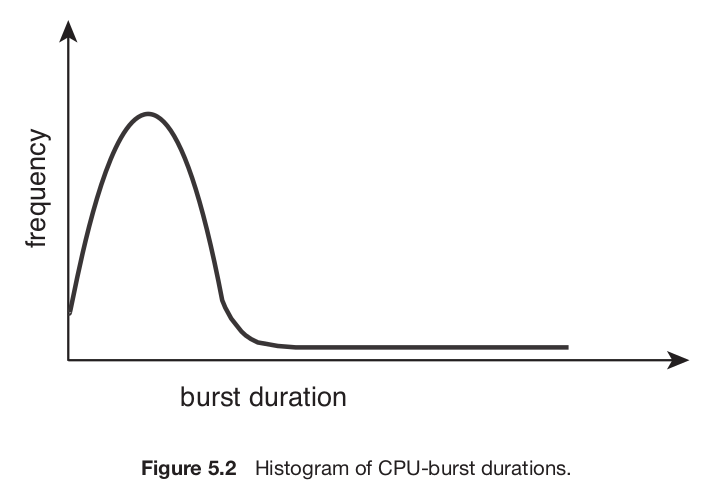
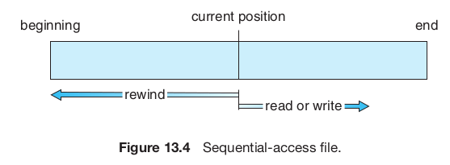

<!-- markdownlint-disable MD025 MD045 -->
<!-- MD025 single-title/single-h1 - Multiple top level headings in the same document -->
<!-- MD045/no-alt-text: Images should have alternate text (alt text) -->
# TOC

- [TOC](#toc)
- [Part one - Overview](#part-one---overview)
  - [Chapter 1 - Introduction](#chapter-1---introduction)
    - [Organization](#organization)
      - [Storage](#storage)
    - [Architecture](#architecture)
    - [OS Operations](#os-operations)
      - [Modes of execution](#modes-of-execution)
    - [Resource management](#resource-management)
    - [Seguridad y protección](#seguridad-y-protección)
    - [Virtualización](#virtualización)
    - [Sistemas distribuidos](#sistemas-distribuidos)
    - [Kernel Data Structures](#kernel-data-structures)
    - [Computing environments](#computing-environments)
    - [Free and Open-source OSs](#free-and-open-source-oss)
  - [Chapter 2 - Operating System Structures](#chapter-2---operating-system-structures)
    - [Services](#services)
    - [Interface](#interface)
    - [Syscalls](#syscalls)
      - [API](#api)
      - [Tipos](#tipos)
    - [System Services](#system-services)
    - [Linkers & Loaders](#linkers--loaders)
      - [Formatos](#formatos)
    - [OS Design & Implementation](#os-design--implementation)
    - [OS Structure](#os-structure)
    - [Building and booting](#building-and-booting)
    - [Debugging](#debugging)
    - [Chapter 2 Summary](#chapter-2-summary)
- [Part two - Process Management](#part-two---process-management)
  - [Chapter 3 - Processes](#chapter-3---processes)
    - [Concepto de proceso](#concepto-de-proceso)
      - [State](#state)
      - [PCB](#pcb)
    - [Process/CPU Scheduling](#processcpu-scheduling)
      - [Context switch](#context-switch)
    - [Operaciones en procesos](#operaciones-en-procesos)
      - [Creation](#creation)
      - [Termination](#termination)
    - [IPC](#ipc)
    - [Client-server](#client-server)
    - [Chapter 3 Summary](#chapter-3-summary)
  - [Chapter 4 - Threads & Concurrency](#chapter-4---threads--concurrency)
    - [Overview](#overview)
    - [Multicore programming](#multicore-programming)
      - [Types of parallelism](#types-of-parallelism)
    - [Multithreading models](#multithreading-models)
    - [Thread Libraries](#thread-libraries)
    - [Implicit Threading](#implicit-threading)
    - [Threading issues](#threading-issues)
    - [Implementación](#implementación)
  - [Chapter 5 - CPU Scheduling](#chapter-5---cpu-scheduling)
    - [Scheduling concepts](#scheduling-concepts)
      - [IO Burst cycle](#io-burst-cycle)
      - [Preemptive / non-preemptive](#preemptive--non-preemptive)
      - [Dispatcher](#dispatcher)
    - [Scheduling criteria](#scheduling-criteria)
    - [Scheduling algorithms](#scheduling-algorithms)
    - [Thread scheduling](#thread-scheduling)
    - [Multiprocessor scheduling](#multiprocessor-scheduling)
      - [Approaches](#approaches)
      - [Multicore](#multicore)
      - [Load Balancing](#load-balancing)
      - [Processor affinity](#processor-affinity)
    - [Real time scheduling](#real-time-scheduling)
    - [OS Scheduling examples](#os-scheduling-examples)
    - [Algorithm evaluation](#algorithm-evaluation)
- [Part three - Process Synchronization](#part-three---process-synchronization)
  - [Chapter 6 - Sync tools](#chapter-6---sync-tools)
    - [Background](#background)
    - [The Critical-Section Problem](#the-critical-section-problem)
      - [Peterson's solution](#petersons-solution)
    - [Hardware support for sync](#hardware-support-for-sync)
      - [Memory barriers](#memory-barriers)
      - [Hardware instructions](#hardware-instructions)
      - [Atomic variables](#atomic-variables)
    - [Mutex locks](#mutex-locks)
      - [Spinlock](#spinlock)
    - [Semaphores](#semaphores)
    - [Monitors](#monitors)
    - [Liveness](#liveness)
      - [Priority inversion](#priority-inversion)
    - [Evaluation](#evaluation)
  - [Chapter 7 - Sync Examples](#chapter-7---sync-examples)
    - [Classic sync problems](#classic-sync-problems)
      - [Bounded-Buffer](#bounded-buffer)
      - [Readers-Writers](#readers-writers)
      - [Dining-Philosophers](#dining-philosophers)
    - [Sync dentro del kernel](#sync-dentro-del-kernel)
    - [POSIX sync](#posix-sync)
    - [Java sync](#java-sync)
    - [Alternative approaches](#alternative-approaches)
      - [Transactional Memory](#transactional-memory)
      - [OpenMP](#openmp)
      - [Functional Programming Languages](#functional-programming-languages)
  - [Chapter 8 - Deadlocks](#chapter-8---deadlocks)
    - [System model](#system-model)
    - [Deadlocks](#deadlocks)
      - [Livelock](#livelock)
    - [Deadlock characterization](#deadlock-characterization)
      - [Condiciones necesarias](#condiciones-necesarias)
      - [Resource-Allocation Graph](#resource-allocation-graph)
    - [Handling Deadlocks](#handling-deadlocks)
    - [Deadlock Prevention](#deadlock-prevention)
    - [Deadlock Avoidance](#deadlock-avoidance)
      - [Safe State](#safe-state)
      - [Resource-Allocation Graph Algorithm](#resource-allocation-graph-algorithm)
      - [Banker's algorithm](#bankers-algorithm)
    - [Deadlock Detection](#deadlock-detection)
    - [Deadlock Recovery](#deadlock-recovery)
- [Part four - Memory Management](#part-four---memory-management)
  - [Chapter 9 - Main Memory](#chapter-9---main-memory)
    - [Memory background](#memory-background)
      - [Basic hardware](#basic-hardware)
      - [Address binding](#address-binding)
      - [Logical vs Physical address space](#logical-vs-physical-address-space)
      - [Dynamic Loading](#dynamic-loading)
      - [Dynamic Linking and Shared Libraries](#dynamic-linking-and-shared-libraries)
    - [Contiguous Memory Allocation](#contiguous-memory-allocation)
      - [Fragmentation](#fragmentation)
    - [Paging](#paging)
      - [Basic method](#basic-method)
      - [Hardware support](#hardware-support)
        - [TLB](#tlb)
      - [Paging protection](#paging-protection)
      - [Shared pages](#shared-pages)
      - [Page table structure](#page-table-structure)
        - [Hierarchical paging](#hierarchical-paging)
        - [Hashed Page tables](#hashed-page-tables)
        - [Inverted page tables](#inverted-page-tables)
        - [Oracle SPARC Solaris](#oracle-sparc-solaris)
    - [Swapping](#swapping)
    - [Memory management examples](#memory-management-examples)
  - [Chapter 10 - Virtual Memory](#chapter-10---virtual-memory)
    - [Virtual memory background](#virtual-memory-background)
    - [Demand paging](#demand-paging)
    - [Copy-on-Write](#copy-on-write)
    - [Page replacement](#page-replacement)
      - [Page replacement algorithms](#page-replacement-algorithms)
      - [Applications and Page replacement](#applications-and-page-replacement)
    - [Frame allocation](#frame-allocation)
      - [NUMA](#numa)
    - [Thrashing](#thrashing)
    - [Memory compression](#memory-compression)
    - [Allocating Kernel Memory](#allocating-kernel-memory)
    - [Other considerations](#other-considerations)
    - [OS Virtual memory examples](#os-virtual-memory-examples)
- [Part five - Storage Management](#part-five---storage-management)
  - [Chapter 11 - Mass Storage Structure](#chapter-11---mass-storage-structure)
    - [Mass storage structure overview](#mass-storage-structure-overview)
      - [HDDs](#hdds)
      - [NVMs](#nvms)
      - [Connection methods](#connection-methods)
      - [Address mapping](#address-mapping)
    - [HDD Scheduling](#hdd-scheduling)
    - [NVM Scheduling](#nvm-scheduling)
    - [Error Detection and Correction](#error-detection-and-correction)
    - [Storage device management](#storage-device-management)
    - [Swap space management](#swap-space-management)
    - [Storage attachment](#storage-attachment)
    - [RAID](#raid)
    - [Object Storage](#object-storage)
  - [Chapter 12 - I/O Systems](#chapter-12---io-systems)
    - [I/O Hardware](#io-hardware)
      - [Memory-Mapped IO](#memory-mapped-io)
      - [Polling](#polling)
      - [Interrupts](#interrupts)
      - [DMA (Direct Memory Access)](#dma-direct-memory-access)
    - [Application IO Interface](#application-io-interface)
      - [Nonblocking and Async IO](#nonblocking-and-async-io)
      - [Vectored IO](#vectored-io)
    - [Kernel IO Subsystem](#kernel-io-subsystem)
    - [IO Requests to Hardware Operations](#io-requests-to-hardware-operations)
    - [STREAMS](#streams)
    - [Performance](#performance)
- [Part six - File System](#part-six---file-system)
  - [Chapter 13 - File-System Interface](#chapter-13---file-system-interface)
    - [File Concept](#file-concept)
      - [File Attributes](#file-attributes)
      - [File Operations](#file-operations)
      - [File Types](#file-types)
      - [File Structure](#file-structure)
      - [Internal File Structure](#internal-file-structure)
    - [Access Methods](#access-methods)
    - [Directory Structure](#directory-structure)
    - [FS Protection](#fs-protection)
    - [Memory-Mapped Files](#memory-mapped-files)
  - [Chapter 14 - File-System Implementation](#chapter-14---file-system-implementation)
    - [FS Structure](#fs-structure)
    - [FS Operations](#fs-operations)
    - [Directory Implementation](#directory-implementation)
    - [Allocation Methods](#allocation-methods)
      - [Contiguous Allocation](#contiguous-allocation)
      - [Linked Allocation](#linked-allocation)
      - [Indexed Allocation](#indexed-allocation)
      - [Allocation Performance](#allocation-performance)
    - [Free Space Management](#free-space-management)
    - [FS Efficiency and Performance](#fs-efficiency-and-performance)
    - [Recovery](#recovery)
    - [Example WAFL FS](#example-wafl-fs)
  - [Chapter 15 - File-System Internals](#chapter-15---file-system-internals)

Notacion:

- (!): Se nombra en el summary (por lo tanto es un punto importante del chapter)

# Part one - Overview

Notas del silber

## Chapter 1 - Introduction

Objetivos

- Organizacion general de una computadora y el rol de interrupciones
- Componentes
- Transicion de modo usuario a modo kernel
- Uso de SOs
- Ejemplos de SOs

### Organization

#### Storage

### Architecture

Se categorizan aproximadamente según la cantidad de CPUs de propósito general
que se usan.

- Single-processor systems

    El **core** es el componente que ejecuta instrucciones y tiene registros
    para almacenar info de forma local. El CPU principal con su core ejecuta un
    conjunto de instrucciones de proposito general, incluyendo instrucciones de
    procesos.

    Pueden tener otros procesadores de proposito especifico.

- Multiprocessor systems

    Tienen mas de un procesador single-core. Tienen mas throughput.

  - SMP: symmetric multiprocessing, cada procesador hace todos los tasks. El
    beneficio es que muchos procersos pueden correr simultaneamente, sin
    causar un deterioro en la performace.

    

    No se pueden agregar CPUs para siempre porque a partir de cierto punto la
    contención del bus pasa a ser un bottleneck y se empieza a degradar la
    performance.

    - Multicore: evolucion a traves del tiempo de multiprocessor, hay mas de un
    core en un chip. Pueden ser mas eficientes que multiples chips con
    single-cores.

        

    Definiciones:

    - CPU: El hardware que ejecuta las instrucciones
    - Procesaro: Un chip fisico que tiene uno o mas CPUs
    - Core: La unidad basica de computo de la CPU
    - Multicore: mas de un core en el mismo CPU
    - Multiprocessor: Mas de un procesador.

    NUMA: Non Uniform Memory Access, alternativa en el que cada CPU tiene una
    memoria local y estan interconectados entre sí. Esto hace que sea más escalable
    seguir agregando CPUs, pero hay un penalty en performance cuando un CPU tiene
    que acceder a la memoria de otro.

    

- Clustered system

    Tiene multiples CPUs, y se diferencian con los sistemas multiprocesador en
    que tienen un conjunto de *nodos* (siustemas individuales) unidos, cada uno
    un sistema multicore.

### OS Operations

- **System daemons**: programas que corren siempre que corra el kernel. Por ej.
  en linux el primer programa que corre es `systemd`, que inicia otros daemons.

El sistema espera idle a que pase algo

- Interrupciones
- Excepciones: Interrupciones generadas por el codigo causados por un error o un
  request de un programa para que se ejecute un servicio del SO (syscall)

- Multiprogramming

  Organizar a los programas para que el CPU siempre tenga uno para ejecutar. Un
  programa en ejecución se llama **proceso**. El SO mantiene los procesos en
  memoria, y elije y ejecuta alguno.

  En un sistema no multiprogramado, cuando el proceso tenga que esperar por algo
  (por ej IO) el CPU se quedaria idle. En cambio, en uno multiprogramado, mientras
  tanto se corre otro. Siempre y cuando al menos un proceso necesite ejecutar, el
  CPU nunca esta idle.

- Multitasking

  Es una extensión lógica de multiprogramación. En un sistema con multitasking, el
  CPU ejecuta multiples procesos cambiando entre ellos, pero los switches ocurren
  frecuentemente, proveyendo al usuario con un **tiempo de respuesta** rapido.

La decisión de que proceso correr es **CPU scheduling**

#### Modes of execution

Es necesario poder diferenciar entre código de usuario y de kernel para que el
de usuario no haga que el SO se comporte de formas que no debería. Al menos son
necesarios dos **modos** de operación (**dual mode**)

- **user mode**
- **kernel mode** (supervisor mode, system mode, privileged mode)

Esto se implementa con un bit en el hardware - "mode bit"

Cuando se ejecuta un programa de usuario, el SO corre en modo usuario. Pero
cuando se hace una syscall, hay que hacer un cambio de modo.


De esta forma, las instrucciones que puedan causar daño se designan como
**instrucciones privilegiadas**, que solo se puedan ejecutar en modo kernel.

Se puede extender el concepto a más de un modo. Por ej. intel tiene **protection
rings** donde 0 es kernel y 3 es user mode. (**multimode**)

### Resource management

Un SO es un **resource manager**. Hace manejo de

- **Procesos**
  
  Un programa por si solo no es un proceso. Un programa es una entidad *pasiva*
  en el sistema, mientras que un proceso es una *activa*. Un proceso
  single-threaded tiene un solo **program counter** que especifica la siguiente
  instrucción a ejecutar, y uno multithreaded tiene múltiples, uno para cada
  thread.
  
  Un proceso es la unidad de trabajo de un sistema, que consiste en una
  colección de procesos. Algunos OS-processes (que ejecutan código del sistema)
  y otros user-processes (que ejecutan código de usuario). Todos pueden ejecutar
  concurrentemente, o en parelelo en diferentes cores.

  El SO debe

  - Crear y borrar user y system processes
  - Schedulear procesos y threads en los CPUs
  - Suspender y resumir procesos
  - Proveedr mecanismos para IPC y sync.

  Chapters 3 a 7.

- **Memoria**
  - Que partes de memoria se usan y por qué proceso
  - Allocating y deallocating memory space as needed
  - Decidir que procesos (o partes de ellos) y data mover desde y hacia la
    memoria.

  Chapters 9 y 10

- **FS**

  El SO provee una vista uniforme y lógica del almacenamiento. Abstrae de las
  propiedades físicas con una sola unidad lógica de almacenamiento, el
  **archivo** (file). Mapea files a memoria física y las accede mediante los
  dispositivos de almacenamiento. Usualmente se organizan en **directorios**.

  El SO se encarga de

  - Crear y borrar archivos
  - Crear y borrar directorios para organizar archivos
  - Soportar primitivas para manipular ambos
  - Mapear archivos al storage
  - Backup de archivos en nonvolatile storage.

  Chapters 13 a 15

- **Mass-Storage**

  El SO debe proveer soporte para **almacenamiento secundario** para almacenar
  su memoria principal (que es volátil). En general se usan HDDs o NVM (SSDs)

  - Mounting y unmounting
  - Manejo del espacio libre
  - Asignación de almacenamiento
  - Disk scheduling
  - Particionar
  - Protección

  Como se usa tan seguido, la velocidad del SO puede depender de la eficiencia
  con la que se maneja el storage secundario.

  Opcionalmente, se puede proveer soporte para **tertiary storage** (para
  backups). Algunos SOs lo hacen mientras otros lo dejan en manos de software de
  usuario.

  Chapter 11

- **Cache**

  Como tienen tamaño limitado, **cache management** es un problema importante de
  diseño. Elegir el tamaño y la política de desalojo puede mejorar mucho la
  performance.

- **IO**

  Un propósito de los SOs es esconder las peculiaridades de los dispositivos de
  hardware del usuario. Esto es parte del **subsistema de E/S**, que consiste en
  varios componentes:

  - Manejo de memoria que incluya buffering, caching y spooling
  - Una interfaz general para drivers de dispositivos
  - Drivers para dispositivos de hardware específicos.
  
### Seguridad y protección

- Protección: Es cualqueir mecanismo para controlar el acceso de procesos o
  usuarios a recursos definidos por el sistema. Debe proveer formas de
  especificar los controles y hacerlos cumplir

- Seguridad: Defender a un sistema de ataques internos y externos. Viruses,
  DDOS, robo de identidad, etc.

Ambos requieren que el sistema distinga a los usuarios que lo utilizan. La
mayoria tiene una lista de usuarios y **user IDs** asociados. (**SID**, security
ID en windows).

También se pueden armar **grupos** de usuarios.

### Virtualización

Es una tecnología que permite abstraer el hardware de una sola computadora (CPU,
memoria, disco, tarjetas de red, etc) en diferentes entoros de ejecución,
creando la ilusión de que cada uno está corriendo en una computadora diferente.

Deja que los SOs corran como apps en otros SOs.

El software de virtualización es parte de una clase más grande que incluye la
**emulación**, que involucra simular hardware en software.

En virtualización, hay un **host** operating system y una aplicación que actúa
de **virtual machine manager (VMM)**, la cual corre los *guest* SOs, maneja su
uso de recursos, y protege a cada uno de los demás.


### Sistemas distribuidos

Es un conjunto de sistemas fisicamente separados conectados a través de una red
(**network**).

Una **red** es un camino de comunicación entre dos o más sistemas. Varian según
el protocolo usado, distancia entre nodos y funcionalidad. El protocolo más
usado es TCP/IP. Se caracterizan basada en la distancia entre sus nodos

- LAN: Local area network, conecta computadoras de un mismo cuarto, edificio,
  campus.
- WAN: Wide area network. Edificios, ciudades o paises.
- PAN: Personal area network.

### Kernel Data Structures

Estructuras de datos usadas por el kernel

- Lists, stacks y queues
- Trees
- Hash functions and maps
- Bitmaps

### Computing environments

Entornos en los cuales se usan SOs. Más info en el libro

- Traditional computing
- Mobile computing
- Client server computing
- Peer to peer computing
- Cloud computing
- Real time embedded systems.

### Free and Open-source OSs

Más info en el libro.

- GNU/Linux
- BSD Unix
- Solaris

## Chapter 2 - Operating System Structures

Objetivos:

- Identificar servicios provistos por un SO
- Ilustrar como las syscalls se usan para proveer servicios del SO
- Comparar y contrastar tecnicas de diseño de SOs monolithic, layered,
  microkernel, modular y hybrid.
- Proceso de boot
- Monitoreo de performance del sistema
- Diseñar e implementar modulos de para interactuar con un kernel de Linux.

### Services


### Interface

- CLI

  **shell**: Interpretes de comandos de los usuarios.

- GUI
- Touch

Eleccion: suele ser personal preference

El diseño de interfaces de usuario buenas e intuitivas no es tarea del SO.

### Syscalls

Las **syscalls** proveen una interfaz a los servicios del SO. Suelen ser
funciones en C o C++, pero para algunas tareas muy low-level incluso en asm.

#### API

Application programming interface. Especifica las funciones que pueden usar y su
signatura. Las mas comunes son

- Windows API
- POSIX API
- Java API

Las funciones de un API por abajo hacen syscalls on behalf del usuario.

#### Tipos

Describe las syscalls que se usan en cada categoria, mas en el libro.

- **Process control**
- **File management**
- **Device management**
- **Info maintenance**
- **Communications**: Hay dos modelos principales
  - Message passing: Los procesos intercambian mensajes entre si para transferir
    info.
  - Shared-memory

- **Protection**

### System Services

Servicios que provee el sistema para su uso y desarrollo más simple.

- Daemons: (o **services**, **subsystems**): System-program processes que estan
  corriendo en todo momento.

### Linkers & Loaders

Para que un programa corra en la CPU, se tiene que cargar en memoria.

1. Los archivos fuente se compilan a archivos objeto, que se cargan en memoria. Son
  del formato **relocatable object file**
2. El **linker** combina los archivos objetos en un solo binario **executable**
   Durante esta fase, otros objetos o bibliotecas se pueden incluir, como la
   libc math (-lm)

3. Un **loader** se usa para cargar el binario a memoria, donde puede correr en
   algun core.
4. Tambien potencialmente se puede hacer **relocation**, que asigna la direccion
   final de las partes del programa.

5. No necesariamente todas las libs se tienen que cargar estaticamente, se
   pueden cargar dinamicamente mientras se carga.
   Evita linkear libs que no se usarian en el ejecutable.
    - Windows: DLLs

#### Formatos

ELF: Executable and Linkable Format. Formato de UNIX.


### OS Design & Implementation

Tipos

- Traditional desktop/laptop
- Mobile
- Distributed
- Real time

Goals:

- **User goals**
- **System goals**

Es importante la separacion de

- Policy: *what* will be done
- Mechanism: *how* it will be done

### OS Structure

Como los componentes de un SO se interconectan y forman un kernel.

- **Monolithic**

  Todo en un solo binario que corre en un solo address space. Ejemplo: UNIX.

  

  

  Contra:

  - Difiles de implementar y extender
  - Coupled: Cambios en una parte del sistema pueden llegar a afectar a otras
    partes.

  Pro

  - Mas rapidos. No hay overhead en el system-call interface, comunicacion con el
    kernel es rapida.

- **Layered**

  Loosely coupled: Cambios en una parte afectan solo ellas.

  

  Cada capa se implementa usando funciones de las inferiores.

  Se pueden debuggear nivel a nivel, de forma tal que cuando encontramos un
  fallo, estamos seguros de que esta en el nivel que estamos debuggeando en ese
  momento.

- **Microkernels**

  Ejemplo: Match

  

  Se hace al kernel mas chiquito y el resto de las cosas programas de usuario.
  Necesariamente los procesos se comunican con message passing a traves del
  kernel, lo cual puede ser lento.

  \+ es mas facil de extender
  
  \+ mas facil de portear

  \- la performance puede ser peor por overhead en las syscalls, al ser codigo
  de usuario.  

- **Modules**

  **LKM**: Loadable kernel modules. El kernel tiene un set de componentes core
  que pueden ser linkeados con modulos adicionales en boot o runtime.

- **Hybrid**

### Building and booting

Proceso de boot, bootloader, GRUB, UEFI / BIOS, etc.

### Debugging

Como hacer debugging en el kernel, [BCC](https://github.com/iovisor/bcc)

### Chapter 2 Summary

- Un SO provee un entorno para la ejecucion de programas mediante servicios a
  sus usuarios y programas.

- Approaches principales para interactuar: CLI, GUI y touch
- syscalls sirven para acceder a los servicios del SO. Los programadores usan la
  API de ellas para acceder a sus servicios.

- Categorias de syscalls: process control, file management, device management,
  info maintenance, communications y protection.

- La libc provee la API de syscalls para Unix y linux.
- Los SOs vienen con una coleccion de system-programs que proveen utilidades a
  usuarios.

- Un **linker** combina varios *relocatable object files* a un solo binario
  ejecutable. Un **loader** lo carga en memoria, donde puede correr en el CPU

- Un SO se diseña con diferentes *goals* en mente. Esto determina sus
  *policies*, que se implementan mediante *mechanisms*

  - Monolithic: No tiene estructura, toda la funcionalidad se provee en un solo
    bonario que corre en un solo espacio de direcciones. Eficientes
  - Layered: Se divide en una cantidad finita de capas, donde la mas baja es el
    HW y la mas alta el UI. Tiene problemas de performance
  - Microkernel: Kernel minimo y el resto userland programs. Se comunican con
    message-passing.
  - Modular: Servicios de kernel como modulos que se pueden cargar y sacar en
    runtime. (por ej. drivers)
  - La mayoria de los SOs modernos son un hybrido entre modular y monolithic.

- Un **boot loader** carga un SO a memoria, lo inicializa y ejecuta.

# Part two - Process Management

- Un *proceso* es un programa en ejecución. Necesita recursos para cumplir su
  tarea, que se le reservan mientras ejecuta.

- Es la *unidad de trabajo* del sistema. Los sistemas consisten en una colección
  de procesos, los del SO ejecutan código de sistema y los de usuario código de
  usuario. Todos concurrentemente.

- Los SOs modernos permiten que tengan diferentes *threads* de control. Cuando
  hay más de un core, pueden correr en paralelo.

- Un aspeco importante del SO es como hace el *scheduling* de threads a cores.

## Chapter 3 - Processes

Objetivos

- Componentes de un proceso y como se representan y schedulean en un SO
- Creacion y terminacion de procesos.
- IPC con shared memory y message passing
  - Programas con pipes y POSIX shared memory
- Client-server communication con sockets y RPC
- Kernel modules que interactuan con el sistema.

### Concepto de proceso

El estado es el PC y el contenido de los registros. La memoria se separa en

- Text section: Codigo ejecutable
- Data: Variables globales
- Heap: Memoria dinamica
- Stack: Almacenamiento temporal (parametros, RET addr, variables locales)


Aunque dos procesos tengan asociado el mismo programa, son secuencias de
ejecucion distintas. Tienen el mismo text y data, pero heap y stack varian.

#### State

Mientras un proceso ejecuta, tiene **estado** (state).

- **new**: Esta siendo creado
- **running**: Se estan ejecutando instrucciones
- **waiting**: Esta esperando a que ocurra algun evento (IO / o una signal)
- **ready**: Esperando para tener asignado un procesador.
- **terminated**: Termino ejecucion


#### PCB

Cada proceso se representa en el SO por una **process control block** (PCB), o
task control block. Incluye

- Estado del proceso
- PC (addr de la siguiente instruccion a ejecutar)
- CPU Registers (es necesario guardarla para poder resumir la ejecucion del
  proceso)
- CPU-scheduling info. Prioridad, punteros a colas, etc.
- Memory-management info
- Accounting info: tiempo usado, etc.
- IO status: IO devices allocated, open files, etc.

Es toda la data necesaria para comenzar o reiniciar un proceso, ademas de alguna
accounting data.

Cuando hay **threads** la PCB contiene info de cada uno.

### Process/CPU Scheduling

Un **process scheduler** elige un proceso listo para que ejecute en un core.
Cada core puede ejecutar uno solo a la vez.

La cantidad de procesos en memoria es conocida como **degree of
multiprogramming**.

La mayoria de los procesos se pueden dividir en dos

- **IO-bound**: la mayoria del tiempo la pasa haciendo IO mas que computations
- **CPU-bound**: hace poco IO y mas que nada computations.

El sistema mantiene diferentes colas para los procesos

- Ready queue
- Wait queue


Y un diagrama de estados y colas


Ni bien entra se pone en ready, y despues puede hacer IO y caer en una IO queue,
o puede crear un proceso y esperar a que termine, o puede ser sacado del core
por una interrupcion o que se le termino el tiempo.

El rol del **CPU scheduler** es elegir de los procesos que estan en ready (en la
ready queue) y asignarles un CPU core.

#### Context switch

Cuando llega una interrupcion y hay que cambiar de proceso, el SO debe guardar
el **contexto** del actual para poder reestablecerlo luego, y cambiarlo con el
del que le toca ejecutar. Este esta representado en la PCB del proceso. El
proceso es llamado **context switch**.


### Operaciones en procesos

#### Creation

Un proceso puede crear otros procesos hijos, y ellos lo mismo, asi formando un
**arbol** de ellos. Estos se identifican con un **process identifier** (pid)

Para crear un proceso en UNIX, se usa la syscall `fork()`, que forkea el hilo de
ejecución y retorna 0 si es el hijo y el PID si es padre. El hijo puede tirar
`exec()` para cargar otro programa.


#### Termination

Un proceso le dice al SO que lo borre con la syscall `exit()`, retornando un
status value (int).

Por lo general es el padre el que lo tiene que matar. Y algunos sistemas no
dejan que los hijos existan si los padres terminaron, si uno termina, todos los
hijos deben terminar. Esto seconoce como **cascading termination**.

- Los procesos hijos que terminan no se sacan de la tabla de procesos para que
  los padres puedan tener su status code, al hacer `wait()`. Entonces hasta que
  los padres lo hagan, quedan como **zombies**.

  Cuando el padre hace wait(), se sacan de la tabla y no son mas zombies.

- Si el padre termina sin hacer `wait()`, quedan **orphans**. Aqui se hace que
  su padre sea `init/systemd`, que periodicamente hace wait() haciendo que no
  queden zombi.

### IPC

Los procesos pueden ser *independientes* si no comparten data con otros
procesos, o *cooperating* si pueden afectar o ser afectados por otros procesos.
Queremos que los procesos cooperen porque

- Info sharing: concurrent access a la misma info
- Computation speedup: Para dividir una tarea en subtareas que ejecuten en
  parlelo (si hay mas de un core)
- Modularidad

Los procesos que cooperan requieren una manera de intercambiar datos entre si,
**inter-process communication** (IPC). Hay dos modelos fundamentales: **shared
memory** y **message passing**


- Shared memory

  Un cacho de memoria se comparte entre un conjunto de procesos, y de esta forma
  pueden intercambiar info escribiendo y leyendo por ahi.

- Message passing

  Intercambian mensajes entre si, basicamente es posible un

  - `send()`
  - `receive()`

  Que cada uno puede especificar de que proceso obtiene/envia el mensaje, o sino
  con *mailboxes* que pueden ser de procesos o el SO.

  Los sends/receives pueden ser blocking o non-blocking, y pueden estar
  buffereados. (por ej. channels de go son blocking-blocking y pueden estar
  buffereados)

Ejemplos

- POSIX shared memory
- Match message passing
  - Ports = mailboxes
- Windows
- Pipes

### Client-server

Formas mas comunes

- Sockets
- RPC

### Chapter 3 Summary

- Un proceso es un programa en ejecucion, cuyo status esta representado por el
  PC y los registros.
- Tiene 4 secciones: text, data, heap y stack.
- Mientras ejecuta puede cambiar de estado. Hay 4 generales: ready, running,
  waiting y terminated
- La PCB (process control block) es la estructura de datos del kernel usada para
  representar un proceso.

- El rol del process-scheduler es elegir un proceso ready para que corra en un
  CPU, y el de un cpu-scheduler es elegir en que cpu corre. Cuando se cambia de
  proceso, se hace un **context-switch**
- IPC: shared memory / message passing
- Pipes: conducto para que procesos se comuniquen
  - Ordinary: Comunicacion entre procesos con parent-child relationship.
    Unidireccionales.
  - Named: mas generales y dejan que mas de un proceso se comunique
- Client-server
  - Sockets: Dejan que dos procesos se comuniquen a traves de la red, pueden
    estar en maquinas diferentes.
  - RPC: Abstrae el concepto de llamados a procedimiento de forma tal que una
    funcion se puede llamar en otro proceso que puede estar corriendo en otra
    computadora.

## Chapter 4 - Threads & Concurrency

El modelo del chapter 3 asumia que habia un solo thread, pero puede haber mas.

Objetivos:

- Que es un thread y las diferencias con un proceso
- Beneficios y desafios de diseñar procesos multithreaded
- Approaches a implicit threading: thread pools, fork-join, Grand Central
  Dispatch.
- Windows/linux threads

### Overview

Un thread es la unidad basica de utilización del CPU. Tiene como componentes

- Thread ID
- PC (Program Counter)
- Registros
- Stack

Y comparte con los otros threads del mismo proceso las secciones de codigo,
data, files abiertos, signals.


Un ejemplo de uso es un webserver que para atender a cada cliente usa un thread
diferente.

Beneficios:

- **Responsiveness**: Por ej. si un usuario toca un boton y eso causa un computo
  intensivo, si fuera single-threaded la app se traba, pero sino se puede hacer
  en un thread a parte y no se pierde la interactividad.
- **Resource sharing**: Los procesos solo pueden usar IPC (shared memory,
  message passing) para compartir recursos, mientras los threads comparten
  memoria y los recursos por default.
- **Economy**: Suele ser mas eficiente crear threads que procesos. En particular
  es mucho mas rapido el context-switch.
- **Scalability**

### Multicore programming

Concurrencia no es lo mismo que paralelismo. Un sistema **concurrente** soporta
mas de una tarea permitiendo que todas *progresen*, mientras que uno paralelo
ejecuta mas de una al mismo tiempo. El paralelismo existe cuando mas de una
tarea esta haciendo progreso en simultaneo.

Se puede tener concurrencia sin paralelismo, y el paralelismo requiere un
sistema multicore.

Desafíos a la hora de programar multithreaded:

- Identificar tareas a dividir en separadas concurrentes.
- Balancear el trabajo de cada una
- Separar los datos para que sean accedidos en cores diferentes
- Dependencias de datos entre tareas (sync)
- Testing y debugging es más difícil

#### Types of parallelism


Hay dos tipos de paralelismo en general

- **Data parallelism**: Separar data en cores y hacer la misma operacion en
  todos.

  > Por ej. sumar los contenidos de un array. Cada thread puede sumar un cacho.

- **Task parallelism**: Distribuir no la data, pero las tareas en distintos
  cores. Cada thread hace una operacion diferente, que podria estar usando la
  misma data. Requiere sync.

  > Por ej. dos threads haciendo operaciones estadisticas diferentes sobre el
  > mismo array, como la media y el promedio.

### Multithreading models


El soporte de threads puede ser a nivel de usuario (**user threads**) o por el
kernel (**kernel threads**). Tiene que existir una relación entre ambos.

Las aplicaciones de usuario crean user-level threads, que luego son mapeados a
kernel threads. Hay tres modelos principales

- **many-to-one**

  

  El threading se hace en user-space. El proceso entero se bloquea si un thread
  hace una syscall bloqueante. No pueden correr en paralelo porque uno solo
  puede acceder al kernel a la vez.

  No se usa mucho.

- **one-to-one**

  

  Mapea cada user thread a un kernel thread. Tiene mas concurrencia que el
  anterior y permite paralelismo.

  Lo malo es que crear un thread de usuario requiere crear un thread de kernel,
  lo cual lo hace mas costoso.

- **many-to-many**

  

  Multiplexa muchos user threads a menos (o la misma cantidad) de kernel
  threads.
  
  Una variacion tambien permite un user-level thread one to one. Se le llama
  **two-level model**.

  

### Thread Libraries

Una **thread library** le da a un programador una API para crear y manejar
threads. Puede ser user-space o kernel-space (soportada por el SO)

- POSIX pthreads
- Windows: kernel
- Java: Por abajo usa windows o posix.

### Implicit Threading

La estrategia de **implicit threading** consiste en mover la creacion de threads
a compiladores y bibliotecas de runtime. Por lo general involucran que los
programadores identifiquen *tareas* que pueden correr en paralelo, en vez de
threads.

Approaches

- **Thread pools**: Tener un pool de threads que se crean al inicio y se
  reutilizan, en vez de crear y destruir cada uno.

- **fork-join**: El padre *forkea* creando multiples hilos de ejecucion, y luego
  espera que terminen (*join*), punto en el cual combina sus resultados.

  

- **OpenMP**: Son directivas del compilador y APIs que permiten identificar
  regiones paralelas como bloques de codigo que pueden correr en paralelo.

- **Grand Central Dispatch** (GCD)

### Threading issues

- `fork()` y `exec()`, copian threads o mantienen? Parametrizado
- Las signals quien las maneja?
- Cancelar threads: Se puede hacer de dos maneras
  - Async cancellation: Para a un thread inmediatamente, aunque este en el medio
    de algo.
  - Deferred cancellation: Le informa al thread que deberia terminar pero lo
    deja hacer de una manera ordenada.

  Se suele preferir *deferred*.

- Thread local storage (TLS)
- Scheduler activations

### Implementación

En Linux, no hay distinción entre threads y procesos, son ambos *tasks*. Los
threads se crean con la syscall `clone()`.

## Chapter 5 - CPU Scheduling

En general se schedulea *kernel-threads* en vez de procesos en los sistemas
modernos. Estos corren en los *cores* del CPU.

Objetivos:

- Describir CPU scheduling algorithms
- Evaluarlos
- Explicar problemas de scheduling
- Describir algoritmos para real time scheduling
- Describir los usados en Windows, Linux y Solaris
- Aplicar modelados y simulaciones para evaluarlos
- Diseñar un programa que los implemente

### Scheduling concepts

En un sistema con un solo core, cada tarea debe esperar a que se libere para
poder ejecutar. El objetivo de la **multiprogramacion** (multiprogramming) es
que haya siempre uno corriendo, para maximizar la utilizacion de CPU.

Un proceso se ejecuta hasta que debe esperar algo (tipicamente IO). En un
sistema simple, el CPU se quedaria idle esperando a que termine, pero en uno con
multiprogramacion se swapea el CPU a otro proceso.

El **CPU scheduler** es el que se encarga de elegir que proceso en ready va a
correr en que CPU.

#### IO Burst cycle


La ejecucion de todo proceso consiste en un **ciclo** de ejecucion en la CPU y
IO wait. Alternan entre ambos: **IO burst** y **CPU burst**.

La distribucion se midio a ser la siguiente:



#### Preemptive / non-preemptive

Hay 4 situaciones en las cuales se podria tomar una decision de scheduling

1. running -> waiting (io wait, `wait()`)
2. running -> ready (interrupt)
3. waiting -> ready (io finish)
4. process termination

En 1 y 4 si o si se debe elegir uno, pero con 2 y 3 hay una elección.

- Cuando no se hace nada en 2 y 3, decimos que es **noonpreemptive** o
  **cooperativo**: Una vez que se le dio el CPU a un proceso, lo usa hasta que
  se ponga en waiting o termine.

- Sino, **preemptive**: Todos los modernos usan este. *Preemption* Puede
  resultar en race conditions.

Tambien:

- Preemtpive: Se puede sacar el CPU de un proceso
- Nonpreemptive: Un proceso debe necesariamente dar el control del CPU.

#### Dispatcher

El **dispatcher** es el modulo de kernel que le da el control del CPU al proceso
seleccionado por el scheduler. Involucra

- Context switch de un proceso a otro
- Cambiar a modo usuario
- JMP al PC del nuevo programa para resumir.

Debe ser lo mas rapida posible ya que se invoca cada context switch. El tiempo
que tarda es conocido como **dispatch latency**.


### Scheduling criteria

Criterios para juzgar que tan buenos son los algoritmos

- **Uso de CPU** (max): Queremos que este ocupado
- **Throughput** (max): Cantidad de procesos que terminan por unidad de tiempo.
- **Turnaround time** (min): Cuanto tarda desde que se pone en ready hasta que
  termina cada proceso.
- **Waiting time** (min): Suma de tiempos esperando en la cola de ready (no
  waiting por IO, porque eso no es controlado por el scheduler)
- **Response time** (min): Tiempo hasta el primer resultado, mejor que
  turnaround para sistemas interactivos.

### Scheduling algorithms

- **FCFS** (First come, first served)

  El que lo pide primero es asignado primero. Se implementa facil con un FIFO
  queue.

  Es nonpreemptive

- **SJF** (Shortest job first)

  Asocia con cada proceso la longitud de su siguiente burst de CPU, y cuando
  esta disponible se lo asigna al que tenga el mas corto (se usa FCFS para
  romper empates).

  Es óptimo en cuanto a avg waiting time (porque siempre es mejor poner uno mas
  corto antes de uno mas largo) pero no se puede saber cual va a ser la longitud
  del siguiente burst. Para esto se puede predecir con un **exponential
  average**.

  Puede ser preemptive (suele llamarse shortest remaining time first) o
  nonpreemptive.

- **RR** (Round robin)

  Es similar a FCFS, pero con preemption. Se define un **time quantum** o **time
  slice**, tiempo que tiene cada proceso para ejecutar en la CPU (Generalmente
  10-100ms) luego del cual se lo saca y se pone al siguiente. Se trata a la
  ready queue como una cola circular.

  Queremos que el quantum sea

  - Grande con respecto al context-switch
  - No demasiado grande, sino se convierte en FCFS

  Rule of thumb: 80% de los CPU-bursts deberian ser mas cortos que el quantum.

- **Priority**

  SJF es un caso particular. Se le asocia una prioridad a cada proceso y se
  despacha el de maxima, con FCFS para romper empates. Estas pueden ser internas
  (del SO) o externas (asignadas por usuarios)

  Puede ser preemptive o nonpreemptive.

  Puede llegar a producir **indefinite blocking** o **starvation** de procesos
  con baja prioridad. Una solucion posible es **aging**: de a poco incrementar
  la prioridad de los procesos que esperan por periodos prolongados de tiempo.

  Otra es combinarlo con round-robin, si hay mas de uno de una prioridad
  correrlos con round robin.

- **Multilevel queue**

  Los procesos se pueden poner en una sola cola para ejecutar, pero depende de
  como esten manejadas podria tomar O(n) determinar el de maxima prioridad.
  Suele ser mas practico entonces tener una queue por prioridad, donde cada una
  puede tener una politica diferente.

  

  Tambien se puede tener una queue por tipo de proceso (RT, interactivo,
  background) cada una con su politica, y luego otra para decidir entre ellas.

- Multilevel feedback queue

  Permite que los procesos cambien de cola. Por ej. si uno usa mucho CPU, baja
  prioridad. Esto hace que los que son IO-bound e interactivos tengan mas
  prioridad (suelen tener CPU-bursts cortos).

  Y un proceso que espera mucho en una cola de baja prioridad puede subir
  (aging), evitando starvation.

  Es el mas general. Se puede configurar para matchear cualquiera de los
  anteriores.

### Thread scheduling

En la mayoria de los SOs modernos se schedulean kernel-level threads en vez de
procesos.

### Multiprocessor scheduling

Si hay mas de un core es posible el **load sharing**: cuando threads pueden
correr en paralelo.

Multiprocessor puede ser

- Multicore CPUs
- Multithread cores
- NUMA
- Multiprocesamiento heterogeneo (HMP): no todos los CPUs son iguales, permite
  que se asignen tareas que consumirian mucho pero que son background a
  procesadores mas chicos

#### Approaches

- **asymmetric multiprocessing**: Hay un CPU maestro que ejecuta solo el codigo
  de kernel, y el resto hace solo codigo de usuario. Se vuelve un bottleneck
- **SMP**: Cada uno puede tener su propia cola o puede haber una en comun (ojo
  con las race conditions, si se usa lock podria ser bottleneck)

  

#### Multicore

Mas en el libro

- Chip multithreading (hyperthreading en intel)
  Cada CPU puede tener mas de un **hardware thread**, y desde el SO cada uno es
  un CPU logico diferente.

#### Load Balancing

Es importante en SMP mantener el workload balanceado (suponiendo una queue por
proceso). Para esto se hace **load balancing**. Approaches:

- **push migration**: Una tarea chequea el load en cada proceso y los distribuye
  equitativamente pusheando threads de uno al otro.
- **pull migration**: Un CPU idle *pullea* un task en waiting de otro.

#### Processor affinity

Si se migra un thread de un CPU a otro se pierde la (warm) cache y tiene que
llenarse devuelta. Esto se llama **processor affinity**, un proceso tiene
afinidad por el procesador en el que esta corriendo. Las ready-queues por CPU
hacen que lo tengamos gratis, mientras que tener una comun no.

- soft affinity: cuando es best-effort que se mantenga la afinidad
- hard affinity: cuando se cumple si o si, con syscalls se configura.

### Real time scheduling

(No lo dio muy en detalle chapa, lo nombró por arriba)

- **soft RT**: no hay garantias de cuando un proceso RT critico se schedulea
  
  Los sistemas soft real time le dan prioridad a las tareas real-time sobre las
  que no, pero no dan garantias.

- **hard RT**: un task tiene que ejecutarse antes de su deadline si o si.

  Los sitemas hard RT proveen garantias de tiempo para las RT tasks.

Hay que minimizar el **event latency**: el tiempo desde que ocurre un evento
hasta que se atiende. Dos tipos de latencia

- Interrupt latency
- Dispatch latency

Algoritmos:

- Priority based scheduling
- Rate-Monotonic scheduling: Asigna tareas periodicas usando una static priority
  policy con preemtpion.
- EDF (Earliest deadline first) scheduling: Asigna prioridades segun el
  deadline. Mientras mas cercano, mas alta la prioridad.
- Proportional share scheduling: Asigna *T* particiones a todas las apps. Si a
  una se le asignan N particiones (*shares*) tiene garantizado ejecutar N/T en
  el procesador.

### OS Scheduling examples

- Linux
  - Implementa un CFS (*Completely fair scheduler*), que asigna una proporcion
    del CPU a cada tarea. Se basa en el virtual runtime (`vruntime`) del task.
- Windows: Preemtpive, 32-level priority scheme.
- Solaris

### Algorithm evaluation

Primero se define un criterio para seleccionar un algoritmo.

- **Deterministic modeling** es un tipo particular de **analytic evaluation**.
  Toma un workload (conjunto de procesos, orden, prioridad, etc.) de input y
  corre los diferentes algoritmos para ver cuál da mejor en cuanto a performance
  de cierta métrica (por ej. waiting time).

  > (esto es lo que haciamos en la practica)

  Como depende del caso particular que le dan, sirve solo para ejemplos y
  explicar algoritmos.

- **Modelos de colas**: matematicamente se predicen parametros
- **Simulaciones**: Se programa un modelo del sistema y se obtiene telemetria.
  Los eventos se pueden generar de forma random (puede seguir una dist) o con un
  **trace file**: copiar un comportamiento que haya sucedido en el sistema.

  

- **Implementacion**: La unica manera accurate de saber que tan bueno es, es
  programarlo y probarlo en un sistema real.

# Part three - Process Synchronization

Usar herramientas que controlan el acceso a datos compartidos para evitar *race
conditions*.

## Chapter 6 - Sync tools

Un **cooperating process** puede afectar o ser afectado por otros procesos
ejecutando en el sistema. Pueden compartir directamente un espacio de
direcciones logico (codigo y data) o requerir el uso de shared memory / message
passing.

Objetivos

- Describir el problema de critical section e ilustrar race condition
- Soluciones de hardware para crit. Mem barries, CAS, atomic vars.
- Mutex, semaphores, monitores, condition variables para CRIT
- Evaluar herramientas que lo solucionan en diferentes niveles de contencion.

### Background

Los procesos pueden correr en paralelo y sus instrucciones pueden tener
cualquier interleaving, dependiendo del scheduler.

(!) Una **race condition** sucede cuando hay muchos procesos ejecutando
concurrentemente y tienen acceso a data compartida, y el resultado final depende
del orden particular en el cual suceden los accesos concurrentes a la data.
Estas pueden resultar en valores corrompidos en la data compartida. Para
evitarlo, tienen que estar *sincronizados* de alguna forma.

> Por ejemplo, dos programas ejecutando `n++` el resultado deberia ser siempre
> n+2. La operacion se podría implementar en algun lenguaje de maquina como
>
> ```asm
> r1 = n
> r1 = r1 + 1
> n = r1
> ```
>
> Un interleaving posible seria
>
> - [p1] r1 = n
> - [p1] r1++
> - [p2] r2 = n
> - [p2] r2++
> - [p1] n = r1
> - [p2] n = r2
>
> Donde el valor final es `n + 1`.

### The Critical-Section Problem

(!) En un sistema con n procesos, cada uno tiene un cacho de codigo llamado
**sección crítica**, en el cual accede y actualiza informacion compartida con al
menos otro proceso. No deberia haber dos procesos ejecutando en sus secciones
criticas a la vez. El *critical-section problem* es diseñar un protocolo que
usen los procesos para sincronizar su actividad para que esto suceda.

La **entry section** es la que hace el *request* de entrar y la **exit section**
la de salir. El resto es **remainder section**. La estructura general de un
proceso típico es

```c
while(true) {
  entry section

    critical section

  exit section

    remainder section
}
```

(!) Una solución al problema debe cumplir con:

1. **Mutual exclusion**: A lo sumo un proceso esta en la seccion critica.
2. **Progress**: Si no hay ninguno en ella y algunos quieren entrar, solo los
   que no esten en REM peuden participar en la decision de cual entra, y no
   puede ser pospuesto indefinidamente.

   Los programas cooperan para determinar que proceso va a entrar a la seccion
   critica.

3. **Bounded waiting**: Hay un limite para la cantidad de veces que otros
   procesos pueden entrar a la seccion critica desde que uno pidio entrar, antes
   de que se lo deje entrar.

   Limita la cantidad de tiempo un programa puede esperar hasta entrar a la
   seccion critica.

Hay dos acercamientos generales para manejar critical sections en SOs:

- **Preemptive kernels**: Deja que los procesos sean preempted mientras corre en
  modo kernel. No esta libre de race conditions.
- **Nonpreemptive kernels**: No deja. Un proceso en kernel mode va a correr
  hasta que sale, se bloquea, o le da control al CPU. Esta libre de race
  conditions en las estructuras de datos del kernel, ya que hay uno a la vez.

  Es dificil de implementar en arquitecturas SMP, ya que puede haber mas de un
  proceso corriendo en cada core.

#### Peterson's solution

Es una software-based (porque no requiere soporte especial del hardware o SO)
solution que permite que dos procesos (Pi y Pj) se turnen para entrar a su
seccion critica.

```c
int turn;     // shared
bool flag[2]; // shared

// codigo de Pi
while(true) {
  flag[i] = true;
  turn = j;
  while (flag[j] && turn == j); // entry

    // crit
  
  flag[i] = false; // exit

  // remainder
}
```

Cumple con las 3 propiedades (demo en el libro), pero (!) **no necesariamente
anda en arquitecturas modernas** porque el compilador o el procesador pueden
reordenar instrucciones que no tienen dependencias para mejorar la eficiencia,
lo cual no tendria efecto en programas singlethreaded pero si en estas
situaciones.

### Hardware support for sync

Como las software-based solutions no esta garantizado que andan en arquitecturas
modernas, hay que brindar algo de soporte desde el HW.

(!) Incluyen

- Memory barriers
- Instrucciones de hardware (CAS, TAS)
- Atomic variables

#### Memory barriers

La manera en la cual una arquitectura determina que garantias de memoria le
provee a una aplicacion es su **memory model**, que puede ser de dos categorias:

- **Strongly ordered**: modificaciones a memoria en un procesador es
  inmediatamente visible a todos los demas.

- **Weakly ordered**: modificaciones a memoria en un procesador pueden no ser
  inmediatamente visibles a los demas.

Varian segun el procesador, entonces desde el kernel no se puede asumir nada.
Pero si brindan instrucciones que fuerzan que los cambios sean propagados al
resto de los procesadores. Se llaman **memory barriers** o **memory fences**.
Cuando se ejecutan, el sistema asegura que se terminen de ejecutar todos los
loads / stores antes de que ejecuten mas.

Son muy low-level y solo se usan a veces en el kernel.

#### Hardware instructions

Instrucciones de hardware especiales que permiten ver el valor y modificar el
contenido de una word o swappear los de dos words de manera **atomica** (como
una unidad indivisible / ininterrumpible). Esto se puede usar para solucionar
critical-section.

Los conceptos principales atras de las instrucciones son los de las funciones
`test_and_set()` y `compare_and_swap()`. Ambas se ejecutan *atomicamente*, si se
ejecutasen dos a la vez, (una en cada core) se ejecutarian secuencialmente en
algun orden arbitrario.

```c
// Ejecutadas atomicamente
bool test_and_set(bool *target) {
  bool rv = *target;
  *target = true;

  return rv;
}

int compare_and_swap(int* value, int expected, int new) {
  int prev = *value;
  if (*value == expected) *value = new;

  return prev;
}
```

Se puede usar para solucionar critical section de la siguiente manera

```c
boolean lock; // shared

// Con test_and_set
do {
  while (test_and_set(&lock)); // entry

  // critical section

  lock = false; // exit

  // remainder
} while(true);

// Con compare_and_swap
while (true) {
  while (compare_and_swap(&lock, 0, 1) != 0); // entry

  // critical section

  lock = 0; // exit

  // remainder
}
```

Estas soluciones solucionan el problema, pero no cumplen con *bounded waiting*.
Se puede modificar para que si, ver libro.

#### Atomic variables

Por lo general `compare_and_swap` no se usa directamente para la exclusion
mutua, sino para construir otras herramientas de mal alto nivel. Por ejemplo,
las **variables atomicas** que proveen operaciones atomicas en tipos de datos
basicos.

Por ejemplo, para implementar `increment` con CAS

```c
void increment(atomic_int *v) {
  int tmp;
  do {
    tmp = *v;
  } while (tmp != compare_and_swap(v, tmp, tmp+1));
}
```

Se suelen usar en SOs y aplicaciones, pero por lo general solo para updates de
secuencias.

### Mutex locks

Las soluciones hardware-based son demasiado bajo nivel para los programadores de
aplicaciones. diseñadores de SOs brindan abstracciones de mas alto nivel para
solucionar el critical-section problem.

(!) El mas simple es el **mutex lock** (mutuex es short para mutual exclusion),
que provee exclusión mútua requiriendo que un proceso tenga que adquirir
(`acquire()`) el lock antes de entrar a la seccion critica y liberarlo
(`release()`) para salir.

```c
while (true) {
  acquire lock

    critical section
  
  release lock

    remainder section
}
```

Para implementarlo, ambos llamados deben ser atomicos.

#### Spinlock

Un mutex implementado con busy-waiting, por ejemplo con CAS. ("spinlock" porque
el processo "spins" mientras espera a que el lock se libere.)

Tiene la desventaja de que desperdicia tiempo de CPU con busy waiting, pero la
ventaja de que no requiere context-switch esperar un lock. Por lo general
conviene usarlo cuando se va a mantener por poco tiempo.

### Semaphores

(!) Un **semaphore** es una herramienta de sync que puede usar para proveer
exclusion mutua. Es un entero que se accede solo mediante dos operaciones
atomicas:

- `wait()`
  
  ```c
  // opcion 1 con busy waiting, definicion clasica
  wait(S) {
    while (S <= 0); // busy wait
    S--;
  }

  // opcion 2 con queue
  // se invierte el orden del decrement and test, asi permitiendo que el valor
  // del semaforo sea negativo y represente la cantidad que estan esperando
  wait(S) {
    S.val--;
    if (S.val < 0) {
      sleep()
      S.waiting.push(this)
    }

  }
  ```

- `signal()`

  ```c
  // opcion 1 con busy waiting
  signal(S) { S++; }

  // opcion 2 con queue
  signal(S) {
    S.val++;
    if (S.val <= 0) {
      wakeup(S.waiting.pop())
    }
  }
  ```

En la practica se distingue entre un **counting semaphore** que tiene valores
arbitrarios, y un **binary semaphore** que puede tener solo 0 o 1 (practicamente
un mutex).

Un uso de counting semaphores es controlar acceso a un recurso con una cantida
finita de instancias. Cuando un proceso hace `wait()` se decrementa y cuando
hace `signal()` se incrementa, y al llegar a 0 se estan usando todos los
recursos.

### Monitors

Los semaforos/mutex estan buenos pero le podes re pifiar usandolos. Una forma de
evitarlo es proveer abstracciones de mas alto nivel, como **monitores**.

(!) Los monitores son un TAD que provee una manera high-level de realiar sync.
Encapsula data con un set de funciones. Se garantiza la exclusion de procesos
dentro del monitor.


Pero eso no es suficientemente potente para algunos esquemas de sync, entonces
se agregan las **variables de condicion**, y los procesos pueden hacer `wait()`
y `signal()` sobre *condiciones*. El `signal()`, a diferencia de los semaforos,
no causa ningun efecto si no hay nadie esperando.


Si P hace `signal` y Q estaba esperando, hay dos posibilides de implementacion

- **signal and wait**: P espera a que Q salga del monitor o espera otra
  condicion.
- **signal and continue**: Q espera a que P salga o espera a una condicion
- mix: Cuando P hace signal() automaticamente sale del monitor.

### Liveness

Usar sync para solucionar el critical-section problem puede causar que un
proceso espere infinitamente para entrar a ella. **Liveness** es un set de
propiedades que un sistema debe cumplir para asegurar que los procesos hacen
*progreso* durante su ciclo de ejecucion.

Cuando un proceso se queda esperando indefinidamente, se llama un *liveness
failure*.

Un problema de liveness posible es **deadlock**, en el cual dos procesos esperan
indefinidamente por un evento que solo el otro puede causar. Estos estan
**deadlocked**.

#### Priority inversion

Si un proceso de prioridad baja tiene un recurso que uno de prioridad alta
necesita, podria pasar que el de baja prioridad sea preempted por uno de
prioridad media, causando que el de alta tenga que esperar mas.

> Por ej. procesos L, M, H con prioridades L < M < H.
> Si L tiene el semaforo S que requiere H, H tiene que esperar a que L lo
> libere. Pero si justo entra M, L es preempted y asi H tiene que esperar a que
> un proceso de prioridad menor que el termine para ejecutar.

Este problema de liveness se conoce como **priority inversion**. Para evitarlo
se puede implementar un **priority-inheritance protocol**, en el cual todos los
procesos que tengan un recurso que requiera otro de mayor prioridad heredan su
prioridad hasta que lo liberen.

> L heredaria la de H, asi no siendo preempted y luego ejecutaria H.

### Evaluation

Cuando usar cada herramienta de sync

- Hardware: Low level, tipicamente se usan en las implementaciones de las demas
- CAS: Construir **lock-free** algorithms que tienen proteccion contra
  race-conditions sin el overhead de locking.

  Se consideran approaches *optimistas*, primero modificas y despues te fijas
  si alguien mas se habia metido en el medio. En caso de que si, repetis hasta
  que sale bien.

  Mutual exclusion locking es un approach *pesimista*, asume que otro thread
  esta accediendo concurrentemente, entonces pesimistamente se adquiere el
  lock antes de hacer cambios.

  En diferentes niveles de contencion,

  - **Uncontended**: CAS es mas rapido (aunque ambos serian rapidos)
  - **Moderate contention**: CAS va a ser mas rapido
  - **High contention**: sync tradicional va a ser mas rapido que CAS

## Chapter 7 - Sync Examples

Ejemplos clasicos de sync, y mecanismos usados por SOs reales.

Objetivos:

- Bounded buffer, readers-writers, dining-philosophers sync problems
- Herramientas usadas por linux y windows para resolver process sync
- POSIX / Java APIs

### Classic sync problems

(!) Problemas clasicos que se usan como ejemplos de clases mas grandes de
concurrency-control problems. Se suelen usar para testear nuevos esquemas de
sync.

#### Bounded-Buffer

```c
// shared
int n;
sem mutex = 1;
sem empty = n;
sem full = 0;

// producer
while(true) {
  // produce item in next_produced
  wait(empty);
  wait(mutex);

  // add next_produced to the buffer
  signal(mutex);
  signal(full);
}

// consumer
while(true) {
  wait(full);
  wait(mutex);

  // remove item from buffer to next_consumed

  signal(mutex);
  signal(empty);

  // consume item in next_consumed
}
```

- `mutex` provee mutual exclusion al buffer
- `empty` y `full` cuentan el numero de buffers llenos y vacios.

#### Readers-Writers

Una DB compartida entre procesos, en la que hay readers y writers. Puede haber
multiples readers pero un solo writer.

- *first* readers/writers problem: los readers no esperan si hay un writer
  esperando.
- *second*: los readers no pueden entrar si hay un writer esperando (i.e debe
  entrar lo mas rapido posible)

Cualquiera de las dos puede llevar a starvation.

```c
// sol a first
// shared
sem rw_mutex = 1;
sem mutex = 1;    // mutex for read_count
int read_count = 0; // counting semaphore

// writer
while(true) {
  wait(rw_mutex);

  // perform write

  signal(rw_mutex);
}

// reader
while (true) {
  wait(mutex);
  read_count++;

  if (read_count == 1)
    wait(rw_mutex);

  signal(mutex);

  // perform reading

  wait(mutex);
  read_count--;
  if (read_count == 0)
    signal(rw_mutex);
  
  signal(mutex);
}
```

Se generaliza a **reader-writer locks**, en los que se especifica el tipo de
acceso quse quiere tomar, y permite 1 writer o multiples readers

#### Dining-Philosophers

Es una representacion simple de la necesidad de asignar recursos a procesos
de una forma deadlock-free y starvation-free.

5 filosofos que comen y piensan. Cuando un filosofo piensa, no interactua.
Cadtanto quieren comer pero para eso necesitan tomar ambos palillos (los mas
cercanos), pero pueden levantar de a uno a la vez, y no se los pueden sacar.
Cuando tienen ambos, comen. Cuando terminan, los largan y piensan.


- Semaphores

  Representar a cada palito con un semaforo.

  ```c
  while (true) {
    wait(chopstick[i]);
    wait(chopstick[(i+1) % 5]);
    . . .
    /* eat for a while */
    . . .
    signal(chopstick[i]);
    signal(chopstick[(i+1) % 5]);
    . . .
    /* think for awhile */
    . . .
  }
  ```

  No es deadlock-free. Podria cada uno agarrar uno y quedarse todos en deadlock.
  Posibles soluciones:

  - Permitir a lo sumo 4 filosofos en la mesa
  - Agarrar ambos en un critical section
  - Usar una solucion asimetrica, en la que la mitad agarran de la izquierda
    primero y la otra de la derecha.
  
  Todas estas soluciones lo hacen deadlock-free, pero no starvation-free.

- Monitor

  Tambien es correcta y deadlock-free, pero *no* starvation free.

  ```c
  monitor DiningPhilosophers
  {
    enum { THINKING, HUNGRY, EATING } state[5];
    condition self[5];

    void pickup(int i) {
      state[i] = HUNGRY;
      test(i);
      if (state[i] != EATING)
        self[i].wait();
    }

    void putdown(int i) {
      state[i] = THINKING;
      test((i + 4) % 5);
      test((i + 1) % 5);
    }

    void test(int i) {
      if ((state[(i + 4) % 5] != EATING) &&
      (state[i] == HUNGRY) &&
      (state[(i + 1) % 5] != EATING)) {
        state[i] = EATING;
        self[i].signal();
      }
    }

    initialization_code() {
      for (int i = 0; i < 5; i++)
        state[i] = THINKING;
    }
  }
  ```

### Sync dentro del kernel

Mecanismos de sync que brinda cada kernel, mas en el libro.

### POSIX sync

Provee una interfaz uniforme para sync a nivel de usuario

- Mutex
- Semaforos
  - named: Se pueden compartir mediante su nombre por procesos unrelated.
  - unnamed: Se deben compartir mediante shared memory.
- Conditon variables: No se usan en el contexto de un monitor, y la exclusion
  mutua se hace mediante un mutex.

### Java sync

Provee

- Monitors: Todos los objetos tienen asociado un lock, y se puede marcar un
  metodo como `synchronized` para que el usuario tenga que tener el lock para
  usarlos. Se puede usar `wait()` y `notify()` desde los metodos.

- Reentrant locks: Parecido a `synchronized`. Es como un lock pero permite que
  el mismo thread haga lock mas de una vez (sino se quedaria bloqueado). Tambien
  hay una version RW.

- Semaphores: Provee un counting semaphore.
- Condition variables: parecido a `wait()` y `notify()`.

### Alternative approaches

#### Transactional Memory

Origina en teoria de base de datos. Una **memory transaction** es una secuencia
de operaciones R/W a memoria atomicas. Si todas las operaciones se completan, la
transaccion se *commitea*. Sino, se hace *rollback.*

Por ejemplo se puede agregar a un lenguaje de programacion para reemplazar el
uso de locks al acceder a data compartida. Por ejemplo agregando la expresion
`atomic{S}` que asegura que S se ejecuta como una transaccion.

```c
void update() {
  acquire();
  // modify shared data
  release();
}

// se convierte en...

void update() {
  atomic {
    // modify shared data
  }
}
```

Se puede implementar en soft o hard

- **Software transactional memory** (STM): exclusivamente desde el software, sin
  hardware especial.
- **Hardware transac: tional memory** (HTM)

#### OpenMP

Son directivas de compilador para denotar regiones criticas / paralelizables.

#### Functional Programming Languages

Como no hay estado ni mutabilidad, no hay race conditions.

## Chapter 8 - Deadlocks

Un **deadlock** es una forma de *liveness failure* en la que todos los procesos
de un conjunto estan esperando un evento que puede ser causado solo por otro del
mismo conjunto.

Objetivos

- Ilustrar como pasa un deadlock
- Definir condiciones necesarias para caracterizarlo
- Identificarlo con un resource allocation graph
- Evaluar 4 approaches para prevenir
- Bankers algorithm
- Deadlock detection algorithm
- Evaluar approaches para recuperarse de un deadlock

Notas (azules)

- `lockdep`: Programa para detectar deadlocks en el kernel de linux
- En las bases de datos transaccionales, las transacciones deben ser atomicas y
  por eso se suelen usar locks. Por lo tanto, pueden haber deadlocks. Para
  manejarlos, periodicamente se corre un deadlock detection y como recovery se
  mata una transaccion que este deadlocked.

### System model

Un sistema es un conjunto finito de recursos distribuido en threads que compiten
por ellos. Pueden particionarse en clases de equivalencia. Si un thread requiere
un recurso de una clase, *cualquier* instancia deberia poder satisfacer el
request.

Un thread puede usar un recurso de las siguientes maneras

1. **Request** the resource. Si no puede ser fulfilled, espera hasta que puede
2. **Use**: opera el recurso.
3. **Release**: libera el recurso.

Un conjunto de threads esta **deadlocked** cuando todos estan esperando por un
evento que causa otro del set (request y release).

### Deadlocks

Ejemplo

```c
mutex first;
mutex second;

/* thread 1 */
first.lock()
second.lock()

// do work

second.unlock()
first.unlock()

/* thread 2 */
second.lock()
first.lock()

// do work

first.unlock()
second.unlock()
```

Sucede un deadlock si thread 1 adquiere `first` mientras que el thread 2
`second`.

#### Livelock

**livelock** es otra forma de *liveness failure*. Ocurre cuando un thread
intenta de hacer algo y falla reiteradamente.

> Por ejemplo, si dos personas se quieren pasar en un pasillo y se van moviendo
> para el costado en la misma direccion. Si bien no estan bloqueados, ninguno de
> los dos hace progreso.

Tipicamente ocurre cuando los threads reintentan operaciones fallidas al mismo
tiempo. Para evitarlo, se puede reintentar en momentos random

> Esto es lo que hace Ethernet cuando hay una colision de red.

### Deadlock characterization

#### Condiciones necesarias

Solo puede haber deadlock si se dan las siguientes 4 condiciones en simultaneo

1. **Exclusion mutua**: Al menos un recurso debe estar adquirido sin ser
   compartipor los demas. Solo un thread puede usarlo a la vez. Si otro thread
   lo requiere, se queda esperando hasta que se haya liberado.
2. **Hold and wait**: Un thread debe tener adquirido al menos un recurso y
   esperando por recursos adicionales adquiridos por otros threads.
3. **No preemption**: Los recursos no pueden ser preempted, solo se puede
   liberar voluntariamente por el thread que lo adquirio.
4. **Circular wait**: Existe un conjunto de threads T0, ..., Tn tal que Ti
   espera un recurso adquirido por T{i+1 % n} (circularmente, i.e Tn de T0)

Obs: 4 => 2

#### Resource-Allocation Graph

Los deadlocks se pueden describir de una manera mas precisa mediante un digrafo
llamado **system resource-allocation graph** (RAG).

- $V = {T_1, ..., T_n} \cup {R_1, ..., R_m}$
  - $T_i$: threads
  - $R_j$: **tipos** de recursos (con circulitos adentro para representar
    instancias)
- E
  - **request edge**: $T_i \rightarrow R_j$ si $T_i$ hizo request de una
    instancia de $R_j$, y esta esperando por ella.
  - **assignment edge**: $R_j \rightarrow T_i$ si una instancia de $R_j$ fue
    asignada a $T_i$

> RAG del ejemplo de deadlock
>
> 

Cuando un thread pide un recurso, se hace un request edge. Cuando se le es
otorgado, se convierte en un assignment edge. Cuando ya no lo necesita, se
elimina.

Si el grafo no tiene ciclos, entonces no hay deadlock. Pero si hay un ciclo,
*podria* existir. Si cada tipo de recurso del ciclo tiene exactamente una
instancia, entonces seguro hay un deadlock. En este caso, es una condicion
no solo necesaria, sino suficiente.

- Ejemplo de RAG con ciclo y deadlock

  

- Ejemplo de RAG con ciclo y **sin** deadlock

  

### Handling Deadlocks

Se puede lidiar de 3 maneras

1. Ignorar el problema y suponer que no pasan. Este es el approach que toman
  mucho SOs modernos como Linux y Windows.

2. Usar un protocolo para prevenir (*prevent* o *avoid*) deadlocks, asegurando
  que nunca entre en un estado de deadlock.

   - **Deadlock Prevention** provee metodos para asegurar que al menos una
    condicion necesaria no se cumpla. Previenen deadlocks restringiendo como se
    hacen los requests a recursos.

   - **Deadlock avoidance**: Requiere que el SO tenga info adicional por
    adelantado para saber que recursos va a solicitar un thread. De esa forma,
    puede postergar hacerlo esperar si resultaria en un deadlock.

3. Dejar que entre en un estado de deadlock, detectarlo, y recuperarse.

### Deadlock Prevention

Asegurando que al menos una de las condiciones necesarias no se cumpla,
*prevenimos* que ocurran.

- Mutual exclusion: En general no se puede evitar porque algunos recursos son
  intrinsicamente no compartibles, como un mutex.
- Hold and wait: No se puede en la practica.
- No Preemption: No se puede aplicar en general.
- Circular Wait: Se impone un orden total sobre los recursos, y se requiere que
  se adquieran en orden creciente. **Es el unico que se puede hacer en la
  practica**

Tiene de posible side effect baja utilizacion de dispositivos y throughput
reducido del sistema.

### Deadlock Avoidance

Requerir info adicional sobre como se van a solicitar los recursos. Sabiendo la
secuencia commpleta de requests y releases de cada thread, el sistema puede
deciri si hacer esperar o no a un thread para evitar un posible deadlock en el
futuro.

Los modelos requieren que cada thread declare el *maximo* numero de recursos de
cada tipo que puede llegar a necesitar.

El resource allocation *state* esta definido por el numero de recursos asignados
y libres, y la demanda maxima de cada thread.

#### Safe State

Un estado es *seguro* si el sistema puede asignar recursos a cada thread (hasta
su maximo) en algun order y evitar un deadlock.

Formalmente, un sistema esta en un estado seguro solo si existe una **safe
sequence**: una secuencia de threads $<T_1, ... T_n>$ tq para cada $T_i$ los
requests que puede seguir haciendo se pueden satisfacer por los libres + los
asignados a $T_j$ con $j < i$. En esta situacion, si no estan inmediatamente
libres, $T_i$ puede esperar hasta que terminen los $T_j$. Cuando terminen, $T_i$
puede obtener sus recursos y terminar, y luego podra $T_{i+1}$, y asi.

Si no existe esa secuencia, se dice que esta en un estado *inseguro*, pero no
todos los estados unsafe llevan a deadlock.


> Por ejemplo, en un sistema con 12 recursos de un solo tipo y tres threads
>
> | Thread | Maximum Needs | Current needs |
> | ------ | ------------- | ------------- |
> | $T_0$  | 10            | 5             |
> | $T_1$  | 4             | 2             |
> | $T_2$  | 9             | 2             |
>
> En el momento $t_0$, el sistema esta en un safe state. La secuencia $<T_1,
> T_0, T_2>$ satisface la condicion de safety.

Dada esta definicion, se pueden definir estrategias para evitar que el sistema
salga del estado safe. Como un proceso puede tener que esperar incluso con los
recursos libres, su utilizacion puede llegar a ser menor.

#### Resource-Allocation Graph Algorithm

Si hay solo una instancia de cada tipo de recurso, podemos usar el si y solo si
de los ciclos del RAG. Se introduce un **claim edge** $T_i \rightarrow R_j$ si
$T_i$ puede requerir el recurso en el futuro.

Si se formarian ciclos, hacemos que el thread espere.


#### Banker's algorithm

El RAG no es aplicable cuando hay mas de una instancia de cada tipo de recurso.
El bankers si, pero es menos eficiente. n = threads, m = recursos

Estructuras de datos:

- Available: Vector con si cada recurso esta available
- Max: Matriz con la maxima demanda de cada thread por recurso
- Allocation: Matriz con los recursos asignados a cada thread
- Need: Matrix con la demanda restante de cada thread. Need[i][j] = Max[i][j] -
  Allocation[i][j]

Sobre esto se pueden hacer algoritmos para ver que

- El sistema esta en un estado seguro ($O(n^2 \times m)$)
- Determinar si un request puede hacerse de forma segura

### Deadlock Detection

Si el sistema no provee medidas para prevenirlo, puede suceder un deadlock. En
esta situacion, puede

- Un algoritmo que examine el estado del sistema para ver si paso un deadlock
- Un algoritmo para recuperarse del deadlock

Algoritmos segun instancias de recursos:

- Single instance

  Se hace una variante del RAG, un **wait-for graph** en la cual se sacan los
  nodos de recursos y se colapsan los arcos correspondientes. Un sistema tiene
  deadlock si y solo si el wait-for graph tiene ciclos.

  

- Multiple instance

  No sirve el wait-for graph porque no es un si y solo si. Se usan estructuras
  similares al del Banker's algorithm y un algoritmo sobre ellas.

Y cuando corremos el algoritmo? Factores

1. Que tan *seguido* ocurren los deadlocks?
2. Que *tantos* threads son afectados por el?

### Deadlock Recovery

Cuando un algoritmo de deteccion determina que hay un deadlock, hay que
hacer algo. Se puede informar a un operador para que lo solucione a manopla, o
se puede hacer un **recovery** automatico, de dos maneras:

- Abortar uno o mas threads para romper con el circular wait.

  Abortar a un proceso no es trivial porque pueden llegar a dejar recursos
  (files abiertos, mutex, etc.) en estados inconsistentes.

  - Abortar *todos* los deadlocked threads, pero puede llegar a requerir
   overhead en que lleguen al estado que estaban devuelta
  - Abortar de a uno hasta que se rompa el ciclo, pero hay que correr el
   algoritmo despues de cada uno (overhead).
  - Hay que tener policies para decidir a cuales ir sacando. Estas suelen
     minimizar el *costo*, segun algun criterio

- Preempt algunos recursos de uno o mas de los deadlocked threads. Hay que tener
  en cuenta varios aspectos
  - Seleccionar la victima: el recurso a sacar, tambien policies
  - Rollback: Tirar el proceso atras a un estado seguro porque ya no tiene el
    recurso. Como es dificil determinar precisamente cuando, lo mas simple es un
    *total rollback*: abortar y restartear el proceso.
  - Starvation: Como garantizar que no se le saque siempre el mismo recurso al
    mismo proceso, lo cual llevaria a su starvation. Una forma es agregar el
    numero de rollbacks en el *cost*.

# Part four - Memory Management

## Chapter 9 - Main Memory

El proposito de una computadora es ejecutar programas, y estos junto con la data
que acceden debe estar al menos parcialmente en memoria principal durante su
ejecucion.

En un sistema con multiprogramacion, como el CPU ejecuta mas de un proceso,
estos deben compartir la memoria. En este capitulo se presentan diferentes
approaches, y la seleccion del mejor suele depender del underlying hardware.

Objetivos:

- Diferencia entre logical y physical addresses, MMU
- first-, best-, worst-fit
- Internal vs external fragmentation
- Logical to physical translation, TLB
- Hierarchical paging, hashed paging, inverted page tables
- IA-32, x86-64, ARMv8 archs

### Memory background

La memoria es central. Es un array de bytes, cada uno con su direccion.
> En un instruction-execution cycle tipico, el CPU carga las instrucciones de
> memoria (de donde apunte el PC), las decodea y fetchea operands de la memoria.
> Luego de que ejecuta, el resultado tal vez se escriba a memoria.

#### Basic hardware

Como la CPU solo puede acceder a memoria principal y sus registros, cualquier
dato que se quiera acceder de otros lugares (como el disco) debe ser movido ahi
antes. Consdieraciones:

- Velocidad: Los registros son de muy rapido acceso (1 clock), pero la memoria
  principal no, ya que se accede mediante una transaccion en el bus de memoria.
  Mientras tanto, se dice que el CPU esta **stalled**. Para remediarlo, se
  agrega una cache en el medio.

- Proteccion: Para que el sistema funcione correctamente, hay que proteger a los
  procesos de los demas. Esto se suele hacer desde el hardware porque seria muy
  costoso hacerlo desde el SO.

  Cada proceso tiene un espacio de memoria diferente. Esto hace que no upedan
  acceder a la memoria de los demas.

  Para esto, es necesario poder determinar el *rango* de direcciones que cada
  proceso puede acceder. Esto se hace con dos registros, un **base register**
  con la primera posicion y un **limit register** con el tamaño del rango.
  Estos registros solo se pueden cargar con instrucciones privilegiadas (que
  solo se pueden ejecutar en modo kernel por el SO)

  

  Con esto, la proteccion se implementa comparando cada direccion que un
  user-space process quiere acceder con los registros. Si esta fuera de su
  rango, se hace un *trap*.

  

  El SO puede acceder toda la memoria

#### Address binding

Usualmente un programa esta en el disco como un binario. Para correr, debe
traerse a memoria y ponerse en el contexto de un proceso, quedando ready para
ejecutar en el CPU. Mientras ejecuta, accede a memoria. El programa puede hacer
referencia a direcciones de memoria, que dependiendo de la etapa en la que este
pueden estar representadas de forma diferente.


Por lo general,

- Las direcciones en el codigo fuente suelen ser *simbolicas* (como una variable
  `count`)
- El compilador **binds** las simbolicas a *relocatable addresses* (como "14
  bytes desde el comienzo")
- El linker o loader binds las relocatable addresses a absolutas (como 7083)

Cada binding es un mapeo de un address space a otro. (!) El *binding* de
direcciones puede ocurrir durante:

- **Compile time**: Si se sabe precisamente en que posicion de memoria va
  a ejecutar, se puede generar **absolute code**. Pero si cambia hay que
  recompilar.
- **Load time**: Si no se sabe en compile time a donde de memoria va a parar un
  proceso, se tiene que generar **relocatable code**. El binding final se
  pospone al momento de hacer el loading.
- **Execution time**: Si el proceso se puede mover de segmento durante su
  ejecucion, el binding se pospone a runtime. Es necesario hardware especial
  (i.e paginacion), y la mayoria de los SOs usan este metodo.

#### Logical vs Physical address space

(!) Una direccion generada por la CPU se conoce como **logical address**, y la
MMU (memory management unit) la traduce a una **physical address**.

Si el binding se hace en compile o load time, entonces las direcciones fisicas y
logicas son las mismas. Pero si se hace en runtime, se suele referir a las
logicas como **virtual adresses**.


El conjunto de direcciones fisicas se llama **physical address space** y el de
las logicas **logical address space**

#### Dynamic Loading

Si un programa es muy grande, se ve limitado por el tamaño de la memoria fisica.
Para evitar esto se puede usar **dynamic loading**, en el cual una rutina se
carga dinamicamente a memoria solo cuando se necesita.

#### Dynamic Linking and Shared Libraries

Las **DLLs** (Dynamically linked libraries) son bibliotecas del sistema que se
linkean a los programas de usuario en runtime, a diferencia de **static
linking**, en la cual se cargan como si fueran objetos normales.

Se pueden compartir entre muchos procesos, y por eso tambien se llaman **shared
libraries**

### Contiguous Memory Allocation

(!) Una forma de asignar memoria es reservar particiones de cachos contiguos de
memoria de tamaño variado.

La memoria se divide en cachos usados por los procesos y *holes* no utilizados.
Cuando un proceso se va a cargar a la CPU, es necesario asignarle un cacho de
memoria, el cual puede no haber (en cuyo caso se puede rechazar el pedido con un
error o ponerlo en una lista de espera). Esto es llamado **variable-partition
scheme**


El problema de satisfacer una peticion de tamaño n de una lista de agujeros
libres es llamado **dynamic storage-allocation problem**, y hay tres estrategias
comunmente usadas

- **First fit**: Asignar el primer hole que tenga tamaño suficiente que sirva.
  Generalmente mas rapido.
- **Best fit**: Asignar el mas chico de los que tienen tamaño suficiente.
- **Worst fit**: Asignar el mas grande. Peor que los otros dos.

#### Fragmentation

Hay dos tipos

- **External fragmentation**: Hay suficiente espacio en memoria para satisfacer
  una peticion, pero no es contiguo. La memoria esta fragmentada en una gran
  cantidad de pequeños holes. First fit y best fit sufren de esto.

  Una solucion posible es **compactar**, mover los bloques libres para que
  queden en un solo bloque. Pero suele ser lento.

  Otro approach es permitir que no sea contiguo el espacio de direcciones de un
  proceso, que es lo que se hace en *paging*.

- **Internal fragmentation**: Por lo general se asignan bloques de tamaño fijo
  en vez de la cantidad exacta, para no tener que estar trackeando que pasa con
  2 bytes. (ex. solicitud de 1020 cuando hay un hole de 1024). Pero con este
  approach, el bloque asignado a un proceso puede ser mas grande que la memoria
  solicitada. La diferencia entre ambos tamaños es la fragmentacion interna,
  memorisin usar que es interna a una particion.

### Paging

**Paging** es un esquema de manejo de memoria que permite que el espacio de
direcciones fisicas de un proceso sea no-contiguo. De esta forma, se evita la
fragmentación externa. Pero no evita la fragmentación interna

#### Basic method

(!) La memoria fisica se divide en bloques de tamaño fijo llamados *page frames*
y la memoria logica en bloques del mismo tamaño llamados *pages*.

(!) Las direcciones logicas se dividen en dos: un numero de pagina (p) y un
offset de pagina (d). El primero es un indice en una per-process **page table**
que tiene una referencia a la frame en memoria fisica que tiene la pagina. El
offset es la posicion dentro del frame.

```text
page number | page offset
     p      |     d
```


#### Hardware support

En la PCB de los procesos hay un puntero a la page table. Esta se podria
implementar con registros, pero por lo general son muy grandes las tablas,
entonces almacenan en memoria y se acceden mediante un **PTBR** (Page table base
register) que apunta a la base.

##### TLB

(!) Para evitar tener que acceder a memoria cada vez que se quiere traducir una
direccion, se usa una cache, la **TLB** (Translation Look-Aside Buffer). Cada
entry mapea un numero de pagina a un page frame.

(!) Usarla en el proceso de traduccion de direcciones implica obtener el numero
de pagina de la direccion logica, y chequear si el frame esta en la TLB. Si lo
esta, se obtiene de la TLB (hit), y sino, se tiene que obtener de la page table.

Tambien permiten entries fijas, como codigo muy usado de kernel.

Algunas TLBs guardan en cada entry un ASIDs (address-space identifiers) que
identifican a los procesos. En caso de que no, cuando hay un context switch hay
que **flushearla** para evitar que un proceso acceda a una pagina que no es
suya.


#### Paging protection

La proteccion de memoria en paging se hace mediante *protection bits* asociados
a cada frame.

#### Shared pages

Se puede compartir codigo compartiendo paginas, por ej. en la que este cargada
la libc. Tambien, para hacer IPC con shared memory algunos SOs usan shared
pages.

#### Page table structure

##### Hierarchical paging

Como los sistemas modernos soportan un address space grande (32 bit, $2^{32}$ o
64 bit, $2^{64}$), el page table seria enorme.

> Por ejemplo, en un sistema con un 32-bit address space, si el page size es 4KB
> ($2^{12}$), la page table tendria 1 millon ($2^{20} = 2^{32} / 2^{12}$) de
> entries. Si cada una pesa 4 bytes, cada proceso gasta 4MB para guardar la page
> table.

Una forma de evitar esto es dividir la page table en pedazos mas chicos.

En 32 bits, se pueden usar dos niveles, la page table tambien esta paginada.


Normalmente, una direccion logica se divide en un page number (20 bits) y un
page offset (12 bits). Como paginamos la page table, el page number tambien se
divide en 10 y 10

```text
page number | page offset
  p1 | p2   |     d
  10   10         12
```

Se traduce de la siguiente manera, y como funciona de "afuera para adentro"
tambien se conoce como **forward-mapped** page table.


En 64 bit se tiene que usar mas niveles, porque sino siguen quedando grandes las
outer pages. Ppero esto lleva a que requieran muchos accesos a memoria
(demasiados) la traduccion

##### Hashed Page tables

**hashed page table** es un approach para hacer handling de address spaces mas
grandes que 32 bits. El hash value es el numero de la pagina virtual.


Para 64 bits se puede usar la variacion **clustered page tables**, en donde cada
entry del mapa refiere a mas de una pagina en vez de una. Son utiles para
*sparse* address spaces.

##### Inverted page tables


##### Oracle SPARC Solaris

Ejemplo real, mas en el libro

### Swapping

(!) Consiste en **swappear** un proceso o parte de el a un **backing store** y
despues traerlo a memoria devuelta para que continue la ejecucion. Esto permite
que el espacio fisico total usado por todos los procesos exceda el tamaño real
de la memoria fisica del sistema, asi aumentando el grado de multiprogramación.

Tipos:

- Standard: Mover todo el proceso

  

- With paging: Requiere mucho tiempo mover *todo* el proceso. La mayoria de los
  sistemas usan una variacion en la que paginas de un proceso (en vez de todo)
  swappean. Las operaciones se llaman **page out** (mem -> store) y **page in**
  (store -> mem)

  

- Mobile systems: Tipicamente no soportan swapping, ya que usan
  flash storage (poco espacio, si se usa mucho se vuelven unreliable).
  Android y IOS le piden a los programas que liberen memoria, y sino los matan.

### Memory management examples

- IA-32: 2 niveles de page-tables y soporta 4KB o 4MB page sizes.
- x86-64, ARMv9: 64-bit arch con hierarchical paging.

## Chapter 10 - Virtual Memory

Las estrategias vistas hasta ahora requieren que el proceso entero este en
memoria para ejecutar. La **memoria virtual** es una tecnica que permite que se
ejecuten procesos que no estan 100% en memoria.

Objetivos:

- Memoria virtual y sus beneficios
- Demand paging
- FIFO, optimal, LRU page-replacement
- Process working set & program locality
- Linux, Win10 & Solaris virtual memory management

Notas (azules)

- **Major y minor page faults**

  Las **major** page faults es cuando fue referenciada pero no esta en memoria,
  entonces hay que traerla del backing store. Demand paging genera un ratio
  inicial alto de major page faults.

  Las **minor** ocurren cuando un proceso no tiene el mapping logico de la
  pagina, pero esta en memoria. Ocurren por dos razones:

  - Un proceso hace referencia a una shared library que ya esta en memoria, pero
    no la tiene mapeada.
  - Una pagina se roba de un proceso y se pone en la free-frame list, pero no se
    pone en cero aun.

  Para ver el numero para cada proceso en Linux, se puede usar el comando

  ```bash
  ps -eo min_flt,maj_flt,cmd
  ```

### Virtual memory background

El hecho de que las instrucciones a ejecutar deban estar en memoria implica que
el proceso entero deberia estarlo. Pero no siempre se requiere todo el programa
para ejecutar, por ej. por handlers de errores que no pasan seguido, o
estructuras de datos que no se usan en su totalidad. Aun en los casos en donde
se necesite el programa entero, no necesariamente se requiere todo al mismo
tiempo.

Ejecutar un programa que esta parcialmente en memoria traeria varios beneficios:

- Un programa no esta restringido por la cantidad de memoria fisica. Los
  usuarios se abstran y escriben programas para un *virtual* address space
  enorme, simplificando.
- Como cada programa toma menos memoria, se pueden ejecutar mas a la vez.
- Se necesita menos I/O porque se traen menos paginas a memoria.

(!) La **memoria virtual** abstrae la memoria fisica a un arreglo enorme de
storage uniforme, separando la memoria logica percibida por desarrolladores de
la fisica.

Las ventajas son

- Un programa puede ser mas grande que la memoria fisica
- No hace falta que este 100% en memoria
- Los procesos pueden compartir memoria
- Los procesos pueden crearse de forma mas eficiente


El **virtual address space** de un proceso es el logical (o virtual) view de
como un proceso esta almacenado en memoria. Esto suele ser que arranca de alguna
posicion y existe contiguo en memoria. El espacio entre el heap y stack se trae
a memoria solo de ser necesario. Esto se conoce como **sparse** address space.


Ademas, la memoria virtual permite que archivos y memoria se compartan entre dos
o mas procesos mediante page sharing. Beneficios:

- Compartir bibliotecas del sistema (como libc). Se mapea el shared object al
  virtual address space. Cada proceso piensa que es suya, pero en realidad las
  paginas donde estan en memoria fisica son compartidas por todos los procesos.
  Tipicamentse mapean como read only.

  

- IPC con shared memory.
- Enabling copy-on-write para que se compartan las paginas al principio del
  `fork()`.

### Demand paging

(!) **Demand paging** consiste en cargar las paginas solo cuando son necesarias
(*demanded*) durante la ejecucion de un programa. Por lo tanto, las paginas que
nunca se solicitan nunca se cargan a memoria.

Es necesario algun tipo de soporte de HW para saber si cada pagina esta en
memoria o en el backing store. Para esto se puede usar el valid-invalid bit en
la PT.


(!) Cuando se intenta de acceder a una pagina que no esta en memoria (i.e bit
invalid) ocurre un **Page Fault**. La pagina debe ser traida del backing store a
un page frame disponible de memoria. Los pasos son

1. Leer en una tabla interna (usualmente dentro de la PCB) del proceso para
   determinar si era una referencia valida o un invalid memory access
2. Si era invalido, matamos al proceso. Si era valida pero no trajimos la pagina
   todavia, la traemos.
3. Encontramos una frame libre.
4. Agendar una operacion de secondary storage para traer la pagina al nuevo frame
5. Cuando termina el read, modificamos la tabla y la PT para indicar que ahora
   esen memoria
6. Reiniciar la instruccion que fue interrumpida por el trap. Ahora el proceso
   puede acceder a la pagina como si hubiera estado siempre en memoria.
   Esto puede ser no trivial en algunas arquitecturas.


**Pure demand paging** es cuando arrancamos el proceso con 0 paginas cargadas, y
la primer instruccion a ejecutar genera un Page Fault.

Como los procesos suelen tener **localida de referencia**, la performance de
demand paging suele ser buena.

El **swap space** es la seccion de secondary storage usada para almacenar las
paginas que no estan presentes en memoria principal.

Para encontrar los frames libres, se usa una **free-frame list**, un pool de
frames libres. Se asignan usando **zero-fill-on-demand**, cuando las piden son
borradas (por cuestiones de seguridad). Eventualmente se vuelve suficientemente
chica para ser repopulada con una estrategia de **page replacement**.

Para que no se vea afectada tanto la eficiencia del sistema, hay que intentar de
que la cantidad de page faults sea minima.z

### Copy-on-Write

(!) **Copy-on-write** permite que los procesos hijos compartan el address space
de los padres hasta que alguno de los dos modifique una pagina, momento en el
cual se hace una copia de ella. Hace **page sharing**. Para las paginas que son
read-only, se comparten para siempre.


### Page replacement

El problema que tiene la memoria virtual es que estamos potencialmente asignando
mas memoria de la que hay disponible fisicamente, y si todos quieren usar toda
su memoria disponible hay que elegir cuales sacar.


(!) Cuando hay poca memoria, un algoritmo de **page-replacement** selecciona una
existente en memoria para ser reemplazada por una nueva.

(!) Algoritmos:

- FIFO
- Optimo
- LRU: Los LRU puros son poco practicos, se suelen usar los LRU-approximation.

Si no hay un frame libre, encontramos una que no se este usando y la liberamos,
escribiendola en secondary storage de ser necesario (si no esta el bit de dirty,
no fue modificada y no hace falta moverla). Luego se actualizan las tablas
relacionadas.


#### Page replacement algorithms

En general queremos el de menor page-fault rate.
Se comparan entre si corriendolos en una **reference string** (string de
memory references) y comparandolos entre si.

- **FIFO**: Se reemplaza la mas vieja. Puede ser malo porque que sea la mas
  vieja no quiere decir que no este activamente usada.

  

- **Optimal** (OPT / MIN)

  Es el algoritmo con el page-fault rate mas bajo de todos. Reemplaza la pagina
  que no se va a usar por el periodo mas largo de tiempo.

  No se puede implementar porque requiere conocer el futuro. Se usa para
  comparar a los demas con el optimo.

  

- **LRU** (Least recently used): intuitivamente, es como optimal pero mirando
  hacia el pasado. La que no fue usada por el mayor tiempo.

  

  La pregunta ahora es *como* saber cual fue. Se suele hacer con ayuda del HW
  porque sino seria muy lento.

  - Counters: Tener un contador que incrementamos con cada uso. De esa forma, al
    reemplazar *buscamos* el minimo.

  - Stack: Se guardan los numeros de pagina en un stack. Cada vez que se
    referencia una, se saca y se pone arriba. De esa forma, la primera es la mas
    recientemente usada y la ultima la menos. Evita las busquedas pero
    incrementa levemente el tiempo de update.

- **LRU-Aproximation**
  
  No todos los sistemas proveen soporte de HW para *true LRU*. Muchos sistemas
  proveen al menos un **reference bit**, que se setea por el HW cada vez que una
  pagina se referencia (read o write). Estan asociados con cada entry del page
  table. Inicialmente, estan todos en 0, y a medida que se van usando se van
  poniendo en 1. En cualquier momento podemos determinar cuales paginas se
  usaron y cuales no, pero no el *orden*.

  Esto es la base para la implementacion de algoritmos que aproximan LRU

  - **Additional-Reference-Bits**

    Hacer polling cada intervalos regulares de tiempo del bit referenced de una
    pagina, y resetearlo. Se va shifteando el reference bit a un numero de
    cierta cantidad de bytes, cuya cantidad determina la cantidad de intervalos
    que se consideran. Interpretandolos como un uint, el mas chico es el menos
    usado.

  - **Second-Chance**

    Es igual a FIFO, pero cuando hay que remover una pagina, si tiene el bit
    referenen 1 se le da una *second chance*: se le pone en 0 y su arrival time
    se resetea. Por lo tanto, una pagina que se le dio una segunda chance no se
    reemplaza hasta que el resto hayan sido reemplazadas, y si se usa con
    suficiente frecuencia como para mantener el bit en 1, nunca se reemplaza.

    

  - **Enhanced Second-Chance**

    Ademas del bit referenced, considera el modify bit, y a ambos como un par
    ordenado.

    - (0, 0): Ni usado ni modificado, la mejor para reemplazar
    - (0, 1): No recientemente usado pero modificado, no es igual de buena
      porque va a haber que bajar la pagina a memoria secundaria
    - (1, 0): Recientemente usada pero limpia, probablemente se va a usar
      devuelta pronto.
    - (1, 1): Recientemente usada y modificada. Probablemente se use devuelta
      pronto, y va a haber que bajarla a memoria secundaria.

    De esta forma, se reemplaza la pagina de la primer clase no vacia.

- **Counting-based**: Mantener un contador de la cantidad de referencias que se
  hacen a cada pagina

  - **LFU**: Least frequently used. La de menor count
  - **MFU**: Most frequently used.

  Ambos malos.

#### Applications and Page replacement

Hay algunas apps (como DBs) que saben mejor que el SO como manejar su memoria,
ya que este lo implementa para proposito general. Por eso a veces provee una
particion del secondary storage como un array de bloques logicos sin
intervencion del file system: un **raw disk**.

### Frame allocation

Como asignamos la cantidad fija de memoria libre a los distintos procesos? La
estrategia basica es asignarle al proceso de usuario cualquiera que este libre.

Restricciones:

- No se puede asignar mas que el total de frames libres
- Hay que asignar al menos un minimo. Mientras menos paginas le asignemos a cada
  proceso, aumenta el page-fault rate. Y necesitamos tener suficientes para
  tener todas las paginas que referenciaria una instruccion. Esto esta definido
  por la arquitectura.

Algoritmos:

- **Equal allocation**: Para splittear *m* frames entre *n* procesos, le damos
  m/n a cada uno.
- **Proportional allocation**: Diferentes procesos tienen diferentes
  requerimientos de memoria. Se asigna memoria a cada proceso proporcional a su
  tamaño.

  Esto no tiene en cuenta la diferencia de prioridad entre procesos, entonces
  otra proporcion podria ser segun eso.

(!) Otro factor que afecta la asignacion de frames es el reemplazo de paginas.
En base a eso, podemos dividir los algoritmos en dos categorias:

- *global* page-replacement selecciona una pagina de cualquier proceso en el
  sistema. Un proceso puede robarle un frame a otro. Por lo general da
  throughput mayor pero con variacion, ya que cuantas paginas se pueden robar
  depende de factores externos al proceso.

- *local* page-replacement selecciona de las asignadas a ese proceso.

#### NUMA

En sistemas con **non-uniform memory access** (NUMA), en donde la velocidad de
acceso a memoria no es la misma para todos los procesadores. Aca, la
performaences mejor si el manejo de memoria virtual se hace NUMA-aware.


### Thrashing

(!) **Thrashing** Ocurre cuando el sistema pasa mas tiempo manejando la porque
paginacion que ejecutando.

> Por ejemplo, si un proceso tiene menos frames asignadas que pages en su
> working set, va a estar constantemente tirando page faults.


(!) Una **localidad** representa un set de paginas que se estan usando en
conjunto. Segun el **locality model**, cuando un proceso ejecuta, se mueve de
localidad a localidad (las cuales pueden solaparse).


Soluciones posibles:

- Working set

  Un **working set** se basa en localidad y se define como el set de paginas
  actualmente en uso por un proceso. Es una aproximacion de ella.

  

  Con el, podemos asegurar siempre asignar la misma cantidad de paginas que el
  working set, preveniendo thrashing. La dificultad es mantener su trackeo.

- Page-Fault Frequency

  Es una solucion mas directa al problema. Como thrashing hace que el page fault
  rate incremente, ponemos cotas superiores (para darle mas paginas, o matar un
  proceso si no hay mas) e inferiores (para sacarle paginas) al page-fault rate
  de un proceso.

  

- Current practice: La solucion actual es agregar suficiente memoria para mas o
  menos tener al working set de todos al mismo tiempo.

### Memory compression

(!) **Memory compression** es una tecnica de manejo de memoria que comprime
cierta cantidad de paginas en una sola. Es una alternativa a paging y se usa en
sistemas mobile que no soportan paging.

Cuando no hay frames libres, en vez de bajarlas al secondary storage se
comprimen varias en una.

### Allocating Kernel Memory

Cuando un proceso de usuario pide memoria, se le da un page frame de los de la
free frame list, posiblemente remplazando alguno.

La memoria de kernel se asigna de un pool diferente de la lista de usuario, por
dos razones:

1. El kernel a veces usa menos de una pagina, lo cual llevaria a fragmentacion.
2. Las paginas de user-mode processes no hace falta que sean contiguas. Pero
   algunos dispositivos de hardware interactuan directo con memoria (sin memoria
   virtual), con lo que requeririan que sea contigua.

Estrategias:

- **Buddy system**

  Asigna memoria de un segmento de tamaño fijo de paginas fisicamente contiguas.
  Esto se hace con un **power-of-2 allocator**, que satisface peticiones en
  unidades potencia de 2. (4KB, 8KB, 16KB, etc.)

  

  > Por ejemplo, el tamaño del segmento es 256 KB y el kernel pide 21KB de
  > memoria. El segmento se va subdividiendo en dos **buddies** hasta que se
  > llega al mínimo que satisface el pedido.

  Una ventaja es que es muy barato hacer **coalescing**, cuando se liberan los
  bloques se pueden ir uniendo los buddies para formar bloques mas grandes.

  La desventaja principal que tiene es que rounding al siguiente power of 2
  causa fragmentacion interna. (por ej. una de 33KB se le da 64KB)

- **Slab allocation**

  

  No tiene fragmentacion interna. Mas info en el libro.

### Other considerations

Las decisiones principales a la hora de hacer un paging system son el algoritmo
de reemplazo y una politica de asignacion, pero hay otras.

- Prepaging: Con pure demand paging, inicialmente un proceso tiene muchos PFs.
  Para evitarlo, la estrategia de **prepaging** trae paginas que van a ser
  necesarias de una.
- Page size: Potencia de 2, de 4KB a 4MB
  - Mas grande
    - para que la PT sea mas chica, ya que esta copiada en cada proceso.
    - Para que haya menos page faults.
  - Mas chica
    - porque es mejor utilizada la memoria. En promedio, la mitad de la
      ultima pagina se pierde por fragmentacion. Para minimizar las perdidas,
      tiene ser mas chica
    - Para tener mas granularidad con la localidad (**resolution**)
- TLB reach: (!) La cantidad de memoria accesible desde la TLB, es igual a la
  cantidad de entires x page size. Una forma de incrementarlo es hacer que las
  paginas sean mas grandes.

  Pero no se quiere que sean *tan* grandes por fragmentacion interna
- Inverted page tables: Mas en el libro
- Program structure
- IO interlock and Page locking: No tiene que pasar que una pagina que iba a ser
  usada como buffer para IO sea robada (global replacement) por otro.
  
  Dos formas de solucionarlo:
  - **lockear** las paginas para que no se reemplacen
  - Solamente hacer IO a memoria del sistema (overhead de copias extra para
    escrituras).

### OS Virtual memory examples

Todos lo hacen de forma similar, con demand paging y copy-on-write. Usan una
variacion de LRU-approximation llamada *clock algorithm*.

- Linux
- Windows
- Solaris

# Part five - Storage Management

Los sistemas de computadoras deben brindar almacenamiento masivo para guardar
permanentemente archivos y datos. Los dispositivos usados varian mucho

- Transfer char / block
- Acceso secuencial / aleatorio (arbitrario)
- Sync / async
- Dedicated / shared
- read-only / read-write

Y debido a esto, el SO (el subsistema de IO) debe proveer una interfaz que deje
controlar a las aplicaciones todos los aspectos de los dispositivos pero
manteniendola lo mas simple posible.

Como son un bottleneck de performance, ademas se quiere optimizar IO para la
maxima concurrencia.

## Chapter 11 - Mass Storage Structure

Estructura del storage masivo. Principalmente es secondary storage, con HDDs y
NVM (non volatile memory), e incluso puede haber tertiary storage (magnetic
tape, cloud storage, etc.). Todos son conocidos en conjunto como NVS (*non
volatile storage*).

Objetivos:

- Estructura fisica de secondary storage devices
- Performance de ellos
- IO scheduling algorithms
- Servicios del SO para mass storage, RAID

Notas (azul)

- **Disk transfer rates**
- **Magnetic tapes**
- **RAID structuring**
- **InServ**

### Mass storage structure overview

(!) Los HDDs y NVM devices son las unidades de IO principales para secondary
storage en la mayoria de las computadoras. El moderno esta estructurado como un
arreglo grande de bloques logicos.

(!) Se conectan a una computadora de 3 maneras

1. Local IO ports
2. Directamente al mother
3. Mediante la conexion a una red (communications network o storage network)

(!) Los requests para IO en el storage secundario se general por el file system
y el subsistema de memoria virtual. Cada uno especifica el address del device a
referenciar en forma de un bloque logico.

#### HDDs

Conceptualmente son simples, con la siguiente forma:


- **Transfer rate**: Tasa de transferencia entre el disco y la computadora
- **Positioning time** / random access time: compuesto por dos
  - **Seek time**: Tiempo necesario para mover la cabeza al cilindro deseado (de
    afuera para adentro)
  - **Rotational latency**: Tiempo necesario para que el sector rote llegando al
    disk head.

#### NVMs

Son electricos en vez de mecanicos. Pueden ser mas reliable que las HDDs porque
no tienen partes que se mueven, y mas rapidos tambien (no hay seek time ni
rotational latency). Pero son mucho mas caros por MB y tienen menos capacidad.

- SSD (solid-state drive)
- USB Drive (flash drive)

Por limitaciones de los NAND semiconductors de los que estan construidos, los
tiempos son read < write < erase, y el erase se puede hacer una cantidad finita
de veces hasta que el sector no se pueda usar mas. Por esto usan algoritmos por
abajo (el SO no se entera porque usa bloques logicos) para optimizarlo.

#### Connection methods

Los secondary storage devices pueden estar conectados a una computadora por el
system bus o un IO bus.

- ATA: advanced techology attachment
- SATA: serial ATA. El mas comun
- eSATA
- SAS: serial attached SCSI
- USB: Universal serial bus
- FC: fibre channel

Como los NVMs son mas rapidos que los HDDs, se creo NVMe (express) que conecta
al dispositivo derecho al system PCI bus, aumentando el throughput y
disminuyendo la latencia.

Los data transfers se hacen a traves de host (computadora) / device
**controllers**.

#### Address mapping

Los dispositivos se direccionan como un array unidimensional largo de **bloques
logicos**, que son la unidad mas chica de transferencia. Se mapean a sectores
fisicos o paginas del device.

Un **LBA** (logical block address) es mas facil para usar que sector, cilindro,
etc. A pesar de que pueden no tener nada que ver, se suele asumir que las LBA
estan relacionadas a las direcciones fisicas, que si crece el LBA suele
significar que crece la fisica.

### HDD Scheduling

(!) Los algoritmos de disk-scheduling pueden mejorar el bandwith efectivo de las
HDDs, el tiempo de respuesta promedio y su varianza. La performance de cada
politica puede variar mucho de disco en disco.

El **bandwidth** de un dispositivo es el numero total de bytes transferidos
sobre el tiempo que tardaron (tiempo del primer request hasta completar el
ultimo). Se puede mejorar el bandwidth cambiando el *orden* en el cual las IO
requests se realizan.

Cuando se le hace una peticion a un dispositivo, si esta ocupado y no la puede
atender inmediatamente se encola. Reordenando esta cola se puede maximizar la
performance minimizando el seek time.

Si bien nada garantiza que LBA = physical address, se asume que estan
relacionados para los algoritmos.

- **FCFS**: Fair pero no es el mas rapido, ya que puede moverse mucho entre
  requests.

  

- **SCAN** (elevator algorithm): La cabeza del disco se comporta como un
  ascensor, atiende las peticiones yendo hacia arriba y despues vuelve en el
  orden reverso y hace esas.

  

- **C-SCAN** (circular SCAN): provee un wait time mas uniforme. Al igual que
  SCAN, mueve la cabeza de un lado del disco al otro, atendiendo peticiones en
  el camino. Pero cuando llega al final, vuelve al principio (circular) sin
  atender peticiones en el camino.

  

Para seleccionar un algoritmo?

### NVM Scheduling

(!) Como no hay partes que se muevan, la performance no varia mucho entre
algoritmos de scheduling y suele bastar con FCFS.

### Error Detection and Correction

(!) El almacenamiento y transmision de data es complejo y frecuentemente resulta
en errores. Error detection intenta de encontrar esos problemas y avisarle al
sistema para que lo corrija, y evitar que se propague. Error correction puede
detectar y reparar problemas, dependiendo en la cantidad de data para correccion
disponible y la cantidad de data que fue corrompida.

- Deteccion: checksums, usar aritmetica para computar, guardar y comparar
  valores en words de tamaño fijo.

  - Parity bit: Cada byte tiene un bit que indica su paridad. Si 1 bit se daña,
  podemos saberlo porque cambia la paridad del byte. Pero si se dañan 2 podemos
  no darnos cuenta.

  - CRCs ([cyclic redundancy check](https://www.mathpages.com/home/kmath458/kmath458.htm))

- ECC (error correction code): Detecta el problema y lo corrige. Contiene
  suficiente info para reconstruir data corrompida (**soft error**). Pero puede
  haber demasiados cambios y que no se puedan corregir automaticamente (**hard
  error**)

### Storage device management

(!) Los dispositivos de almacenamiento estan particionados en uno o mas cachos
de espacio. Cada particion puede tener un *volume* o ser parte de un
multidevice volume. Los file systems se crean en volumenes.

(!) El SO maneja los bloques del disp de almacenamiento. Los nuevos dispositivos
por lo general vienen pre-formateados. El dispositivo es particionado, se crean
file systems, y se reservan boot blocks para guardar el bootloader si va a
contener un sistema operativo. Finalmente, cuando un bloque o pagina se
corrompe, el sistema debe tener una manera de bloquearla o reemplazarla
logicamente con una demas.

### Swap space management

Swapping se usa de forma intercambiable con *paging*, ya que los SOs modernos
swappean paginas en vez de procesos enteros.  

(!) Un swap space eficiente es clave para tener buena performance en algunos
sistemas. Algunos dedican una particion raw para swap space, mientras otros usan
un file en el file system, y otros proveen ambas opciones (por ej Linux).

### Storage attachment

- **Host-attached storage**: Accedido mediante IO ports locales. Usan muchas
  tecnologias, la mas comun SATA.

- **Network-attached storage**: Acceder a storage a traves de la red.

  

  > Ej: NFS, CIFS, iSCSI

- **Cloud storage**: Igual a NAS pero a traves de internet o un WAN a un data
  center. Pero el cloud storage no es un file-system pelado, es API based.

  > Ej: Amazon S3, Drive, Dropbox.

- **Storage area networks** (SAN): Las network-attached incrementan la latencia de la
  red. Una SAN es una red privada flexible.

  

### RAID

(!) Como usualmente se requiere mucho storage en sistemas grandes, y porque
estos fallan en diversas maneras, por lo general los secondary storage devices
se hacen redundantes mediante algoritmos de RAID (**redundant arrays of
independent disks**). Estos permiten que se use mas de un drive para una
operacion y que se siga operando e incluso recovery automatico en caso de
fallas. Se organizan en diferentes niveles, cada uno provee una combinacion
entre reliability y high transfer rates.

- Reliability: La solucion al problema de reliability es introducir
  **redundancia**, guardar info extra que normalmente no se necesita pero nos
  deja recuperarnos de fallas. La tecnica mas simple pero mas cara es
  **mirroring**: duplicar cada drive. Un disco logico consiste de dos fisicos en
  los cuales se replican los writes, un **mirrored volume**. El **MTBF** (*mean
  time between failures*) mejora.

- Performance: Se puede mejorar el transfer rate haciendo **data striping**.
  Spitear los bits de cada byte en multiples drives (bit-level striping), o
  bloques de un archivo (block-level striping)

Niveles:


- **RAID level 0**: Block striping sin redundancia
- **RAID level 1**: Drive mirroring
- **RAID level 4**: Memory-style ECC organization. Se guardan bits de paridad en
  el N+1-esimo drive (si los bloques se guardan del 1 al N) para corregir
  errores. Un problema es el overhead de computar el parity.
- **RAID level 5**: Block-interleaved distributed parity. Difiere del 4 en que
  distribuye la paridad entre los discos tambien.
- **RAID level 6**: P + Q redundancy scheme. Es como 5 pero guarda info
  redundante extra.
- **Multidimensional RAID level 6**
- **RAID level 0 + 1**: Combina los niveles 1 y 0.
- **RAID level 1 + 0**: Mirror de a pares y sobre los pares el striping.


Algunos niveles tambien tienen un **hot-spare**, un disco a usar de reemplazo si
falla otro.

La limitación principal es que RAID protege ante errores de los medios físicos,
pero no de otros errores de hardware o software.

### Object Storage

(!) Object storage se usa para problemas de Big Data como indexar la internet y
cloud photo storage. Los objetos son self-defining collections of data,
addressed por ID de objeto en vez de filename. Tipicamente usan replicacion para
proteccion de data, computan basados en la data en sistemas donde la copia del
dato existe, y son horizontalmente escalables para mucha capacidad y facil
expansion.

## Chapter 12 - I/O Systems

El rol de la mayoria de los sistemas de computadoras es IO y computo. En muchos
casos lo principal es IO y el computo es incidental. El rol del SO es manejar y
controlar operaciones y devices de IO

Objectives:

- Estructura del subsistema de IO
- Principios y complejidades del hardware de IO
- Aspectos de performance de IO hard y soft.

Controlar los dispositivos de IO es una tarea muy importante. Como estos varian
mucho en funcionalidad y velocidad, muchos metodos son necesarios para
controlarlos. Estos conforman el **subsistema de IO** del kernel.

Para encapsular los detalles de cada device, el kernel se estructura para usar
**device drivers**, que presentan una interfaz uniforme de acceso a los
dispositivos al subsistema de IO.

### I/O Hardware

(!) Los componentes basicos de hardware que intervienen en IO son

- Buses
- Controladores de dispositivos
- Los dispositivos en si

Un dispositivo se comunica con un computer system enviando señales a traves de
un punto de conexion, o **port**. Si los devices comparten un set de cables en
comun, esa conexion se llama un **bus**, que ademas tiene un protocolo que
define que mensajes pueden enviarse a traves de el.


Un **controller** opera un port, bus o device.

(!) Mover data entre los dispositivos y la memoria se hace por el CPU programado
como IO (polling, interrupts) o se delega a un controlador de DMA

- IO Port y registers
- Handshaking entre host y device controller
  - Polling loops
  - Via interrupts
- Delegar el trabajo a un controlador de DMA para transferencias de muchos
  datos.

#### Memory-Mapped IO

Para que el CPU pueda darle comandos y datos a un controllador para hacer IO,
el controlador expone uno o mas registros para datos y señales de control. El
CPU escribe en ellos para comunicarse con el controlador.

Puede haber instrucciones especiales para transferir bytes o words a un IO port,
o puede soportar **memory-mapped IO**: Los registros son mapeados al espacio de
memoria del procesador.

Tipicamente consiste en 4 registros

- **data-in register**: Leido por el host para obtener input
- **data-out register**: Escrito por el host para enviar output
- **status register**: Contiene bits que pueden ser leidos por el host, que
  indican estados.
- **control register**: Escrito por el host para iniciar un comando o cambiar el
  modo de operacion del device.

#### Polling

Cuando el host hace **busy-waiting** o **polling** constantemente del estado
del dispositivo.

> Por ejemplo, esta en un loop leyendo el registro `status` hasta que no esta
> en *busy*.

Se vuelve ineficiente cuando no encuentra ningun dispositivo listo para
ejecutar. Seria mas eficiente que el dispositivo le avise al CPU cuando este
listo (*interrupts*)

#### Interrupts

El mecanismo de interrupciones funciona con el hardware de CPU que tiene una
**interrupt-request line** que lee despues de cada instruccion a ver si hubo
una interrupcion. Cuando la detecta, salta al **interrupt-handler routine**,
que determina la causa, procesa la interrupcion, y retorna de ella volviendo a
lo que estaba haciendo.

El dispositivo *raises* una interrupt, el CPU *catches* it y la *despacha* al
interrupt handler, que *clears* la interrupcion atendiendo al dispositivo.


En SOs modernos, es necesario

- Diferir handling de interrupciones durante procesamiento critico
- Forma eficiente de despachar al interrupt handler correcto
- Interrupciones multinivel, para distinguir prioridades y responder con la
  urgencia adecuada.
- Una manera de que las instrucciones obtengan la atencion directa del SO (por
  separado de IO requests) para PFs o divisones por 0. (*traps*)

De estas cosas se encarga el **interrupt-controller** (hardware).

Hay dos request lines de interrupciones, **nonmaskable** (errores no
recuperables) y **maskable** (se puede apagar por el CPU antes de entrar a
secciones criticas que no deben ser interrumpidas).

El mecanismo de interrupciones acepta una **address**, que usa para buscar en
un **interrupt vector** el handler asociado. Cuando hay mas dispositivos que
posiciones, se usa **interrupt chaining**: cada entry tiene una lista de
handlers y se ve uno por uno (como hashing with chaining).


El mecanismo de interrupciones tambien sirve para handlear **excepciones**,
como divisones por 0, page faults, etc.

Las syscalls tambien se implementan con interrupciones, las llamadas a funciones
de biblioteca raisean un **software interrupt** o **trap**, que luego es
atendido por el kernel. Estos suelen tener baja prioridad.

Es mas comun el uso de interrupt-driven IO, polling se usa para high-throughput
IO. Tambien hay algunos drivers que usan interrupciones cuando el IO rate es
bajo y switchean a polling cuando incrementa al punto en el que polling es mas
rapido y eficiente, por ej. una placa de red.

#### DMA (Direct Memory Access)

Para un dispositivo que hace transferencias grandes de datos, seria muy poco
eficiente hacerlo de a bits (**programmed IO**, **PIO**), y se delega esa tarea
a un procesador de proposito especifico: **DMA** controller.

El handshaking entre el DMA controller y el device controller se hace mediante
las **DMA-request** y **DMA-ack** wires.


### Application IO Interface

Se abstrael los detalles y diferencias entre los dispositivos de IO
clasificandolos en clases que se acceden mediante una **interfaz**. Esto se
encapsula en **device drivers**, modulos de kernel que internamente son adhoc a
devices especificos pero exportan una interfaz uniforme.


La interfax de los drivers varia segun el SO.


Los dispositivos pueden tener muchas caracteristicas distintas

- **Character stream or block**: character: transfiere byte por byte, block:
  bloques de bytes como unidad
- **Sequential or random access**: El secuencial transfiere data en un orden
  fijo, mientras que el random (arbitrary) access puede hacer seek de cualquier
  lugar
- **Sync o async**
- **Shareable o dedicated**
- **Velociadad**
- **Read-write, read only, write once**

(!) El syscall interface brindada a aplicaciones esta diseñada para poder
controlar muchas categorias de hardware, y las divisiones son:

- **Block & character-stream devices**

  Usan el **block-device interface**: `read`, `write`, `seek`, etc.

  Algunas apps saben mejor como manejar la memoria, entonces se les brinda
  acceso directo mediante **raw IO**. Hay un compromiso que es que el SO le de
  un modo sin buffering y locking: **direct IO**

- **Memory mapped files**
- **Network sockets**

   Usan el **socket** interface.

- **Clocks & Timers**: Current time, elapsed time, timers para triggerear una
  operacion despues de cierto tiempo. El hardware que lo hace se llama
  **programmable interval timer**.

  Este se puede configurar para que espere un tiempo y haga un interrupt. Por
  ejemplo, el kernel lo usa para preemtpion de procesos en scheduling.

  Las computadoras tienen clock hardware, el **HPET** (high-performance event
  timer). Sus triggers generan interrupciones. Si estos ticks se usan para
  mantener la hora del sistema, puede desviarse por delays. Esto se puede
  corregir con protocolos como **NTP** (network time protocol)

La mayoria de los SOs tambien tienen un **escape** o **back door** que pasa de
forma transparente comandos arbitrarios de aplicaciones a device drivers. (en
UNIX, `ioctl`). De esta forma no hay que hacer nuevas syscalls.

(!) Las syscalls suelen bloquear al proceso que las ejecuta, pero tambien hay
nonblocking y async calls en caso de que no se pueda esperar.

#### Nonblocking and Async IO

IO puede ser blocking o nonblocking. Cuando una aplicacion hace un **blocking**
syscall, el thread se bloquea hasta que este listo, y ahi se pone en ready
devuelta. Es mas facil escribir este codigo que codigo async.

Algunos procesos de usuario necesitan **nonblocking** IO, como una interfaz de
usuario que recibe input mientras procesa y muestra data. Esto se puede
implementar con threads (un thread se bloquea y otro sigue ejecutando) pero
tambien algunos SOs proveen nonblocking syscalls para IO, que retornan cuantos
bytes se transfirieron.

Una alternativa es syscalls async, terminan al toque y despues informan el
resultado.


Por default cuando una aplicacion pide un network send o un storage write, lo
bufferea y retorna a la aplicacion. Cuando sea posible, el SO completa la
request. Algunos sistemas lo flushean con un intervalo y proveen formas de
hacerlo a mano (para no tener que esperar el intervalo), o formas de indicar que
sea sync en vez de async.

#### Vectored IO

Se hace uso de metodos **gather-scatter** para transferir mas de una cosa a la
vez.

### Kernel IO Subsystem

El subsistema de IO coordina una coleccion de servicios disponibles al resto de
las aplicaciones y otras partes del kernel.

- Manejo del namespace de archivos y devices: Manejar las conexiones entre los
  devices de hardware y los nombres simbolicos de los archivos usados por las
  aplicaciones.
- Access control a files y devices
- Operation control (un modem no puede hacer `seek()`)
- File system space allocation
- Device allocation
- Buffereo, cacheo, spooling
- IO scheduling
- Monitoreo de estado de dispositivos, manejo de errores, recupero de fallas
- Config e inicializacion de drivers
- Power management de dispositivos de IO.

Y los niveles mas altos (de abstraccion) del IO subsystem acceden a los
dispositivos via los drivers.

- **IO Scheduling**

  Consiste en determinar un buen orden para ejecutar una
  secuencia de IO requests. Esto puede mejorar el performance del sistema,
  compartir un dispositivo de forma fair entre procesos y reducir el avg IO
  waiting time.

  Cuando soporta async io, tiene que tener un **device-status table** para
  trackear varios IO requests al mismo tiempo.

  

- **Buffering**

  Un **buffer** es un area de memoria que almacena data que se esta transfiriendo
  entre dos dispositivos o entre un disp y una aplicacion. Se hace por tres
  razones:

  - Lidiar con la disparidad de velocidades entre el producer y consumer de un
    stream de datos.

    > Ejemplo: Se esta recibiendo un archivo por internet. La velocidad de la red
    > es mucho mas lenta que el disco, entonces sin buffering el disco tendria que
    > ir igual de lento. Se almacenan en un buffer de memoria los bytes recibidos
    > de la red, y cuando llego el buffer entero, se escribe al disco en una sola
    > operacion. Pero como no es instantaneo y la placa de red necesita un lugar
    > donde guardar datos, se usa un segundo buffer mientras (**double
    > buffering**).

  - Proveer adaptaciones para dispositivos con data-transfer size diferentes.

  - Soportar **copy semantics**: cuando una app escribe un buffer a memoria, si
    despues lo modifica, no se ve afectado lo que escribio (i.e se guarda una
    copia). Esto tambien se puede implementar con mem virtual y copy-on-write.

- **Caching**

  Una **cache** es una region de memoria rapida que tiene copias de datos, y
  acceder a ella es mas rapido que a la copia original.

- **Spooling and Device Reservation**

  Un **spool** (*simultaneous peripheral operations on-line*) es un buffer que
  mantiene el output para un device, como impresora, que no puede aceptar
  *interleaved* data streams. Los usuarios quieren poder imprimir concurrentemente
  pero no que sus impresiones salgan mezcladas.
  El SO solventa este problema interceptando todas las llamadas a la impresora,
  cuando una app termina de imprimir, pasa a la cola del spooler, que las va
  despachando de a una a la impresora.

  Tambien otros SOs brindan formas de que un proceso *reserve* un dispositivo
  para que no sea usado por otros concurrentemente.

- **Error Handling**

Los dispositivos o transferencias pueden fallar, ya sea de forma transitoria,
como cuando se cae la red, o de forma permanente, como que se muera un disco.

En general, las IO syscalls devuelven un codigo de estado que dice si salio bien
o mal.

- **IO Protection**

  Un usuario puede intentar de hacer *ilegal* IO. Para prevenirlo, definimos
  todas las instrucciones de IO como privilegiadas, y de esa manera deben
  llamarlas a traves del SO (con una syscall)

  Ademas, todo memory-mapped IO y port memory locations tienen acceso protegido
  por el mecanismo de proteccion de memoria.

  

- **Kernel IO Data Structures**

  

- **Power Management**

  Por ej. en datacenters que tienen que gastar mucho en cooling, o en
  dispositivos moviles en los cuales se diseña el SO con power management como
  prioridad. Tres aristas princiupales

  - Power collapse: Apagar casi todo, pero aun asi recibir interrupciones, para
    consumir la menor cantidad de energia posible cuando no se usa.
  
  - Component-level power management: Una infraestructura que le permite al SO
    saber la jerarquia y relacion de los componentes fisicos para saber cuales
    se pueden o no apagar y en que orden.

  - Wakelocks: Una aplicacion adquiere y libera *wakelocks* que evitan que el
    dispositivo se vaya a dormir.

### IO Requests to Hardware Operations

Como asociamos un filename con el dispositivo? En MS-DOS FAT son prefijos en el
nombre, como `C:\...`, pero en UNIX no hay una diferenciacion clara. Tiene una
**mount table** que asocia prefijos de paths con device names.

Cada device tiene un **major** (tipo de dispositivo, indica que driver hay que
llamar) y **minor** (instancia del dispositivo, para que el driver indexe en una
tabla de dispositivos) device number.


### STREAMS

(!) **STREAMS** es una implementacion y metodologia que provee un framework para
un approach modular e incremental de escribir device drivers y network
protocols. A traves de el los drivers se pueden *stackear*, con los datos
pasando a traves de ellos secuencialmente y bidireccionalmente.

### Performance

(!) Las IO syscalls son costosas en terminos de consumo de CPU porque hay que
atravesar muchas capas de software entre un dispositivo fisico y una aplicacion.
Estas capas implican overhead en context switching, cruzar barreras de
proteccion del kernel, signal e interrupt handling para atender a los
dispositivos de IO, y la carga de CPU y memoria en copiar data entre buffers de
kernel y application space.

Ejemplo de comunicacion entre computadoras via la red


Para mejorar performance, se pueden implementar los siguientes principios

- Reducir # context switches
- Reducir copias a memoria para transferir de disp a app
- Reducir la frecuencia de interrupciones usando transferencias grandes,
  controladores mas inteligentes y polling (si se puede minimizar el busy
  waiting)
- Incrementar concurrencia usando DMA
- Mover primitivas de procesamiento al hardware para que puedan ser concurrentes
  con el CPU y bus

Y donde se deberia implementar la funcionalidad de IO? Device hardware, device
driver, o application software? Por lo general se sigue la siguiente progresión


# Part six - File System

Un **archivo** es una coleccion de info relacionada definida por su creador. Son
mapeadas por le SO a dispositivos fisicos de almacenamiento masivo. Un file
system define *como* se hace esto, ademas de como se acceden y manipulan.

Acceder al physical storage puede ser lento, los FS deben ser diseñados para
hacerlo de forma eficiente.

## Chapter 13 - File-System Interface

Para la mayoria de los usuarios es el aspecto mas visible del SO. Consiste en
dos partes: una coleccion de archivos y una estructura de directorios.

Objetivos:

- Funcion de FS
- Interfaces a FS
- Design tradeoff (access methods, file sharing, file locking, dir structures)
- FS Protection

Notas:

- **Java file locking**
- **Unix permissions**

  Directory y file protection se manejan de la misma manera. Cada archivo tiene
  tres campos, owner, group y universe que pueden tener tres bits, rwx (read, write, execute).jj

### File Concept

(!) Un file es un TAD definido e implementado por el SO, una secuencia de
registros logicos. Estos registros pueden ser un byte, una linea (de longitud
fija o variable) o un *data item* mas complejo. El SO puede soportar varios
tipos o dejar el soporte a las programas de aplicacion.

Las computadoras pueden guardar info en varios medios fisicos. El SO para
abstraer esto de sus usuarios, provee una vista logica uniforme de la
informacion persistida a traves de la unidad logica de storage: el **file**.

Los archivos suelen representar programas (source & object) y data. Pueden ser
*free form* o tener un formato estricto. Pero en general son sequencias de bits,
bytes, lineas o records, cuyo significado es definido por su creador y usuario.

#### File Attributes

Los archivos tienen un nombre por el cual son identificados, para la
conveniencia del usuario. Sus atributos varian entre SOs pero tipicamente
consisten en:

- **Nombre**: El file name simbolico que es la unica informacion guardada de
  forma human-readable.
- **Identificador**: Tag unico (usualmente un numero) que identifica al file
  dentro del file system - el non-human-readable name para el archivo.
- **Type**: Usada si el SO soporta diferentes tipos de archivos
- **Location**: Puntero al dispositivo y lugar fisico en el que se encuentra
- **Tamaño**: El tamaño actual del archivo y posiblemente el maximo permitido.
- **Protection**: Informacion de control de acceso (quien puede hacer que)
- **Timestamps y identificacion de usuarios**: Creation, last modification, last
  use, etc.

La informacion de los archivos se guarda en la estructura del directorio.

#### File Operations

Un archivo es un TAD que tiene las siguientes operaciones basicas, provistas por
el SO a traves de syscalls:

- **Create**: Se tiene que reservar espacio para el archivo y se tiene que
  agregar un entry a un directorio.

  Tambien puede aceptar access-mode (r, rw, ro, etc.) info.
- **Open**: Para no tener que chequear permisos y evaluar los nombres antes de
  cada operacion, se debe hacer un `open`. Si sale bien, retorna un *handle* que
  se usa como argumento para las demas.
- **Write**: Se le pasa el open file handle y la informacion a ser escrita. El
  sistema debe mantener un **write pointer** de donde se deberia hacer el
  siguiente si es secuencial.
- **Read**: Se le pasa un handle y un buffer. El SO debe mantener un **read
  pointer**. Por lo general los writes y reads usan el mismo puntero, un
  **current-file-position pointer**.
- **Reposition**: Se modifica el puntero de posicion del file, tambien se llama
  **file seek**
- **Delete**: Se libera el espacio y se saca el directory entry. Si hay **hard
  links** (mas de un nombre [directory entry] para el mismo file) no se borra
  hasta quno se haya borrado el ultimo link.

- **Truncate**: Borrar los contenidos de un file pero mantener sus atributos.
  Evita borrar y recrear.

Otras operaciones incluyen append al final y rename. En conjunto, estas
operaciones primitivas se pueden combinar para realizar otras.

> Por ejemplo, `copy` seria create la nueva, open la vieja, read de vieja y
> write a la nueva.

Tambien son necesarias operaciones que cambian los atributos de un archivo.

El SO mantiene una **open-file table** que contiene info de todos los archivos
abiertos. De esta forma, cuando se hace una operacion, se pasa un indice a esta
tabla y no es necesario buscar el archivo devuelta en el directorio. Este indice
tipicamente lo retorna open.

Como puede haber dos procesos que abran un archivo concurrentemente, hay dos
niveles de tablas, una por proceso y otra a nivel de sistema. Las entries de la
del proceso apuntan a la del sistema, que tiene un **open count**, cuantos
procesos la tienen abierta (cuando llega a 0 se remueve). Ademas, tiene
informacion como donde esta y sus permisos de acceso.

Algunos SOs proveen formas de *lockear* files o partes de ellos. Un **shared
lock** es como un reader-lock, muchos procesos pueden adquirir el lock
concurrentemente. Un **exclusive lock** es como un writer lock, solo puede
tenerlo uno a la vez. Este locking puede ser **mandatory** (el SO no deja a
otros adquirirlo, asegura la integridad del lock) o **advisory** (pasa a ser
responsabilidad de los desarrolladores)

#### File Types

Una tecnica usual para distinguir tipos de archivos es nombrarlos sufijados por
una extension `{name}.{extension}`. Como por ej `resume.docx`, `server.c`,
`ReaderThread.cpp`.

Las aplicaciones tambien usan extensiones para indicar los tipos de archivos en
los que estan interesados. No siempre son requeridos. Como el SO no brinda
soporte, se pueden tomar como *hints* para las aplicaciones que las usan.


#### File Structure

Los tipos se pueden usar para denotar estructuras internas de los archivos, que
pueden estar soportadas o no por los SOs. El problema es que al soportarlas se
vuelven complicados. UNIX por ejemplo solo soporta que los archivos sean
secuencias de 8bit bytes.

Si o si tienen que soportar executable files como formato (eg elf) para poder
cargar y ejecutar programas.

#### Internal File Structure

(!) Una tarea importante del SO es mapear los archivos logicos a dispositivos de
almacenamiento fisico como HDDs o NVM devices. Como no necesariamente es el
mismo el physical record size que el logico, puede ser necesario ordenar logicos
dentro de fisicos. Esto puede ser hecho por el SO o el application program.

### Access Methods

Los archivos guardan info que debe poder ser accedida de alguna manera y copiada
a la memoria.

- **Sequential access**: Se lee en orden, un record tras otro. Es el mas comun y
  simple. Se aumenta y decrementa automaticamente el puntero.

  

- **Direct access** (o **relative access**): Un archivo esta compuesto por
  **logical records** de tamaño fijo que deja que se escriban en cualquier
  orden. Esta basado en el modelo del disco de un file. Las DBs suelen ser de
  este tipo.

  El numero de bloque que usa el usuario es relativo, comienza en 0 para cada
  file.

- **Other access methods**: Se construyen sobre direct access, y suelen
  involucrar la construccion de un **indice** del archivo.

### Directory Structure

(!) Dentro de un FS, es util crear directorios para poder organizar los archivos

La organizacion del directorio debe permitir

- Buscar un file, y potencialmente buscar files que matcheen un patron
- Crear un file y agregarlo al directorio
- Borrar un archivo y sacarlo del directorio. Puede dejar un agujero y un FS
  podria tener metodos para defragmentarlo.
- Listar files
- Renombrar files
- Recorrer el FS

Esquemas mas comunes:

- **Single level**

  Es la estructura mas simple. Todos los archivos se guardan en el mismo directorio.

  (!) En un sistema multiusuario causa problemas de naming, ya que cada una debe
  tener un nombre unico.

  

- **Two level**

  (!) Solventa el problema del primero creando un directorio para cada usuario.

  Cada usuario tiene su **user file directory (UFD)**, contenido en el **master
  file directory (MFD)**.

  

  Un usuario y un filename definen un **path name**. Los directorios buscados
  cuando se nombra un file son el **search path**.

- **Tree structure**

  (!) Es la generalizacion natural de una estructura de dos niveles (ya que son
  arboles de altura 2), permite que un usuario cree *subdirectorios* para
  organizar los archivos.

  Cada directorio puede tener files o subdirectorios, que suelen ser tambien
  archivos pero tratados de forma especial.

  

  Cada proceso tiene un **current directory**.

  Los paths pueden ser de dos formas

  - **Absolute path names**: Comienzan del root (`/`) y siguen un camino hasta
    el fspecificado.
  - **Relative path name**: Definen un path desde el current directory.

- **DAG** (Directed Acyclic Graph)

  (!) Permiten que los usuarios compartan subdirectorios y files pero complican
  busqueda y borrado.

  Una estructura de arbol no permite que se compartan, pero un **acyclic graph**
  si.

  

  Hay varias formas de poder compartir directorios, una usada por UNIX es un
  **link**, que es efectivamente un puntero a otro file o directorio. Este se
  podria implementar como un path name, entonces al buscar, si nos encontramos
  con algo que esta marcado como link, seguimos el link (**resolve**) para
  encontrar el file real.

  Hay que tener trackeo de quien tiene links al file para no dejar
  dangling-pointers al borrar. Unix y Windows dejan los links cuando los files
  se borran, y es responsabilidad del usuario darse cuenta que se borraron.

  Para **hard links** o links no simbolicos, Unix mantiene una cuenta de cuantos
  apuntan a un archivo, y solo se borra cuando haya 0.

- **General graph**

  (!) Permite completa flexibilidad en compartir archivos y directorios pero a
  veces requiere garbage collection para recuperar espacio de disco no usado.

  El problema de los DAG es asegurar que no haya ciclos.

  Dejando que haya ciclos, tenemos que asegurarnos no recorrer dos veces las
  mismas cosas.

  Es necesario usar **garbage collection** cuando no necesariamente que no sea 0
  quiere decir que sigue habiendo referencias (por los ciclos, self-references)

  

### FS Protection

(!) Remote FS presentan desafios en reliability, performance y seguridad. Los
*Distributed Information* systems mantienen usuario, host y info de acceso para
que los clientes y servidores puedan compartir informacion del estado para
manejar uso y acceso.

(!) Como los archivos son el medio principal de almacenamiento de informacion en
la mayoria de los sistemas, es necesario file protection en sistemas
multiusuario. El acceso a files puede ser controlado por separado para cada tipo
de acceso, read, write, execute, append, delete, list dir, etc. File protection
puede ser provista por access lists, passwords u otras tecnicas.

Es necesario controlar el acceso a archivos. Los mecanismos de proteccion
limitan los *tipos* de accesos que se pueden hacer (read, write, excecute,
append, delete, list, change attributes)

La forma mas comun es hacer que dependa de la *identidad* de los usuarios. Una
forma de implementarlo es con un **access-control list (ACL)** que lista todos
los usuarios que tienen permiso para hacer algo. Pero es dificil de mantener,
entonces muchos sistemas organizan en tres categorias a los usuarios y su
conexion con los archivos:

- **Owner**: El creador del archivo
- **Group**: Set de usuarios que necesitan acceso similar
- **Other**: El resto de los usuarios del sistema

Se ve mas en el chapter 17 (protection)

Otro approach es ponerle password a los archivos.

### Memory-Mapped Files

Otro metodo de acceder archivos. **memory mapping** un file consiste en asociar
una parte del virtual address space al file. De esta forma, con el primer read o
write se trae una pagina entera del file, y los accesos siguientes son manejados
como accesos a memoria comunes y corrientes. Y manipular files a traves de
memoria es mas rapido que el overhead causado por `read` y `write`.

En unix se hace con `mmap`.


Varios procesos pueden mapear el mismo file concurrentemente para compartir
informacion. Por lo general *shared memory* se implementa memory-mapping files.


## Chapter 14 - File-System Implementation

Objetivos:

- Detalles de implementar un local file system y estructuras de directorios.
- Block allocation, free block algorithms y trade-offs
- Eficiencia y problemas de performance del FS
- Recovery de fallos
- WAFL

### FS Structure

(!) La mayoria de los FS residen en storage secundario, que esta diseñado para
almacenar una cantidad grande de datos permanentemente. El medio mas comun es el
disco, pero tambien se usan NVM devices (SSD)

Para mejorar la eficiencia del IO, los transfers se hacen en **bloques**, que
suelen ser de 4KB.

Los FS se suelen estructurar en capas, lo que permite que el código de las capas
inferiores se reutilice entre file systems. Pero peude introducir overhead.

(!) Los FS se suelen implementar de forma layered o modulares. Los niveles bajos
lidian con las propiedades fisicas de los dispositivos de almacenamiento y se
comunican con ellos. Los niveles mas altos lidian con nombres simbolicos de
archivos y las propiedades logicas de ellos.


- **IO Control**: Device drivers e interrupt handlers para transferir info de
  memoria al disco.
- **Basic file system** (block IO subsystem en Linux) hace reads y writes en el
  storage device, y se encarga del scheduling de IO.
- **File organization module**: Sabe de archivos y sus bloques logicos. Se
  encarga del trackeo de bloques libres
- **Logical file system**: Maneja metadata (todo menos el contenido de los
  files). Mantiene estructura de archivos mediante **file control blocks
  (FCBs)** (**inodes** en UNIX).

Ejemplos:

- Unix: UFS (Unix File System)
- Windows: FAT, FAT32, NTFS (Windows NT FS)
- Linux: Soporta muchos, pero el standard es ext (extended file system), ext3,
  ext4.

(!) Los dispositivos de storage se segmentan en *particiones* para controlar el
uso de media y permitir multiples FS en el mismo device. Estos se *montan* en
una arquitectura de file system logica para que puedan ser usados.

### FS Operations

Habla de las estructuras de datos usadas para implementar las operaciones
soportadas por el file system.

- **Boot control block**
- **Volume control block**
- Directory structure
- Per file FCB

  

In memory:

- **Mount table**
- In memory dir structure cache
- System wide open file table
- Per process open file table

Las tablas de open files tienen **file descriptors** (unix) o **file handles**
(windows)


### Directory Implementation

Eleccion de algoritmos para directory allocation y management.

(!) Las rutinas de manejo de directorios deben considerar eficiencia,
performance y reliability. Se suele usar un hash table ya que es rapido y
eficiente, pero un daño a esa tabla o un crash del sistema puede causar una
inconsistencia entre la información de un directorio y el contenido en el disco.

- **Linear list**: Una lista de nombres de archivos con punteros a los bloques
  de datos. Es facil de implementar pero es O(n) para busquedas.

- **Hash table**: Se explica solo

### Allocation Methods

(!) Los archivos dentro de un FS pueden tener asignado espacio en el storage
secundario de tres formas: contiguous, linked o indexed. Lo mas comun es que un
FS use uno solo.

#### Contiguous Allocation


Cada archivo ocupa un set de bloques contiguos en el dispositivo. Minimiza los
seeks para HDDs. No se usa en FS modernos.

Para dar un bloque libre, se suele usar first fit o best fit en vez de worst
fit. El problema es el mismo que [Contiguous Memory
Allocation](#contiguous-memory-allocation)

(!) Puede sufrir de fragmentacion externa, cuando el espacio libre esta partido
en pedazos. Es un problema cuando el cacho mas grande contiguo no es suficiente
para un request.

Un esquema posible para **compactar** y degragmentar es pasar ida y vuelta el FS
de un disco a otro, de esa forma asignando el espacio contiguo devuelta. Pero
cuesta mucho. Se puede hacer offline con el FS no montado.

Otro problema es que no siempre se sabe a priori el espacio que va a tomar un
file.

(!) Se puede optimizar aumentando el espacio mediante *extents* para mayor
flexibilidad y menor fragmentacion externa. Se comienza por asignar un bloque
contiguo de espacio. Si este no alcanza, se agrega un **extent**, un cacho
extra. Los bloques de un archivo entonces es el lugar a donde esta el primero y
un link al primer bloque del extent.

#### Linked Allocation


Solventa todos los problemas del contiguous allocation. Cada file es una lista
enlazada de bloques, que pueden estar en cualquier lado del device. Los
directorios entonces contienen un puntero al primero y ultimo de cada una.

No hay fragmentacion externa, no hace falta compactar, y los files pueden tener
cualqueir tamaño que puede crecer con el tiempo.

Problemas:

- (!) Es eficiente para acceso secuencial pero es ineficiente para el acceso
  directo (O(n) la busqueda). Para cada uno hay que hacer un acceso a disco
  para ver el puntero al siguiente en el bloque.

- Desperdician espacio para punteros (4 bytes)

  Una solucion es agrupar bloques en **clusters**, y asignar clusters en vez de
  bloques. Por ej. clusters de 4 bloques, ahi los punteros gastan menos espacio.

- Reliability, los punteros estan dispersos por todo el disco y si se pierde uno
  o si se usa uno equivocado leiste el file que no es.

Una variacion es usar una **file-allocation table** (FAT). En vez de usar una
lista enlazada, usar una tabla con los bloques y en cada uno que diga el
siguiente. Se suele guardar en un espacio fijo al principio de cada volumen.


Puede resultar en muchos seeks si no se cachea, ya que el FAT se guarda al
principio del volumen.

> Pero al cachearla, puede haber problemas de reliability (inconsistencias) si
> se cae el sistema antes de bajarla a memoria. (esto por alguna razon no lo
> nombraba el libro)

Se mejora el random-access time porque el disk head puede encontrar el lugar de
cada bloque solo leyendo el FAT.

#### Indexed Allocation

Linked allocation soluciona fragmentacion y declaracion de tamaño, pero es
ineficiente para accesos directos (sin una FAT). Lo solventa llevando todos los
punteros a un solo lugar: un **index block**.

Cada file tiene su index block, que es un array de punteros a bloques de
storage.


El tamaño del index block determina el tamaño maximo de cada file, entonces para
files chicos se desperdicia un poco de espacio. Esquemas:

- **Linked**: Un index block es un bloque normal, y estan en una lista enlazada.
- **Multilevel index**: Variacion de linked, un first-level apunta a
  second-level index blocks, que apuntan a file blocks. Se puede continuar a mas
  niveles incrementando el tamaño maximo de archivos.

- **Combined**: Usada en Unix.

  Se guardan los primeros punteros del inodo para apuntar a **bloques
  directos** (que contienen la data del file). Los siguientes apuntan a
  **indirect blocks**, el primero a **single indirect block** (un bloque que en
  vez de contener data contiene direcciones de bloques directos), el segundo a
  **double indirect blocks** (contiene direcciones de single indirect blocks) y
  el ultimo de un **triple indirect block**

  

(!) Puede requerir mucho overhead. Se puede hacer en clusters de multiples
bloques para aumentar el throughput y reducir el numero de *index entries*
necesarias. Indexar en clusters grandes es parecido a contiguous allocation con
*extents*.

#### Allocation Performance

Los metodos varian en eficiencia de storage y tiempo de acceso a bloques de
datos. Para elegir cual usar, depende del uso del sistema. No es lo mismo uno
que tiene mayoritariamente accesos secuenciales que uno que tiene aleatorios.

### Free Space Management

Reutilizar espacio de archivos borrados. Se mantiene una **free-space list** que
tiene todos los bloques libres, no asignados a un file o directorio. Para crear
un archivo se busca ahi uno libre y se saca de la lista. Cuando se borra, se
agrega. A pesar de su nombre, no necesariamente se implementa con una lista.

(!) Los metodos de free-space allocation influencian la eficiencia de uso de
disco, performance del FS, y reliability del storage secundario.

Metodos:

- **Bit vector** (bitmap): Cada bloque es un bit, 1 si esta libre 0 si esta
  asignado. Es ineficiente si no esta en memoria principal, lo que es poco
  practico.

- **Linked list**: Otro approach es linkear los bloques libres manteniendo un
  puntero al primero en algun lado. No es eficiente.

  

Optimizaciones a linked list:

- **Grouping**: Modificacion de la lista, guarda las direcciones de los primeros
  n bloques libres en el primer bloque libre. El ultimo contiene de los
  siguientes n y asi.

- **Counting**: Aprovecha el hecho de que por lo general se liberan o asignan
  bloques contiguos en simultaneo. Se guarda el address de un bloque y la
  cantidad (count) de bloques seguidos libres. Se pueden guardar en un arbol
  balanceado en vede una lista para mejor eficiencia.

- **Space maps**: Usado por **ZFS** de oracle.
- **TRIMing unused blocks**: Para los dispositivos que no permiten hacer
  overwrite, son necesarios procesos que los liberen.

### FS Efficiency and Performance

(!) Por el rol fundamental que cumplen los FS en la operacion del sistema, es
crucial su performance y reliability. Se usan log structures y caching para
mejorar la performance, y log structures / RAID para reliability.

No parece importante, mas en el libro.

### Recovery

Los archivos y directorios se almacenan en memoria principal y en el volumen de
storage, y es importante que fallas en el sistema no lleven a perdida de datos o
inconsistencias.

- **Consistency checking**

  Sin importar cual sea la causa de la corrupcion, se deben detectar. Se podria
  hacer viendo toda la metadata de todo el FS pero seria lento, entonces se pone
  un bit de consistencia en cada archivo, que al terminar una operacion se pone
  en 0. Si esta en 1, se corre un **consistency checker**.

  (!) Un *consistency checker* (`fsck` en Unix) se puede usar para reparar
  estructuras del FS dañadas. Intenta de reparar inconsistencias que encuentre.
  La cantidad de cosas que puede hacer estan dictadas por el allocation y
  free-space management algorithms.
  
  > Dato curioso del libro: Algunos NVM devices tienen una bateria o
  > supercapacitor para hacer writes de los buffers del device al storage para
  > que nopierda data.

- **Log-Structured File Systems** (journaling). Originalmente sacados de bases
  de datos. Todos los cambios a metadata se escriben secuencialmente a un log
  (se *commitean*) y la syscall retorna al usuario. Mientras tanto, se aplican
  los log entries a las estructuras de FS.

  El log file es un **circular buffer**, que escribe al final y continua al
  principio, sobreescribiendo valores viejos.

  Cuando el sistema crashea, se hacen los log entries pendientes desde el
  puntero que indica el ultimo que se hizo. El problema es cuando no se llega a
  commitear antes del crash.

  Tambien aumenta el performance de las metadata-oriented operations (create,
  delete) en las HDDs, porque es mas rapido hacer escrituras secuenciales sync
  al log file y async random, que hacer directamente las random.

- **Other solutions**: Snapshots, mas en el libro.

- **Backup and Restore**

  (!) Tools de backup del SO permiten que se copie la data a otro storage,
  permitiendo que el usuario se recupere de perdida de data o de un dispositivo
  entero por fallas del HW, bugs del SO, o error de usuario (`rm -rf /`)

  Tambien habla de **full backups** e **incremental backups**.

### Example WAFL FS

(!) Es un ejemplo de optimizacion de performance para matchear un IO load
especifico.

WAFL: **write-anywhere file layout**. Se usa para file systems distribuidos,
NFS, CIFS, ftp, etc. Mas en el libro

## Chapter 15 - File-System Internals