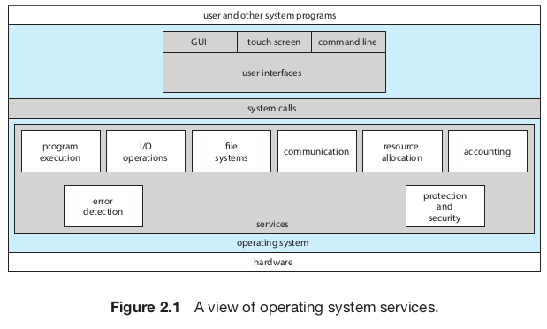

<!-- markdownlint-disable MD025 MD045 -->
<!-- MD025 single-title/single-h1 - Multiple top level headings in the same document -->
<!-- MD045/no-alt-text: Images should have alternate text (alt text)markdownlintMD045 -->

# Part one - Overview

Notas del silber

## Chapter 1 - Introduction

Objetivos

- Organizacion general de una computadora y el rol de interrupciones
- Componentes
- Transicion de modo usuario a modo kernel
- Uso de SOs
- Ejemplos de SOs

### Organization

#### Storage

### Architecture

Se categorizan aproximadamente según la cantidad de CPUs de propósito general
que se usan.

- Single-processor systems

    El **core** es el componente que ejecuta instrucciones y tiene registros
    para almacenar info de forma local. El CPU principal con su core ejecuta un
    conjunto de instrucciones de proposito general, incluyendo instrucciones de
    procesos.

    Pueden tener otros procesadores de proposito especifico.

- Multiprocessor systems

    Tienen mas de un procesador single-core. Tienen mas throughput.

  - SMP: symmetric multiprocessing, cada procesador hace todos los tasks. El
    beneficio es que muchos procersos pueden correr simultaneamente, sin
    causar un deterioro en la performace.

    

    No se pueden agregar CPUs para siempre porque a partir de cierto punto la
    contención del bus pasa a ser un bottleneck y se empieza a degradar la
    performance.

    - Multicore: evolucion a traves del tiempo de multiprocessor, hay mas de un
    core en un chip. Pueden ser mas eficientes que multiples chips con
    single-cores.

        

    Definiciones:

    - CPU: El hardware que ejecuta las instrucciones
    - Procesaro: Un chip fisico que tiene uno o mas CPUs
    - Core: La unidad basica de computo de la CPU
    - Multicore: mas de un core en el mismo CPU
    - Multiprocessor: Mas de un procesador.

    NUMA: Non Uniform Memory Access, alternativa en el que cada CPU tiene una
    memoria local y estan interconectados entre sí. Esto hace que sea más escalable
    seguir agregando CPUs, pero hay un penalty en performance cuando un CPU tiene
    que acceder a la memoria de otro.

    

- Clustered system

    Tiene multiples CPUs, y se diferencian con los sistemas multiprocesador en
    que tienen un conjunto de *nodos* (siustemas individuales) unidos, cada uno
    un sistema multicore.

### OS Operations

- **System daemons**: programas que corren siempre que corra el kernel. Por ej.
  en linux el primer programa que corre es `systemd`, que inicia otros daemons.

El sistema espera idle a que pase algo

- Interrupciones
- Excepciones: Interrupciones generadas por el codigo causados por un error o un
  request de un programa para que se ejecute un servicio del SO (syscall)

- Multiprogramming

  Organizar a los programas para que el CPU siempre tenga uno para ejecutar. Un
  programa en ejecución se llama **proceso**. El SO mantiene los procesos en
  memoria, y elije y ejecuta alguno.

  En un sistema no multiprogramado, cuando el proceso tenga que esperar por algo
  (por ej IO) el CPU se quedaria idle. En cambio, en uno multiprogramado, mientras
  tanto se corre otro. Siempre y cuando al menos un proceso necesite ejecutar, el
  CPU nunca esta idle.

- Multitasking

  Es una extensión lógica de multiprogramación. En un sistema con multitasking, el
  CPU ejecuta multiples procesos cambiando entre ellos, pero los switches ocurren
  frecuentemente, proveyendo al usuario con un **tiempo de respuesta** rapido.

La decisión de que proceso correr es **CPU scheduling**

#### Modes of execution

Es necesario poder diferenciar entre código de usuario y de kernel para que el
de usuario no haga que el SO se comporte de formas que no debería. Al menos son
necesarios dos **modos** de operación (**dual mode**)

- **user mode**
- **kernel mode** (supervisor mode, system mode, privileged mode)

Esto se implementa con un bit en el hardware - "mode bit"

Cuando se ejecuta un programa de usuario, el SO corre en modo usuario. Pero
cuando se hace una syscall, hay que hacer un cambio de modo.

De esta forma, las instrucciones que puedan causar daño se designan como
**instrucciones privilegiadas**, que solo se puedan ejecutar en modo kernel.

Se puede extender el concepto a más de un modo. Por ej. intel tiene **protection
rings** donde 0 es kernel y 3 es user mode. (**multimode**)

### Resource management

Un SO es un **resource manager**. Hace manejo de

- **Procesos**
  
  Un programa por si solo no es un proceso. Un programa es una entidad *pasiva*
  en el sistema, mientras que un proceso es una *activa*. Un proceso
  single-threaded tiene un solo **program counter** que especifica la siguiente
  instrucción a ejecutar, y uno multithreaded tiene múltiples, uno para cada
  thread.
  
  Un proceso es la unidad de trabajo de un sistema, que consiste en una
  colección de procesos. Algunos OS-processes (que ejecutan código del sistema)
  y otros user-processes (que ejecutan código de usuario). Todos pueden ejecutar
  concurrentemente, o en parelelo en diferentes cores.

  El SO debe

  - Crear y borrar user y system processes
  - Schedulear procesos y threads en los CPUs
  - Suspender y resumir procesos
  - Proveedr mecanismos para IPC y sync.

  Chapters 3 a 7.

- **Memoria**
  - Que partes de memoria se usan y por qué proceso
  - Allocating y deallocating memory space as needed
  - Decidir que procesos (o partes de ellos) y data mover desde y hacia la
    memoria.

  Chapters 9 y 10

- **FS**

  El SO provee una vista uniforme y lógica del almacenamiento. Abstrae de las
  propiedades físicas con una sola unidad lógica de almacenamiento, el
  **archivo** (file). Mapea files a memoria física y las accede mediante los
  dispositivos de almacenamiento. Usualmente se organizan en **directorios**.

  El SO se encarga de

  - Crear y borrar archivos
  - Crear y borrar directorios para organizar archivos
  - Soportar primitivas para manipular ambos
  - Mapear archivos al storage
  - Backup de archivos en nonvolatile storage.

  Chapters 13 a 15

- **Mass-Storage**

  El SO debe proveer soporte para **almacenamiento secundario** para almacenar
  su memoria principal (que es volátil). En general se usan HDDs o NVM (SSDs)

  - Mounting y unmounting
  - Manejo del espacio libre
  - Asignación de almacenamiento
  - Disk scheduling
  - Particionar
  - Protección

  Como se usa tan seguido, la velocidad del SO puede depender de la eficiencia
  con la que se maneja el storage secundario.

  Opcionalmente, se puede proveer soporte para **tertiary storage** (para
  backups). Algunos SOs lo hacen mientras otros lo dejan en manos de software de
  usuario.

  Chapter 11

- **Cache**

  Como tienen tamaño limitado, **cache management** es un problema importante de
  diseño. Elegir el tamaño y la política de desalojo puede mejorar mucho la
  performance.

- **IO**

  Un propósito de los SOs es esconder las peculiaridades de los dispositivos de
  hardware del usuario. Esto es parte del **subsistema de E/S**, que consiste en
  varios componentes:

  - Manejo de memoria que incluya buffering, caching y spooling
  - Una interfaz general para drivers de dispositivos
  - Drivers para dispositivos de hardware específicos.
  
### Seguridad y protección

- Protección: Es cualqueir mecanismo para controlar el acceso de procesos o
  usuarios a recursos definidos por el sistema. Debe proveer formas de
  especificar los controles y hacerlos cumplir

- Seguridad: Defender a un sistema de ataques internos y externos. Viruses,
  DDOS, robo de identidad, etc.

Ambos requieren que el sistema distinga a los usuarios que lo utilizan. La
mayoria tiene una lista de usuarios y **user IDs** asociados. (**SID**, security
ID en windows).

También se pueden armar **grupos** de usuarios.

### Virtualización

Es una tecnología que permite abstraer el hardware de una sola computadora (CPU,
memoria, disco, tarjetas de red, etc) en diferentes entoros de ejecución,
creando la ilusión de que cada uno está corriendo en una computadora diferente.

Deja que los SOs corran como apps en otros SOs.

El software de virtualización es parte de una clase más grande que incluye la
**emulación**, que involucra simular hardware en software.

En virtualización, hay un **host** operating system y una aplicación que actúa
de **virtual machine manager (VMM)**, la cual corre los *guest* SOs, maneja su
uso de recursos, y protege a cada uno de los demás.

### Sistemas distribuidos

Es un conjunto de sistemas fisicamente separados conectados a través de una red
(**network**).

Una **red** es un camino de comunicación entre dos o más sistemas. Varian según
el protocolo usado, distancia entre nodos y funcionalidad. El protocolo más
usado es TCP/IP. Se caracterizan basada en la distancia entre sus nodos

- LAN: Local area network, conecta computadoras de un mismo cuarto, edificio,
  campus.
- WAN: Wide area network. Edificios, ciudades o paises.
- PAN: Personal area network.

### Kernel Data Structures

Estructuras de datos usadas por el kernel

- Lists, stacks y queues
- Trees
- Hash functions and maps
- Bitmaps

### Computing environments

Entornos en los cuales se usan SOs. Más info en el libro

- Traditional computing
- Mobile computing
- Client server computing
- Peer to peer computing
- Cloud computing
- Real time embedded systems.

### Free and Open-source OSs

Más info en el libro.

- GNU/Linux
- BSD Unix
- Solaris

## Chapter 2 - Operating System Structures

Objetivos:

- Identificar servicios provistos por un SO
- Ilustrar como las syscalls se usan para proveer servicios del SO
- Comparar y contrastar tecnicas de diseño de SOs monolithic, layered,
  microkernel, modular y hybrid.
- Proceso de boot
- Monitoreo de performance del sistema
- Diseñar e implementar modulos de para interactuar con un kernel de Linux.

### Services

### Interface

- CLI

  **shell**: Interpretes de comandos de los usuarios.

- GUI
- Touch

Eleccion: suele ser personal preference

El diseño de interfaces de usuario buenas e intuitivas no es tarea del SO.

### Syscalls

Las **syscalls** proveen una interfaz a los servicios del SO. Suelen ser
funciones en C o C++, pero para algunas tareas muy low-level incluso en asm.

#### API

Application programming interface. Especifica las funciones que pueden usar y su
signatura. Las mas comunes son

- Windows API
- POSIX API
- Java API

Las funciones de un API por abajo hacen syscalls on behalf del usuario.

#### Tipos

Describe las syscalls que se usan en cada categoria, mas en el libro.

- **Process control**
- **File management**
- **Device management**
- **Info maintenance**
- **Communications**: Hay dos modelos principales
  - Message passing: Los procesos intercambian mensajes entre si para transferir
    info.
  - Shared-memory

- **Protection**

### System Services

Servicios que provee el sistema para su uso y desarrollo más simple.

- Daemons: (o **services**, **subsystems**): System-program processes que estan
  corriendo en todo momento.

### Linkers & Loaders

Para que un programa corra en la CPU, se tiene que cargar en memoria.

1. Los archivos fuente se compilan a archivos objeto, que se cargan en memoria. Son
  del formato **relocatable object file**
2. El **linker** combina los archivos objetos en un solo binario **executable**
   Durante esta fase, otros objetos o bibliotecas se pueden incluir, como la
   libc math (-lm)

3. Un **loader** se usa para cargar el binario a memoria, donde puede correr en
   algun core.
4. Tambien potencialmente se puede hacer **relocation**, que asigna la direccion
   final de las partes del programa.

5. No necesariamente todas las libs se tienen que cargar estaticamente, se
   pueden cargar dinamicamente mientras se carga.
   Evita linkear libs que no se usarian en el ejecutable.
    - Windows: DLLs

#### Formatos

ELF: Executable and Linkable Format. Formato de UNIX.

### OS Design & Implementation

Tipos

- Traditional desktop/laptop
- Mobile
- Distributed
- Real time

Goals:

- **User goals**
- **System goals**

Es importante la separacion de

- Policy: *what* will be done
- Mechanism: *how* it will be done

### OS Structure

Como los componentes de un SO se interconectan y forman un kernel.

- **Monolithic**

  Todo en un solo binario que corre en un solo address space. Ejemplo: UNIX.

  

  

  Contra:

  - Difiles de implementar y extender
  - Coupled: Cambios en una parte del sistema pueden llegar a afectar a otras
    partes.

  Pro

  - Mas rapidos. No hay overhead en el system-call interface, comunicacion con el
    kernel es rapida.

- **Layered**

  Loosely coupled: Cambios en una parte afectan solo ellas.

  

  Cada capa se implementa usando funciones de las inferiores.

  Se pueden debuggear nivel a nivel, de forma tal que cuando encontramos un
  fallo, estamos seguros de que esta en el nivel que estamos debuggeando en ese
  momento.

- **Microkernels**

  Ejemplo: Match

  

  Se hace al kernel mas chiquito y el resto de las cosas programas de usuario.
  Necesariamente los procesos se comunican con message passing a traves del
  kernel, lo cual puede ser lento.

  \+ es mas facil de extender
  
  \+ mas facil de portear

  \- la performance puede ser peor por overhead en las syscalls, al ser codigo
  de usuario.  

- **Modules**

  **LKM**: Loadable kernel modules. El kernel tiene un set de componentes core
  que pueden ser linkeados con modulos adicionales en boot o runtime.

- **Hybrid**

### Building and booting

Proceso de boot, bootloader, GRUB, UEFI / BIOS, etc.

### Debugging

Como hacer debugging en el kernel, [BCC](https://github.com/iovisor/bcc)

### Summary

- Un SO provee un entorno para la ejecucion de programas mediante servicios a
  sus usuarios y programas.

- Approaches principales para interactuar: CLI, GUI y touch
- syscalls sirven para acceder a los servicios del SO. Los programadores usan la
  API de ellas para acceder a sus servicios.

- Categorias de syscalls: process control, file management, device management,
  info maintenance, communications y protection.

- La libc provee la API de syscalls para Unix y linux.
- Los SOs vienen con una coleccion de system-programs que proveen utilidades a
  usuarios.

- Un **linker** combina varios *relocatable object files* a un solo binario
  ejecutable. Un **loader** lo carga en memoria, donde puede correr en el CPU

- Un SO se diseña con diferentes *goals* en mente. Esto determina sus
  *policies*, que se implementan mediante *mechanisms*

  - Monolithic: No tiene estructura, toda la funcionalidad se provee en un solo
    bonario que corre en un solo espacio de direcciones. Eficientes
  - Layered: Se divide en una cantidad finita de capas, donde la mas baja es el
    HW y la mas alta el UI. Tiene problemas de performance
  - Microkernel: Kernel minimo y el resto userland programs. Se comunican con
    message-passing.
  - Modular: Servicios de kernel como modulos que se pueden cargar y sacar en
    runtime. (por ej. drivers)
  - La mayoria de los SOs modernos son un hybrido entre modular y monolithic.

- Un **boot loader** carga un SO a memoria, lo inicializa y ejecuta.

# Part two - Process Management

- Un *proceso* es un programa en ejecución. Necesita recursos para cumplir su
  tarea, que se le reservan mientras ejecuta.

- Es la *unidad de trabajo* del sistema. Los sistemas consisten en una colección
  de procesos, los del SO ejecutan código de sistema y los de usuario código de
  usuario. Todos concurrentemente.

- Los SOs modernos permiten que tengan diferentes *threads* de control. Cuando
  hay más de un core, pueden correr en paralelo.

- Un aspeco importante del SO es como hace el *scheduling* de threads a cores.

## Chapter 3 - Processes

Objetivos

- Componentes de un proceso y como se representan y schedulean en un SO
- Creacion y terminacion de procesos.
- IPC con shared memory y message passing
  - Programas con pipes y POSIX shared memory
- Client-server communication con sockets y RPC
- Kernel modules que interactuan con el sistema.

### Concepto de proceso

El estado es el PC y el contenido de los registros. La memoria se separa en

- Text section: Codigo ejecutable
- Data: Variables globales
- Heap: Memoria dinamica
- Stack: Almacenamiento temporal (parametros, RET addr, variables locales)

Aunque dos procesos tengan asociado el mismo programa, son secuencias de
ejecucion distintas. Tienen el mismo text y data, pero heap y stack varian.

#### State

Mientras un proceso ejecuta, tiene **estado** (state).

- **new**: Esta siendo creado
- **running**: Se estan ejecutando instrucciones
- **waiting**: Esta esperando a que ocurra algun evento (IO / o una signal)
- **ready**: Esperando para tener asignado un procesador.
- **terminated**: Termino ejecucion

#### PCB

Cada proceso se representa en el SO por una **process control block** (PCB), o
task control block. Incluye

- Estado del proceso
- PC (addr de la siguiente instruccion a ejecutar)
- CPU Registers (es necesario guardarla para poder resumir la ejecucion del
  proceso)
- CPU-scheduling info. Prioridad, punteros a colas, etc.
- Memory-management info
- Accounting info: tiempo usado, etc.
- IO status: IO devices allocated, open files, etc.

Es toda la data necesaria para comenzar o reiniciar un proceso, ademas de alguna
accounting data.

Cuando hay **threads** la PCB contiene info de cada uno.

### Process/CPU Scheduling

Un **process scheduler** elige un proceso listo para que ejecute en un core.
Cada core puede ejecutar uno solo a la vez.

La cantidad de procesos en memoria es conocida como **degree of
multiprogramming**.

La mayoria de los procesos se pueden dividir en dos

- **IO-bound**: la mayoria del tiempo la pasa haciendo IO mas que computations
- **CPU-bound**: hace poco IO y mas que nada computations.

El sistema mantiene diferentes colas para los procesos

- Ready queue
- Wait queue

Y un diagrama de estados y colas

Ni bien entra se pone en ready, y despues puede hacer IO y caer en una IO queue,
o puede crear un proceso y esperar a que termine, o puede ser sacado del core
por una interrupcion o que se le termino el tiempo.

El rol del **CPU scheduler** es elegir de los procesos que estan en ready (en la
ready queue) y asignarles un CPU core.

#### Context switch

Cuando llega una interrupcion y hay que cambiar de proceso, el SO debe guardar
el **contexto** del actual para poder reestablecerlo luego, y cambiarlo con el
del que le toca ejecutar. Este esta representado en la PCB del proceso. El
proceso es llamado **context switch**.

### Operaciones en procesos

#### Creation

Un proceso puede crear otros procesos hijos, y ellos lo mismo, asi formando un
**arbol** de ellos. Estos se identifican con un **process identifier** (pid)

Para crear un proceso en UNIX, se usa la syscall `fork()`, que forkea el hilo de
ejecución y retorna 0 si es el hijo y el PID si es padre. El hijo puede tirar
`exec()` para cargar otro programa.

#### Termination

Un proceso le dice al SO que lo borre con la syscall `exit()`, retornando un
status value (int).

Por lo general es el padre el que lo tiene que matar. Y algunos sistemas no
dejan que los hijos existan si los padres terminaron, si uno termina, todos los
hijos deben terminar. Esto seconoce como **cascading termination**.

- Los procesos hijos que terminan no se sacan de la tabla de procesos para que
  los padres puedan tener su status code, al hacer `wait()`. Entonces hasta que
  los padres lo hagan, quedan como **zombies**.

  Cuando el padre hace wait(), se sacan de la tabla y no son mas zombies.

- Si el padre termina sin hacer `wait()`, quedan **orphans**. Aqui se hace que
  su padre sea `init/systemd`, que periodicamente hace wait() haciendo que no
  queden zombi.

### IPC

Los procesos pueden ser *independientes* si no comparten data con otros
procesos, o *cooperating* si pueden afectar o ser afectados por otros procesos.
Queremos que los procesos cooperen porque

- Info sharing: concurrent access a la misma info
- Computation speedup: Para dividir una tarea en subtareas que ejecuten en
  parlelo (si hay mas de un core)
- Modularidad

Los procesos que cooperan requieren una manera de intercambiar datos entre si,
**inter-process communication** (IPC). Hay dos modelos fundamentales: **shared
memory** y **message passing**

- Shared memory

  Un cacho de memoria se comparte entre un conjunto de procesos, y de esta forma
  pueden intercambiar info escribiendo y leyendo por ahi.

- Message passing

  Intercambian mensajes entre si, basicamente es posible un

  - `send()`
  - `receive()`

  Que cada uno puede especificar de que proceso obtiene/envia el mensaje, o sino
  con *mailboxes* que pueden ser de procesos o el SO.

  Los sends/receives pueden ser blocking o non-blocking, y pueden estar
  buffereados. (por ej. channels de go son blocking-blocking y pueden estar
  buffereados)

Ejemplos

- POSIX shared memory
- Match message passing
  - Ports = mailboxes
- Windows
- Pipes

### Client-server

Formas mas comunes

- Sockets
- RPC

### Chapter 3 Summary

- Un proceso es un programa en ejecucion, cuyo status esta representado por el
  PC y los registros.
- Tiene 4 secciones: text, data, heap y stack.
- Mientras ejecuta puede cambiar de estado. Hay 4 generales: ready, running,
  waiting y terminated
- La PCB (process control block) es la estructura de datos del kernel usada para
  representar un proceso.

- El rol del process-scheduler es elegir un proceso ready para que corra en un
  CPU, y el de un cpu-scheduler es elegir en que cpu corre. Cuando se cambia de
  proceso, se hace un **context-switch**
- IPC: shared memory / message passing
- Pipes: conducto para que procesos se comuniquen
  - Ordinary: Comunicacion entre procesos con parent-child relationship.
    Unidireccionales.
  - Named: mas generales y dejan que mas de un proceso se comunique
- Client-server
  - Sockets: Dejan que dos procesos se comuniquen a traves de la red, pueden
    estar en maquinas diferentes.
  - RPC: Abstrae el concepto de llamados a procedimiento de forma tal que una
    funcion se puede llamar en otro proceso que puede estar corriendo en otra
    computadora.