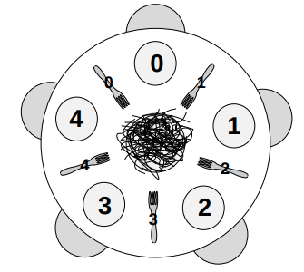

# Little book of semaphores

Notas de [*The little book of semaphores*][book]

[book]: http://greenteapress.com/semaphores/LittleBookOfSemaphores.pdf

## Table of contents

- [Little book of semaphores](#little-book-of-semaphores)
  - [Table of contents](#table-of-contents)
  - [Intro](#intro)
    - [Orden](#orden)
    - [No determinismo](#no-determinismo)
    - [Variables compartidas](#variables-compartidas)
      - [Tipos de interacciones](#tipos-de-interacciones)
  - [Semaphores](#semaphores)
    - [Definición](#definición)
    - [Syntax](#syntax)
  - [Patrones de sincronización](#patrones-de-sincronización)
    - [Signaling](#signaling)
    - [Rendezvous](#rendezvous)
      - [Deadlock](#deadlock)
    - [Mutex](#mutex)
      - [Simetria](#simetria)
      - [Sección crítica](#sección-crítica)
      - [Lock & Unlock](#lock--unlock)
    - [Multiplex](#multiplex)
    - [Barrier](#barrier)
    - [Reusable barrier](#reusable-barrier)
    - [Queue](#queue)
      - [Exclusive queue](#exclusive-queue)
  - [Classical synchronization problems](#classical-synchronization-problems)
    - [Producer-consumer](#producer-consumer)
      - [Implementacion](#implementacion)
      - [Deadlock 4](#deadlock-4)
      - [Buffer finito](#buffer-finito)
    - [Readers-writers problem](#readers-writers-problem)
      - [Lightswitch](#lightswitch)
      - [Starvation](#starvation)
      - [Solucion](#solucion)
      - [Writer-priority readers-writers](#writer-priority-readers-writers)
    - [No-starve mutex](#no-starve-mutex)
    - [Dining philosophers](#dining-philosophers)
      - [Deadlock #5](#deadlock-5)
      - [Dining philosophers solution #1](#dining-philosophers-solution-1)
      - [Solucion asimetrica](#solucion-asimetrica)
      - [Solución de Tanenbaum](#solución-de-tanenbaum)
    - [Cigarette smokers problem](#cigarette-smokers-problem)
  - [Less classical synchronization problems](#less-classical-synchronization-problems)
    - [The dining savages problem](#the-dining-savages-problem)
    - [The barbershop problem](#the-barbershop-problem)
      - [FIFO Barbershop](#fifo-barbershop)

## Intro

### Orden

Decimos que dos eventos son **secuenciales** (secuential) si ocurren uno después
del otro, y **concurrentes** (concurrent) si no sabemos el orden en el cual ocurrieron.

### No determinismo

Los programas concurrentes suelen ser no deterministas, es decir, no sabemos
solo con verlo que sucederá. Por ejemplo

```code
  Thread A              Thread B
1 print yes           1 print no
```

El orden de ejecución podría ser

a1 < b1

o

b1 < a1

### Variables compartidas

Cuando las variables son **locales** a los threads no suele haber problema, ya
que el resto no puede acceder. Pero también puede haber algunas que sean
**shared** entre ellos.

#### Tipos de interacciones

Los tipos de interacciones entre threads se pueden partir en

- Concurrent reads: Dos o mas threads hacen un read, lo cual no suele traer
  problemas de sincronización.
- Concurrent writes: dos o mas threads hacen write
- Concurrent updates: dos o mas threads hacen un read, seguido por un write de
  ese valor modificado.

## Semaphores

### Definición

Es como un entero con tres diferencias

1. Se puede inicializar el valor a cualquier entero, pero luego solo se puede
   incrementar o decrementar. No se puede leer.
   > En el marco de la materia se recomienda inicializarlo a un entero positivo.

2. Cuando un thread **decrementa** el semáforo, si el resultado es negativo, el
   thread bloquea y no puede continuar hasta que otro lo incrementa.

3. Cuando un thread **incrementa** el semáforo, si hay otros threads esperando,
   despierta **a uno** de los que estaba esperando.

Que significa el valor?

- positivo: Es la cantidad de threads que pueden decrementar sin bloquear
- negativo: Representa la cantidad de threads que estan bloqueados y esperando.
- cero: No hay threads esperando, pero si uno intenta de decrementar, bloqueará.

### Syntax

```python
fred = Semaphore(1) # Construye un nuevo semaforo con el valor inicial
fred.signal()       # Incrementa el semaforo
fred.wait()         # Decrementa el semaforo
```

## Patrones de sincronización

### Signaling

A threads sends a **signal** to another to indicate that something has happened.

```python
sem = Semaphore(0)

  Thread A          Thread B
1 a1                sem.wait()
2 sem.signal()      b1
```

De esta forma se garantiza el orden `a1 < b1`.

### Rendezvous

Dos threads tienen un *encuentro* (rendezvous) en un punto.

```text
  Thread A      Thread B
1 a1            b1
2 a2            b2
```

Se busca que `a1 < b2` y `b1 < a2` pero no se impone nada sobre a1 y b1.

"Two threads rendezvous at a point of execution, and neither is allowed to
proceed until both have arrived.

```text
aArrived = Semaphore(0)
bArrived = Semaphore(0)

Thread A          Thread B
a1                b1
aArrived.signal() bArrived.signal()
bArrived.wait()   aArrived.wait()
a2                b2
```

#### Deadlock

```text
Thread A          Thread B
a1                b1
bArrived.wait()   aArrived.wait()
aArrived.signal() bArrived.signal()
a2                b2
```

A llega y bloquea en su wait. B llega y también bloquea en su wait, pues A no
llegó a hacer el signal de aArrived. Ninguno puede proceder y nunca lo harán.

Esto se conoce como un **deadlock**.

### Mutex

Implementa la *exclusión mutua* entre threads.

```text
Thread A            Thread B
count = count + 1   count = count + 1
```

Agregarle semaforos al ejemplo para forzar exclusión mutua de la
variable compartida `count`

```python
mutex = Semaphore(1) # en 1 para que el primer wait no bloquee

Thread A            Thread B
mutex.wait()        mutex.wait()
count = count + 1   count = count + 1
mutex.signal()      mutex.signal()
```

#### Simetria

Como los dos threads están corriendo el mismo código, se dice que la solución es
**simetrica** (*symmetric*). En cambio, si tuvieran que correr código diferente,
se diria **asimetrica** (*asymmetric*).

La soluciones simetricas suelen ser más faciles de generalizar.

#### Sección crítica

Se suele llamar al código que debe ser protegido **sección crítica**
(*critical section*).

#### Lock & Unlock

Una metáfora alternativa es pensar a la sección crítica como un cuarto, en el
cual puede haber solamente un thread a la vez. Los mutexes se llaman *locks*, y
un thread *lockea* (locks) el cuarto después de entrar, y lo *desbloquea*
(unlocks) al salir.

### Multiplex

Es una generalización de mutex, pero puede haber multiples threads en la sección
crítica, con una cota superior. No puede haber más de n threads en la sección
crítica a la vez.

```python
multiplex = Semaphore(n) # los primeros n no bloquean

Thread K
mutex.wait()            # si hay menos de n, entra. Sino, espera a que lo haya
    critical section
mutex.signal()          # hay uno menos

# - n representa la cantidad de threads que pueden estar a la vez en CRIT
# - El valor del semaforo representa los que todavia pueden entrar, ya que
#   cuando sea 0, el proximo que lo intente bloqueara hasta que uno salga.
```

A este patron se lo llama **multiplex**

### Barrier

Generalizacion de Rendezvous pero para mas de dos threads.

```python
# Barrier
rendezvous
critical point
```

```python
n = cant threads
count = 0
mutex = Semaphore(1)
barrier = Semaphore(0)

Thread
rendezvous # Punto de encuentro

# Incremento la cantidad que llegaron
mutex.wait()
    count += 1
mutex.signal()

# Si ya llegaron todos, no hay que esperar mas
if count == n: barrier.signal()

# turnstile
barrier.wait()      # Espero a que llegue el ultimo
barrier.signal()    # Despierto al siguiente

critical point
```

El patron de hacer wait, inmediatamente seguido por un signal se suele conocer
como **turnstile**, porque deja que un thread pase a la vez, y puede estar
lockeado para parar a todos. Un turnstile es como el del subte.

En el estado inicial, (cero) el turnstile esta bloqueado. El n-esimo thread la
desbloquea y luego el resto pasa.

### Reusable barrier

Un set de threads realizan una serie de pasos en un loop, y se sincronizan en
una barrera luego de cada uno. Necesitamos una *barrera reutilizable*, que se
lockee por si misma luego de que hayan pasado todos los threads.

Para esto, se pueden usar dos *turnstiles*. Inicialmente, el primero está
bloqueado y el segundo desbloqueado.

- Cuando todos los threads llegan al primero, se bloquea el segundo y se
  desbloquea el primero.

- Cuando todos llegan al segundo, bloqueamos el primero, lo que hace que puedan
  dar la vuelta sin adelantarse, y después se desbloquea el segundo.

```python
n = cant threads
count = 0
mutex = Semaphore(1)
turnstile = Semaphore(0)
turnstile2 = Semaphore(1)

Thread
while true:
    # rendezvous

    mutex.wait()
        count += 1
        if count == n:
            turnstile2.wait()       # lock the second
            turnstile.signal()      # unlock the first
    mutex.signal()

    turnstile.wait()                # first turnstile
    turnstile.signal()

    # critical point

    mutex.wait()
        count -= 1
        if count == 0:
            turnstile.wait()        # lock the first
            turnstile2.signal()     # unlock the second
    mutex.signal

    turnstile2.wait()               # second turnstile
    turnstile2.signal()
```

Se le llama **two-phase barrier** porque fuerza a todos los threads a esperar
dos veces: cuando todos llegan, y otra para cuando todos terminan de ejecutar
la sección crítica.

Se puede afirmar lo siguiente para ayudar a probar de manera informal que el
programa es correcto:

1. Solo el n-esimo thread puede bloquear o desbloquear los turnstiles
2. Antes de que un thread pueda desbloquear el primer turnstile, tiene que
   cerrar el segundo y viceversa, por lo tanto es imposible para un thread
   adelantarse por más de un turnstile de los demás.

### Queue

Leaders and followers, esperan en dos queues. Cuando llega un lider, chequea si
hay un follower esperando. Si lo hay, procede, y sino queda esperando.

Cuando llega un follower, chequea por un lider y proceeden o esperan de forma
acorde.

```python
leaderQueue = Semaphore(0)
followerQueue = Semaphore(0)

# Leader
followerQueue.signal()
leaderQueue.wait()
dance()

# Follower
leaderQueue.signal()
followerQueue.wait()
dance()
```

#### Exclusive queue

Pero si cada uno puede bailar con solo el que lo trajo?

```python
leaders = followers = 0
mutex = Semaphore(1)
leaderQueue = Semaphore(0)
followerQueue = Semaphore(0)
rendezvous = Semaphore(0)
```

```python
# Leader
mutex.wait()
if followers > 0:
    followers--
    followerQueue.signal()
else:
    leaders++
    mutex.signal()
    leaderQueue.wait()

dance()
rendezvous.wait()
mutex.signal()
```

```python
# Follower
mutex.wait()
if leaders > 0:
    leaders--
    leaderQueue.signal()
else:
    followers++
    mutex.signal()
    followers.wait()

dance()
rendezvous.signal()
```

## Classical synchronization problems

### Producer-consumer

Algunos threads son **productores** y otros **consumidores**.
Los productores crean items y los ponen en una estructura de datos, mientras
que los consumidores los remueven y los procesan.

Cosas a forzar

- El buffer debe tener exclusion mutua
- Si un consumer llega mientras el buffer está vacío, bloquea hasta que un
  producer agrega un nuevo item.

Los producers hacen lo siguiente constantemente

```python
# Producer
event = waitForEvent()
buffer.add(event)
```

Y los consumers

```python
# Consumer
event = buffer.get()
event.process()
```

#### Implementacion

```python
mutex = Semaphore(1)
bufferItems = Semaphore(0) # cantidad de elementos del buffer

# Producer
event = waitForEvent()
mutex.wait()
    buffer.add(event)
mutex.signal()
bufferItems.signal()

# Consumer
bufferItems.wait()
mutex.wait()
    event = buffer.get()
mutex.signal()
event.process()
```

#### Deadlock 4

Si el consumer fuera el siguiente (haciendo wait en el semaforo de items dentro
del mutex), se llega a un deadlock.

```python
# Consumer
mutex.wait()
    bufferItems.wait()
    event = buffer.get()
mutex.signal()
event.process()
```

Por ejemplo, si el buffer esta vacio, un consumer lockea el mutex, y se queda
esperando un item. Luego entra un productor, que se queda esperando el mutex y
nunca puede anunciar que llego un item. Deadlock!

Por lo general, **esperar por un semaforo mientras se tiene un mutex puede**
**tener peligro de deadlock.**

#### Buffer finito

Se tiene el constraint adicional

- Si un productor llega mientras que el buffer está lleno, bloquea hasta que un
  consumidor remueva un item.

```python
mutex = Semaphore(1)
items = Semaphore(0) # cantidad de elementos del buffer
bufferSize = # tamaño del buffer
spaces = Semaphore(bufferSize) # slots libres del buffer

# Producer
event = waitForEvent()

spaces.wait()     # consume un slot libre
mutex.wait()
    buffer.add(event)
mutex.signal()
items.signal()

# Consumer
items.wait()
mutex.wait()
    event = buffer.get()
mutex.signal()
spaces.signal()   # libera un slot
event.process()
```

### Readers-writers problem

Se refiere a cualquier situación en la que una estructura de datos, base de
datos, o file system es leido y modificado por threads concurrentes.

Las constraints son:

1. Cualquier cantidad de lectores puede estar en la sección crítica
   simultáneamente.

2. Los writers deben tener acceso exclusivo a la sección critica.

Un writer no puede entrar a la sección crítica mientras que haya cualquier otro
thread (reader o writer) ahí, y mientras haya writers, no puede entrar ningún
otro thread.

El patron de exclusion es llamado **categorical mutual exclusion**, un thread en
la seccion critica no necesariemente excluye a otros, pero la presencia de una
categoria en la seccion critica exclude a todas las demas.

```python
int readers = 0
mutex = Semaphore(1)
roomEmpty = Semaphore(1)    # 1 si no hay threads en CRIT, 0 sino.

## Reader
mutex.wait()
    readers += 1
    if readers == 1:
        roomEmpty.wait()    # primer reader lockea
mutex.signal()

# CRIT de readers

mutex.wait()
    readers -= 1
    if readers == 0:
        roomEmpty.signal()  # ultimo reader desbloquea
mutex.signal()

## Writer
roomEmpty.wait()
    # CRIT de este writer
roomEmpty.signal()
```

#### Lightswitch

Este patron se conoce como **lightswitch**, ya que el primero en entrar lockea
un semaforo, y el ultimo en salir lo desbloquea. Se puede pensar como que la
primera persona que entra a un cuarto prende la luz, y la ultima que sale la
apaga.

#### Starvation

Es posible que no paren de entrar readers y que nunca le toque a los writers.
Para evitar eso, se puede hacer que cuando llegue un writer, los readers
existentes puedan terminar, pero que no puedan entrar readers adicionales.

#### Solucion

```python
int readers = 0
mutex = Semaphore(1)
roomEmpty = Semaphore(1)    # 1 si no hay threads en CRIT, 0 sino.

turnstile = Semaphore(1)

## Reader
mutex.wait()
    readers += 1
    if readers == 1:
        roomEmpty.wait()    # primer reader lockea
mutex.signal()

turnstile.wait()
turnstile.signal()

mutex.wait()
    readers -= 1
    if readers == 0:
        roomEmpty.signal()  # ultimo reader desbloquea
mutex.signal()

## Writer
# pass through the turnstile
# si llega un writer, bloquea acá dejando a los readers siguientes detrás de él.
turnstile.wait()

  roomEmpty.wait()
    # CRIT de este writer
  roomEmpty.signal()

turnstile.signal()
```

Y usando la nueva primitiva `Lightswitch`,

```python
readSwitch = Lightswitch()
roomEmpty = Semaphore(1)
turnstile = Semaphore(1)

## Reader
turnstile.wait()
turnstile.signal()

readSwitch.lock(roomEmpty)
  # CRIT para readers
readSwitch.unlock(roomEmpty)

## Writer
# pass through the turnstile
# si llega un writer, bloquea acá dejando a los readers siguientes detrás de él.
turnstile.wait()

  roomEmpty.wait()
    # CRIT de este writer

turnstile.signal()
roomEmpty.signal()
```

#### Writer-priority readers-writers

Pero y si quisieramos darle prioridad a los writers? Es decir, que una vez que
llegue un writer al sistema, los readers no deberian poder entrar hasta que
hayan salido todos los writers.

```python
readSwitch = LightSwitch()
writeSwitch = LightSwitch()

noReaders = Semaphore(1)
noWriters = Semaphore(1)

## Reader
noReaders.wait()
  readSwitch.lock(noWriters)
noReaders.signal()

    # CRIT

readSwitch.unlock(noWriters)

## Writer
writeSwitch.lock(noReaders)
    noWriters.wait()
        # CRIT
    noWriters.signal()
writeSwitch.unlock(noReaders)
```

Un problema de esta solución es que ahora puede haber starvation de los readers.

### No-starve mutex

En la sección anterior, se vio lo llamado **categorical starvation**, en la cual
una categoría de threads (readers) puede causar que otra categoría (writers)
sufra inanición.

En un nivel más básico, se puede resolver el problema de **thread starvation**,
en el cual un thread espera indefinidamente mientras otros proceden.

_mas en el libro_

### Dining philosophers

El problema fue planteado originalmente por Dijkstra.

5 filosofos, que representan threads, se acercan a una mesa con 5 tenedores, 5
platos y un gran bowl de fideos. Ejecutan el siguiente loop

```c
while true:
    think()
    get_forks()
    eat()
    put_forks()
```

Los tenedores representan recursos que los threads tienen que tener de forma
exclusiva para poder progresar.

1. Los filosofos necesitan *dos* tenedores para comer.
2. Tienen una variable local `i = 0..4` que identifica a cada uno
3. Los tenedores estan numerados de 0 a 4, de forma tal que el filosofo tiene el
  tenedor i a la derecha y el i+1 a la izquierda.



Debemos implementar `get_forks` y `put_forks` de forma tal que

1. Solo un filosofo puede tener un tenedor a la vez
2. No debe haber deadlocks
3. No debe haber starvation de un filosofo esperando un tenedor
4. Mas de un filosofo debe poder comer a la vez. Debería permitir la máxima
   cantidad de concurrencia.

```python
# funciones utiles para obtener para un filosofo
# los tenedores que le corresponden
def left(i): return i
def right(i): return (i + 1) % 5
```

#### Deadlock #5

```python
forks = [Semaphore(1) for i in range(5)]

def get_forks(i):
    fork[right(i)].wait()
    fork[left(i)].wait()

def put_forks(i):
    fork[right(i)].signal()
    fork[left(i)].signal()
```

Esta solución es incorrecta ya que no cumple con la condición 4, se puede dar un
deadlock si todos los filosofos tienen el tenedor de su izquierda, y están
esperando al de la derecha.

#### Dining philosophers solution #1

Si hubiera 4 filosofos, entonces sería imposible que haya un deadlock, ya que
nunca se completaria el circulo.

```python
forks = [Semaphore(1) for i in range(5)]
footman = Semaphore(4)

def get_forks(i):
    footman.wait() # si hay 4 ya, espera a que se vaya uno
    fork[right(i)].wait()
    fork[left(i)].wait()

def put_forks(i):
    fork[right(i)].signal()
    fork[left(i)].signal()
    footman.signal()
```

Si hay solo 4 filosofos, entonces en el peor caso todos tienen 1 tenedor y
esperan otro. Pero quedaría uno libre, el cual tiene dos vecinos, que tienen
otro tenedor en la mano. Por lo tanto, cualquiera de sus vecinos puede tomarlo y
comer.

Además de evitar el deadlock, esta solución evita el starvation de los
filósofos.

#### Solucion asimetrica

Si hay al menos un leftie y un rightie (es decir, que agarran respectivamente o
el tenedor izquierdo o el derecho), entonces no puede haber deadlock.

Supongo que si lo hay. Sea i un filosofo de los que están con dedlock.

Si es leftie, entonces el que está a su derecha es un leftie, porque sino
podría haberlo agarrado. Esto continúa hasta volver al inicial, que también es
leftie. Luego todos son lefties. Absurdo.

El caso de rightie es análogo.

#### Solución de Tanenbaum

Por cada filósofo hay una variable de estado que indica si está pensando,
comiendo, o esperando para comer, "hungry". Y un semáforo que indica si el
filósofo puede comenzar a comer.

```python
state = ['thinking'] * 5
sem = [Semaphore(0)] * 5
mutex = Semaphore(1)

def get_fork(i):
    mutex.wait()
        state[i] = 'hungry'
        test(i)
    mutex.signal()
    sem[i].wait()

def put_fork(i):
    mutex.wait()
        state[i] = "thinking"
        test(right(i))
        test(left(i))
    mutex.signal()

def test(i):
    # retorna si el i-esimo filosofo puede comenzar a comer, y en
    # caso de que pueda, hace signal al semaforo i-esimo.
    if state[i] == "hungry" and
       state[left(i)] != "eating" and
       state[right(i)] != "eating":
            state[i] = "eating"
            sem[i].signal()
```

Hay dos formas por las cuales un filósofo podría comenzar a comer

- El filosofo ejecuta `get_fork` y encuentra los forks disponibles, procede
  inmediatamente.
- Uno de sus vecinos esta comiendo y el filosofo bloquea su propio semaforo.
  Eventualmente, uno de los vecinos terminara, punto en el cual ejecuta test en
  sus dos vecinos.

### Cigarette smokers problem

Libro p.101

## Less classical synchronization problems

### The dining savages problem

Una tribu de *savages* tiene comidas comunales en las que comen de un pote que
tiene hasta M servings. Cuando un savage quiere comer, se sirve del pote, pero
si esta vacio le dice al cocinero que lo llene, y espera a que lo haga.

Código sin sync

```python
Savage():
    while True:
        getServingFromPot()
        eat()

Cook():
    while True:
        putServingsInPot(M)
```

Los contraints son:

- Los *savages* no pueden llamar a `getServingFromPot` si esta vacio
- El *cook* puede llamar a `putServingsInPot` solo si esta vacio.

Solucion:

```python
servings = 0
mutex = Semaphore(1)
emptyPot = Semaphore(0)
fullPot = Semaphore(0)

Savage():
    while True:
        mutex.wait()
            if servings == 0:
                emptyPot.signal()
                fullPot.wait()

            servings -= 1
            getServingFromPot()
        mutex.signal()

        eat()

Cook():
    while True:
        emptyPot.wait()
        putServingsInPot(M)
        # Esto podria estar tambien dentro del savage para que siempre se acceda
        # dentro del mutex, pero no es necesario, ya que en este momento es el
        # unico accediendo
        servings = M
        fullPot.signal()
```

### The barbershop problem

Originalmente Dijkstra, y una variacion aparece en el Silbershatz (*Operating*
*Systems Concepts*)

Una barberia consiste de una sala de espera con *n* sillas, y una sola silla
para cortarse el pelo. Si no hay clientes, el barbero se va a dormir.
Si entra un cliente y todas las sillas estan ocupadas, se va. Si el barbero esta
ocupado, pero hay sillas disponibles, se sienta y espera. Si el barbero esta
dormido, lo despierta.

Y para hacerlo mas concreto,

- Los clientes deberian llamar `getHairCut`
- Si un cliente llega y el local esta lleno, se van llamando a `balk` que no
  retorna.
- El barbero deberia llamar `cutHair`
- Cuando el barbero llama `cutHair`, deberia haber exactamente un thread
  llamando a `getHairCut` concurrentemente.

```python
n = 4
clients = 0
mutex = Semaphore(1)

# sync a la entrada
client = Semaphore(0)
barber = Semaphore(0)

# sync a la salida
clientDone = Semaphore(0)
barberDone = Semaphore(0)

Barber():
    while True:
        # espera a que haya un cliente
        client.wait()
        # le indica al cliente que esta listo
        barber.signal()

        # corta pelo
        cutHair()

        # rendezvous
        barberDone.signal()
        clientDone.wait()


Client():
    mutex.wait()    # mutex.lock()
        if clients == n:
            mutex.signal()
            balk()

        clients++
    mutex.signal()  # mutex.unlock()

    # sin garantizar orden
    client.signal()
    barber.wait()

    getHairCut()

    clientDone.signal()
    barberDone.wait()

    mutex.wait()
        clients--
    mutex.signal()
```

#### FIFO Barbershop

No hay garantia en la anterior que se siga FIFO.

```python
n = 4
clients = 0
mutex = Semaphore(1)

# sync a la entrada
customer = Semaphore(0)

# sync a la salida
clientDone = Semaphore(0)
barberDone = Semaphore(0)

Barber():
    while True:
        # espera a que haya un cliente
        customer.wait()
        # le indica al cliente que esta listo
        mutex.wait()
            sem = clients.pop(0)
        mutex.signal()

        sem.signal()

        # corta pelo
        cutHair()

        # rendezvous
        barberDone.signal()
        clientDone.wait()

Client():
    self.sem = Semaphore(0)
    mutex.wait()    # mutex.lock()
        if clients == n:
            mutex.signal()
            balk()

        clients++
        queue.push(self.sem)
    mutex.signal()  # mutex.unlock()

    customer.signal()
    self.sem.wait()

    getHairCut()

    clientDone.signal()
    barberDone.wait()

    mutex.wait()
        clients--
    mutex.signal()
```
