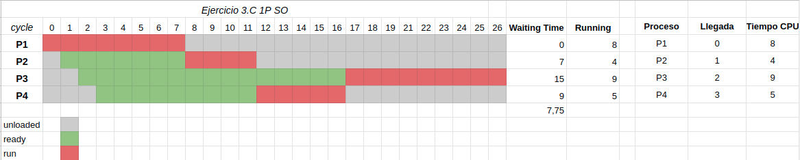
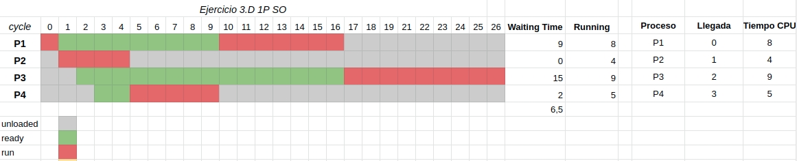

# SO - 1P - Ejercicio de Scheduling (3)

> En los casos siguientes se muestran diferentes características o comportamientos de procesos, y su correspodiente diagrama de Gantt cuando se le aplica un scheduler en particular.
>
> a. Para cada caso indique cuál es el algoritmo del scheduler utilizado.
>
> b. Calcule el waiting-time promedio para cada uno.
>
> c. Discuta este resultado waiting-time promedio para los casos A y B. ¿Por qué dan estos resultados?

Recuerdo que *waiting time* es el tiempo que un proceso pasa en estado *ready*.
Es decir, esta listo para ejecutar en la CPU, pero el scheduler todavia no hizo
su dispatch.

## Caso A

a.

Si bien llegaron todos al mismo tiempo, se decidió ejecutar primero a P1 en
vez de P2 y P3, y luego P2 en vez de P3. Esto me hace creer que es un
scheduler con algun tipo de prioridad, pero también podría estar tirando un
random si fuera un scheduler FIFO, como llegaron al mismo tiempo es imposible
decirlo con certeza.

Como todos corren ininterrumpidos, me hace creer que es un scheduler
non-preemptive, es decir, que toma decisiones sobre que hacer con los procesos
solo cuando se bloquean, y no los desaloja pasados un *quantum*.
El problema es que como ninguno se bloqueo, también podría ser que sea un
scheduler con preemption y un *quantum* de 14 ciclos de clock, por lo que P1
correría sin ser desalojado.

Lo que se me hace mas razonable es asumir que es un scheduler non-preemptive, con prioridades.

b. avg waiting time = $(0 + 14 + (14 + 3)) / 3 = 31 / 3 \approx 10,3$

## Caso B

a.

Como todos llegaron al mismo tiempo, no es posible decirlo con un 100% de
certeza, pero veo que podria haber mas de un scheduling posible. Por ejemplo,
podria ser SJF (*Shortest Job First*) o SRTF (*Shortest Remaining Time First*)
ya que ejecuta primero a los que duraran menos.

Pero tambien podria tranquilamente ser FIFO y que haya tirado un random.

En cuanto a si es preemtive o non-preemptive, podria ser que tenga un quantum
de 3 ticks de clock, y que haya decidido no desalojar al proceso P3 ya que no
hay otro para ejecutar en su lugar. Pero tambien podria ser non-preemtive.

Lo que me parece mas razonable es que sea SJF, pero hay que tener
en cuenta que es dificil en un caso real saber cuanto van a tardar en ejecutar
los procesos.

b. avg waiting time = $(0 + 3 + (3 + 3)) / 3 = 9 / 3 = 3$

## Caso C

Imagen que agrega el estado *ready* para mayor claridad.

a.

- Cuando corre P2 podria haber corrido P2, P3 o P4. Esto puede haber sido por
  orden de llegada, o porque P2 tenia el *shortest job*
- No los corre en orden de llegada, pues P4 corre antes que P3, a pesar de haber
  llegado después. Esto descarta que sea round robin / FCFS (FIFO)

Necesariamente debe ser un scheduler por prioridades, y no puede ser FIFO.

Seria razonable que esa prioridad este determinada por el largo del trabajo, ya
que corre P2 y P4 antes que P3. Nuevamente SJF

b. avg waiting time = $(0 + 7 + 15 + 9) / 4 = 31/4 = 7,75$

## Caso D

a.

Voy a suponer que el proceso P1 no se bloquea, sino que luego de ejecutar por un
ciclo fue desalojado a favor de P2, en el medio quedando en estado ready. Seria
razonable asumir que este es un scheduler parecido a SJF, pero que desaloja a
los procesos cuando llega uno con trabajo mas corto que el que esta running.

Esto explicaría por qué desaloja a P1 cuando llega P2, y no desaloja a P2 cuando
llegan P3 y P4.

Devuelta no puede ser Round Robin o FCFS porque al tener la posibilidad de
ejecutar P3 o P4 ejecuta P4, a pesar de haber llegado despues. Otra razón para
que sea parecido a SJF.

Seria aun mas razonable que sea SRTF, ya que los va desalojando, y por ejemplo
si aun proceso que tiene 100 clocks en total lo desaloja cuando le quedan 4, y
despues llega uno de 99, querria poner a ejecutar al de 100 ya que le faltan 4,
a pesar de que su trabajo sea mas largo.

b. waiting time = $(9 + 0 + 15 + 2) / 4 = 26 / 4 = 6,5$

## Punto C

> c. Discuta este resultado waiting-time promedio para los casos A y B. ¿Por qué dan estos resultados?

Porque al correr los que tienen trabajos mas cortos primero se optimiza mejor el
tiempo, ya que los procesos no tienen que estar esperando a que el que tarda mas
termine de ejecutar para poder correr.
