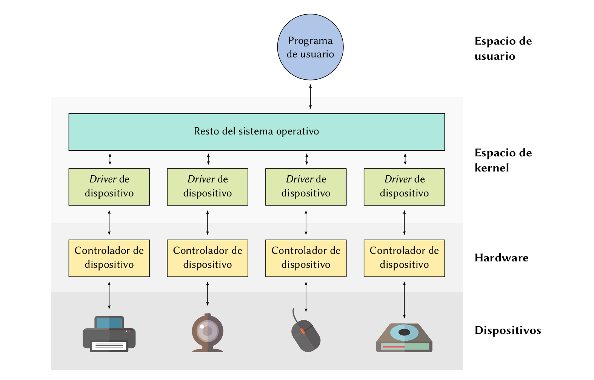
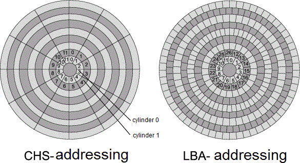

# Practica 6 - Drivers

Cosas a tener en cuenta para ejs de drivers

- Tener en cuenta que pasa si se corre concurrentemente en varios procesos
- Los handlers de int tiene que ser lo mas minimales posibles, no deberian
  bloquear en nada.

RAID 0, 1, 4, y 5.

- las diferencias
- lo que esta en la practica

### 6.3 - ffrizo

!!
- spooling: es una tecnica que se usa cuando tengo un dispositivo que es mucho
  mas lento de lo que tendrias sentido esperar a que termine para seguir
  trabajando. delego en alguien mas el laburo de esperar a que el dispoistivo
  termine.

  > El ejemplo tipico son las impresoras.
  > mando a imprimir al spooler, sigo con mis cosas y me desentiendo de eso. El
  > spooler entonces se encarga de esperarla, hacer que pase el siguiente, etc.

  Es un soft que toma el rol de administrar un recurso.

- disp virtuales: cualquier dispositivo que no tiene un dispositivo fisico real
  del otro lado.

  Puedo dar un disp virtual que abstraiga la interfaz de un dispositivo real,
  por ejemplo un dispositivo de impresora que abstrae varias astras.

  Podes abstraer varios disp fisicos atras de uno virtual.
  
  Tambien un raid virtualizado
!!

a. si.
b.

- latencia: tiempo desde que esta ready hasta que esta listo para ejecutar
  cuanto pasa. Tiempo de respuesta del sistema.
  Si antes de implementar spooling se quedaban esperando a que impriman, la CPU
  va a tener una mejor ocupacion.
- throughput: desde el punto de vista del proceso
- liberacion de recursos: ahora que no tiene que esperar a que termine la
  impersion los va a poder liberar antes. Van a estar menos tiempo bloqueados
  inutilmente.

c.

- por un lado, no solo queremos enviar cosas, sino recibir. la placa de red es
  de entrada salida

- Tiene sentido cuando los tiempos de respuesta son largos, y la placa de red
  responde rapido. Trae un overhead innecesario

## 6.7 - ffrizo

No deberia haber otro que lo modifique mas que el driver. Confiamos en el resto
del kernel. Otro proceso podria correr el codigo

El busy waiting se hace cuando llaman a read

## 6.8 - ffrizo

Ahora con interrupciones.

Es parecido al de la clase. Hay que definir una rutina que atienda la int,
asociar el handler a la int 7.

El comportamiento de cara al usuario tiene que ser el mismo, la diferencia es
que en el 7 el usuario se quedaba esperando pero gastaba cpu, pero ahora tambien
espera pero bloquea con un semaforo.

El handler de int tiene que avisrle a read que la tecla fue pulsada.

Hay que tener en cuenta que no haya condiciones de carrera.

Codigo Reentrane: Puede estar siendo ejecutado el mismo codigo en parelelo.

## 6.9 - ffrizo

Mas para conversar

!! teoria

> cuando dice administrador de entrada salida, a que se refiere?
Es la parte del kernel que maneja e/s, y no el kernel

El dispositivo siempre tiene algun soft integrado.
Por ej la impresora tiene un integrado con una pequeña cpu que se encarga de
realizar la impresion.
O un disco duro.

Ej del 7, setear los bits lo hace el controlador.

Todos los dispositivos tiene un controlador.

Por otro lado, estan los programas que quieren usar los dispositivos

Y por el otro lado, esta el SO, no habla derecho con la impresora, ni con el
controlador de la impresora, hacen syscalls que el SO traduce al lenguaje del
controlador. Lo que esta ahi en el medio haciendo esas traducciones es el driver.

El *administrador de E/S* es la cajita celeste que habla con los drivers.
Es la parte del SO que conecta al programa con el driver.

!! teoria

a. fd open(path, flags)

Un fd es la desc entre la asociacion entre un file y un programa.

!!
0. modulo virtual file system (vfs): lo tienen los SOs unix, es como el fs
global. /media/data o /home/ estan colgados ahi.
Es un arbol padre en el que estan montados los fs concretos

El fs en el que estan los dispositivos es /dev/
Entonces si haces open de /dev/sarasa, ve que el dispositivo tiene un major y un
minor (id). Una vez que se tiene ese id, le toca trabajar al administrador de
entrada y salida.

Los procesos tienen una PCB, y una de las cosas que tienen es la lista de
archivos que tiene abierta.
!!

1. Se fija si hay un driver asociado a ese dispositivo, y si no hay uno asociado
   devuelve un error. (mapear eso a un driver)

2. El driver define una función open, hay que ejecutarla.
   Se ejecuta cada vez que un programa quiere acceder al driver, entonces
   va a estar asociado a esa instancia particular del driver para ese programa.

   > ej, en letras123 te fijabas si habia un slot disponible, y si no tirabamos
   > un error al programa.

Una vez que ya se hizo, tengo que guardarme en la tabla de archivos abiertos
para ese programa que ese dispositivo esta mapeado a ese programa. Y le da
al programa el fd. Un puntero en la tabla de archivos abiertos de ese proceso
Pero esto no lo hace el administrador de E/S.

b. write(fd, buf, count)

0. Veo si el dispositivo existe, y hay un driver asociado
1. Ver si lo tiene abierto ese proceso (hicieron el open previamente). 
   Pueden llamar a write sobre un disp que no hayan hecho open, 
   y por lo tanto que no este inicializado

el administrador de procesos sabe que cada proceso tiene abierto cada archivo, y
a parte hay otro nivel, que es tener abierto un dispositivo. Por un lado tenes
el disp, y por el otro un nodo en el fs que representa a ese dispositivo.

Una parte del kernel se encarga de los fd, y eso, y hay otra que es la que sabe
que se llamo a la funcion open del dispositivo (adm de e/s). Ademas el driver
cada vez que un proceso hace open, puede guardar cierta info privada que le
corresponde a ese proceso. (en letras123 para saber quien habia hecho un read)

el adm de E/S tiene que tener si o si un matcheo

Me llega un id de disp, le corresponde a este driver, tiene esta fn write, hizo
open anteriormente, y si todo eso esta dado llamo a la fn write del driver con
los parametros que me pasaron.

## 6.11 - ffrizo

Es un ej largo que de escribir un driver para una controladora de discos.

!! teoria discos

Los discos duros nunca se leen de a bits, se leen de a cosas mas grandes, se le
suele llamar sector, o bloque.

El sector es lo que yo puedo leer de un disco.
Los bloques del disco son, en un sistema de archivos son las unidades logicas en
las que yo divido el disco para asignarselo a los archivos.
No puedo en un bloque tener mas de un archivo distinto, tienen que ser multiplos
de los sectores en general los bloques.
No tiene sentido tener un bloque que ocupe solo parte de un sector, ya que voy a
leer varios bloques juntos, en general son chiquitos (512 bytes, 1K)

LBA suele ser el nombre que se le da al puntero al sector.
!!

Un disco no es una tira, tiene platos, tiene pistas, y cada una tiene sectores

    LBA = (número de pista)*(cantidad_sectores_por_pista) + (número de sector dentro de la pista), si no me equivoco

!!

Asumimos que nos pasan una LBA valida.
