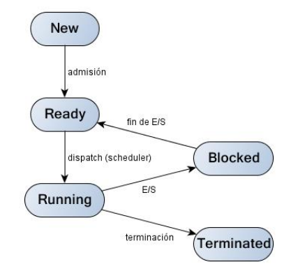
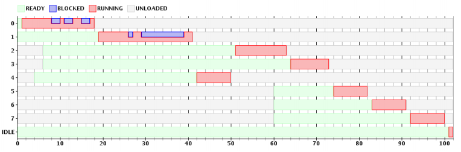
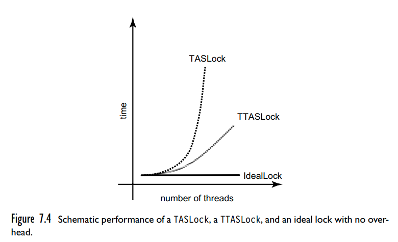
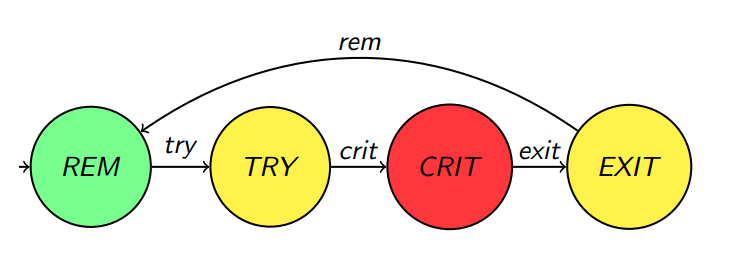
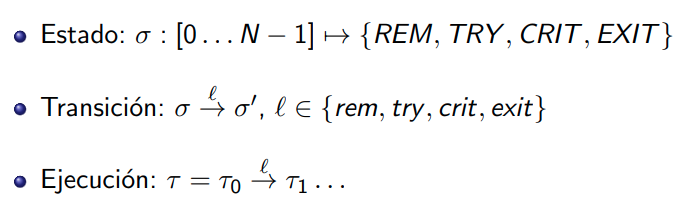

# Resumen para el primer parcial de SO

## Contenidos

- [Resumen para el primer parcial de SO](#resumen-para-el-primer-parcial-de-so)
  - [Contenidos](#contenidos)
  - [SOs](#sos)
    - [Elementos basicos de un SO](#elementos-basicos-de-un-so)
    - [Procesos](#procesos)
      - [Memoria](#memoria)
      - [Que puede hacer](#que-puede-hacer)
        - [Syscalls](#syscalls)
      - [Árbol de procesos](#árbol-de-procesos)
      - [Fork](#fork)
    - [Otras funciones](#otras-funciones)
    - [Esperar a que un proceso hijo termine](#esperar-a-que-un-proceso-hijo-termine)
    - [Copy on write](#copy-on-write)
  - [IPC - InterProcess Communication](#ipc---interprocess-communication)
    - [File Descriptors (FD)](#file-descriptors-fd)
    - [Modelo de flujo de comunicacion](#modelo-de-flujo-de-comunicacion)
    - [Interaccion con archivos](#interaccion-con-archivos)
    - [dup2](#dup2)
      - [Esquema de redireccion](#esquema-de-redireccion)
    - [Pipes](#pipes)
      - [Pipes en PCB](#pipes-en-pcb)
      - [Comunicacion entre procesos con pipes](#comunicacion-entre-procesos-con-pipes)
  - [Scheduling](#scheduling)
    - [Context Switch](#context-switch)
    - [Estados de un proceso](#estados-de-un-proceso)
      - [Tipos de schediling](#tipos-de-schediling)
    - [Nomenclaturas](#nomenclaturas)
    - [Politicas de scheduling](#politicas-de-scheduling)
    - [Diagramas de GANTT](#diagramas-de-gantt)
    - [Métricas de rendimiento](#métricas-de-rendimiento)
  - [Memoria](#memoria-1)
  - [Sincronizacion entre procesos](#sincronizacion-entre-procesos)
    - [Secciones críticas](#secciones-críticas)
    - [Deadlock](#deadlock)
    - [Primitivas de sync](#primitivas-de-sync)
      - [TAS](#tas)
      - [Semaforos](#semaforos)
      - [Mutex](#mutex)
      - [Atomicos](#atomicos)
      - [TAS Lock / Spin Lock](#tas-lock--spin-lock)
      - [TTASLock / Local spinning](#ttaslock--local-spinning)
      - [CAS](#cas)
    - [Problemas de sync](#problemas-de-sync)
    - [Correctitud](#correctitud)
    - [Propiedades](#propiedades)
      - [Tipos](#tipos)
      - [Modelo de proceso](#modelo-de-proceso)
      - [LTL](#ltl)
      - [WAIT-FREEDOM](#wait-freedom)
      - [FAIRNESS - Equanimidad](#fairness---equanimidad)
      - [EXCL - Exclusión Mutua](#excl---exclusión-mutua)
      - [LOCK-FREEDOM - Progreso](#lock-freedom---progreso)
      - [DEADLOCK/LOCKOUT/STARVATION-FREEDOM - Progreso global dependiente](#deadlocklockoutstarvation-freedom---progreso-global-dependiente)
      - [WAIT-FREEDOM - Progreso global absoluto](#wait-freedom---progreso-global-absoluto)

## SOs

Algunas definiciones

- **multiprogramacion**: Mas de un programa se ejecuta a la vez.
- **contencion**: Varios programas queriendo acceder al mismo recurso a la vez.

Un SO tiene que manejar la contención de los recursos y la concurrencia de
manera tal de lograr

- Buen rendimiento
- Correctitud

Y para poder hacerlo, corre en nivel de privilegio 0.

### Elementos basicos de un SO

- **Drivers**: Programas que hacen de interfaz con el hardware
- **Kernel**: La parte central del sistema operativo.
- **Shell**: Es un porgrama mas que permite al usuario interactuar con el SO.
  Ejemplos: `sh`, `bash`, etc.
- **Proceso**: Programa en ejecucion, unidad de scheduling, espacio de memoria
  asociado y otros atributos.
- **Archivo**: Bytes con un nombre y atributos
- **Directorio**: Colección de archivos y otros directorios que tiene nombre y
  es organizado jerárquicamente.
- **Dispostivo virtual**: Abstracción de un dispositivo físico. Por lo general
  es un file.
- **File sistem**: Forma de organizar los datos en el disco para gestionar su
  acceso, permisos, etc.
- **Directorios del sistema**: Directorios donde el SO guarda los archivos que
  necesita. `/boot`, `/devices`, etc.
- **Binarios del sistema**: Archivos en directorios del sistema que llevan
  a cabo tareas importantes.
- **Archivos de configuracion**: El SO saca de ahi info que necesita para
  funcionar.

### Procesos

Un programa es una secuencia de pasos escrita en algún lenguaje, que cuando se
pone en ejecución, pasa a ser un *proceso*. A cada uno se le asigna un
identificador único, el **process id** o **pid**.

#### Memoria

La memoria de un proceso está compuesta por

- texto: Código de máquina del programa
- datos: Heap
- stack

#### Que puede hacer

- Terminar (`exit()`)
- Lanzar un proceso hijo (`fork()`, `exec()`, `system()`)
- Ejecutar en la CPU
- Hacer una syscall
- Realizar I/O

##### Syscalls

La diferencia entre una llamada a funcion normal y una *syscall* es que esta
ultima requiere un cambio de nivel de privilegio, un cambio de contexto, e
incluso a veces una interrupcion.

#### Árbol de procesos

Todos los procesos están organizados jerárquicamente, como un árbol. Cada uno
tiene la posibilidad de lanzar un proceso hijo.

Entonces hay un proceso que es el padre de todo el resto, `root` o `init`, que
es el que luego lanza el `shell`.


#### Fork

Es la forma que tiene el sistema operativo de crear nuevos procesos.

```text
$ man fork

    fork - create a child process

    pid_t fork(void);

DESCRIPTION
    fork()  creates  a new process by duplicating the calling process.  The
    new process is referred to as the child process.  The  calling  process
    is referred to as the parent process.

    The child process and the parent process run in separate memory spaces.
    At the time of fork() both memory spaces have the same content.  Memory
    writes,  file  mappings (mmap(2)), and unmappings (munmap(2)) performed
    by one of the processes do not affect the other.

RETURN VALUE
    On success, the PID of the child process is returned in the parent, and
    0  is returned in the child.  On failure, -1 is returned in the parent,
    no child process is created, and errno is set appropriately.

...

NOTES
    Under Linux, fork() is implemented using copy-on-write  pages,  so  the
    only  penalty  that it incurs is the time and memory required to dupli‐
    cate the parent's page tables, and to create a  unique  task  structure
    for the child.
```

`fork` entonces crea un nuevo proceso. En el caso del creador (padre) se retorna
el PID del hijo, y en el caso del hijo retorna 0. Ejemplo:

```c
pid_t pid = fork();
if(pid == 0) {
    // soy el hijo
    child()
    exit(0)
}

// soy el padre y pid es el Process ID de mi hijo
```

### Otras funciones

- `int clone(...)`: Crea un nuevo proceso. Es usado en la implementacion de
  threads.
- `int execve(const char* filename, char* const argv[], char* const envp[])`:
  Sustituye la imagen de memoria del programa por la del programa ubicado en el
  `filename`.

- `pid_t vfork(void)`: Crea un hijo sin copiar la memoria del padre, pensado
  para que el hijo haga fork.

- `void exit(int status)`: Finaliza el proceso actual

- `int system(const char *command)`: Ejecuta el comando. Hace `fork` y luego
  `execl`.

### Esperar a que un proceso hijo termine

- `pid_t waitpid(pid_t pid, int *wstatus, int options);`: Suspende la ejecucion
  del proceso hasta que el hijo especificado por `pid` cambie de estado. Por
  defecto, espera solo a que los hijos terminen, pero se puede modificar
  mediante las options.

  `pid` puede ser:
  - `< - 1`: Espera a cualquier hijo cuyo process group ID sea igual al `pid`
  - `-1`: Espera a cualquier proceso hijo
  - `0`: Espera a cualquier hijo cuyo process group ID sea igual al `pid` del
    proceso que llamo la funcion.
  - `> 0`: Espera al proceso hijo con el process id igual a `pid`.

- `pid_t wait(int* status)`: Bloquea al padre hasta que algún hijo termine.
  Es equivalente a hacer `waitpid(-1, &status, 0);`

### Copy on write

Los procesos no comparten la memoria, cada uno cuenta con su espacio propio.
Entonces por ejemplo, si un proceso usa mucha memoria, podria llegar a ser
pesado copiar toda la memoria al nuevo cuando se haga `fork`.

Para evitar esto, en linux los procesos creados usando `fork` comienzan con sus
paginas de memoria apuntando a las mismas que el padre. Recien cuando alguien
escribe en esas paginas se hace la copia: **copy on write**.

## IPC - InterProcess Communication

### File Descriptors (FD)

Cada proceso tiene en su PCB una tabla con referencias a los archivos que tiene
abiertos. Un **file descriptor** es un indice de esa tabla.

Los FDs los usa el kernel para referenciar a los archivos abiertos que tiene
cada proceso. Cada entry en la tabla apunta a un archivo


Distintas entradas de file descriptor pueden apuntar al mismo archivo, pero
son *instancias de apertura* distintas.

### Modelo de flujo de comunicacion

Cada proceso tiene definida una entrada y salida estandar, y puede abstraerse
de donde y hacia donde se está escribiendo.

Por lo general los procesos esperan tener abiertos 3 **file descriptors**
(las entries 0, 1 y 2 de la tabla)

- 0 = `stdin` (standard input)
- 1 = `stdout` (standard output)
- 2 = `stderr` (standard error)

**Se heredan del proceso padre cuando se crea el hijo** con `fork`, y se
mantiene despues de la llamada a `execve`.

### Interaccion con archivos

Para escribir y leer de file descriptors,

- `ssize_t read(int fd, void *buf, size_t count);`
- `ssize_t write(int fd, const void *buf, size_t count);`
  
donde

- `fd` es el file descriptor.
- `buf` es el buffer al cual se leen o escriben datos.
- `count`: es la cantidad maxima de bytes a leer o escribir.

Ambas devuelven la cantidad de bytes leidos, -1 en caso de error.

Son **bloqueantes** por defecto, es decir, por ej. con el read hasta que no
encuentre información disponible se queda esperando. Esto se puede cambiar
mediante el uso de ciertos flags (`man 2 fcntl`)

### dup2

```bash
echo "Es jueves y mi PCB lo sabe" > archivo.txt
```

- Se llama al programa echo, que escribe su parámetro por **stdout**
- Con > se le indica a la consola que **stdout** se redirija a `archivo.txt`
- Cómo? Abre archivo.txt y hace que la entry de stdout apunte a el

La función `dup2(int oldfd, int newfd)` pisa el file descriptor en `newfd` el
contenido que está en `oldfd` (`man dup2`)

```text
$ man dup

    ...

    #include <unistd.h>

    int dup(int oldfd);
    int dup2(int oldfd, int newfd);

    ...

    The  dup()  system  call  creates  a copy of the file descriptor oldfd,
    using the lowest-numbered unused file descriptor for the  new  descrip‐
    tor.

    After a successful return, the old and new file descriptors may be used
    interchangeably.  They refer to the same  open  file  description  (see
    open(2)) and thus share file offset and file status flags; for example,
    if the file offset is modified by using lseek(2) on  one  of  the  file
    descriptors, the offset is also changed for the other.

    The two file descriptors do not share file descriptor flags (the close-
    on-exec flag).  The close-on-exec flag (FD_CLOEXEC; see  fcntl(2))  for
    the duplicate descriptor is off.

dup2()
    The  dup2() system call performs the same task as dup(), but instead of
    using the lowest-numbered unused file  descriptor,  it  uses  the  file
    descriptor number specified in newfd.  If the file descriptor newfd was
    previously open, it is silently closed before being reused.
```

#### Esquema de redireccion


### Pipes

```bash
echo "sistemas" | wc -c
```

- Se llama a `echo` que escribe por stdout
- `wc -c` cuenta los caracteres que entran por stdin
- Se conecta el stdout de echo con el stdin de wc -c mediante el pipe


Un pipe no es mas que un archivo que esta en memoria y actua como **buffer**
para leer y escribir de manera **secuencial**.

Los pipes tienen dos extremos, uno de lectura y uno de escritura, y se pueden
crear mediante la siguiente syscall

```c
int pipe(int pipefd[2])
```

- `pipefd[0]`: fd que apunta al extremo del pipe en el cual se **lee**
- `pipefd[1]`: fd del extremo en el que se **escribe**

#### Pipes en PCB

Al crearse, se agregan sus extremos a la tabla de file descriptors.


Y despues de hacer fork? Los file descriptors se copian, y siguen apuntando a
los mismos extremos del pipe.


#### Comunicacion entre procesos con pipes


Un proceso no puede acceder a un *pipe* anonimo que haya sido creado por un
proceso que no este vinculado a el, por lo tanto, requieren que los procesos que
se comunican sean descendientes del proceso que crea el pipe.

El proceso padre tambien lo puede usar para comunicarse con sus descendientes.

Mas de dos procesos pueden tener acceso al mismo pipe, pero a priori no hay
forma de saber cual proceso fue el que escribio en el, salvo que el contenido
escrito lo especifique.

El SO provee una forma segura de leer y escribir en un pipe de forma
concurrente: si se hacen varios writes desde distintos procesos a un mismo pipe,
si bien el orden no sera el mismo, aparecen los datos sin entrelazarse entre si.

## Scheduling

A cada proceso se le da un tiempo de ejecucion llamado *quantum*, luego del cual
se lo saca. Si el sistema operativo hace *preemtion*, entonces saca al proceso
de la CPU cuando se terminó su quantum.

### Context Switch

Para cambiar de proceso, debemos guardar lo que estaba haciendo para luego poder
restaurarlo. Esto se guarda en una estructura de datos llamada **PCB**
(*Process Control Block*)


### Estados de un proceso



- **Listo** (*ready*): El proceso no esta bloqueado, pero no tiene CPU
  disponible para correr. Esta esperando su turno.
- **Corriendo** (*running*): Esta usando la CPU.
- **Bloqueado** (*blocked*): No puede correr hasta que algo externo suceda
  (tipicamente que haya terminado la E/S)
- **Terminado** (*terminated*)

Y si tiene desalojo,


#### Tipos de schediling

El scheduler debe tomar decisiones cuando un proceso

1. Se bloquea
2. Se carga un proceso nuevo
3. Cuando un proceso se ejecuta durante un cierto tiempo permitido (*quantum*)
4. Cuando un proceso se desbloquea
5. Cuando un proceso termina

Si las decisiones solo ocurren en 1 y 4, decimos que es **non-preemptive**
(*sin desalojo*). Sino, se llama **preemtive** (*con desalojo*).

- **Preemptive** (*apropiativo*, o *con desalojo*): El scheduler desaloja a los
  procesos terminado su quantum. Para eso usa la interrupción del clock.
- **Non preemptive** *(cooperativo)*: El scheduler analiza la situación cuando
  toma control el kernel (i.e cuando se hace una syscall). Y a veces proveen
  llamadas explícitas para que ejecuten otros procesos.

### Nomenclaturas

- **Cambio de contexto**: Cada vez que se decide cambiar el proceso en
  ejecución, y trae un cierto **overhead**.

- Los tiempo que cada proceso utiliza la CPU se denomina
  **ráfaga de procesamiento** (*CPU Bursts*) y los tiempos que usan para I/O,
  **ráfagas de E/S** (*IO Bursts*). La duración de cada ráfaga puede variar.

- A los procesos que tienden a tener mayormente IO Bursts en comparación a las
  de CPU, se los llama procesos de E/S.

### Politicas de scheduling

El scheduler tiene que elegir de todos los procesos listos a cual correr
despues, y la forma en la que lo hace esta de terminado por la *politica de*
*scheduling* que elija.

Ademas requiere tener una lista de PCBs, llamada **tabla de procesos**.

Luego a nivel conceptual, un proceso también se puede tomar como una *unidad*
*de scheduling*.

Las políticas no son más que algoritmos que deciden el momento en que cada
proceso se estará ejecutando, y en que procesador lo hará, en caso de que
existan varios.

- **FIFO**/**FCFS** (First Came, First Served)

  La CPU asigna a los procesos en el orden de llegada.
  Cuando se asigna el procesador, el proceso ejecuta hasta finalizar o
  bloquearse, no se interrumpe debido a que se haya ejecutado demasiado tiempo.
  
  Cuando un proceso llega al sistema o vuelve a ready (por ej, después de
  terminar E/S), se coloca al final de la cola.

- **Por prioridades**

  Cada proceso tiene un valor de prioridad asignado, y se ejecutan primero los
  de mayor prioridad. Y hay que elegir un criterio para decidir entre los de
  igual prioridad.

  Si las prioridades cambian a lo largo de la ejecución, se le dice de prioridad
  *variable*, y sino, de prioridades *fijas*.

  Puede darse la **starvation** (*inanición*) de un proceso, es decir, que nunca
  le toque correr. En particular a un proceso de menor prioridad, porque siempre
  llegan los de mayor.

- **SJF** (Shortest Job First)

  Se ejecutan primero los procesos de menor duración. Para esto es necesario
  saber la duración de antemano, y no tiene desalojo.

  Es un caso particular de un scheduler con prioridades fijas (donde la
  prioridad está dada por el tiempo de ejecución).

- **SRTF** (Shortest Remaining Time First)

  Primero ejecutan los procesos a los que les resta menos tiempo de CPU. Al
  iguaque SJF, es necesario saber la duración, y llevar una cuenta del tiempo
  ejecutado.
  
  Caso particular de scheduler con prioridades variables.

- **Round Robin**

  Se le da un *quantum* a cada proceso, el cual es una cantidad determinada de
  ciclos de clock, y se va alternando entre ellos.

  Al igual que FCFS los procesos en estado Ready están en una cola, pero el
  sistema operativo puede decidir interrumpir su ejecución pasado su quantum.

  La elección de cuanto dura es fundamental, ya que si es muy grande, el sistema
  será percibido como lento, y si es muy chico, no se amortiza el costo de
  context switch y el scheduling.

- **Múltiples colas**

  Existen varias colas de procesos en estado *Ready*, con distintas prioridades.
  Los procesos se asignan a una cola dependiendo de alguna propiedad del proceso
  (que puede ser prioridad fija o variable).

  Hay que definir un criterio para administrar las colas.

### Diagramas de GANTT

Son usados para mostrar el estado de cada uno de los procesos existentes durante
un periodo de tiempo determinado.



### Métricas de rendimiento

No siempre son compatibles entre ellas

- *Fairness*: Justicia en la asignación del CPU
- Tiempo de respuesta: Tiempo que el proceso tarda en empezar a ejecutarse.
- *Throughput*: Rendimiento del sistema. Cantidad de procesos que terminan por
  unidad de tiempo.
- *Turnaround*: Tiempo total que le toma a un proceso ejecutar completamente.
- *Waiting time*: Tiempo que un proceso pasa en estado *ready*.

## Memoria

## Sincronizacion entre procesos

Hacer que los procesos puedan cooperar sin estorbarse.

Toda ejecución debería dar un resultado equivalente a *alguna* ejecución
*secuencial* de los mismos procesos. Sino,es porque ocurre lo llamado
**race condition** o *condición de carrera*

El resultado obtenido varia dependiendo de en que orden se ejecutan las cosas.

### Secciones críticas

Una forma de solucionar el problema es lograr la exclusión mutua mediante
**secciones críticas**, *CRIT*

### Deadlock

Se da cuando el sistema se traba, porque todos los procesos están esperando
recursos que el resto no libera por a su vez estar esperando recursos.


### Primitivas de sync

#### TAS

El hardware provee una instrucción que permite establecer atómicamente el valor
de una variable entera en 1: `TestAndSet` o TAS.

Pone un 1 y devuelve el valor anterior, de manera **atómica**, es decir, de
forma indivisible, incluso con varias CPUs.

```c
bool TestAndSet(bool* dest) {
    bool prev = *dest;
    *dest = TRUE;
    return prev;
}
```

Un ejemplo para lockear usando TAS, con **busy waiting**

```c
bool lock; // shared

void main() {
    while(true) {
        while(TestAndSet(&lock)); // Si da true, ya estaba lockeado

        // CRIT

        // EXIT
        lock = false;
    }
}
```

Aquí se hace *busy waiting* o *espera activa* ya que el proceso está consumiendo
tiempo de CPU para intentar de obtener el lock.

#### Semaforos

Es un TAD que permite controlar el acceso a un recurso compartido por
múltiples procesos.

Tiene un valor al cual no podemos acceder. La única de interactuar con el
semáforo es mediante las primitivas `wait()` y `signal()`, las cuales son
**atómicas** a efectos de los procesos. (es decir, no se entrelazan con
otros procesos, no debería haber condiciones de carrera por ese lado)

Primitivas

- `sem(uint val)`: Devuelve un nuevo semáforo inicializado en ese valor
- `wait()`: Mientras el valor sea <= 0 se bloquea el proceso esperando
  un signal. Luego decrementa el valor del semáforo.
- `signal()`: Incrementa en uno el valor del semáforo y despierta a
  *alguno* de los procesos que estén haciendo `wait` sobre él. El resto
  quedan bloqueados

#### Mutex

Permite realizar la *exclusión mútua*, y se puede implementar con semáforos,

```c
mutex = sem(1)
```

donde,

- `mutex.lock` $\equiv$ `wait(sem)`
- `mutex.unlock` $\equiv$ `signal(sem)`

#### Atomicos

Es un objeto que provee `getAndSet()` y `testAndSet()`, implementa operaciones
indivisibles a nivel de hardware.

```c
private bool reg;
atomic bool get() { return reg; }
atomic void set(bool b) { reg = b; }

atomic bool getAndSet(bool b) {
    bool m = reg;
    reg = b;
    return m;
}

atomic bool testAndSet() {
    return getAndSet(true);
}
```

#### TAS Lock / Spin Lock

Es un mutex construido con `testAndSet()`

```c
class TASLock {
    atomic<bool> reg;
    void new() { reg.set(false); }
    void lock() { while (reg.testAndSet()) {} } // no es atomico
    void unlock() { reg.set(false); }
}
```

Produce **busy waiting** pero puede tener un overhead menor
al de usar semáforos.

#### TTASLock / Local spinning

Testea anets de hacer test and set, de esta forma minimizando el impacto del
busy waiting.

```c
void lock() {
    while true {
        while(mtx.get());
        if (!mtx.testAndSet()) return;
    }
}
```

*Local Spinning* es mas eficiente

- Lee la memoria cache mientras sea verdadero
- Cuando un proceso hace `unlock()` hay cache miss



#### CAS

Otra primitiva es *Compare And Swap* o **CAS**

```cpp
atomic T compareAndSwap(T u, T v) {
    T res = reg;
    if (u == res) reg = v;
    return res;
}
```

### Problemas de sync

Algunos problemas posibles entonces son

- Race conditions
- Deadlocks
- Starvation

### Correctitud

La correctitud de un programa paralelo es un conjunto de propiedades que se
plantean sobre toda ejecución.

### Propiedades

Para argumentar que una propiedad no es cierta, es necesario mostrar un
*contraejemplo*, una sucesión de pasos que muestra una ejecución del sistema
que no la cumpla.

#### Tipos

- **safety**
  - Intuición: Nada malo sucede
  - Nunca pasan cosas que no queremos que pasen
  - Ejemplos: Mutex, ausencia de deadlock, no perdida de mensajes, etc.
  - Definición: Tienen un *contraejemplo finito*
- **progreso** o **liveness**
  - Intuición: En algun momento algo bueno si va a suceder
  - El sistema progresa, suceden cosas, el sistema no se queda bloqueado.
  - Ejemplos: "Si se presiona el botón de stop, el tren frena", no inanición.
  - Definición: Los contraejemplos no son finitos (una secuencia infinita de
    pasos).
- **fairness**
  - Intuición: Los procesos reciben su turno con infinita frecuencia.
  - "No se van a dar escenarios poco realistas en donde alguien es postergado
    para siempre"

#### Modelo de proceso





#### LTL

```text
T |= F?             los estados t satisfacen F

F = p
F = F1 AND F2
F = F1 OR F2
F = [] F1           en todos los estados vale

Por ejemplo,

[] NOT(deadlock)    en ningun estado de mi sistema hay un deadlock

F = <> F1           en algun momento del futuro vale F1

<> estado == final  en algun momento llego al estado final.

[] (pedido => <> respuesta)     tipica propiedad de liveness
```

#### WAIT-FREEDOM

Todo proceso que intenta acceder a la sección crítica, en algún momento lo
logra, cada vez que lo intenta.

Para todo proceso, si está en un estado TRY, habrá un momento posterior en el
que estará en CRIT.

Intuicion: Libre de procesos que esperan para siempre.


#### FAIRNESS - Equanimidad

Para toda ejecucion $\tau$ y todo proceso $i$, **si** $i$ *puede* hacer una
transicion $l_i$ en una cantidad infinita de estados $\tau$ **entonces**
existe un $k$ tal que $\tau_k \xrightarrow{l_i} \tau_{k+1}$

#### EXCL - Exclusión Mutua

Para toda ejecución $\tau$ y estado $\tau_k$, no puede haber más de **un**
proceso $i$ tal que $\tau_k(i) = CRIT$

*EXCL* $\equiv \square \# CRIT \leq 1$

#### LOCK-FREEDOM - Progreso

Para toda ejecución y estado, si hay un proceso en TRY, y ninguno en CRIT,
entonces hay un estado posterior tal que algún proceso está en CRIT.

*LOCK-FREEDOM* $\equiv \square ( \#TRY \geq 1 \wedge \#CRIT = 0 \Rightarrow \lozenge
\#CRIT > 0)$

#### DEADLOCK/LOCKOUT/STARVATION-FREEDOM - Progreso global dependiente

Predicados auxiliares:

- *Lograr entrar*

  $IN(i) \equiv i \in TRY \Rightarrow \lozenge i \in CRIT$

- *Salir*
  
  $OUT(i) \equiv i \in CRIT \Rightarrow \lozenge i \in REM$

Para toda ejecución, si para todo estado y proceso i que está en crit, existe
un estado tal que sale, entonces para todo estado posterior y todo proceso
diferente, si intenta de entrar existe un estado para el cual entra.

Que todos salgan implican que todos van a entrar en algún momento.

*STARVATION-FREEDOM* $\equiv \forall i \square OUT(i) \Rightarrow \forall i \square
IN(i)$

#### WAIT-FREEDOM - Progreso global absoluto

Todo proceso entra a la sección crítica

*WAIT-FREEDOM* $\equiv \forall i \square IN(i)$
