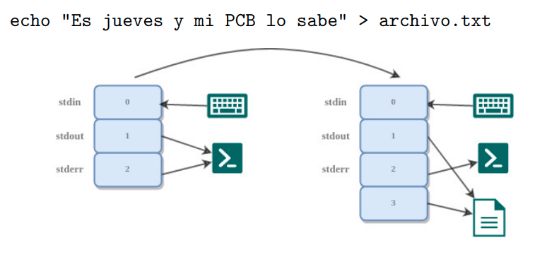
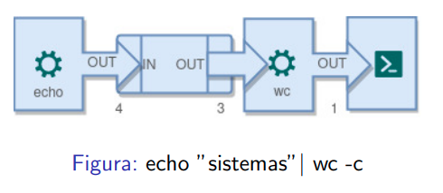
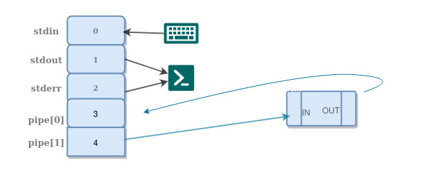
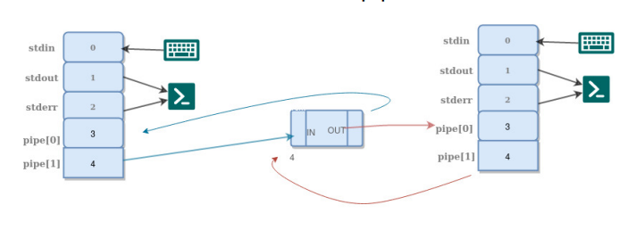
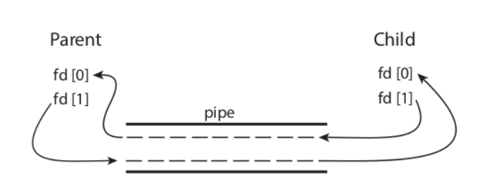

# Resumen para el primer parcial de SO

## Fork

Es la forma que tiene el sistema operativo de crear nuevos procesos.

```text
$ man fork

    fork - create a child process

    pid_t fork(void);

DESCRIPTION
    fork()  creates  a new process by duplicating the calling process.  The
    new process is referred to as the child process.  The  calling  process
    is referred to as the parent process.

    The child process and the parent process run in separate memory spaces.
    At the time of fork() both memory spaces have the same content.  Memory
    writes,  file  mappings (mmap(2)), and unmappings (munmap(2)) performed
    by one of the processes do not affect the other.

RETURN VALUE
    On success, the PID of the child process is returned in the parent, and
    0  is returned in the child.  On failure, -1 is returned in the parent,
    no child process is created, and errno is set appropriately.

...

NOTES
    Under Linux, fork() is implemented using copy-on-write  pages,  so  the
    only  penalty  that it incurs is the time and memory required to dupli‐
    cate the parent's page tables, and to create a  unique  task  structure
    for the child.
```

`fork` entonces crea un nuevo proceso. En el caso del creador (padre) se retorna
el PID del hijo, y en el caso del hijo retorna 0. Ejemplo:

```c
pid_t pid = fork();
if(pid == 0) {
    // soy el hijo
    child()
    exit(0)
}

// soy el padre y pid es el Process ID de mi hijo
```

### Otras funciones

- `int clone(...)`: Crea un nuevo proceso. Es usado en la implementacion de
  threads.
- `int execve(const char* filename, char* const argv[], char* const envp[])`:
  Sustituye la imagen de memoria del programa por la del programa ubicado en el
  `filename`.

- `pid_t vfork(void)`: Crea un hijo sin copiar la memoria del padre, pensado
  para que el hijo haga fork.

- `void exit(int status)`: Finaliza el proceso actual

### Esperar a que un proceso hijo termine

- `pid_t waitpid(pid_t pid, int *wstatus, int options);`: Suspende la ejecucion
  del proceso hasta que el hijo especificado por `pid` cambie de estado. Por
  defecto, espera solo a que los hijos terminen, pero se puede modificar
  mediante las options.

  `pid` puede ser:
  - `< - 1`: Espera a cualquier hijo cuyo process group ID sea igual al `pid`
  - `-1`: Espera a cualquier proceso hijo
  - `0`: Espera a cualquier hijo cuyo process group ID sea igual al `pid` del
    proceso que llamo la funcion.
  - `> 0`: Espera al proceso hijo con el process id igual a `pid`.

- `pid_t wait(int* status)`: Bloquea al padre hasta que algún hijo termine.
  Es equivalente a hacer `waitpid(-1, &status, 0);`

### Copy on write

Los procesos no comparten la memoria, cada uno cuenta con su espacio propio.
Entonces por ejemplo, si un proceso usa mucha memoria, podria llegar a ser
pesado copiar toda la memoria al nuevo cuando se haga `fork`.

Para evitar esto, en linux los procesos creados usando `fork` comienzan con sus
paginas de memoria apuntando a las mismas que el padre. Recien cuando alguien
escribe en esas paginas se hace la copia: **copy on write**.

## IPC - Inter Process Communication

### File Descriptors (FD)

Cada proceso tiene en su PCB una tabla con referencias a los archivos que tiene
abiertos. Un **file descriptor** es un indice de esa tabla.

Los FDs los usa el kernel para referenciar a los archivos abiertos que tiene
cada proceso. Cada entry en la tabla apunta a un archivo


Distintas entradas de file descriptor pueden apuntar al mismo archivo, pero
son *instancias de apertura* distintas.

### Modelo de flujo de comunicacion

Cada proceso tiene definida una entrada y salida estandar, y puede abstraerse
de donde y hacia donde se está escribiendo.

Por lo general los procesos esperan tener abiertos 3 **file descriptors**
(las entries 0, 1 y 2 de la tabla)

- 0 = `stdin` (standard input)
- 1 = `stdout` (standard output)
- 2 = `stderr` (standard error)

**Se heredan del proceso padre cuando se crea el hijo** con `fork`, y se
mantiene despues de la llamada a `execve`.

### Interaccion con archivos

Para escribir y leer de file descriptors,

- `ssize_t read(int fd, void *buf, size_t count);`
- `ssize_t write(int fd, const void *buf, size_t count);`
  
donde

- `fd` es el file descriptor.
- `buf` es el buffer al cual se leen o escriben datos.
- `count`: es la cantidad maxima de bytes a leer o escribir.

Ambas devuelven la cantidad de bytes leidos, -1 en caso de error.

Son **bloqueantes** por defecto, es decir, por ej. con el read hasta que no
encuentre información disponible se queda esperando. Esto se puede cambiar
mediante el uso de ciertos flags (`man 2 fcntl`)

### dup2

```bash
echo "Es jueves y mi PCB lo sabe" > archivo.txt
```

- Se llama al programa echo, que escribe su parámetro por **stdout**
- Con > se le indica a la consola que **stdout** se redirija a `archivo.txt`
- Cómo? Abre archivo.txt y hace que la entry de stdout apunte a el

La función `dup2(int oldfd, int newfd)` pisa el file descriptor en `newfd` el
contenido que está en `oldfd` (`man dup2`)

```text
$ man dup

    ...

    #include <unistd.h>

    int dup(int oldfd);
    int dup2(int oldfd, int newfd);

    ...

    The  dup()  system  call  creates  a copy of the file descriptor oldfd,
    using the lowest-numbered unused file descriptor for the  new  descrip‐
    tor.

    After a successful return, the old and new file descriptors may be used
    interchangeably.  They refer to the same  open  file  description  (see
    open(2)) and thus share file offset and file status flags; for example,
    if the file offset is modified by using lseek(2) on  one  of  the  file
    descriptors, the offset is also changed for the other.

    The two file descriptors do not share file descriptor flags (the close-
    on-exec flag).  The close-on-exec flag (FD_CLOEXEC; see  fcntl(2))  for
    the duplicate descriptor is off.

dup2()
    The  dup2() system call performs the same task as dup(), but instead of
    using the lowest-numbered unused file  descriptor,  it  uses  the  file
    descriptor number specified in newfd.  If the file descriptor newfd was
    previously open, it is silently closed before being reused.
```

#### Esquema de redireccion



### Pipes

```bash
echo "sistemas" | wc -c
```

- Se llama a `echo` que escribe por stdout
- `wc -c` cuenta los caracteres que entran por stdin
- Se conecta el stdout de echo con el stdin de wc -c mediante el pipe



Un pipe no es mas que un archivo que esta en memoria y actua como **buffer**
para leer y escribir de manera **secuencial**.

Los pipes tienen dos extremos, uno de lectura y uno de escritura, y se pueden
crear mediante la siguiente syscall

```c
int pipe(int pipefd[2])
```

- `pipefd[0]`: fd que apunta al extremo del pipe en el cual se **lee**
- `pipefd[1]`: fd del extremo en el que se **escribe**

#### Pipes en PCB

Al crearse, se agregan sus extremos a la tabla de file descriptors.



Y despues de hacer fork? Los file descriptors se copian, y siguen apuntando a
los mismos extremos del pipe.



#### Comunicacion entre procesos con pipes



Un proceso no puede acceder a un *pipe* anonimo que haya sido creado por un
proceso que no este vinculado a el, por lo tanto, requieren que los procesos que
se comunican sean descendientes del proceso que crea el pipe.

El proceso padre tambien lo puede usar para comunicarse con sus descendientes.

Mas de dos procesos pueden tener acceso al mismo pipe, pero a priori no hay
forma de saber cual proceso fue el que escribio en el, salvo que el contenido
escrito lo especifique.

El SO provee una forma segura de leer y escribir en un pipe de forma
concurrente: si se hacen varios writes desde distintos procesos a un mismo pipe,
si bien el orden no sera el mismo, aparecen los datos sin entrelazarse entre si.

## Sincronizacion

### Primitivas de sincronizacion

Semaforos, atomic

### Propiedades

#### Tipos

Contraejemplo: Sucesión de pasos que muestra una ejecución del sistema que viole
cierta propiedad.

- **safety**
  - Intuición: Nada malo sucede
  - Nunca pasan cosas que no queremos que pasen"
  - Ejemplos: Mutex, ausencia de deadlock, no perdida de mensajes, etc.
  - Definición: Tienen un *contraejemplo finito*
- **progreso** o **liveness**
  - Intuición: En algun momento algo bueno si va a suceder
  - El sistema progresa, suceden cosas, el sistema no se queda bloqueado.
  - Ejemplos: "Si se presiona el botón de stop, el tren frena", no inanición.
  - Definición: Los contraejemplos no son finitos (una secuencia infinita de
    pasos).
- **fairness**
  - Intuición: Los procesos reciben su turno con infinita frecuencia.
  - "No se van a dar escenarios poco realistas en donde alguien es postergado
    para siempre"

#### Modelo de proceso

TODO

#### WAIT-FREEDOM

Todo proceso que intenta acceder a la sección crítica, en algún momento lo
logra, cada vez que lo intenta.

Para todo proceso, si está en un estado TRY, habrá un momento posterior en el
que estará en CRIT.

Intuicion: Libre de procesos que esperan para siempre.

#### FAIRNESS - Equanimidad

.

#### EXCL - Exclusión Mutua

Para toda ejecución y estado, no puede haber más de un proceso i que esté en el
mismo punto en el tiempo en CRIT.

#### LOCK-FREEDOM - Progreso

Para toda ejecución y estado, si hay un proceso en TRY, y ninguno en CRIT,
entonces hay un estado posterior tal que algún proceso está en CRIT.

#### DEADLOCK/LOCKOUT/STARVATION-FREEDOM - Progreso global dependiente

IN: Si está en try, en algún momento está en crit
OUT: Si está en crit, en algún momento sale

Para toda ejecución, si para todo estado y proceso i que está en crit, existe un
estado tal que sale, entonces para todo estado posterior y todo proceso
diferente, si intenta de entrar existe un estado para el cual entra.

Que todos salgan implican que todos van a entrar en algún momento.

#### WAIT-FREEDOM - Progreso global absoluto

Todo proceso entra a la sección crítica

$WAIT-FREEDOM \equiv \forall i \square IN(i)$

## Memoria

TODO