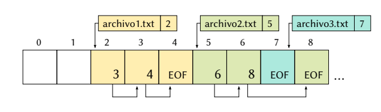

# Resumen para 2p So

## File systems

Fuentes: videos de rodo

### Definiciones

- Un **archivo** es un conjunto de datos relacionados entre si. Incluye *datos*
  y *metadatos* (datos que describen al archivo en si, como por ejemplo
  propietario, permisos, etc). Es la unidad mínima de almacenamiento secundario
  para el usuario.

- Un **sistema de archivos** permite administrar y ordenar los archivos. La   diferencia entre uno y otro esta en la estructura de datos que se utilizan

- Las lecturas y escrituras a un medio de almacenamiento se hacen en unidades llamadas **bloques**, que pasa a ser la unidad minima de almacenamiento. No los bytes.

  Los bloques son *lógicos*, pero tienen que ver con las caracteristicas del hardware subyacente, como por ejemplo los sectores de un disco.

  Cada archivo ocupa una cantidad entera de bloques, lo cual lleva a fragmentación interna.

### Asignación

Como **asignar** los bloques a los diferentes archivos

#### Contigua

es la forma mas naive, pero puede llevar a fragmentación externa: teniendo el espacio disponible no se le puede asignar a un bloque por estar fragmentado.

Ejemplo

Se asignan bloques contiguos a los archivos 1, 2 y 3.

Se desaloja el archivo 2, y ahora hay espacio para un archivo de 4 bloques, pero no contiguo.

#### FAT

**Referencia**: Cada bloque dice cual es el siguiente del archivo, una lista enlazada. Y en el final, el ultimo nodo marca el final del archivo. Una versión tuneada de esto es **FAT** (*File Allocation Table*), tiene una tabla de asignación de archivos. Cada bloque guarda al siguiente, y finaliza en un EOF.

O FAT, es una tabla que tiene una entrada para cada bloque de disco. Si tengo un disco con 1000 bloques, necesito 1000 entradas.

Si tengo un archivo que inicia en la posicion 5, voy a la entrada 5, que indica cual es el siguiente, y así hasta llegar a `EOF` que tambien esta indicado en la tabla.

- Cual es el bloque siguiente del archivo al cual pertenece el bloque
- Si el bloque es el ultimo de un archivo
- Si el bloque está vacío

El sistema necesita la data adicional para saber donde inician los archivos.

Por ejemplo el archivo 2, no necesariamente tienen que estar contiguos en memoria, incluso podria haber un archivo con un solo bloque.

Problemas:

- Cuando el acceso a los bloques no es secuencial, se vuelve menos eficiente.
- Requiere tener *toda* la tabla cargada en memoria siempre

Ejemplos: FAT, FAT16, FAT32

#### Inodos

Se mantienen **indexados** todos los bloques de cada archivo. Tener para cada archivo una lista de punteros a todos sus bloques.

Me traigo solo los bloques asociados a cada archivo.

En los sistemas UNIX, estas estructuras se llaman **inodos**.

Ejemplos: UFS, ext2, ext3, ext4

En un sistema con **inodos**, a cada archivo le corresponde una de estas estructuras.

- Metadatos: Datos descriptivos del propio archivo
- Punteros: A los bloques de datos. Los datos no estan en el inodo

#### Punteros con indireccion

Es deseable que tengan un tamaño fijo, y los primeros bloques de un archivo suelen ser accedidos con más frecuencia. Para archivos mas grande se usan **punteros con indirección**

- Indireccion simple: Apunta a un inodo
- Indireccion doble: Tiene dos niveles de punteros
- Indireccion triple: Tiene punteros a bloques de indirecciones dobles

Este arbol según la necesidad permite abarcar una mayor cantidad de bloques.

#### Estructura interna

Pero donde están los inodos? En un fs ext2, los bloques del disco están divididos en **grupos** contiguos

Cada grupo contiene bloques de **datos** y bloques de **inodos**

- Reservado: para que arranque el sistema. Si tengo mas de un fs no necesariamente en todos va a estar ocupado.
- Se agrupan los bloques para tener redundancia de ciertos datos, y conseguir los archivos con mayor facilidad.
- **Super bloque**: Tiene la descripción de todo el sistema de archivos en general. Se copia varias veces de forma redundante en cada grupo. A partir de ahi empieza la info personal de cada grupo
- Descriptor de grupo: Dan información del grupo
  - archivos asignados
  - inodos disponibles
  - espacio disponible
  - etc.
- Bitmaps: De bloques de datos y de inodos. Indica rápido que bloques de inodos y datos están disponbiles.
- Tabla de inodos: Es donde están almacenados los inodos que apuntan a los bloques de datos almacenados más adelante.

Todo el disco esta de esa forma. Los inodos están repartidos a lo largo de todo el disco. A cada inodo no le corresponde a un bloque, en un único bloque puede haber más de un inodo. Suelen ser mucho mas grandes los bloques que los inodos.

### Directorios

Contienen dentro los archivos. Y como sabemos a partir de el nombre de un archivo (el nombre completo, con `/`s) que bloques ocupa? **directorios**

Los directorios **también son archivos**, son una tabla con una entrada por cada archivo que contienen, indicando su nombre y posición donde comienzan.

Un directorio puede tener subdirectorio, y de esa forma podemos organizar a los archivos de forma *jerárquica*, mediante un arbol (en realidad un grafo) de directorios.

#### En FAT

En FAT32, los directorios

- Indican el indice del **primer bloque** de cada archivo
- Contienen todos los **metadatos**: nombre, tamaño, fecha de ultimo acceso, etc.
- El bloque del directorio **root** es distinguido, tiene una posición especial, y de esa forma podemos encontrar cualquier ruta partiendo desde la raiz.

#### En ext2

Los directorios,

- Solo contienen el **nombre** de cada archivo y el índice de su inodo, ya que los metadatos están en cada uno.
- Como los directorios son archivos, también les corresponde un inodo a cada uno
- Al igual que en FAT, el directorio root está en una posición distinguida: es siempre el inodo número 2.

### Links (enlaces)

En los sistemas con inodos, el nombre de los archivos no aparece en los inodos.

#### Hard link

De esa forma, se puede referenciar el mismo inodo con diferentes nombres desde más de un directorio, conocido como **hard link** (*enlace duro* o *físico*)

- Uno de los metadatos que tiene es la cantidad de enlaces duros del inodo.

Se pueden crear con `ln`.

Los links duros no se pueden hacer entre sistemas de archivos, porque un hard link solamente es un numero de inodo, y se podria confundir.

#### Symbolic links

O *links simbólicos*. Permiten tener enlaces que vayan más allá del fs actual.

Se crean con `ls -s`

De fondo se crea otro inodo, y dentro de el se guarda la entrada de directorio que apunta a la entrada de ese archivo. Pero esa dirección podría ser tranquilamente la de otro sistema de archivos.

### Recuperando un archivo en FAT

Y ext2 se hace en el taller

