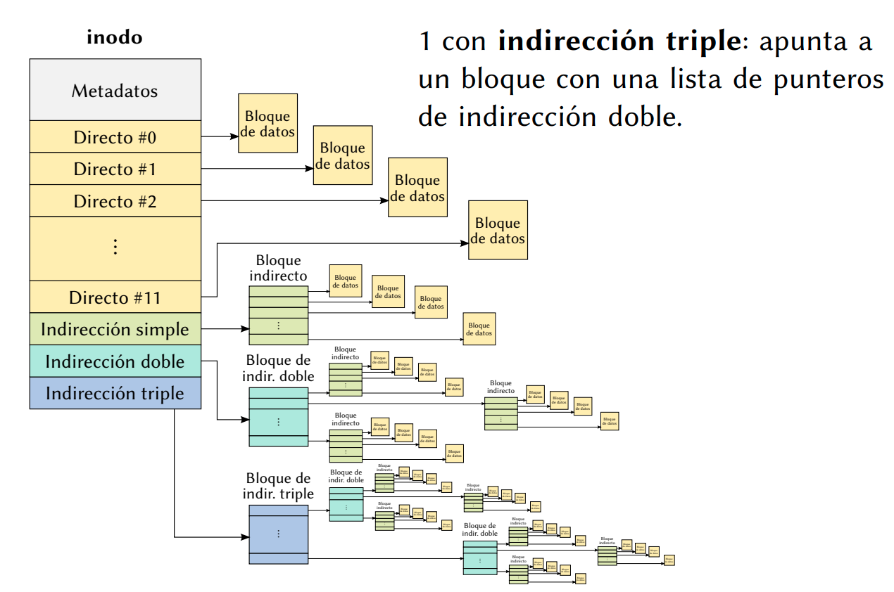
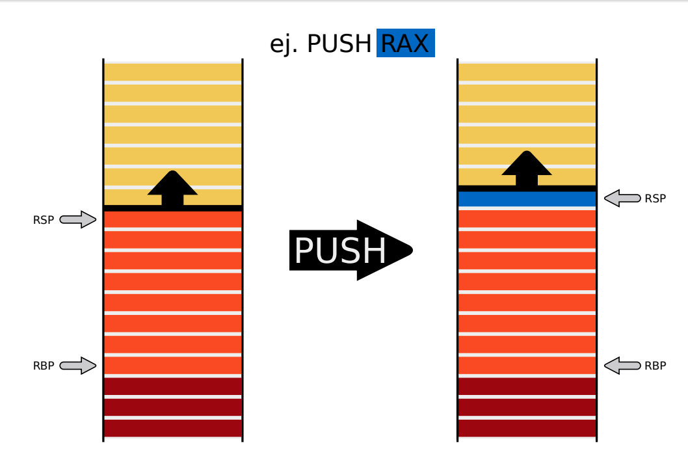

# Resumen para 2p So

## TOC

- [Resumen para 2p So](#resumen-para-2p-so)
  - [TOC](#toc)
  - [E/S](#es)
    - [Copias de seguridad](#copias-de-seguridad)
    - [Redundancia - RAID](#redundancia---raid)
      - [RAID 0 (Data Striping, Striped Volume)](#raid-0-data-striping-striped-volume)
      - [RAID 1 (Mirror)](#raid-1-mirror)
      - [RAID 4](#raid-4)
      - [RAID 5](#raid-5)
      - [RAID 5E](#raid-5e)
      - [RAID anidados](#raid-anidados)
    - [Drivers](#drivers)
      - [Tipos de dispositivos](#tipos-de-dispositivos)
      - [API](#api)
      - [Desarrollo](#desarrollo)
      - [Cosas generales a tener en cuenta](#cosas-generales-a-tener-en-cuenta)
      - [Ejemplo: Robot](#ejemplo-robot)
        - [Software](#software)
        - [Kernel](#kernel)
        - [driver_write naive](#driver_write-naive)
        - [Interrupciones](#interrupciones)
  - [File systems](#file-systems)
    - [Definiciones](#definiciones)
    - [Asignación](#asignación)
      - [Contigua](#contigua)
      - [FAT](#fat)
      - [Inodos](#inodos)
      - [Punteros con indireccion](#punteros-con-indireccion)
      - [Estructura interna](#estructura-interna)
    - [Directorios](#directorios)
      - [En FAT](#en-fat)
      - [En ext2](#en-ext2)
    - [Links (enlaces)](#links-enlaces)
      - [Hard link](#hard-link)
      - [Symbolic links](#symbolic-links)
    - [Recuperando un archivo en FAT](#recuperando-un-archivo-en-fat)
  - [Seguridad](#seguridad)
    - [Problemas de seguridad](#problemas-de-seguridad)
    - [Ejemplo](#ejemplo)
    - [Tipos de impacto](#tipos-de-impacto)
    - [Exploit](#exploit)
    - [Tipos de vulnerabilidades clasicas](#tipos-de-vulnerabilidades-clasicas)
    - [Buffer overflow](#buffer-overflow)
    - [Format String](#format-string)
    - [Mecanismos de proteccion](#mecanismos-de-proteccion)
  - [Distribuidos](#distribuidos)
    - [Arquitecturas sync cliente/servidor](#arquitecturas-sync-clienteservidor)
      - [RPC - Remote Procedure Calls](#rpc---remote-procedure-calls)
    - [Mecanismos async](#mecanismos-async)
    - [Pasaje de mensajes](#pasaje-de-mensajes)
    - [Locks en entornos distribuidos](#locks-en-entornos-distribuidos)
      - [Coordinador](#coordinador)
      - [Sincronizacion](#sincronizacion)
    - [Orden parcial entre eventos](#orden-parcial-entre-eventos)
    - [Acuerdo bizantino](#acuerdo-bizantino)
    - [Problemas y algoritmos](#problemas-y-algoritmos)
      - [Modelo de fallas](#modelo-de-fallas)
      - [Complejidad](#complejidad)
    - [Exclusion mutua distribuida](#exclusion-mutua-distribuida)
      - [Token passing](#token-passing)
      - [Otra alternativa](#otra-alternativa)
      - [Locks - protocolo de mayoria](#locks---protocolo-de-mayoria)
      - [Eleccion de lider](#eleccion-de-lider)
      - [Instantanea (snapshot) global consistente](#instantanea-snapshot-global-consistente)
      - [2PC (Two Phase Commit)](#2pc-two-phase-commit)
  - [Anexo - Repaso de Orga2](#anexo---repaso-de-orga2)
    - [Pila](#pila)
      - [Push y pop](#push-y-pop)
      - [Alineacion](#alineacion)
    - [Convencion C](#convencion-c)
      - [32 bits](#32-bits)
      - [64 bits](#64-bits)

## E/S

### Copias de seguridad

Hacer un backup consiste en resguardar todo lo importante en otro lado.

Pero copiar todos los datos puede llegar a ser muy costoso.

Estrategia de backup:

- Cada tanto hacer una copia total
- Todas las noches una *incremental*: solo los modificados desde la ultima incremental
- O una *diferencial*: solo los modificados desde la ultima copia total.

Luego, para restaurar

- Si solo hago copias totales, tomo la del dia correspondiente y listo
- Si hago diferenciales, necesito la ultima total mas la ultima diferencial

  Hoy = Ultimo total + ultimo dif

- Si hago incrementales, necesito la ultima total y todas las incrementales
  entre esa copia total y la fecha requerida.

  Hoy = Ultimo total + $\sum_i Incremental_i$

### Redundancia - RAID

A veces una copia de seguridad no alcanza, el costo de que el sistema salga de
linea es muy alto. Entonces conviene implementar *redundancia*

Fuentes:

- [Wikipedia](https://es.wikipedia.org/wiki/RAID)

**RAID**: *Redundant Array of Independent Disks* es un sistema de almacenamiento
de datos que utiliza multiples unidades (discos duros o SSDs) entre las cuales
se distribuyen o replican los datos.

Pueden estar configurados en varios niveles, los cuales se diferencian en su
integridad, tolerancia frente a fallos, tasa de transferencia y capacidad.

Todas las implementaciones pueden soportar el uso de uno o mas *hot spares*
(discos de reserva). Que son unidades preinstaladas que pueden usarse
inmediatamente tras el fallo de un disco raid.

**Para el marco del parciar hay que saber RAID 0, 1, 4, y 5.** (segun ffrizo)

#### RAID 0 (Data Striping, Striped Volume)


Un RAID 0 distribuye los datos equitativamente entre dos o mas discos, sin
informacion de paridad que proporcione redundancia.

Se usa para dar alto rendimiento de escritura, ya que se escriben en dos o mas
discos de forma paralela.

Se puede usar con discos de diferentes tamaños, pero el espacio añadido al
conjunto esta limitado por el tamaño del disco mas chico (ej. 450GB y otro de
100GB, el tamaño resultante es de 200GB, cada disco aporta 100GB).

La probabilidad de fallo es inversamente proporcional al numero de discos del
conjunto, pues para que falle es suficiente que lo haga *cualquiera* de los
discos.

#### RAID 1 (Mirror)


Crea una copia exacta (o espejo) de un conjunto de datos en dos o mas discos.

Es util cuando queremos mas seguridad pero desaprovechando capacidad, ya que si
perdemos un disco, tenemos al otro con la misma informacion.

Un conjunto RAID 1 solo puede ser tan grande como el mas pequeño de sus discos.

La fiabilidad incrementa exponencialmente con respecto a un solo disco, ya que
la probabilidad de fallo es el producto de la de cada disco, pues para que falle
tienen que fallar todos.

El rendimiento de lectura incrementa de forma lineal con respecto al numero de
copias. Un RAID 1 puede estar leyendo al mismo tiempo dos datos diferentes en
dos discos diferentes.

#### RAID 4


Acceso independiente con discos dedicados a la paridad

Usa division a nivel de bloques con un disco de paridad dedicado. Necesita al
menos 3 discos fisicos.

Es parecido a RAID 3 excepto porque divide a nivel de bloques en vez de bytes,
lo cual permite que cada miembro del conjunto funcione independientemente cuando
se solicita un unico bloque.

Si la controladora de disco lo permite, un conjunto RAID 4 puede servir varias
peticiones de lectura simultaneamente.

#### RAID 5


Distribuido con paridad.

Es una divison de datos a nivel de bloques, que distribuye la info de paridad
entre todos los discos miembros del conjunto. Genenralmente se implementass con
soporte de hardware para el calculo de paridad.

Necesita un minimo de 3 discos para ser implementado.

En el ejemplo, una peticion de lectura de A1 seria servida por el disco 0, y una
simultanea en el bloque B1 tendria que esperar, pero del bloque B2 podria ser
atendida concurrentemente ya que seria realizada por el disco 2.

Cada vez que se escribe un bloque de datos, se genera un bloque de paridad
dentro de la misma division (stripe). Una serie de bloques (un bloque de cada
uno de los discos en conjunto) se le llama *stripe* o division. Si otro bloque,
o alguna porcion de un bloque, es escrita en ea misma division, el bloque de
paridad es recalculado y vuelto a escribir.

Los bloques de paridad se leen durante lecturas cuando alguna produce un error
de CRC (error de verificacion de redundancia). El sector en la misma posicion
relativa dentro de cada bloque de datos restantes en la divison y dentro del
bloque de paridad se usan para reconstruir el sector erroneo, ocultando asi el
error del resto del sistema.

Si falla un disco entero del conjunto, los bloques de paridad de los discos
restantes son combinados con los bloques de datos para reconstruir los datos del
disco que fallo. **Pero si falla un segundo disco, provoca la perdida completa
de los datos**

#### RAID 5E


Variante de RAID que incluye discos de reserva, los cuales pueden estar
conectados y preparados (*hot spare*) o en espera (*standby spare*). No supunen
mejora en rendimiento, pero minimizan el tiempo de reconstruccion y la
administracion necesaria ante fallos.

#### RAID anidados

Si lo toman, ver en wikipedia

- **RAID 0+1**: Espejo de divisiones
- **RAID 1+0**: Divison de espejos
- **RAID 30**: Divison de niveles RAID con paridad dedicada
- **RAID 100**: Division de divison de espejos
- **RAID 10+1**: Espejo de espejos

### Drivers

El driver es parte del SO a efectos practicos. Corre en espacio de kernel.


- **Controlador del dispositivo**: Es un software que corre dentro del
  dispositivo, es parte del hardware. y hasta podria estar implementado en HW.

- **Driver**: es una pieza de software que conoce muy bien el kernel donde esta
  instalado y el dispositivo

  Traduce el `open`, `read`, `write` que hace el usuario, a poner en tal
  registro tal bit, etc. Permiten brindarle al soft de usuario una interfaz
  unificada para dispositivos distintos.

#### Tipos de dispositivos

- **char device**: A los que escribis y lees como si fuera un stream de datos
  Por ejemplo un teclado.
- **block device**: Das una direccion y vas y lees en esa direccion, o escribis

#### API

Un *driver* debe implementar los siguientes procedimientos para poder ser
cargado por un SO (de forma muy simplificada):

- `int driver_init()`: Invocada durante la carga del SO
- `int driver_open()`: Invocada al solicitarse un *open*
- `int driver_close()`: Invocada al solicitarse un *close*
- `int driver_read(int* data)`: Invocada al solicitarse un *read*
- `int driver_write(int* data)`: Invocara al solicitarse un *write*
- `int driver_remove()`: Invocada durante la descarga del SO

Carga y descarga: en gral el driver se considera como parte del sistema
operativo.

#### Desarrollo

Como driver hay que asumir responsabilidad de kernel, entre ellas garantizar la
seguridad de los datos.

Nunca hacer wait de un semaforo en un handler de interrupcion, porque un
deadlock en kernel es irrecuperable.

Definir todo como `static`! hace que quede en una pos fija de memoria, en la
seccion de codigo.

Todo lo que se hace en el init se debe deshacer cuando se saca.

#### Cosas generales a tener en cuenta

- Los drivers corren dentro del contexto de un proceso, por lo que pueden
  acceder a sus datos.

- Seguridad: Hay que tener cuidado con los punteros que nos pasa el usuario,
  y hacer las validaciones correspondientes. No deberiamos leer y escribir en
  cualquier lado. Usar `copy_from_user()` y `copy_to_user()`

- Concurrencia: Muchos procesos pueden tener abierto el driver a la vez. Hay que
  tenerlo en cuenta porque sino resulta en horribles race conditions.

- La inicializacion de primitivas de sync, y las estructuras de datos que
  requiere el driver se hacen en `driver_init()`. Hay que recordar hacer el
  *cleanup* en `driver_remove()`.

- Como no se linkea contra bibliotecas, solo se pueden usar funciones que sean
  parte del kernel.

#### Ejemplo: Robot

Fuente: [Clase de Franco de drivers](https://campus.exactas.uba.ar/pluginfile.php/194922/mod_resource/content/1/drivers-slides.pdf)

Robot que permite localizar y obtener cajas en un deposito.

Registros

- `LOC_TARGET`
- `LOC_CTRL`
- `LOC_STATUS`

Operacion

- Cuando se le ingresa un codigo en el registro `LOC_TARGET` y la constante
  `START` en el registro `LOC_CTRL`, el robot comienza la operación de búsqueda,
  escribiendo `BUSY` en `LOC_STATUS`

- Al encontrar la caja, escribe en los registros
  - `LOC_CTRL = JOYA`
  - `LOC_STATUS = READY`
- Si no la puede encontrar, escribe
  - `LOC_CTRL = BAJON`
  - `LOC_STATUS = READY`

En todos los casos, el contenido de `LOC_TARGET` se mantiene hasta que se vuelva
a escribir otro valor.

##### Software

Codigo que viene con el robot

```c
int main (int argc, char *argv[]) {
  int robot = open("/dev/chinbot", "w");  // open device
  int codigo;
  int resultado;
  while (1) {
    printf("Ingrese el código de la caja\n");
    scanf ("%d", &codigo);
    resultado = write(robot, codigo);     // write on device
    if (resultado == 1) {
      printf("Su orden ha llegado\n");
    } else {
      printf("No podemos encontrar su caja %d\n", codigo);
    }
  }
}
```

Es un char device.

##### Kernel

Para la programación del driver se dispone de estas syscalls

- `void OUT(int IO_address, int data)`: Escribe `data` en el registro de E/S
- `int IN(int IO_address)`: Devuelve el valor del registro de E/S
- `int request_irq(int irq, void* handler)`: Asocia `handler` a la int. `irq`
  Devuelve `IRQ_ERROR` si ya esta saociada a otro handler.
- `int free_irq(int irq)`: Libera la int IRQ del handler asociado.

##### driver_write naive

```c
int driver_write(void* data) {
  OUT(LOC_TARGET, *data);
  OUT(LOC_CTRL, START);

  while (IN(LOC_STATUS) != BUSY) {}     // busy waiting
  while (IN(LOC_STATUS) != READY) {}    // busy waiting

  resultado = IN(LOC_CTRL);
  if (resultado == JOYA)
    return 1;
  else if (resultado == BAJON)
    return 0;
  
  return -1;
}
```

**Problema**: se lee el puntero devuelto por el usuario y se escribe en el
registro asi nomas, y podria tener cualquier cosa. Podria estar leyendo tambien
una posicion de memoria que no le corresponde, ya que nosotros estamos desde el
kernel, no se validan esas cosas.

**Solución**: copiar los datos del usuario a otro buffer, validando permisos
en el proceso.

```c
int driver_write(void* data) {
  // Copio los datos que me pasa usuario
  int codigo;
  copy_from_user(&codigo, data, sizeof(int));

  OUT(LOC_TARGET, codigo);
  OUT(LOC_CTRL, START);

  while (IN(LOC_STATUS) != BUSY) {}     // busy waiting
  while (IN(LOC_STATUS) != READY) {}    // busy waiting

  resultado = IN(LOC_CTRL);
  if (resultado == JOYA)
    return 1;
  else if (resultado == BAJON)
    return 0;
  
  return -1;
}
```

**Problema**: podria haber mas de un proceso con el driver en open solicitando
write a la vez, lo cual podria llevar a condiciones de carrera

**Solución**: good ol' mutex

```c
int driver_write(void* data) {
  // Copio los datos que me pasa usuario
  int codigo;
  copy_from_user(&codigo, data, sizeof(int));

  mutex.lock();   // inicia CRIT

  OUT(LOC_TARGET, codigo);
  OUT(LOC_CTRL, START);

  while (IN(LOC_STATUS) != BUSY) {}     // busy waiting
  while (IN(LOC_STATUS) != READY) {}    // busy waiting

  resultado = IN(LOC_CTRL);

  mutex.unlock(); // finaliza CRIT

  if (resultado == JOYA)
    return 1;
  else if (resultado == BAJON)
    return 0;
  
  return -1;
}
```

##### Interrupciones

El driver hasta ahora está implementado con polling, pero el dispositivo tiene
soporte para interrupciones, como bien figura en su manual:

> “Robot es compatible con el acceso de interrupción.
> Se selecciona este modo, una operación terminada
> `CHINBOT_INT` interrupción lanzará.”

```c
mutex acceso;
semaforo listo;
bool esperando;

int driver_init() {
  acceso = mutex_create();
  listo = semaforo_create(0);
  esperando = false;
  irq_register(CHINBOT_INT, handler);
}

void handler() {
  // Es necesario chequear que esté esperando, ya que de no estarlo,
  // podria signalearse el semaforo mientras no lo este utilizando
  // este proceso. Lo cual llevaria a que luego se tome como ready
  // instantaneamente cuando podria no estarlo.
  if (esperando && IN(LOC_STATUS) == READY) {
    esperando = false;
    listo.signal();
  }
}

int driver_write(void* data) {
  int codigo;
  copy_from_user(&codigo, data, sizeof(int));

  acceso.lock();
  OUT(LOC_TARGET, codigo);
  OUT(LOC_CTRL, START);

  esperando = true;
  listo.wait();

  resultado = IN(LOC_CTRL);
  acceso.unlock();

  if (resultado == JOYA)
    return 1;
  else if (resultado == BAJON)
    return 0;

  return -1;
}
```

## File systems

Fuentes

- [Diapos y videos de rodo](https://campus.exactas.uba.ar/pluginfile.php/200994/mod_resource/content/1/ClaseComplementariaFS.pdf)

### Definiciones

- Un **archivo** es un conjunto de datos relacionados entre si. Incluye *datos*
  y *metadatos* (datos que describen al archivo en si, como por ejemplo
  propietario, permisos, etc). Es la unidad mínima de almacenamiento secundario
  para el usuario.

- Un **sistema de archivos** permite administrar y ordenar los archivos. La   diferencia entre uno y otro esta en la estructura de datos que se utilizan

- Las lecturas y escrituras a un medio de almacenamiento se hacen en unidades llamadas **bloques**, que pasa a ser la unidad minima de almacenamiento. No los bytes.

  Los bloques son *lógicos*, pero tienen que ver con las caracteristicas del hardware subyacente, como por ejemplo los sectores de un disco.

  Cada archivo ocupa una cantidad entera de bloques, lo cual lleva a fragmentación interna.

### Asignación

Como **asignar** los bloques a los diferentes archivos

#### Contigua

es la forma mas naive, pero puede llevar a fragmentación externa: teniendo el espacio disponible no se le puede asignar a un bloque por estar fragmentado.

Ejemplo

Se asignan bloques contiguos a los archivos 1, 2 y 3.


Se desaloja el archivo 2, y ahora hay espacio para un archivo de 4 bloques, pero no contiguo.


#### FAT

**Referencia**: Cada bloque dice cual es el siguiente del archivo, una lista enlazada. Y en el final, el ultimo nodo marca el final del archivo. Una versión tuneada de esto es **FAT** (*File Allocation Table*), tiene una tabla de asignación de archivos. Cada bloque guarda al siguiente, y finaliza en un EOF.

Una tabla de **asignación de archivos**, **FAT**, es una tabla que tiene una
entrada para cada bloque de disco.
Si tengo un disco con 1000 bloques, necesito 1000 entradas.

Si tengo un archivo que inicia en la posicion 5, voy a la entrada 5, que indica cual es el siguiente, y así hasta llegar a `EOF` que tambien esta indicado en la tabla.

En la tabla se indica:

- Cual es el bloque siguiente del archivo al cual pertenece el bloque
- Si el bloque es el ultimo de un archivo
- Si el bloque está vacío

El sistema necesita la data adicional para saber donde inician los archivos.


Por ejemplo el archivo 2, no necesariamente tienen que estar contiguos en memoria, incluso podria haber un archivo con un solo bloque.

Problemas:

- Cuando el acceso a los bloques no es secuencial, se vuelve menos eficiente.
- Requiere tener *toda* la tabla cargada en memoria siempre

Ejemplos: FAT, FAT16, FAT32

#### Inodos

Se mantienen **indexados** todos los bloques de cada archivo. Tener para cada archivo una lista de punteros a todos sus bloques.

Me traigo solo los bloques asociados a cada archivo.

En los sistemas UNIX, estas estructuras se llaman **inodos**.

Ejemplos: UFS, ext2, ext3, ext4


En un sistema con **inodos**, a cada archivo le corresponde una de estas estructuras.

- Metadatos: Datos descriptivos del propio archivo
- Punteros: A los bloques de datos. Los datos no estan en el inodo

#### Punteros con indireccion

Es deseable que tengan un tamaño fijo, y los primeros bloques de un archivo suelen ser accedidos con más frecuencia. Para archivos mas grande se usan **punteros con indirección**



- Indireccion simple: Apunta a un inodo
- Indireccion doble: Tiene dos niveles de punteros
- Indireccion triple: Tiene punteros a bloques de indirecciones dobles

Entonces, hay

- **12 directos**: que apuntan directamente a un bloque de datos
- 1 con **indireccion simple**: que apunta a un bloque con una lista de punteros
  a bloques de datos.
- 1 con **indireccion doble**: apunta a un bloque con una lista de punteros de
  indireccion simple.
- 1 con **indireccion triple**: apunta a un bloque con una lista de punteros de
  indireccion doble.

Este arbol según la necesidad permite abarcar una mayor cantidad de bloques.

#### Estructura interna

Pero donde están los inodos? En un fs ext2, los bloques del disco están
divididos en **grupos** contiguos. Los inodos estan repartidos a lo largo de
todo el disco.


Cada grupo contiene bloques de **datos** y bloques de **inodos**.
A cada inodo **no** le corresponde un bloque. En un bloque **puede haber varios
inodos** y suelen ser mucho mas grandes los bloques que los inodos.

- Reservado: para que arranque el sistema. Si tengo mas de un fs no necesariamente en todos va a estar ocupado.
- Se agrupan los bloques para tener redundancia de ciertos datos, y conseguir los archivos con mayor facilidad.
- **Super bloque**: Tiene la descripción de todo el sistema de archivos en general. Se copia varias veces de forma redundante en cada grupo. A partir de ahi empieza la info personal de cada grupo
- Descriptor de grupo: Dan información del grupo
  - archivos asignados
  - inodos disponibles
  - espacio disponible
  - etc.
- Bitmaps: De bloques de datos y de inodos. Indica rápido que bloques de inodos y datos están disponbiles.
- Tabla de inodos: Es donde están almacenados los inodos que apuntan a los bloques de datos almacenados más adelante.

### Directorios

Contienen dentro los archivos. Y como sabemos a partir de el nombre de un archivo (el nombre completo, con `/`s) que bloques ocupa? **directorios**

Los directorios **también son archivos**, son una tabla con una entrada por cada
archivo que contienen, indicando su nombre y posición donde comienzan en el disco.

Un directorio puede tener subdirectorio, y de esa forma podemos organizar a los archivos de forma *jerárquica*, mediante un arbol (en realidad un grafo) de directorios.

#### En FAT

En FAT32, los directorios

- Indican el indice del **primer bloque** de cada archivo
- Contienen todos los **metadatos**: nombre, tamaño, fecha de ultimo acceso, etc.
- El bloque del directorio **root** es distinguido, tiene una posición especial, y de esa forma podemos encontrar cualquier ruta partiendo desde la raiz.


#### En ext2

Los directorios,

- Solo contienen el **nombre** de cada archivo y el índice de su inodo, ya que los metadatos están en cada uno.
- Como los directorios son archivos, también les corresponde un inodo a cada uno
- Al igual que en FAT, el directorio root está en una posición distinguida: es siempre el inodo número 2.

### Links (enlaces)

En los sistemas con inodos, el nombre de los archivos no aparece en los inodos.

#### Hard link

De esa forma, se puede referenciar el mismo inodo con diferentes nombres desde más de un directorio, conocido como **hard link** (*enlace duro* o *físico*)


- Uno de los metadatos que tiene es la cantidad de enlaces duros del inodo.

Se pueden crear con `ln`.

Los links duros no se pueden hacer entre sistemas de archivos, porque un hard link solamente es un numero de inodo, y se podria confundir.

#### Symbolic links

O *links simbólicos*. Permiten tener enlaces que vayan más allá del fs actual.

Se crean con `ln -s`

De fondo se crea otro inodo, y dentro de el se guarda la entrada de directorio que apunta a la entrada de ese archivo. Pero esa dirección podría ser tranquilamente la de otro sistema de archivos.


### Recuperando un archivo en FAT

Y ext2 se hace en el taller


## Seguridad

### Problemas de seguridad

Hay bugs comunes, y bugs de seguridad. La diferencia es que los últimos son
aquellos que exponen **más funcionalidad** o distinta al usuario que la que
el programa dice tener.

### Ejemplo

```c
# include <stdio .h>

int main (int argc, char* argv []) {
  char nombre[80];

  printf("Ingrese su nombre: ");
  gets(nombre);
  printf("Hola , %s!\n", nombre);

  return 0;
}
```

Dos preguntas que uno siempre debe hacerse desde un punto de vista de seguridad

1. Que controla el usuario?
2. Que informacion sensible hay ahi?

Ej: Para un programa **correcto**, deberiamos responder

1. El contenido del buffer `nombre`
2. Nada

Ej: Para un programa **incorrecto*

1. El contenido del buffer `nombre` y todas las posiciones de memoria siguientes
2. Todos los datos guardados en la pila por las llamadas anteriores.

Problema particular, antes de llamar a la funcion `gets`


El usuario controla toda la pila antes de nombre (las posiciones mas altas, las
partes mas bajas de la tabla). En particular, el return address. Luego controla
que se ejecutará cuando main termine con return.

### Tipos de impacto

- **Escalado de privilegios**: Ejecutar con un usuario de mayor privilegio
- **Autenticacion indebida**: Ingresar a la sesion de un usuario que no nos
  corresponde, sin necesariamente saber las credenciales.
- **Denial of Service**: Deshabilitar el uso del servicio para terceros.
- **Obtencion de datos privados**: Base de datos de clientes, PANes, etc.

### Exploit

Un **exploit** es un fragmento de código que utiliza la funcionalidad oculta del
programa vulnerable. Se dice que **explota la vulnerabilidad**

### Tipos de vulnerabilidades clasicas

- **Buffer Overflow**
- **Integer Overflow**

  Ocurre cuando un valor entero se pasa de tamaño de la variable donde se está
  almacenando, y no es un problema de seguridad en si mismo, pero puede ser
  usaden combinacion con otros.

- **Format String**

### Buffer overflow

Codigo | Desensamblado
------ | -------------
 | 

La dirección de nombre dentro de la funcion es `ebp-0x58`

Debemos pasar entonces como entrada un buffer con la siguiente forma:

- 80 bytes cualquiera para llenar el buffer
- 8 bytes que se escriben sobre ???
- 4 bytes que se escriben sobre el valor de ebp.
- 4 bytes que pisan el return address

`gets` deja de leer con un EOL o EOF.


Ya controlamos `eip`, por lo que podemos saltar a donde queramos. Opciones

1. Saltar a nuestro propio buffer

   Ponemos como return address una direccion dentro de nuestro buffer, dentro
   del cual ponemos el exploit

   

2. Saltar a codigo del programa que haga lo que nosotros queramos
3. Saltar a codigo suelto del programa que ejecute parte de lo que queremos, y
   luego permita seguir controlando el flujo.

### Format String

```c
// fs.c
# define MAX_BUF 2048

void echo (void) {
  char echobuf[MAX_BUF];

  fgets(echobuf, MAX_BUF, stdin);
  printf(echobuf);
}
```

La vuln se basa en un mal diseño de la función `printf`

```c
int printf(const char* format, ...);
```

El primer parametro contiene informacion sobre como darle formato a los
distintos parametros. En particular,

- hay modificadores para indicar que el parametro es de 1, 2, 4, u 8 bytes (h,
  hh, l)

  ```c
  long a = 1;
  double pi = 3.14;

  printf("a=%ld pi=%lf", a, pi);
  ```

- hay modificadores que dejan elegir que parametro se desea mostrar en ese punto

  ```c
  printf("%2$d %1$s", "hola", 123);
  ```

- hay una opcion que deja **escribir** en el puntero pasado por parametro
  cuantos caracteres fueron escritos hasta el momento en el stream.

  ```c
  printf("%d%n%d", 123, &a, 456);
  ```

Justo antes de llamar a `printf`,


El usuario controla el contenido de echobuf, y el format string de la llamada a
printf.

- Enviamos en el buffer caracteres `%n` para escribir en memoria
- Enviamos en el mismo buffer direcciones de memoria que vamos a usar como
  parametros
- Usamos la variante que nos permite elegir el nro de parametro a usar. Y con
  esto ya podemos elegir donde escribir.


- Para escribir un numero de 32 bits, deberiamos enviar por stdout esa cantidad
  de caracteres (recordemos que %n guarda la cantidad de caracteres escritos).
  No entran en el buffer.

- Usamos la variante que escribe numero de 1 byte (`%hhn`) y aprovechamos el
  integer overflow para escribir de a 1 byte.


Pasos

1. Hacemos 4 escrituras de 1 byte
2. Usamos este esquema de escritura para sobreescribir el return address
3. Saltamos a otro codigo, ponemos al final del buffer nuestro exploit y
   saltamos a esa posicion.

El buffer entonces queda asi:

```c
“addr1addr2addr3addr4 AA...AA %4$hhn BB...BB %5$hhn
CC...CC %6$hhn DD...DD %7$hhn paa...aaading codigo”
```

Otros recursos para aprender de format string

- [Live Overflow](https://www.youtube.com/watch?v=0WvrSfcdq1I&feature=youtu.be)
- [Syracuse pdf](http://www.cis.syr.edu/~wedu/Teaching/cis643/LectureNotes_New/Format_String.pdf)

### Mecanismos de proteccion

Algunos SOs implementan uno o mas mecanismos para protegerse de posibles
ataques, como

- `DEP`: Data Execution Prevention
  
  Ninguna region de memoria deberia ser al mismo tiempo escribible y ejecutable.
  Se implementan con ayuda del hardware, por ej mediante el bit NX en intel.
  Impide ataques basicos como los que aparecen aqui.

  Es bypasseable (ROP)

- `ASLR`: Address Space Layout Randomization

  Modifica de manera aleatoria la direccion base de regiones importantes de
  memorientre diferentes ejecuciones de un proceso. Por ej del heap, stack,
  libc, etc.

  Impide ataques que utilizan direcciones hardcodeadas. Y no todo se randomiza,
  por lo general, la seccion de text no cambia, y para que lo haga, se tiene que
  compilar especialmente para ser *Position Independent Executable* (PIE).

  Es bypasseable.

- `Stack Canaries`: Tambien Stack Guards o Stack Cookies

  Se implementa a nivel compilador. Se coloca un valor en la pila luego de crear
  el stack frame (canary) el cual se verifica antes de retornar de la funcion.

  La idea es proteger el valor de retorno de la funcion de buffer overflows.

## Distribuidos

Que es un sistema distribuido? Diferentes maquinas que no compartan un clock.
Entonecs se pierde la nocion de simultaneidad, que quiere suceder que algo
suceda antes o despues.

En distribuidos ni siquiera tenes la garantia de que se ejecutan a la vez,
antes, o despues, todo depende del punto de vista.

Un sistema distribuido podrian ser notebooks conectadas, en un datacenter varios
servidores, o una sola computadora con varios procesadores compartiendo un
mother. O las supercomputadoras.

### Arquitecturas sync cliente/servidor

La cooperacion entre los nodos tiene la forma de que uno le solicita un servicio
a otro, y los otros no tienen un rol activo. A este tipo de arquitectura se le
llama *cliente/servidor*, donde el servidor es el componente que da servicios
cuando los clientes se lo piden.

#### RPC - Remote Procedure Calls

Es un mecanismo que permite a los programas hacer *procedure calls* de manera
remota. El hecho de uqe sea remota es ocultado del programador.


Es un mecanismo **sincronico**, y hay una sola maquina que hace el
procesamiento.

### Mecanismos async

- RPC Asincronico (futures, promises, async rpc)
- Pasaje de mensajes (send / receive)
  - Pipes
  - MPI

### Pasaje de mensajes

Es el mecanismo mas general, ya que no supone que hay nada compartido excepto un
canal de comunicacion.

Problemas a manejar:

- Codificacion/decodificacion de los datos
- Tengo que dejar de procesar para atender el traspaso de mensajes
- La comunicacion es varios ordenes de magnitud mas lenta que la velocidad del
  procesador
- El canal puede perder mensajes
- Puede haber un costo economico por cada mensaje que se transmite

Problemas a ignorar (en esta materia, pero *se ve en redes™*)

- Los nodos pueden morir
- La red se puede partir

**Conjetura de Brewer**: En un entorno distribuido no se puede tener a la vez
consistencia, disponibilidad y tolerancia a fallos. Hay que elegir 2.
> n “Brewer’s conjecture and the feasibility of
consistent, available, partition-tolerant web services”, de Seth
Gilbert y Nancy Lynch.

### Locks en entornos distribuidos

No hay `TestAndSet` atomico, entonces como implementamos locks?

#### Coordinador

Poner el control de los recursos bajo un unico nodo, que haga de *coordinador*.
Dentro de el hay procesos que son proxies de procesos remotos, y de esa forma se
pueden usar los mecanismos de sync entre procesos de siempre. Cada proceso
remoto le pide a su proxy que obtenga un recurso.

El problema es que tiene un unico punto de falla: el coordinador.
Ademas, es un cuello de botella, y hay que consultarle a un coordinador que
podria estar muy lejos por recursos cercanos.

#### Sincronizacion

Para poder sincronizar los nodos de un sistema distribuido, tendriamos que
sincronizar los relojes, no? Pero hacerlo con mucha precision y mantenerlos
sincronizados en el tiempo es caro y dificil de lograr.

Es realmente necesario sincronizar relojes? No.

### Orden parcial entre eventos

Leslie lamport se dio cuenta que lo unico importante no era saber exactamente
cuando ocurrieron, sino si algo habia ocurrido antes o despues de otra cosa.

Se define entonces un *orden parcial no reflexivo* entre los eventos

> https://es.wikipedia.org/wiki/Conjunto_parcialmente_ordenado
> Una relación es de orden parcial si y solo si al menos un par de elementos de se
> relacionan entre sí
>
> Una relacion es de orden si es
>
> - **reflexiva**: $aRa$
> - **antisimetrica**: $aRb y bRa => a = b$
> - **transitiva**: $aRb y bRc => aRc$
>
> y es *no reflexiva* porque los elementos no estan
> relacionados consigo mismos.

Se define de la siguiente manera:

- Si dentro de un proceso, A sucede antes que B, A -> B (A sucede antes que B)
- Si E es el envio de un mensaje y R su recepcion, E -> R aunque sucedan en
  procesos distintos.
- Si A->B y B->C entonces A->C (transitividad)
- Si no vale ni A->B ni B->A (razon por la cual seria parcial y no total),
  decimos que A y B son **concurrentes**.

Y se implementa

- Cada procesador tiene un clock que puede ser real, pero alcanza con que sea
  monotonicamente creciente en cada lectura.
- Cada mensaje tiene un timestamp
- Como la recepcion es siempre posterior al envio, si recibo un mensaje con un
  timestamp `t` que es mayor a mi valor del clock, entonces actualizo el valor
  de mi clock a `t + 1`.

Esto da el orden parcial. Y si queremos un orden **total**, solo tenemos que
romper los empates, que se dan entre eventos concurrentes, por lo cual se
podrian ordenar arbitrariamente. (por el PID o algo asi)

### Acuerdo bizantino

- [Video de Tom Scott](https://www.youtube.com/watch?v=IP-rGJKSZ3s)

Formalizacion

- Dadas
  - **Fallas** en la comunicacion
  - **Valores** $V = \{0, 1\}$
  - **Inicio** todo proceso $i$ empieza con un valor valido, $init(i) \in V$
- Se trata de
  - **Acordar** Para todo $i \neq j, decide(i) = decide(j)$
  - **Validez** $\exists i, decide(i) = init(i)$
  - **Terminacion** todo $i$ decide en un numero finito de transiciones (WAIT
    FREEDOM)

Teo: No existe ningun algoritmo para resolver consenso en este escenario.

- Dadas
  - **Fallas** los procesos dejan de funcionar
  - **Valores** $V = \{0, 1\}$
  - **Inicio** todo proceso $i$ empieza con un valor valido, $init(i) \in V$
- Se trata de
  - **Acordar** Para todo $i \neq j, decide(i) = decide(j)$
  - **Validez** $\forall i init(i)=v$ entonces $\nexists j, decide(j) \neq v$
  - **Terminacion** todo $i$ que *no falla* decide en un numero finito de transiciones

Teo: Si fallan a lo sumo k < n procesos, entonces se puede resolver consenso con
O((k+1) * n^2) mensajes

Y hay otro para procesos no confiables

### Problemas y algoritmos

Problemas y algoritmos sobre sistemas totalmente distribuidos. Pertenecen a tres
grandes familias

- Orden de ocurrencia de los eventos
- Exclusion mutua
- Consenso

#### Modelo de fallas

Cuando se trabaja con algoritmos distribuidos es importante determinar el modelo
de fallas. Alternativas (que pueden combinarse)

- Nadie falla (los resultados son correctos si no hay fallas)
- Los procesos se caen pero no levantan
- Los procesos se caen y pueden levantar
- Los procesos caen y pueden levantar pero solo en determinados momentos
- La red se particiona
- Los procesos pueden comportarse de forma impredecible

Cada una lleva a algoritmos distintos

#### Complejidad

Se mide segun la *cantidad de mensajes* que se envian a traves de la red. Pero
no siempre, ya que por ejemplo algoritmos sobre redes dedicadas de alta
velocidad pueden llegar a tener otros cuellos de botella.

### Exclusion mutua distribuida

#### Token passing

  Es la forma mas sencilla. Se arma un anillo logico (a lo token ring) entre los
  procesos y se pone a ciurcular un token. Cuando quiero entrar a CRIT, espero que
  me llegue el token, y cuando entro me lo quedo hasta que salgo.

  La desventaja es que hay mensajes circulando incluso cuando no son necesarios.

#### Otra alternativa

- Cuando quiero entrar, envio a todos un mensaje `solicitud(Pi, ts)` (ts
timestamp). Cada proceso puede responder inmediatamente o encolar la
respuesta.
- Entro cuando recibi todas las respuestas.
- Y si entro, al salir respondo todos los pedidos demorados.
- Respondo inmediatamente si
  - No quiero entrar a CRIT
  - Quiero entrar, aun no lo hice, y el `ts` del pedido que recibi es menor
    que el mio, entonces el otro tiene prioridad.

Requiere que todos conozcan la existencia de todos (no es un token ring), pero
no circulan mensajes si no se quiere entrar a la seccion critica.

Tiene de supuestos que no se pierden mensajes y que ningun proceso falla.

#### Locks - protocolo de mayoria

Queremos obtener un lock sobre un objeto del cual hay copias en n lugares.
Para hacerlo, debemos pedirlo a por lo menos n/2 + 1 (la mitad mas uno) sitios

Cada sitio responde si puede o no darnoslo.

Si obtengo el lock, cada objeto tiene un numero de version, entonces lo
escribimos **en todas las copias** y ponemos el numero de version como el max+1.

- **No se pueden otorgar dos locks a la vez** ya que seria necesario que dos
  procesos tengan al menos la mitad mas 1.

- **No se puede leer una copia desactualizada** ya que cada proceso escribe en
  n/2 + 1 copias, entonces siempre voy a leer al menos 1 de las que escribio el
  otro proceso, la cual esta actualizada.

  > Supongamos que leo una copia desactualizada.
  > Debo tener $k \geq n/2 + 1$ locks cuya ts sea $t$, y que exista otra copia
  > $j$ con marca $t_j > t$.
  >
  > Por lo tanto, el ultimo que escribio la version $t_j$, lo tuvo que hacer en
  > menos de $n/2 + 1$ copias, porque sino al menos una de las mias tendria
  > marca $t_j$.
  >
  > Pero cada proceso escribe siempre en todas las que tiene lockeadas, y lockea
  > al menos $n/2 + 1$. Abs!

#### Eleccion de lider

Una serie de procesos elije a uno como *lider* para alguna tarea.

- Mantengo un status que dice si soy el lider o no. Comienza con que no
- Organizo los procesos en un anillo y hago circular mi ID.
- Cuando recibo un mensaje, comparo el ID que circula con el mio, y circulo el
  mayor.
- Cuando dio toda la vuelta, sabemos quien es el lider. (el maximo)
- Circulamos otro mensaje de notificacion para que todos lo sepan. 

Complejidades

- Tiempo
  - Sin stop O(n)
  - Con stop O(2n)
- Comunicacion
  - O(n^2)
  - Cota inferior de nlogn

#### Instantanea (snapshot) global consistente

Es *global* porque quiero saber el estado de todos los nodos del sistema.
Pero como no comparten clocks, necesito que si los miro a todos juntos, eso
tenga sentido que haya sucedido en algun momento del tiempo. Que sean
*consistentes* entre ellos. Por ejemplo,

> si un nodo en su estado dice que
>
> `A -> B`
>
> B recibio un mensaje de A
> no puede suceder que A crea que no se lo envio, porque la recepcion siempre
> es posterior al envio. Pero al reves si, ya que el mensaje puede estar en el
> aire

Algoritmo

- Cuando se quiere hacer una instantanea, envia un mensaje de `marca`.
- Cuando recibo por primera vez un mensaje de marca, guardo una copia de mi
  estado y le mando a todos los otros procesos un mensaje de marca
- Empiezo a registrar los mensajes que recibo hasta que recibo `marca` de todos

> deberia recibir marca de todos una vez, pues todos lo mandan una vez a todos

- Cuando recibo el ultimo de marca, se que termino la instantanea. Y todos los
  procesos guardaron la copia de su estado. Los mensajes de la primera a la
  ultima estaban en vuelo durante la instantanea.

- Finalmente, el estado global es que cada proceso esta en cierto estado, y los
  mensajes que cada proceso se guardo despues del comienzo de la instantanea son
  los que estan circulando por la red.

#### 2PC (Two Phase Commit)

Acuerdo en dos etapas. La idea es realizar una transaccion de manera *atomica*,
todos los nodos tienen que estar de acuerdo en si se hizo o no se hizo.

Espiritu

- En la primera fase, preguntamos a todos si estamos de acuerdo con que se haga
  la transaccion, con un timeout para las respuestas
  - Si recibimos *no* de al menos uno (o cortamos por timeout), abortamos
  - Si recibimos todos *si*, pasamos a la segunda
- En la segunda fase, avisamos a todos que quedo confirmada.

Esta la formalizacion en las diapos.

## Anexo - Repaso de Orga2

Fuentes:

- [Diapos de david 2c2019](https://campus.exactas.uba.ar/pluginfile.php/149071/mod_resource/content/2/01_presentacion_hola_mundo_convencion_c_asm_pila_published.pdf)

- [Machete de 1er parcial](https://docs.google.com/document/d/1q4qzEBWjzl_wiBAOIVjUy5BZY0WkPOBkhAjqWdu4nlA/edit#)

### Pila

La pila


#### Push y pop

Push | Pop
---- | ---
 | 

#### Alineacion

32 bits | 64 bits
------- | -------
 | 

### Convencion C

Para llamar a una funcion en c, se ejecuta dentro de un **contexto de
ejecucion**.

**stack frame**: estructura en memoria construida por la direccion de retorno,
el conjunto de registros preservados, las variables locales y los parametros
pasados por pila.

La construcción del *stack frame* consiste entonces en colocar el registro base
de la pila en una direccion relativa al comienzo del area de la funcion llamadora.

```asm
; Stack frame
push rbp
mov rbp, rsp
```

#### 32 bits

Los parametros se pasan por pila, que debe estar alineada a 4 bytes antes de
un llamado a función.

Llamado | Retorno
------- | -------
 | 

Pasaje de parametros:

- A traves de la pila desde la dir mas baja a la mas alta
- Apilados de derecha a izquierda según aparecen en la firma.
- Para valores de 64 bits se apilan little endian.


#### 64 bits

La pila opera alineada a 8 bytes, pero antes de llamar a funciones de c tiene
que estar alineada a 16 bytes.

Llamado | Retorno
------- | -------
 | 

Pasaje de parametros

- Por registro, de izq a der segun la firma de la funcion
  - RDI, RSI, RDX, RCX, R8 y R9
- El resto de los param que superen la cantidad de registros se ubican en la
  pila como en 32 bits.

Solo registros | Registros y pila
-------------- | ----
 | 
